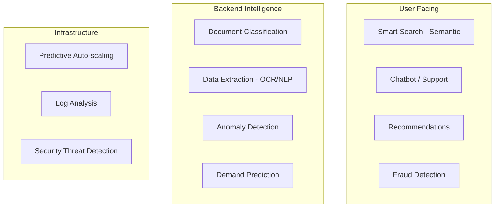
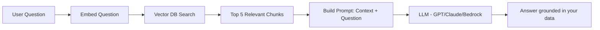
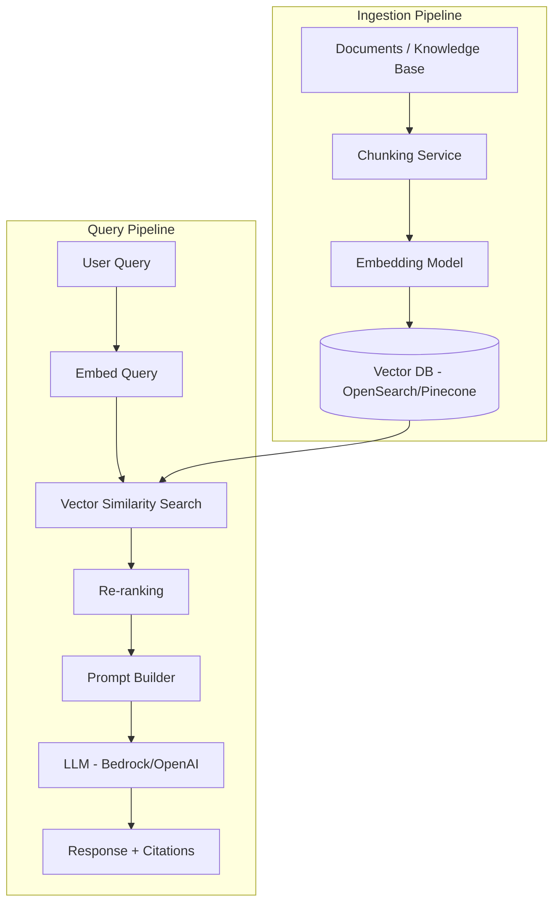
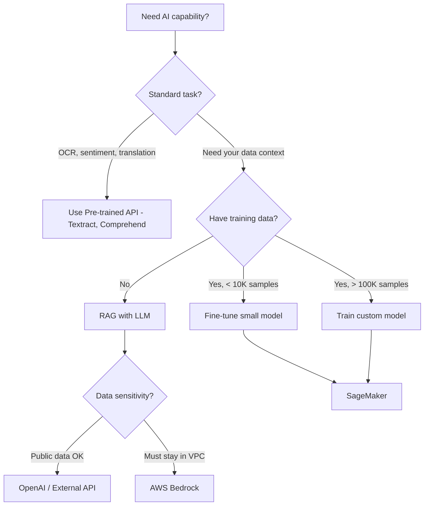

# AI in System Design — When, Where, and How

## The Decision: Do You Even Need AI?

Before adding AI to your system, ask:

| Question | If Yes | If No |
|----------|--------|-------|
| Can a human write rules for this? | Use rules engine, skip AI | Consider AI |
| Do you have labeled training data? | ML model viable | Use pre-trained/LLM |
| Is the task well-defined with clear inputs/outputs? | Traditional ML | LLM might help |
| Does accuracy need to be > 99%? | AI alone won't cut it — hybrid approach | AI can add value |
| Is latency budget > 500ms? | AI feasible | Need optimized/smaller models |

<div class="callout-warn">

**Common mistake**: Using GPT-4 for something a regex or SQL query can solve. AI adds latency, cost, and unpredictability. Use it only when the problem genuinely requires intelligence — pattern recognition, natural language understanding, or decisions with too many variables for rules.

</div>

---

## Where AI Fits in System Architecture



### Tier 1: Pre-trained APIs (Easiest)

Use when: You need standard AI capabilities without training custom models.

| Need | AWS Service | Alternative |
|------|------------|-------------|
| Text extraction from images | Textract | Google Vision |
| Sentiment analysis | Comprehend | Google NLP |
| Speech to text | Transcribe | Whisper (OpenAI) |
| Translation | Translate | DeepL API |
| Image moderation | Rekognition | Google Vision |

**Cost**: Pay per API call. No infrastructure to manage.

### Tier 2: LLM Integration (RAG Pattern)

Use when: You need AI that understands YOUR data — not just general knowledge.

### Tier 3: Custom ML Models

Use when: You have unique data and need specialized predictions (fraud scoring, demand forecasting, recommendation engines).

---

## RAG — The Most Common AI Pattern

### What is RAG?

**Retrieval-Augmented Generation**: Instead of fine-tuning an LLM on your data (expensive, slow), you retrieve relevant context at query time and feed it to the LLM.



### RAG Architecture in Production



### Key Decisions in RAG

| Decision | Options | Recommendation |
|----------|---------|----------------|
| Chunk size | 256 / 512 / 1024 tokens | Start with 512, test with your data |
| Chunk overlap | 0 / 50 / 100 tokens | 50-100 tokens (prevents cutting context) |
| Embedding model | OpenAI ada-002, Cohere, Titan | Titan on AWS (cheapest), ada-002 (best quality) |
| Vector DB | OpenSearch, Pinecone, pgvector, Chroma | pgvector if already on PostgreSQL, OpenSearch for scale |
| LLM | GPT-4, Claude, Bedrock Titan | Bedrock if on AWS (no data leaves your VPC) |
| Top-K retrieval | 3 / 5 / 10 chunks | 5 is a good default, more = more context but higher cost |

<div class="callout-tip">

**Applying this** — Start with pgvector (PostgreSQL extension) for your vector DB. You already have PostgreSQL — no new infrastructure. When you outgrow it (> 10M vectors, need sub-10ms search), migrate to OpenSearch or Pinecone. Don't start with a specialized vector DB for a prototype.

</div>

---

## Model Serving — How to Deploy AI

### Option 1: API-based (Managed)

```
Your App → HTTPS → OpenAI API / AWS Bedrock
```

- ✅ Zero infrastructure
- ✅ Always latest models
- ❌ Data leaves your network (OpenAI) — Bedrock keeps it in VPC
- ❌ Per-token pricing adds up at scale
- ❌ Rate limits, latency variability

### Option 2: Self-hosted (SageMaker)

```
Your App → SageMaker Endpoint → Your Model on GPU
```

- ✅ Data stays in your VPC
- ✅ Predictable latency
- ✅ Custom models
- ❌ GPU costs ($1-10/hour per endpoint)
- ❌ Ops overhead (scaling, monitoring)

### Option 3: Hybrid

```
Non-sensitive queries → Bedrock / OpenAI (cheaper, faster)
Sensitive data queries → SageMaker self-hosted (data privacy)
```

### Cost Comparison (1M queries/month, ~500 tokens each)

| Approach | Monthly Cost | Latency |
|----------|-------------|---------|
| GPT-4 API | ~$15,000 | 2-8s |
| GPT-3.5 API | ~$1,000 | 0.5-2s |
| Bedrock Claude Haiku | ~$500 | 0.5-2s |
| SageMaker (Llama 3 on g5.xlarge) | ~$1,200 | 0.3-1s |

<div class="callout-scenario">

**Scenario**: Building a customer support chatbot. 50K queries/day. Some queries involve PII (account details). **Decision**: Use Bedrock (data stays in VPC) with Claude Haiku for most queries (fast, cheap). Escalate complex queries to Claude Sonnet (better reasoning, 3x cost). Never send PII to external APIs.

</div>

---

## AI Decision Framework



<div class="callout-interview">

**🎯 Interview Ready** — "How would you add AI to an existing system?" → First, identify if AI is actually needed (rules engine might suffice). For knowledge-based Q&A, use RAG: chunk documents, embed into vector DB, retrieve relevant context, feed to LLM. Use Bedrock on AWS to keep data in VPC. Start with pgvector for vector storage. Use managed APIs (Textract, Comprehend) for standard tasks. Only train custom models when you have unique data and pre-trained models don't meet accuracy requirements.

</div>

---

## Common Pitfalls

| Pitfall | Reality |
|---------|---------|
| "Let's use GPT-4 for everything" | GPT-4 costs 30x more than Haiku. Use the cheapest model that meets accuracy needs |
| "AI will replace our rules engine" | Rules are deterministic, auditable, fast. AI is probabilistic, slow, expensive. Use both |
| "We need real-time AI" | Most AI use cases can tolerate 1-5s latency. Don't over-optimize |
| "Fine-tuning will fix accuracy" | Usually, better prompts + better retrieval (RAG) fixes accuracy. Fine-tuning is last resort |
| "Vector DB is mandatory for RAG" | pgvector in PostgreSQL handles millions of vectors. You don't need Pinecone on day 1 |

<div class="callout-tip">

**Applying this** — The best AI architecture is the simplest one that works. Start with managed APIs and RAG. Measure accuracy. Only add complexity (fine-tuning, custom models, specialized vector DBs) when you have data proving the simpler approach isn't enough.

</div>
