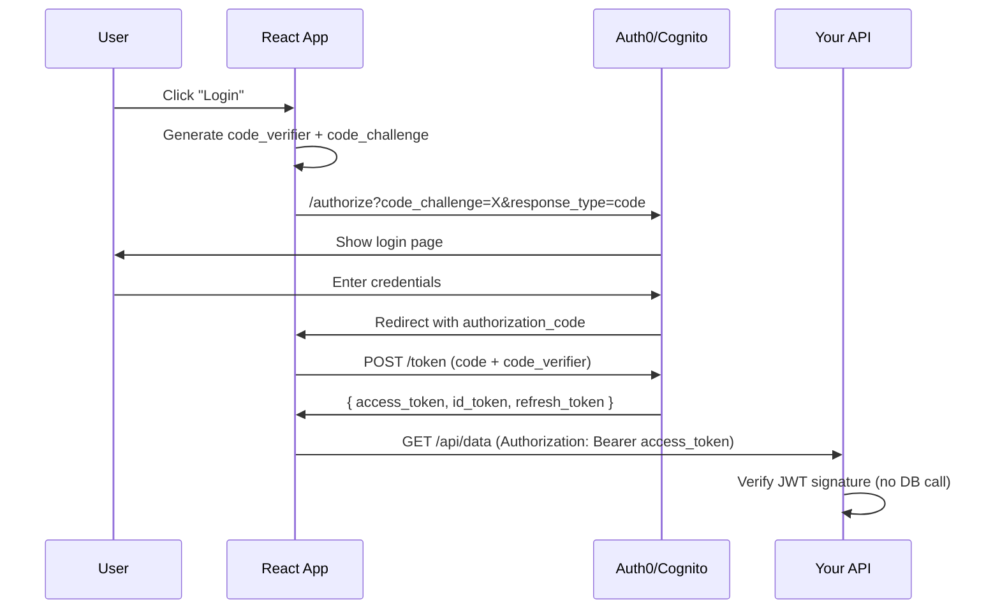
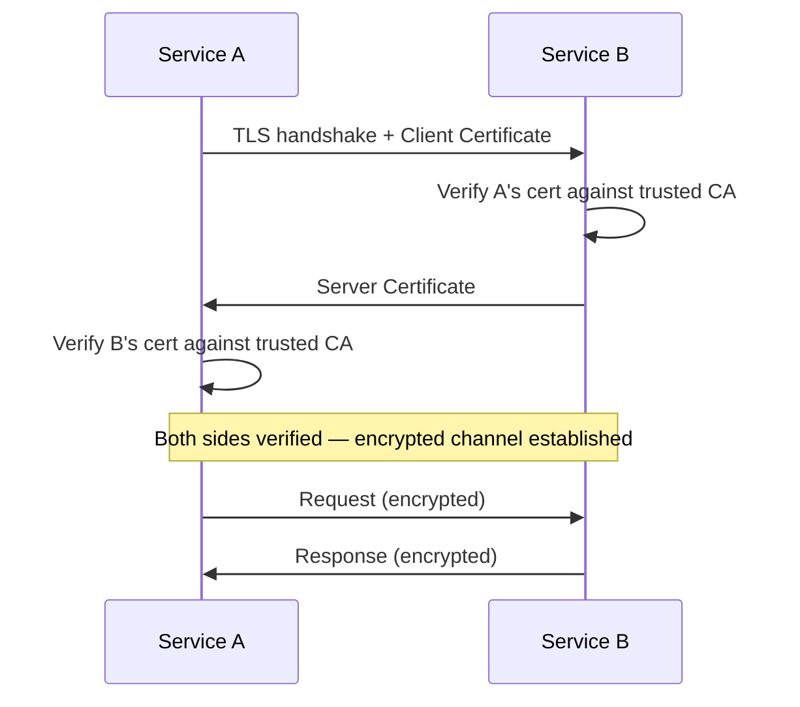

# Auth & Security Decisions

## The Landscape

Authentication (who are you?) and authorization (what can you do?) seem simple until you have: SPAs, mobile apps, server-to-server APIs, third-party integrations, and microservices — all needing different auth flows.

---

## OAuth2 / OIDC — The Foundation

### OAuth2 Flows — Which One for Your App?

| App Type | Flow | Why |
|----------|------|-----|
| SPA (React, Angular) | Authorization Code + PKCE | No client secret in browser, PKCE prevents interception |
| Server-rendered web app | Authorization Code | Server can securely store client secret |
| Mobile app | Authorization Code + PKCE | Same as SPA — no secret storage on device |
| Machine-to-machine (API) | Client Credentials | No user involved, service authenticates itself |
| Microservice-to-microservice | Client Credentials or mTLS | Internal trust, no user context needed |

### SPA Flow (Authorization Code + PKCE)



<div class="callout-tip">

**Applying this** — PKCE (Proof Key for Code Exchange) replaces the client secret for public clients (SPAs, mobile). The code_verifier is generated per login attempt and never sent over the wire — only its hash (code_challenge) is. This prevents authorization code interception attacks.

</div>

---

## JWT vs Session — The Real Trade-off

| Factor | JWT (Stateless) | Session (Stateful) |
|--------|----------------|-------------------|
| Storage | Token in client (cookie/localStorage) | Session ID in cookie, data in server/Redis |
| Verification | Verify signature locally (no DB call) | Lookup session in store (DB/Redis call) |
| Revocation | Hard — token valid until expiry | Easy — delete session from store |
| Scalability | ⭐⭐⭐ No shared state between servers | ⭐⭐ Need shared session store |
| Token size | ~800 bytes (contains claims) | ~32 bytes (just session ID) |
| Best for | APIs, microservices, SPAs | Server-rendered apps, need instant revocation |

### JWT Structure

```
Header.Payload.Signature

Header:  { "alg": "RS256", "typ": "JWT" }
Payload: { "sub": "user123", "role": "admin", "tenant": "acme", "exp": 1700000000 }
Signature: RS256(header + "." + payload, private_key)
```

### When JWT Revocation Matters

```
User changes password → All existing tokens should be invalid
Admin bans user → Token still works until expiry
```

**Solutions:**
1. **Short-lived tokens** (15 min) + refresh tokens (7 days)
2. **Token blacklist** in Redis (check on critical operations)
3. **Token version** in user record — if token version < user version, reject

<div class="callout-scenario">

**Scenario**: Your SPA uses JWT with 1-hour expiry. User gets fired. Their token works for up to 59 more minutes. **Fix**: Use 15-min access tokens + refresh tokens. On critical operations (payment, data export), check a Redis blacklist. On user deactivation, add their user_id to the blacklist and revoke refresh tokens.

</div>

---

## x509 / mTLS — Service-to-Service

### When to Use

| Scenario | Auth Method |
|----------|------------|
| Browser → API | JWT (OAuth2) |
| Service → Service (internal) | mTLS or JWT |
| Service → Service (external partner) | mTLS with x509 certificates |
| IoT device → Cloud | x509 client certificates |

### How mTLS Works



**Regular TLS**: Only the server proves its identity (your browser verifies google.com).

**mTLS**: Both sides prove identity. Service A proves it's Service A, Service B proves it's Service B. Used in zero-trust networks.

### Certificate Management in Practice

```yaml
# Kubernetes — cert-manager auto-rotates certificates
apiVersion: cert-manager.io/v1
kind: Certificate
metadata:
  name: service-a-cert
spec:
  secretName: service-a-tls
  duration: 720h      # 30 days
  renewBefore: 168h    # Renew 7 days before expiry
  issuerRef:
    name: internal-ca
    kind: ClusterIssuer
```

<div class="callout-tip">

**Applying this** — For internal microservices, use a service mesh (Istio, Linkerd) that handles mTLS automatically. You get encrypted service-to-service communication without changing application code. For external partners, issue x509 client certificates and verify them at your API gateway.

</div>

---

## Auth0 vs Cognito vs Build Your Own

| Factor | Auth0 | Cognito | Build Your Own |
|--------|-------|---------|---------------|
| Setup time | Hours | Hours | Weeks-Months |
| Cost (10K MAU) | ~$230/mo | ~$50/mo | Engineering time |
| Cost (1M MAU) | ~$23K/mo | ~$5K/mo | Infrastructure + engineering |
| Customization | High (Actions, Rules) | Medium | Unlimited |
| Social login | ✅ Built-in | ✅ Built-in | Build each integration |
| MFA | ✅ Built-in | ✅ Built-in | Build or integrate |
| Compliance (SOC2, HIPAA) | ✅ | ✅ | Your responsibility |
| Vendor lock-in | High | Medium (AWS) | None |

### Decision

- **Startup / MVP**: Auth0 or Cognito — don't build auth, build your product
- **Scale (> 100K users)**: Cognito (cheaper) or Keycloak (self-hosted, free)
- **Enterprise with specific requirements**: Keycloak or build your own
- **Already on AWS**: Cognito is the natural choice

<div class="callout-interview">

**🎯 Interview Ready** — "How would you design auth for a microservices system?" → API Gateway validates JWT on every request (no DB call). Auth service issues tokens via OAuth2 (Authorization Code + PKCE for SPAs, Client Credentials for services). Short-lived access tokens (15 min) + refresh tokens (7 days). Internal service-to-service uses mTLS via service mesh. Critical operations check a Redis token blacklist for revoked users.

</div>
