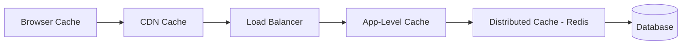

# Caching Strategy — What, Where, and Why

## The Core Question

Caching is not "add Redis and done." Every caching decision has trade-offs: **freshness vs speed, memory vs compute, complexity vs performance**.

---

## Cache Placement — Where to Cache



| Layer | Latency | Best For |
|-------|---------|----------|
| Browser cache | 0ms | Static assets, API responses with Cache-Control |
| CDN cache | 5-20ms | Images, JS/CSS, public API responses |
| App-level (in-memory) | < 1ms | Hot config, feature flags, small lookup tables |
| Distributed (Redis) | 1-5ms | Session data, computed results, rate limiting |
| Database query cache | 5-10ms | Repeated identical queries |

<div class="callout-tip">

**Applying this** — Cache at the outermost layer possible. If the browser can cache it, don't hit the CDN. If the CDN can cache it, don't hit your server. Every layer you skip saves latency AND cost.

</div>

---

## Redis vs Memcached — The Real Difference

| Feature | Redis | Memcached |
|---------|-------|-----------|
| Data structures | Strings, Lists, Sets, Hashes, Sorted Sets, Streams | Strings only |
| Persistence | RDB snapshots + AOF | None (pure cache) |
| Replication | Master-replica, Redis Cluster | Client-side sharding |
| Pub/Sub | ✅ Built-in | ❌ |
| Lua scripting | ✅ | ❌ |
| Memory efficiency | Good | Better (no overhead for data structures) |
| Multi-threaded | Single-threaded (io-threads in 6.0+) | Multi-threaded |

### When to pick Memcached over Redis

Only when: (1) You need pure key-value string caching, (2) You want multi-threaded performance on a single node, (3) You don't need persistence or data structures. **In practice, Redis wins 95% of the time.**

---

## Caching Patterns

### 1. Cache-Aside (Lazy Loading)

```
Read: App checks cache → miss → read DB → write to cache → return
Write: App writes DB → invalidate cache
```

```java
public User getUser(String userId) {
    String cached = redis.get("user:" + userId);
    if (cached != null) return deserialize(cached);

    User user = userRepository.findById(userId);
    redis.setex("user:" + userId, 3600, serialize(user));
    return user;
}
```

- ✅ Only caches what's actually requested
- ✅ Cache failure = app still works (reads from DB)
- ❌ First request always slow (cache miss)
- ❌ Stale data possible between DB write and cache invalidation

### 2. Write-Through

```
Write: App writes cache AND DB simultaneously
Read: Always from cache
```

- ✅ Cache always fresh
- ❌ Write latency increases (two writes)
- ❌ Caches data that may never be read

### 3. Write-Behind (Write-Back)

```
Write: App writes to cache → cache async writes to DB
Read: Always from cache
```

- ✅ Fastest writes (cache only)
- ❌ Data loss risk if cache crashes before DB write
- ❌ Complex — need reliable queue between cache and DB

### Decision Matrix

| Pattern | Use When |
|---------|----------|
| Cache-Aside | Read-heavy, can tolerate brief staleness, most common choice |
| Write-Through | Data must always be fresh, write volume is moderate |
| Write-Behind | Write-heavy, can tolerate eventual consistency, need speed |

---

## Cache Invalidation — The Hard Problem

> "There are only two hard things in Computer Science: cache invalidation and naming things." — Phil Karlton

### Strategies

**1. TTL (Time-To-Live)** — Simplest, most common
```java
redis.setex("product:123", 300, data); // expires in 5 minutes
```
- ✅ Simple, self-healing
- ❌ Stale for up to TTL duration

**2. Event-driven invalidation** — Invalidate on write
```java
// On product update
productRepository.save(product);
redis.del("product:" + product.getId());
redis.del("category:" + product.getCategoryId() + ":products");
```
- ✅ Fresh immediately
- ❌ Must track all cache keys affected by a write

**3. Version-based** — Cache key includes version
```java
String version = redis.get("product:123:version"); // "v7"
String cacheKey = "product:123:" + version;
// On update: increment version → old cache naturally ignored
```
- ✅ No explicit invalidation needed
- ❌ Old versions waste memory until TTL

<div class="callout-interview">

**🎯 Interview Ready** — "How do you handle cache invalidation?" → Use TTL as a safety net (always set one). For critical data, add event-driven invalidation on writes. For high-read data, use cache-aside with short TTL (30-60s). Never rely solely on invalidation — TTL ensures self-healing even if invalidation fails.

</div>

---

## Cache Stampede — The Silent Killer

### The Problem

Popular cache key expires. 10,000 requests arrive simultaneously. All see cache miss. All query the database. Database gets 10,000 identical queries at once.

### Solutions

**1. Lock-based (Mutex)**
```java
public Product getProduct(String id) {
    String cached = redis.get("product:" + id);
    if (cached != null) return deserialize(cached);

    // Try to acquire lock
    boolean locked = redis.set("lock:product:" + id, "1", "NX", "EX", 5);
    if (locked) {
        Product product = db.findById(id);
        redis.setex("product:" + id, 300, serialize(product));
        redis.del("lock:product:" + id);
        return product;
    }

    // Another thread is rebuilding — wait and retry
    Thread.sleep(50);
    return getProduct(id); // retry
}
```

**2. Early refresh** — Refresh before expiry
```java
// TTL is 300s, but refresh at 240s (80% of TTL)
String cached = redis.get("product:" + id);
long ttl = redis.ttl("product:" + id);
if (ttl < 60) {
    // Async refresh — don't block current request
    executor.submit(() -> refreshCache(id));
}
return deserialize(cached);
```

<div class="callout-tip">

**Applying this** — For most applications, cache-aside with TTL + event-driven invalidation is the right pattern. Add stampede protection (mutex or early refresh) only for keys with > 100 RPS. Don't over-engineer caching for keys that get 10 requests/minute.

</div>
