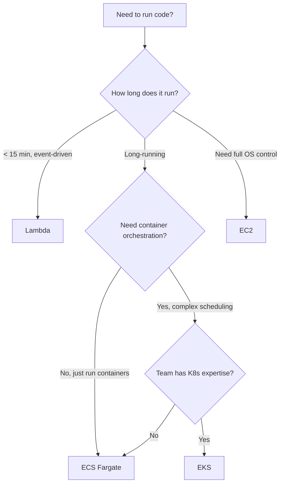
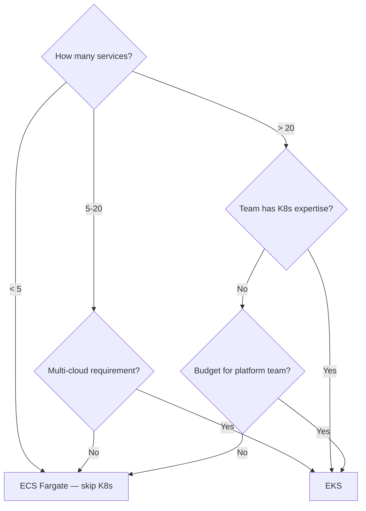
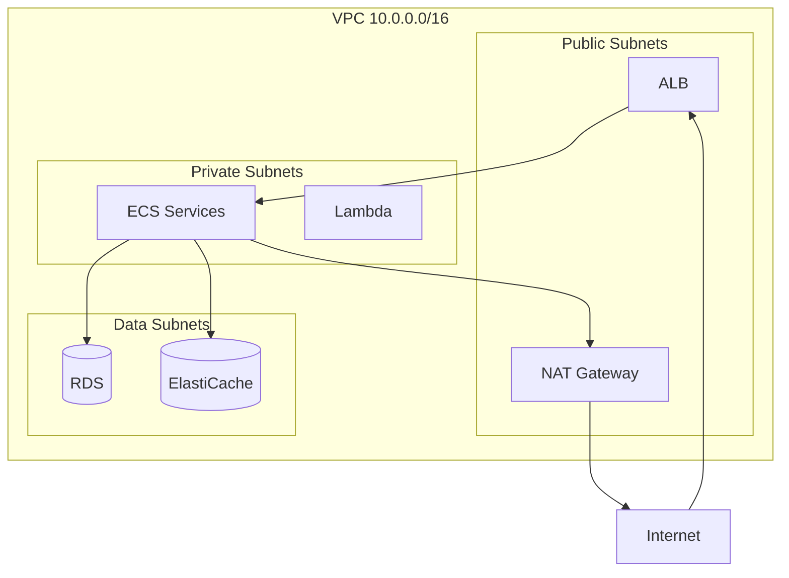

# Cloud & Infrastructure Decisions

## AWS Services — The Decision Tree

You don't need to know every AWS service. You need to know **when to pick which one** for compute, networking, storage, and orchestration.

---

## Compute — Where Does Your Code Run?



| Service | Best For | Avoid When |
|---------|----------|------------|
| **Lambda** | Event handlers, API endpoints < 15min, cron jobs, file processing triggers | Long-running processes, WebSockets, high-throughput steady load |
| **ECS Fargate** | Microservices, web apps, APIs — no server management | Need GPU, need OS-level access |
| **ECS on EC2** | Same as Fargate but need GPU, spot instances, or specific instance types | Small team, don't want to manage EC2 |
| **EKS** | Already using K8s, need portability across clouds, complex scheduling | Small team, single cloud, < 10 services |
| **EC2** | Legacy apps, need full OS control, specific hardware | Anything that can run in containers |

### Lambda vs ECS — The Common Dilemma

| Factor | Lambda | ECS Fargate |
|--------|--------|-------------|
| Cold start | 100ms-10s (depends on runtime) | None (always running) |
| Max duration | 15 minutes | Unlimited |
| Pricing | Per-invocation + duration | Per-vCPU-hour + memory-hour |
| Scaling | Instant (1000 concurrent default) | 2-5 min to scale out |
| Steady load cost | Expensive (paying per-request) | Cheaper (fixed capacity) |
| Spiky load cost | Cheap (pay only when invoked) | Expensive (over-provisioned) |

<div class="callout-scenario">

**Scenario**: API gets 10 requests/sec steady, spikes to 1000/sec during sales. **Lambda** — you pay almost nothing during quiet periods and scale instantly during spikes. If the same API gets 500 req/sec 24/7, **ECS Fargate** is 60-70% cheaper.

</div>

---

## Networking — ALB vs NLB

| Factor | ALB (Application) | NLB (Network) |
|--------|-------------------|----------------|
| Layer | Layer 7 (HTTP/HTTPS) | Layer 4 (TCP/UDP) |
| Routing | Path-based, host-based, header-based | Port-based only |
| WebSocket | ✅ | ✅ |
| SSL termination | ✅ At ALB | ✅ or passthrough to target |
| Static IP | ❌ (use Global Accelerator) | ✅ |
| Latency | ~1-2ms added | ~100μs added |
| Cost | Per-hour + LCU (request-based) | Per-hour + LCU (connection-based) |
| Best for | Web apps, REST APIs, microservices | gRPC, IoT, gaming, extreme low latency |

### Decision

```
HTTP/REST API → ALB
Need path-based routing (/api/v1/users → Service A) → ALB
gRPC or raw TCP → NLB
Need static IP (partner whitelisting) → NLB
WebSocket with HTTP fallback → ALB
Extreme low latency (< 1ms) → NLB
```

<div class="callout-tip">

**Applying this** — 90% of web applications need ALB. NLB is for specific use cases: gRPC services, IoT MQTT brokers, gaming servers, or when partners need to whitelist a static IP. If you're unsure, start with ALB.

</div>

---

## Database Services

| Need | Service | Why |
|------|---------|-----|
| Relational, ACID | RDS (PostgreSQL/MySQL) | Managed, backups, replicas, Multi-AZ |
| Relational, massive scale | Aurora | 5x throughput of MySQL, auto-scaling storage |
| Key-value, serverless | DynamoDB | Zero ops, auto-scaling, single-digit ms |
| In-memory cache | ElastiCache (Redis) | Sub-ms reads, pub/sub, data structures |
| Document store | DocumentDB | MongoDB-compatible, managed |
| Search | OpenSearch | Full-text search, log analytics |
| Time-series | Timestream | IoT metrics, auto-tiered storage |

### RDS vs Aurora — When to Upgrade

| Factor | RDS | Aurora |
|--------|-----|--------|
| Cost | $$ | $$$ (20-30% more) |
| Read replicas | Up to 5 | Up to 15 |
| Failover time | 60-120 seconds | < 30 seconds |
| Storage | Manual provisioning | Auto-scales to 128TB |
| Replication lag | Seconds | Milliseconds |

**Upgrade to Aurora when**: You need > 5 read replicas, faster failover, or auto-scaling storage. For most apps, RDS is sufficient and cheaper.

---

## Secrets & Configuration

| What | Service | Why NOT alternatives |
|------|---------|---------------------|
| API keys, DB passwords | Secrets Manager | Auto-rotation, audit trail, cross-account |
| Feature flags, config | Parameter Store (SSM) | Free tier, hierarchical, versioned |
| Encryption keys | KMS | Hardware-backed, audit, key rotation |
| Certificates | ACM | Free public certs, auto-renewal |

```java
// Secrets Manager — retrieve DB password at runtime
SecretsManagerClient client = SecretsManagerClient.create();
String secret = client.getSecretValue(b -> b.secretId("prod/db/password"))
    .secretString();

// NEVER do this:
// String password = "hardcoded-password-123"; ❌
// String password = System.getenv("DB_PASSWORD"); // ⚠️ OK for dev, not prod
```

<div class="callout-tip">

**Applying this** — Use Secrets Manager for anything that rotates (passwords, API keys). Use Parameter Store for config that changes occasionally (feature flags, endpoint URLs). Use environment variables only in development. In production, always fetch secrets at runtime from Secrets Manager.

</div>

---

## Docker & Kubernetes — Decision Framework

### Do You Need Kubernetes?



### K8s vs ECS — Honest Comparison

| Factor | ECS Fargate | EKS |
|--------|-------------|-----|
| Learning curve | Low | High (steep) |
| Ops overhead | Minimal | Significant |
| Ecosystem | AWS-native | Massive (Helm, Istio, ArgoCD, etc.) |
| Portability | AWS only | Any cloud, on-prem |
| Cost | Service cost only | $73/mo per cluster + node costs |
| Service mesh | App Mesh (limited) | Istio, Linkerd (mature) |
| Best for | AWS-only shops, small teams | Multi-cloud, large teams, complex needs |

<div class="callout-interview">

**🎯 Interview Ready** — "How would you design the infrastructure for a microservices platform on AWS?" → ECS Fargate for compute (unless multi-cloud needed, then EKS). ALB for HTTP routing with path-based rules. RDS PostgreSQL for relational data, DynamoDB for high-throughput key-value. ElastiCache Redis for caching and sessions. Secrets Manager for credentials. CloudWatch for monitoring. CodePipeline or GitHub Actions for CI/CD. All in a VPC with private subnets for services, public subnets only for ALB.

</div>

---

## VPC Design — Production Layout



| Subnet | Contains | Internet Access |
|--------|----------|----------------|
| Public | ALB, NAT Gateway, Bastion | Direct (IGW) |
| Private | ECS tasks, Lambda, App servers | Outbound only (via NAT) |
| Data | RDS, ElastiCache, OpenSearch | None (isolated) |

**Key rule**: Database subnets have NO internet access. Not inbound, not outbound. Services connect via VPC internal networking only.
