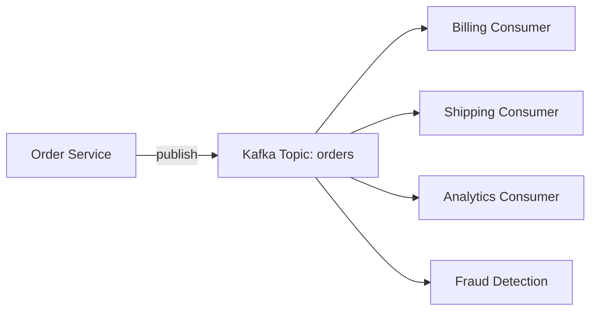
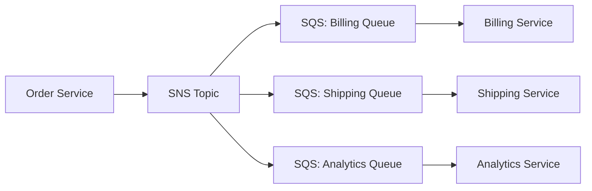
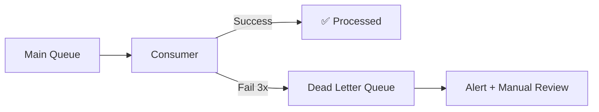

# Messaging & Event Systems — Kafka vs RabbitMQ vs SQS

## Why This Decision Matters

Wrong messaging choice = rewriting infrastructure 6 months later. Each system has fundamentally different guarantees and trade-offs.

---

## The Decision Table

| Factor | Kafka | RabbitMQ | SQS | SNS |
|--------|-------|----------|-----|-----|
| Model | Log-based streaming | Message broker | Managed queue | Pub/Sub fanout |
| Ordering | Per-partition | Per-queue | Best-effort (FIFO available) | No ordering |
| Replay | ✅ Consumers can re-read | ❌ Once consumed, gone | ❌ Once consumed, gone | ❌ |
| Throughput | Millions/sec | ~50K/sec | ~3K/sec (standard) | ~30M publishes/sec |
| Latency | 5-15ms | 1-5ms | 20-50ms | 10-30ms |
| Consumer model | Pull (consumer controls pace) | Push or Pull | Pull (long polling) | Push to subscribers |
| Ops overhead | High (ZooKeeper/KRaft, brokers) | Medium | Zero (managed) | Zero (managed) |
| Cost model | Infrastructure cost | Infrastructure cost | Per-request pricing | Per-request pricing |

---

## When to Use What

### Kafka — Event Streaming & Log

**Use when:**
- You need to **replay** events (new consumer reads from beginning)
- Multiple consumers need the **same events** independently
- **Ordering** matters (financial transactions, state machines)
- Throughput > 100K events/sec
- You're building **event sourcing** or **CDC** pipelines

**Real examples:** Order events consumed by billing, shipping, analytics, and fraud detection — each independently, each at their own pace.



Each consumer has its own offset. Billing can be at event #5000 while Analytics is at #3000 (catching up after downtime). No data loss.

### RabbitMQ — Task Queue & Routing

**Use when:**
- You need **complex routing** (topic exchanges, headers, fanout)
- Tasks should be processed **exactly once** then removed
- You need **priority queues**
- Low latency matters (< 5ms)
- Message volume < 50K/sec

**Real examples:** Email sending, image processing, PDF generation — fire-and-forget tasks.

### SQS — Simple Managed Queue

**Use when:**
- You want **zero ops** (no brokers to manage)
- Simple producer → consumer pattern
- You're already on AWS
- Volume < 3K/sec (standard) or need FIFO guarantees
- Dead-letter queue for failed messages

**Real examples:** Decoupling microservices, async job processing, Lambda triggers.

### SNS — Fan-out Notifications

**Use when:**
- One event needs to reach **multiple subscribers**
- Subscribers are SQS queues, Lambda functions, HTTP endpoints, or email
- You don't need ordering or replay

**Real examples:** Order placed → notify inventory (SQS), send email (Lambda), update dashboard (HTTP).

<div class="callout-tip">

**Applying this** — The most common pattern in production: **SNS + SQS fan-out**. SNS publishes to multiple SQS queues. Each queue feeds a different service. This gives you fan-out (SNS) + independent consumption + dead-letter queues (SQS) + zero ops.

</div>

---

## Common Patterns

### Pattern 1: SNS + SQS Fan-out (AWS Standard)



Each queue has its own DLQ, retry policy, and consumer. If Billing is down, its queue buffers messages. Shipping and Analytics are unaffected.

### Pattern 2: Kafka for Event Sourcing

```
Every state change is an event. Current state = replay all events.

Event 1: OrderCreated { id: 123, items: [...], total: 500 }
Event 2: PaymentReceived { orderId: 123, amount: 500 }
Event 3: OrderShipped { orderId: 123, trackingId: "XYZ" }

Current state of Order 123 = apply events 1 + 2 + 3
```

Kafka's log retention makes this possible. You can rebuild any service's state by replaying its topic from the beginning.

### Pattern 3: Dead-Letter Queue (DLQ)



After N failed attempts, the message moves to DLQ. This prevents poison messages from blocking the queue forever.

<div class="callout-interview">

**🎯 Interview Ready** — "Kafka or RabbitMQ?" → It depends on the use case. Kafka for event streaming where multiple consumers need the same data independently and replay is needed. RabbitMQ for task queues where messages are consumed once and deleted. SQS if you want zero ops on AWS. The most common production pattern is SNS→SQS fan-out for microservice decoupling.

</div>

---

## Delivery Guarantees — The Trade-off Triangle

| Guarantee | Meaning | Cost |
|-----------|---------|------|
| At-most-once | Message may be lost, never duplicated | Fastest, simplest |
| At-least-once | Message never lost, may be duplicated | Need idempotent consumers |
| Exactly-once | Message delivered exactly once | Slowest, most complex (Kafka transactions) |

**In practice**: Use **at-least-once** delivery + **idempotent consumers**. This is simpler and more reliable than exactly-once semantics.

```java
// Idempotent consumer — safe to process same message twice
public void processPayment(PaymentEvent event) {
    // Check if already processed
    if (paymentRepository.existsByIdempotencyKey(event.getIdempotencyKey())) {
        log.info("Duplicate event, skipping: {}", event.getIdempotencyKey());
        return;
    }
    // Process and save with idempotency key
    paymentRepository.save(new Payment(event));
}
```

<div class="callout-tip">

**Applying this** — Don't chase exactly-once delivery. It's expensive and fragile. Instead, make your consumers idempotent (safe to process the same message twice). Use a unique idempotency key per message and check before processing. This is how Stripe, Shopify, and every payment system works.

</div>
