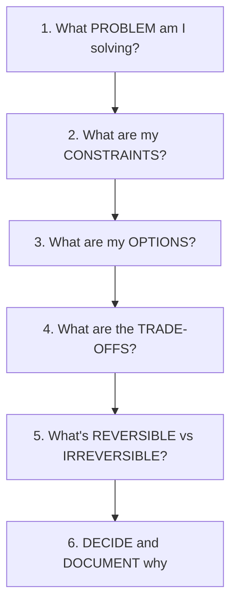
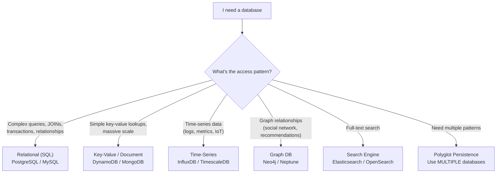
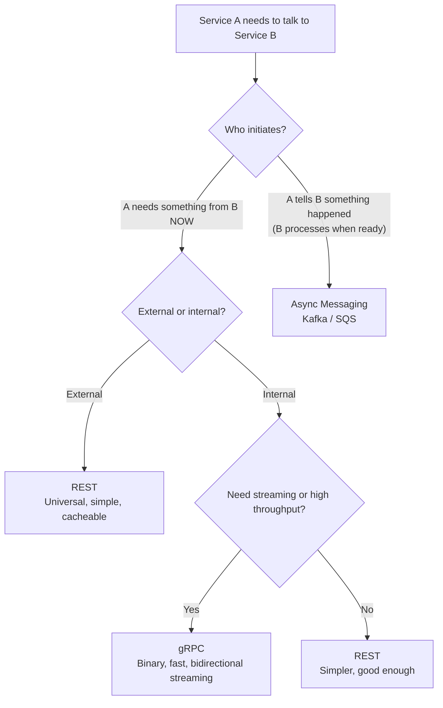
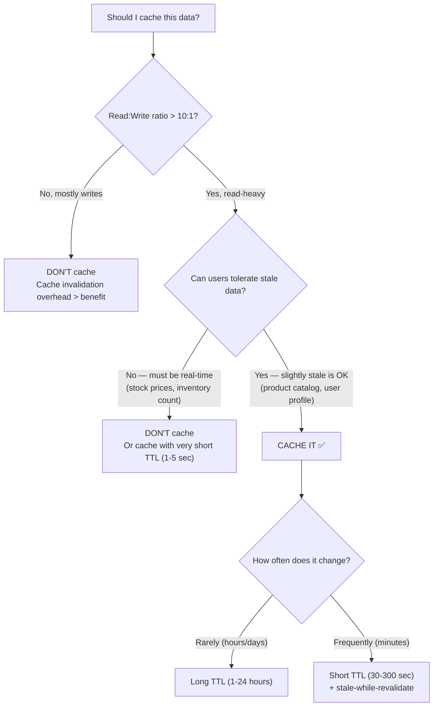

# How to Think in Architecture — Making Decisions You Won't Regret

## Why This Tutorial Exists

Architecture is decision-making. Every day, you choose: SQL or NoSQL? REST or gRPC? Redis or Memcached? AWS or GCP? Most tutorials tell you WHAT each technology does. This tutorial teaches you HOW to evaluate trade-offs and make decisions that hold up under real-world pressure.

---

## The Architecture Decision Framework

Every technology decision follows the same pattern:

### The Most Important Rule

> **Understand the problem before evaluating solutions. Most bad architecture decisions come from solving the wrong problem.**

**Scenario**: Team says "We need Redis for caching." Ask: "What problem are we solving?" Answer: "The product page loads in 3 seconds." Better question: "WHY does it take 3 seconds?" Investigation reveals: 5 unoptimized SQL queries with missing indexes. Fix: Add indexes → page loads in 200ms. No Redis needed.

**Lesson**: The solution to "it's slow" isn't always "add cache." Sometimes it's "fix the query." Always diagnose before prescribing.

---

## Framework 1: Database Decisions

### The "When NOT to Use" Guide

| Technology | When NOT to use it | Common mistake |
|-----------|-------------------|----------------|
| **PostgreSQL** | When you need 100K+ writes/sec with simple key lookups | Using SQL for everything because "it's safe" |
| **MongoDB** | When you need complex JOINs or ACID transactions across collections | Using it because "schema-less is flexible" (you still need a schema — it's just implicit) |
| **DynamoDB** | When you don't know your access patterns upfront | Choosing it for "scalability" then struggling with query limitations |
| **Redis** | As your primary database (it's in-memory — data loss risk) | Using it as a database instead of a cache |
| **Elasticsearch** | As your primary database for writes | It's optimized for search, not for transactional writes |

**Applying this** — In real projects, use polyglot persistence. An e-commerce system might use: PostgreSQL for orders (ACID transactions), DynamoDB for product catalog (fast reads, simple key lookups), Redis for session cache (fast, ephemeral), Elasticsearch for product search (full-text). Each database does what it's best at. The mistake is forcing one database to do everything.

---

## Framework 2: Communication Decisions

| I need to... | Use | Why not the alternative |
|-------------|-----|----------------------|
| Expose API to external clients | **REST** | gRPC requires protobuf — external clients expect JSON |
| Internal service-to-service, high performance | **gRPC** | REST has JSON serialization overhead, no streaming |
| Decouple services, handle spikes | **Message Queue (Kafka/SQS)** | Sync calls create tight coupling and cascading failures |
| Real-time bidirectional communication | **WebSocket** | REST is request-response only, no server push |
| Notify multiple services of an event | **Event Bus (SNS/EventBridge)** | Direct API calls create N point-to-point connections |

### The Decision: REST vs gRPC vs Messaging

---

## Framework 3: Caching Decisions

### Should I Cache This?

### Cache Invalidation — The Hardest Problem

| Strategy | How it works | When to use |
|----------|-------------|-------------|
| **TTL (Time-To-Live)** | Data expires after X seconds | When slightly stale data is acceptable |
| **Write-through** | Update cache AND database together | When you need cache to always be fresh |
| **Write-behind** | Update cache immediately, database later (async) | When write performance matters more than consistency |
| **Cache-aside** | App checks cache → miss → query DB → populate cache | Most common, simplest to implement |
| **Event-based invalidation** | Database change triggers cache delete | When you need fresh data but can't use write-through |

**Warning**: The most dangerous cache bug is serving stale data that LOOKS correct. A user updates their email, but the cached profile still shows the old email. They think the update failed and contact support. Always invalidate cache on writes, or use short TTLs for user-facing data.

---

## Framework 4: The Reversibility Test

Before making any architecture decision, ask: **"How hard is it to change this later?"**

| Decision | Reversibility | Implication |
|----------|--------------|-------------|
| Choosing a programming language | **Very hard** — rewrite everything | Spend more time deciding |
| Choosing a database | **Hard** — data migration is painful | Spend more time deciding |
| Choosing a message queue | **Medium** — abstraction layer helps | Decide reasonably, abstract the interface |
| Choosing a cache | **Easy** — swap Redis for Memcached with minimal code change | Decide quickly, optimize later |
| Choosing an API format | **Easy** — add a new endpoint, deprecate old | Decide quickly |
| Choosing a cloud provider | **Very hard** — vendor lock-in | Evaluate carefully, use abstractions where possible |

**Applying this** — For reversible decisions, decide fast and move on. For irreversible decisions, invest time in evaluation. Jeff Bezos calls these "one-way doors" vs "two-way doors." Most decisions are two-way doors — you can change them later. Don't spend a week debating Redis vs Memcached. Spend that week on database choice — that's a one-way door.

---

## Framework 5: The "What Happens When It Fails" Test

For EVERY technology choice, ask: "What happens when this component is down for 5 minutes?"

| Component down | Impact | Your design should... |
|---------------|--------|---------------------|
| Cache (Redis) | Requests hit database directly | DB should handle the load (maybe slower) — fail-open |
| Database | Nothing works | Read replica failover, connection retry, circuit breaker |
| Message queue | Events are lost or delayed | Producer retries, consumer idempotency, dead letter queue |
| External API | Your feature is broken | Circuit breaker, fallback response, cached last-known-good |
| CDN | Static assets don't load | Origin server serves directly (slower but works) |
| Auth service | Nobody can log in | Cache auth tokens locally, allow existing sessions to continue |

🎯 **Interview Ready** — After presenting your architecture, proactively say: "Let me walk through failure modes. If Redis goes down, the app falls back to database queries — slower but functional. If the payment service is down, the circuit breaker returns 'payment processing' and we retry via a queue. If the database goes down, we have a read replica that promotes automatically. No single component failure takes down the entire system." This shows you think about production reality, not just happy-path design.

---

## 🎯 Interview Corner

**Q: "How do you make architecture decisions in your team?"**

I use a structured approach: (1) **Write an ADR (Architecture Decision Record)** — a short document with: Context (what's the problem), Options (what are the alternatives), Decision (what we chose), Consequences (trade-offs). (2) **Evaluate against constraints** — budget, timeline, team expertise, scale requirements. (3) **Prototype if uncertain** — for irreversible decisions, build a small proof-of-concept before committing. (4) **Get peer review** — share the ADR with the team, incorporate feedback. (5) **Document the "why not"** — future engineers will ask "why didn't we use X?" The ADR answers that. The key is making the decision EXPLICIT and DOCUMENTED, not just "we chose Kafka because someone suggested it in a meeting."

**Follow-up trap**: "What if the team disagrees?" → Disagree and commit. Discuss thoroughly, hear all perspectives, but someone (tech lead/architect) makes the final call. Endless debate is worse than a slightly suboptimal decision. You can always revisit if the decision proves wrong — that's why reversibility matters.

**Q: "How do you evaluate a new technology you've never used?"**

Five-step evaluation: (1) **What problem does it solve?** If I don't have that problem, I don't need it. (2) **What are the trade-offs?** Every technology optimizes for something at the cost of something else. (3) **Who else uses it at similar scale?** If only startups with 100 users use it, it's unproven at my scale. (4) **What's the operational cost?** Can my team run it? Is there managed service? What's the learning curve? (5) **What's the exit strategy?** If it doesn't work out, how hard is it to migrate away? I never adopt technology because it's "trending." I adopt it because it solves a specific problem better than my current solution, and the migration cost is justified.

---

## Quick Reference — The Architecture Decision Cheat Sheet

| Decision area | Key question | Decision driver |
|--------------|-------------|-----------------|
| Database | What's the access pattern? | Queries → SQL. Key-value → NoSQL. Both → Polyglot |
| Communication | Does the caller need an immediate response? | Yes → Sync. No → Async |
| Caching | Read:Write ratio > 10:1? Stale data OK? | Both yes → Cache. Either no → Don't cache |
| Scaling | Where's the bottleneck? | DB → Cache/Shard. App → Horizontal scale. Network → CDN |
| Consistency | Financial/inventory data? | Yes → Strong consistency. No → Eventual is fine |
| Reversibility | One-way door or two-way door? | One-way → Invest time. Two-way → Decide fast |

---

> **The best architects don't know the most technologies. They ask the best questions. "What problem are we solving?" eliminates 80% of bad decisions before they're made.**
