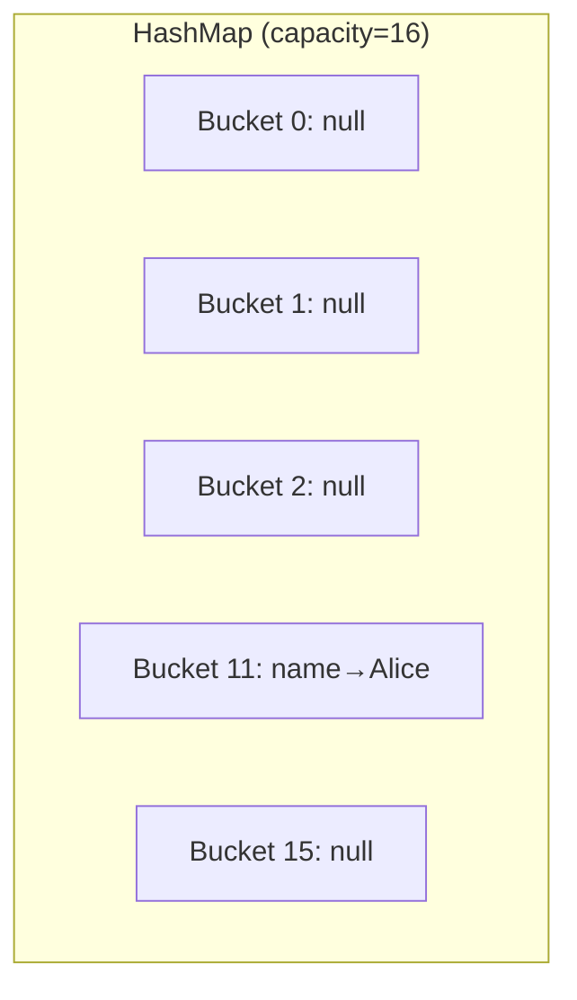
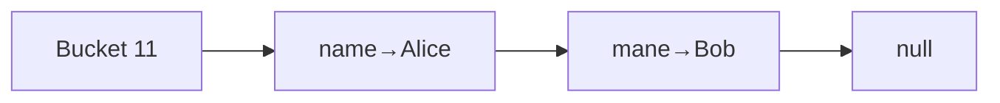
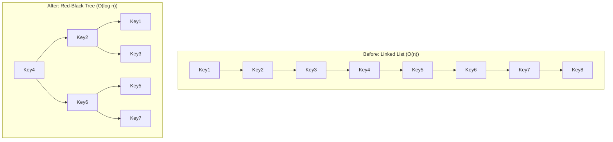

# HashMap Internals — How It Really Works

## The Real-World Analogy

Imagine a **library** with 16 shelves. When a new book arrives, the librarian doesn't just put it anywhere — she looks at the book's title, does a quick calculation, and says *"This goes on shelf 7."*

That's exactly what HashMap does. The "calculation" is **hashing**, the "shelves" are **buckets**, and the "books" are your key-value pairs.

---

## 1. What Happens When You Do `map.put("name", "Alice")`?

Let's trace through step by step:

```java
HashMap<String, String> map = new HashMap<>();
map.put("name", "Alice");
```

### Step 1: Calculate the hash

```java
int hash = key.hashCode();  // "name".hashCode() → some integer like 3373707
```

### Step 2: Find the bucket index

```java
int index = hash & (capacity - 1);  // 3373707 & 15 = 11 (for default capacity 16)
```

> **Why `& (capacity - 1)` instead of `% capacity`?** Bitwise AND is much faster than modulo. This only works because capacity is always a power of 2.

### Step 3: Place it in the bucket

The entry goes into bucket 11. If bucket 11 is empty, done. If not — we have a **collision**.



---

## 2. Collisions — The Interesting Part

### Scenario: Two keys land in the same bucket

```java
map.put("name", "Alice");   // bucket 11
map.put("mane", "Bob");     // also bucket 11! (different key, same bucket)
```

When this happens, HashMap creates a **linked list** in that bucket:



### What happens during `get("mane")`?

1. Calculate hash → bucket 11
2. Go to bucket 11, find first node: key is `"name"` — not a match
3. Follow the link to next node: key is `"mane"` — **match!** Return `"Bob"`

> **This is why `equals()` and `hashCode()` contract matters.** HashMap uses `hashCode()` to find the bucket, then `equals()` to find the exact key within that bucket.

---

## 3. Tree-ification (Java 8+) — When Linked Lists Get Too Long

### The Problem

If many keys hash to the same bucket, the linked list grows long. Searching a linked list is **O(n)** — terrible for a data structure that promises O(1).

### The Solution

When a single bucket has **8 or more entries**, Java converts the linked list into a **Red-Black Tree**. Now lookup in that bucket is **O(log n)** instead of O(n).



### When does it convert back?

When the count drops to **6 or fewer**, it converts back to a linked list. The gap (8 to treeify, 6 to untreeify) prevents constant back-and-forth conversion.

---

## 4. Resizing — When the Map Gets Full

### Load Factor

Default load factor is **0.75**. This means: when 75% of buckets are occupied, **resize**.

```
Default capacity: 16
Threshold: 16 × 0.75 = 12
```

When you add the 13th entry → HashMap **doubles** its capacity to 32 and **rehashes** every entry.

### Why rehashing is expensive

```java
// Every single entry must be recalculated
for each entry:
    newIndex = entry.hash & (newCapacity - 1);  // different result now!
```

### Scenario: You know you'll store 1000 items

```java
// BAD — will resize multiple times: 16→32→64→128→256→512→1024→2048
HashMap<String, String> map = new HashMap<>();

// GOOD — no resizing needed (1000/0.75 = 1334, next power of 2 = 2048)
HashMap<String, String> map = new HashMap<>(2048);
```

<div class="callout-tip">

**Applying this**: When building any service that loads data into a HashMap (e.g., config cache, lookup table), always pre-size it. `new HashMap<>(expectedSize * 4 / 3 + 1)` avoids all resizing.

</div>

<div class="callout-interview">

🎯 **Interview Ready**: "If you know the size upfront, always set initial capacity to avoid expensive resize operations. The formula is `expectedSize / loadFactor + 1`, rounded to next power of 2."

</div>

---

## 5. The hashCode() and equals() Contract

### The Golden Rules

1. If `a.equals(b)` is true → `a.hashCode() == b.hashCode()` **must** be true
2. If `a.hashCode() == b.hashCode()` → `a.equals(b)` **may or may not** be true (collision)
3. If `a.equals(b)` is false → hashCodes **can** be same or different

### Scenario: Breaking the contract

```java
class Employee {
    String name;
    int id;

    // BROKEN: Override equals but NOT hashCode
    @Override
    public boolean equals(Object o) {
        if (this == o) return true;
        if (!(o instanceof Employee)) return false;
        return this.id == ((Employee) o).id;
    }
    // hashCode() not overridden — uses default Object.hashCode() (memory address)
}

Employee e1 = new Employee("Alice", 1);
Employee e2 = new Employee("Alice", 1);

map.put(e1, "Engineer");
map.get(e2);  // Returns NULL! Even though e1.equals(e2) is true!
```

**Why?** `e1` and `e2` have different `hashCode()` (different memory addresses), so they land in different buckets. HashMap never even checks `equals()`.

### The Fix

```java
@Override
public int hashCode() {
    return Objects.hash(id);  // Now e1 and e2 hash to the same bucket
}
```

---

## 6. Internal Structure — What's Really Inside

```java
// Simplified version of HashMap's internal Node
static class Node<K,V> {
    final int hash;      // cached hash of the key
    final K key;
    V value;
    Node<K,V> next;      // link to next node (for collisions)
}

// The bucket array
transient Node<K,V>[] table;  // default size 16
```

### Key fields

| Field | Default | Purpose |
|-------|---------|---------|
| `table` | `Node[16]` | The bucket array |
| `size` | 0 | Number of key-value pairs |
| `threshold` | 12 | When to resize (capacity × loadFactor) |
| `loadFactor` | 0.75 | How full before resize |

---

## 7. Real-World Decision Scenarios

### Scenario 1: Multi-threaded access

HashMap is **not thread-safe**. Two threads can cause **data loss** (Java 8+) or **infinite loops** (Java 7).

<div class="callout-scenario">

**Decision**: Building a shared cache accessed by multiple request threads? Use `ConcurrentHashMap`. Need a simple thread-safe wrapper with low contention? `Collections.synchronizedMap()`. Single-threaded hot path? Plain `HashMap` is fastest.

</div>

### Scenario 2: Null keys

HashMap allows **one null key** (stored in bucket 0). `ConcurrentHashMap` does NOT allow null keys.

### Scenario 3: Capacity is always a power of 2

`hash & (capacity - 1)` only works as modulo when capacity is power of 2. HashMap auto-rounds up.

```java
new HashMap<>(10);  // actual capacity = 16
new HashMap<>(17);  // actual capacity = 32
```

<div class="callout-interview">

🎯 **Interview Ready**: Common questions — (1) "Why is HashMap not thread-safe?" → Two threads can corrupt the bucket array during resize or simultaneous writes. (2) "Difference between HashMap and ConcurrentHashMap?" → HashMap: no locks, allows null key. CHM: segment/node-level locking, no null keys. (3) "Why power of 2 capacity?" → Enables fast `hash & (n-1)` instead of slow `hash % n`.

</div>

---

## 8. Performance Summary

| Operation | Average | Worst (many collisions) |
|-----------|---------|------------------------|
| `put()` | O(1) | O(log n) — tree, O(n) — list |
| `get()` | O(1) | O(log n) — tree, O(n) — list |
| `remove()` | O(1) | O(log n) — tree, O(n) — list |
| `containsKey()` | O(1) | O(log n) |
| `resize` | O(n) | O(n) |

---

## 9. Quick Cheat Sheet

```
HashMap<K,V>
├── Default capacity: 16
├── Load factor: 0.75
├── Resize at: capacity × 0.75
├── Resize to: capacity × 2
├── Collision handling: LinkedList → Red-Black Tree (at 8)
├── Null keys: 1 allowed (bucket 0)
├── Null values: unlimited
├── Thread-safe: NO
└── Iteration order: NOT guaranteed
```

> **Remember**: HashMap is like a smart librarian — fast at finding books (O(1)), but if too many books share the same shelf (collisions), things slow down. The librarian's solution? Reorganize the shelves (treeify) or get a bigger library (resize).
