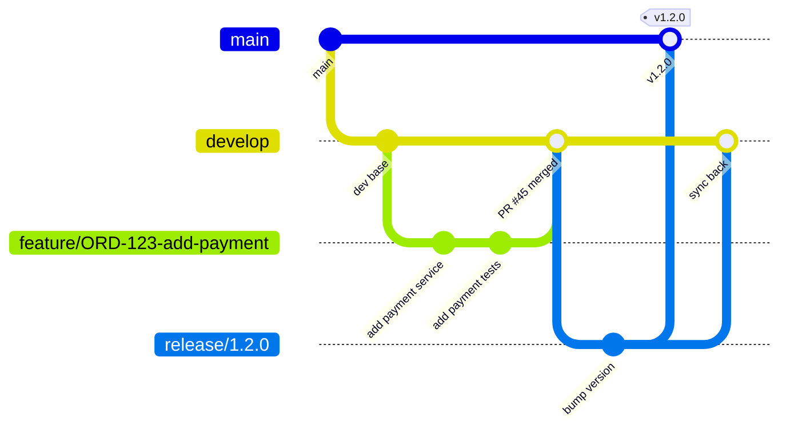

# Java Coding Standards — The Team Lead / Architect Playbook

## Why This Matters

You join a team of 12 engineers. Everyone writes Java differently. PRs take 3 days to review because every reviewer has different opinions. Bugs slip through because there's no consistent structure. Production incidents happen because someone swallowed an exception.

**Coding standards aren't about being pedantic — they're about making 12 people code like one.**

This guide covers everything you'd enforce as a team lead or architect — from naming to Git workflow to PR review checklists.

---

## 1. Naming Conventions — The Foundation

### Classes

```java
// ✅ Noun, PascalCase, describes WHAT it is
public class OrderService { }
public class PaymentGatewayClient { }
public class UserNotFoundException extends RuntimeException { }

// ❌ Vague, verb-based, or abbreviated
public class Manager { }          // manager of what?
public class DoPayment { }        // verb — this is a method name, not a class
public class UsrSvc { }           // abbreviation — unreadable in 6 months
```

### Methods

```java
// ✅ Verb, camelCase, describes WHAT it does
public Order findOrderById(Long id) { }
public boolean isEligibleForDiscount(Customer customer) { }
public void cancelExpiredSubscriptions() { }

// ❌ Vague or misleading
public Order get(Long id) { }     // get from where? DB? cache? API?
public void process() { }         // process what? how?
public boolean check(User u) { }  // check what about the user?
```

### Variables

```java
// ✅ Descriptive, reveals intent
int retryCount = 3;
List<Order> pendingOrders = orderRepo.findByStatus(PENDING);
Duration connectionTimeout = Duration.ofSeconds(30);

// ❌ Single letters, Hungarian notation, meaningless names
int n = 3;                         // n what?
List<Order> list1 = ...;           // list1 of what?
String strName = "John";           // Hungarian notation — Java isn't C
```

### Constants

```java
// ✅ UPPER_SNAKE_CASE, meaningful
public static final int MAX_RETRY_ATTEMPTS = 3;
public static final Duration DEFAULT_TIMEOUT = Duration.ofSeconds(30);
public static final String API_VERSION = "v2";

// ❌ Magic numbers scattered in code
if (retryCount > 3) { }           // what's 3? why 3?
Thread.sleep(5000);                // what's 5000? why 5 seconds?
```

<div class="callout-tip">

**Applying this** — Create a `NAMING_CONVENTIONS.md` in your repo root. First week on a new team, grep the codebase for patterns. If you see `Manager`, `Helper`, `Util`, `Processor` everywhere — that's a sign the team needs naming standards. In your PR template, add a checkbox: "Naming follows team conventions."

</div>

---

## 2. Package & Project Structure

### Standard Layout (Maven/Gradle)

```
src/main/java/com/company/product/
├── config/              # Spring configs, beans, properties mapping
├── controller/          # REST controllers (thin — delegate to service)
├── service/             # Business logic
│   └── impl/            # Service implementations (if using interfaces)
├── repository/          # Data access (JPA, JDBC, etc.)
├── model/
│   ├── entity/          # JPA entities (DB tables)
│   ├── dto/             # Request/Response DTOs
│   └── enums/           # Enumerations
├── exception/           # Custom exceptions + global handler
├── mapper/              # Entity ↔ DTO mappers
├── client/              # External API clients (Feign, RestTemplate)
├── util/                # Pure utility functions (stateless)
└── security/            # Auth filters, JWT, security config
```

### Rules

| Rule | Why |
|------|-----|
| Controllers never call repositories directly | Separation of concerns — business logic belongs in service |
| DTOs never leak into service layer | Services work with domain objects, not API contracts |
| No circular dependencies between packages | If `service` imports `controller`, your architecture is broken |
| One public class per file | Java convention, enforced by compiler for top-level classes |
| Test mirrors main structure | `src/test/java/com/company/product/service/OrderServiceTest.java` |

### Feature-Based vs Layer-Based (For Larger Projects)

```
# Layer-based (traditional — works for small/medium projects)
controller/ → service/ → repository/

# Feature-based (better for large projects / microservices)
order/
├── OrderController.java
├── OrderService.java
├── OrderRepository.java
├── OrderDto.java
└── OrderMapper.java
payment/
├── PaymentController.java
├── PaymentService.java
└── ...
```

<div class="callout-scenario">

**Scenario**: Your monolith has 200+ classes in the `service/` package. Finding anything takes minutes. **Solution**: Migrate to feature-based packaging. Each feature is self-contained — when you eventually extract it into a microservice, you just move the package. This is the "modular monolith" approach.

</div>

---

## 3. Exception Handling — The #1 Production Issue Source

### The Golden Rules

```java
// ❌ NEVER swallow exceptions
try {
    processPayment(order);
} catch (Exception e) {
    // silently ignored — you'll spend 3 days debugging why payments fail
}

// ❌ NEVER catch generic Exception (unless you're a top-level handler)
try {
    processPayment(order);
} catch (Exception e) {
    log.error("Failed", e);  // catches NullPointerException too — hides bugs
}

// ✅ Catch specific, log with context, rethrow or handle
try {
    processPayment(order);
} catch (PaymentDeclinedException e) {
    log.warn("Payment declined for order={}, reason={}", order.getId(), e.getReason());
    notifyCustomer(order, e.getReason());
} catch (PaymentGatewayTimeoutException e) {
    log.error("Gateway timeout for order={}", order.getId(), e);
    scheduleRetry(order);
}
```

### Custom Exception Hierarchy

```java
// Base exception for your domain
public abstract class AppException extends RuntimeException {
    private final String errorCode;

    protected AppException(String errorCode, String message) {
        super(message);
        this.errorCode = errorCode;
    }

    protected AppException(String errorCode, String message, Throwable cause) {
        super(message, cause);
        this.errorCode = errorCode;
    }

    public String getErrorCode() { return errorCode; }
}

// Specific exceptions
public class OrderNotFoundException extends AppException {
    public OrderNotFoundException(Long orderId) {
        super("ORDER_NOT_FOUND", "Order not found: " + orderId);
    }
}

public class InsufficientBalanceException extends AppException {
    public InsufficientBalanceException(BigDecimal required, BigDecimal available) {
        super("INSUFFICIENT_BALANCE",
              String.format("Required: %s, Available: %s", required, available));
    }
}
```

### Global Exception Handler (Spring)

```java
@RestControllerAdvice
public class GlobalExceptionHandler {

    @ExceptionHandler(OrderNotFoundException.class)
    public ResponseEntity<ErrorResponse> handleNotFound(OrderNotFoundException ex) {
        return ResponseEntity.status(404)
            .body(new ErrorResponse(ex.getErrorCode(), ex.getMessage()));
    }

    @ExceptionHandler(AppException.class)
    public ResponseEntity<ErrorResponse> handleAppException(AppException ex) {
        log.error("Application error: code={}, msg={}", ex.getErrorCode(), ex.getMessage(), ex);
        return ResponseEntity.status(400)
            .body(new ErrorResponse(ex.getErrorCode(), ex.getMessage()));
    }

    @ExceptionHandler(Exception.class)
    public ResponseEntity<ErrorResponse> handleUnexpected(Exception ex) {
        log.error("Unexpected error", ex);
        return ResponseEntity.status(500)
            .body(new ErrorResponse("INTERNAL_ERROR", "Something went wrong"));
        // NEVER expose stack traces or internal details to the client
    }
}
```

<div class="callout-interview">

**🎯 Interview Ready** — "How do you handle exceptions in a microservices architecture?" → Define a base domain exception with error codes. Each service has its own exception hierarchy. Use `@RestControllerAdvice` for global handling. Never expose internal details in API responses. Log with context (orderId, userId) — not just the message. For inter-service calls, map upstream errors to your domain exceptions — don't let a payment service's `NullPointerException` leak into your order service's response.

</div>

---

## 4. Logging Standards

### What to Log

```java
// ✅ Log business events with context
log.info("Order created: orderId={}, userId={}, amount={}", orderId, userId, amount);
log.info("Payment processed: orderId={}, gateway={}, txnId={}", orderId, gateway, txnId);
log.warn("Retry attempt: orderId={}, attempt={}/{}", orderId, attempt, maxRetries);
log.error("Payment failed: orderId={}, gateway={}, reason={}", orderId, gateway, reason, ex);

// ❌ Useless logs
log.info("Entering method");
log.info("Processing...");
log.debug(order.toString());  // dumps entire object — unreadable in production
```

### Log Levels — When to Use What

| Level | When | Example |
|-------|------|---------|
| `ERROR` | Something broke, needs attention | Payment gateway down, DB connection failed |
| `WARN` | Something unexpected but handled | Retry triggered, cache miss, deprecated API called |
| `INFO` | Business events, state changes | Order created, user logged in, job completed |
| `DEBUG` | Developer troubleshooting | SQL queries, request/response payloads, cache hits |
| `TRACE` | Deep debugging (rarely used) | Loop iterations, byte-level data |

### Structured Logging (For Production)

```java
// Use MDC for request-scoped context
MDC.put("requestId", requestId);
MDC.put("userId", userId);

// Now every log line in this request automatically includes requestId + userId
log.info("Order created: orderId={}", orderId);
// Output: 2024-01-15 10:30:45 [requestId=abc-123] [userId=42] INFO OrderService - Order created: orderId=789

MDC.clear();  // clean up after request (use a filter/interceptor)
```

### What NEVER to Log

```java
// ❌ NEVER log sensitive data
log.info("User login: email={}, password={}", email, password);     // SECURITY BREACH
log.info("Payment: card={}", cardNumber);                           // PCI violation
log.debug("Token: {}", jwtToken);                                   // session hijack risk
log.info("SSN: {}", user.getSsn());                                 // PII violation
```

<div class="callout-tip">

**Applying this** — Set up a logging interceptor that adds `requestId`, `userId`, and `traceId` to MDC for every request. Use logback's `%X{requestId}` in your pattern. In production, set root level to `INFO`, set your app packages to `DEBUG` only when troubleshooting. Use ELK or CloudWatch for log aggregation — never SSH into servers to read logs.

</div>

---

## 5. Git Workflow Standards

### Branching Strategy



### Branch Naming

```
feature/JIRA-123-short-description    # new feature
bugfix/JIRA-456-fix-payment-timeout   # bug fix
hotfix/JIRA-789-critical-auth-bypass  # production emergency
release/1.2.0                         # release branch
chore/update-spring-boot-3.2          # dependency updates, refactoring
```

### Commit Messages

```
# Format: <type>(<scope>): <description>
#
# Types: feat, fix, refactor, test, docs, chore, perf, ci

# ✅ Good commits
feat(payment): add Stripe webhook handler for refunds
fix(order): prevent duplicate order creation on retry
refactor(user): extract address validation to separate service
test(payment): add integration tests for idempotency
perf(search): add composite index on (status, created_at)
ci(deploy): add staging environment to GitHub Actions

# ❌ Bad commits
"fix"
"WIP"
"changes"
"updated stuff"
"John's changes"
"asdfgh"
```

### Commit Hygiene

```bash
# ❌ One giant commit with 47 files
git add .
git commit -m "add payment feature"

# ✅ Logical, atomic commits
git add src/service/PaymentService.java src/repository/PaymentRepository.java
git commit -m "feat(payment): add payment processing service"

git add src/controller/PaymentController.java src/dto/PaymentRequest.java
git commit -m "feat(payment): add REST endpoint for payment initiation"

git add src/test/service/PaymentServiceTest.java
git commit -m "test(payment): add unit tests for payment processing"
```

<div class="callout-scenario">

**Scenario**: A developer pushes 1 commit with 2000 lines — new feature + bug fix + refactoring + dependency update all mixed together. The bug fix needs to be cherry-picked to production. **You can't.** It's tangled with everything else. **Rule**: One logical change per commit. If you can't describe it in one line, it's too big.

</div>

---

## 6. Pull Request Standards

### PR Template (Add to `.github/PULL_REQUEST_TEMPLATE.md`)

```markdown
## What does this PR do?
<!-- Brief description of the change -->

## JIRA Ticket
<!-- Link to ticket -->

## Type of Change
- [ ] Feature
- [ ] Bug fix
- [ ] Refactoring
- [ ] Dependency update

## Checklist
- [ ] Unit tests added/updated
- [ ] Integration tests pass
- [ ] No new warnings/errors in build
- [ ] API documentation updated (if applicable)
- [ ] Database migration included (if applicable)
- [ ] Backward compatible (or migration plan documented)
- [ ] Logging added for new business flows
- [ ] No secrets/credentials in code
```

### PR Size Rules

| PR Size | Lines Changed | Review Time | Verdict |
|---------|--------------|-------------|---------|
| Small | < 200 | 15 min | ✅ Ideal |
| Medium | 200–500 | 30 min | ⚠️ Acceptable |
| Large | 500–1000 | 1+ hour | ❌ Split it |
| Massive | 1000+ | Days | 🚫 Reject — break it down |

### Code Review Checklist (For Reviewers)

```
Correctness:
  □ Does the logic actually solve the problem?
  □ Are edge cases handled (null, empty, boundary values)?
  □ Are error paths handled (not just happy path)?

Security:
  □ No SQL injection (parameterized queries)?
  □ No sensitive data in logs?
  □ Input validation present?
  □ Auth/authz checks in place?

Performance:
  □ No N+1 queries?
  □ No unnecessary DB calls in loops?
  □ Appropriate use of caching?
  □ No unbounded collections in memory?

Maintainability:
  □ Naming is clear and consistent?
  □ No code duplication?
  □ Methods < 30 lines (ideally)?
  □ Classes have single responsibility?

Testing:
  □ Unit tests cover happy + error paths?
  □ Mocks used appropriately (not over-mocked)?
  □ Test names describe the scenario?
```

<div class="callout-tip">

**Applying this** — As a team lead, enforce these rules: (1) No PR merges without at least 1 approval, (2) CI must pass before merge, (3) PRs open > 3 days get flagged in standup, (4) Rotate reviewers — don't let one person become the bottleneck. Set up branch protection rules in GitHub/GitLab to enforce this automatically.

</div>

---

## 7. SOLID Principles — Applied Practically

### Single Responsibility (S)

```java
// ❌ OrderService does everything
public class OrderService {
    public Order createOrder(OrderRequest req) { ... }
    public void sendConfirmationEmail(Order order) { ... }    // not order logic
    public void generateInvoicePdf(Order order) { ... }       // not order logic
    public void updateInventory(Order order) { ... }          // not order logic
}

// ✅ Each class has one reason to change
public class OrderService {
    public Order createOrder(OrderRequest req) {
        Order order = orderRepository.save(buildOrder(req));
        eventPublisher.publish(new OrderCreatedEvent(order));  // others react to event
        return order;
    }
}

public class OrderNotificationListener {
    @EventListener
    public void onOrderCreated(OrderCreatedEvent event) {
        emailService.sendConfirmation(event.getOrder());
    }
}

public class InventoryListener {
    @EventListener
    public void onOrderCreated(OrderCreatedEvent event) {
        inventoryService.reserve(event.getOrder().getItems());
    }
}
```

### Open/Closed (O)

```java
// ❌ Adding a new payment method requires modifying existing code
public class PaymentProcessor {
    public void process(Payment payment) {
        if (payment.getType() == CREDIT_CARD) { ... }
        else if (payment.getType() == PAYPAL) { ... }
        else if (payment.getType() == CRYPTO) { ... }  // keep adding else-if forever
    }
}

// ✅ Open for extension, closed for modification
public interface PaymentHandler {
    boolean supports(PaymentType type);
    PaymentResult process(Payment payment);
}

@Component
public class CreditCardHandler implements PaymentHandler {
    public boolean supports(PaymentType type) { return type == CREDIT_CARD; }
    public PaymentResult process(Payment payment) { ... }
}

// Adding UPI? Just add a new class — no existing code changes
@Component
public class UpiHandler implements PaymentHandler {
    public boolean supports(PaymentType type) { return type == UPI; }
    public PaymentResult process(Payment payment) { ... }
}

@Component
public class PaymentProcessor {
    private final List<PaymentHandler> handlers;

    public PaymentResult process(Payment payment) {
        return handlers.stream()
            .filter(h -> h.supports(payment.getType()))
            .findFirst()
            .orElseThrow(() -> new UnsupportedPaymentException(payment.getType()))
            .process(payment);
    }
}
```

### Dependency Inversion (D)

```java
// ❌ High-level module depends on low-level module
public class OrderService {
    private final MySqlOrderRepository repo = new MySqlOrderRepository();  // tightly coupled
}

// ✅ Both depend on abstraction
public interface OrderRepository {
    Order save(Order order);
    Optional<Order> findById(Long id);
}

@Repository
public class JpaOrderRepository implements OrderRepository { ... }

@Service
public class OrderService {
    private final OrderRepository repo;  // depends on interface, not implementation

    public OrderService(OrderRepository repo) {
        this.repo = repo;  // constructor injection — testable, swappable
    }
}
```

<div class="callout-interview">

**🎯 Interview Ready** — "Give me a real example of SOLID in your project." → "Our payment service uses the Strategy pattern (Open/Closed). Each payment method is a separate handler implementing a common interface. When we added Apple Pay, we wrote one new class — zero changes to existing code. The PaymentProcessor auto-discovers handlers via Spring's dependency injection. This also made testing trivial — we test each handler in isolation."

</div>

---

## 8. Testing Standards

### Test Naming

```java
// ✅ Describes scenario and expected outcome
@Test
void createOrder_withValidItems_returnsOrderWithPendingStatus() { }

@Test
void createOrder_withEmptyCart_throwsEmptyCartException() { }

@Test
void applyDiscount_whenCouponExpired_returnsOriginalPrice() { }

// ❌ Meaningless names
@Test
void test1() { }

@Test
void testCreateOrder() { }  // what about createOrder? happy path? error?
```

### Test Structure (AAA Pattern)

```java
@Test
void createOrder_withValidItems_returnsOrderWithPendingStatus() {
    // Arrange
    OrderRequest request = OrderRequest.builder()
        .userId(42L)
        .items(List.of(new OrderItem("SKU-001", 2)))
        .build();
    when(inventoryClient.checkStock("SKU-001")).thenReturn(true);

    // Act
    Order result = orderService.createOrder(request);

    // Assert
    assertThat(result.getStatus()).isEqualTo(OrderStatus.PENDING);
    assertThat(result.getUserId()).isEqualTo(42L);
    assertThat(result.getItems()).hasSize(1);
    verify(eventPublisher).publish(any(OrderCreatedEvent.class));
}
```

### What to Test at Each Level

| Level | What | Tools | Speed |
|-------|------|-------|-------|
| Unit | Single class, mocked dependencies | JUnit 5, Mockito | ms |
| Integration | Service + real DB / real queue | @SpringBootTest, Testcontainers | seconds |
| Contract | API request/response shape | Spring Cloud Contract, Pact | seconds |
| E2E | Full flow through all services | Selenium, RestAssured | minutes |

### Testing Anti-Patterns

```java
// ❌ Testing implementation, not behavior
verify(repo).save(any());  // who cares if save was called? check the RESULT

// ❌ Over-mocking — test is coupled to implementation
when(mapper.toEntity(any())).thenReturn(entity);
when(repo.save(entity)).thenReturn(savedEntity);
when(mapper.toDto(savedEntity)).thenReturn(dto);
// If you refactor the service, all tests break even though behavior is unchanged

// ❌ No assertions — test always passes
@Test
void testSomething() {
    orderService.createOrder(request);
    // ... no assert, no verify — this test proves nothing
}

// ❌ Testing getters/setters — waste of time
@Test
void testGetName() {
    user.setName("John");
    assertEquals("John", user.getName());  // congratulations, Java works
}
```

<div class="callout-tip">

**Applying this** — Enforce minimum 80% line coverage on new code (not legacy). Use JaCoCo with a Maven/Gradle plugin that fails the build below threshold. But remember — coverage is a necessary condition, not sufficient. 100% coverage with no assertions is worse than 50% coverage with meaningful tests. In PR reviews, check test quality, not just coverage numbers.

</div>

---

## 9. Code Smells & Anti-Patterns to Reject in PRs

### God Class

```java
// ❌ One class does everything — 2000 lines, 50 methods
public class OrderManager {
    public void createOrder() { }
    public void cancelOrder() { }
    public void refundOrder() { }
    public void sendEmail() { }
    public void generateReport() { }
    public void syncInventory() { }
    public void calculateTax() { }
    // ... 43 more methods
}

// ✅ Split by responsibility
// OrderService, OrderCancellationService, RefundService,
// NotificationService, ReportService, InventoryService, TaxService
```

### Primitive Obsession

```java
// ❌ Passing raw strings/ints everywhere
public void createUser(String email, String phone, String address,
                       int age, String country, String zipCode) { }

// ✅ Use value objects
public void createUser(Email email, PhoneNumber phone, Address address, Age age) { }

// Value object with validation baked in
public record Email(String value) {
    public Email {
        if (!value.matches("^[\\w.-]+@[\\w.-]+\\.[a-zA-Z]{2,}$")) {
            throw new InvalidEmailException(value);
        }
    }
}
```

### Boolean Trap

```java
// ❌ What does true mean here?
orderService.process(order, true, false, true);

// ✅ Use enums or builder
orderService.process(order, ProcessingOptions.builder()
    .priority(Priority.HIGH)
    .sendNotification(true)
    .async(false)
    .build());
```

### Null Returns

```java
// ❌ Returning null — caller must remember to check
public User findUser(Long id) {
    return userRepo.findById(id).orElse(null);  // NullPointerException waiting to happen
}

// ✅ Return Optional for "might not exist" cases
public Optional<User> findUser(Long id) {
    return userRepo.findById(id);
}

// ✅ Or throw if absence is exceptional
public User getUser(Long id) {
    return userRepo.findById(id)
        .orElseThrow(() -> new UserNotFoundException(id));
}
```

---

## 10. Dependency Management

### Version Pinning

```xml
<!-- ✅ Pin exact versions — reproducible builds -->
<dependency>
    <groupId>org.springframework.boot</groupId>
    <artifactId>spring-boot-starter-web</artifactId>
    <version>3.2.1</version>
</dependency>

<!-- ❌ Version ranges — builds break randomly -->
<dependency>
    <groupId>com.example</groupId>
    <artifactId>some-lib</artifactId>
    <version>[1.0,2.0)</version>
</dependency>
```

### BOM (Bill of Materials) for Consistency

```xml
<dependencyManagement>
    <dependencies>
        <dependency>
            <groupId>org.springframework.boot</groupId>
            <artifactId>spring-boot-dependencies</artifactId>
            <version>3.2.1</version>
            <type>pom</type>
            <scope>import</scope>
        </dependency>
    </dependencies>
</dependencyManagement>

<!-- Now child dependencies don't need version — BOM manages it -->
<dependency>
    <groupId>org.springframework.boot</groupId>
    <artifactId>spring-boot-starter-web</artifactId>
    <!-- version inherited from BOM -->
</dependency>
```

### Dependency Update Strategy

| Frequency | What | How |
|-----------|------|-----|
| Weekly | Security patches (PATCH versions) | Dependabot / Renovate auto-PRs |
| Monthly | Minor versions | Manual review + test suite |
| Quarterly | Major versions (Spring Boot 3.x → 3.y) | Dedicated sprint, migration guide |
| Yearly | Framework upgrades (Java 17 → 21) | Planned migration with team |

---

## 11. The Architect's Checklist — Before Every Release

```
Code Quality:
  □ No compiler warnings
  □ No SonarQube critical/blocker issues
  □ Code coverage ≥ 80% on new code
  □ No TODO/FIXME in production code (convert to tickets)

Security:
  □ No hardcoded secrets (use Vault / Secrets Manager)
  □ Dependencies scanned for CVEs (OWASP dependency-check)
  □ Input validation on all API endpoints
  □ SQL injection protection (parameterized queries only)

Performance:
  □ No N+1 queries (check Hibernate logs)
  □ Connection pools sized correctly
  □ Timeouts configured for all external calls
  □ Circuit breakers on critical dependencies

Operations:
  □ Health check endpoint exists (/actuator/health)
  □ Structured logging with correlation IDs
  □ Metrics exposed (Micrometer → Prometheus)
  □ Graceful shutdown configured
  □ Database migrations are backward compatible
```

<div class="callout-interview">

**🎯 Interview Ready** — "How do you ensure code quality across a team?" → "We enforce it at 4 levels: (1) IDE — formatter + linter rules shared via `.editorconfig` and Checkstyle, (2) Pre-commit — hooks run tests + formatting, (3) CI — SonarQube gates, coverage thresholds, dependency vulnerability scans, (4) PR review — mandatory 1+ approval with a structured checklist. The key is automation — humans forget, pipelines don't."

</div>

---

## Quick Reference Card

| Area | Standard |
|------|----------|
| Naming | PascalCase classes, camelCase methods, UPPER_SNAKE constants |
| Methods | < 30 lines, single responsibility, no side effects if possible |
| Classes | < 300 lines, single responsibility, favor composition over inheritance |
| Exceptions | Catch specific, log with context, never swallow |
| Logging | Structured, MDC for context, never log secrets |
| Git branches | `type/TICKET-description` |
| Commits | `type(scope): description` — atomic, one logical change |
| PRs | < 500 lines, template filled, tests included |
| Tests | AAA pattern, descriptive names, test behavior not implementation |
| Dependencies | Pin versions, use BOM, automate updates |
