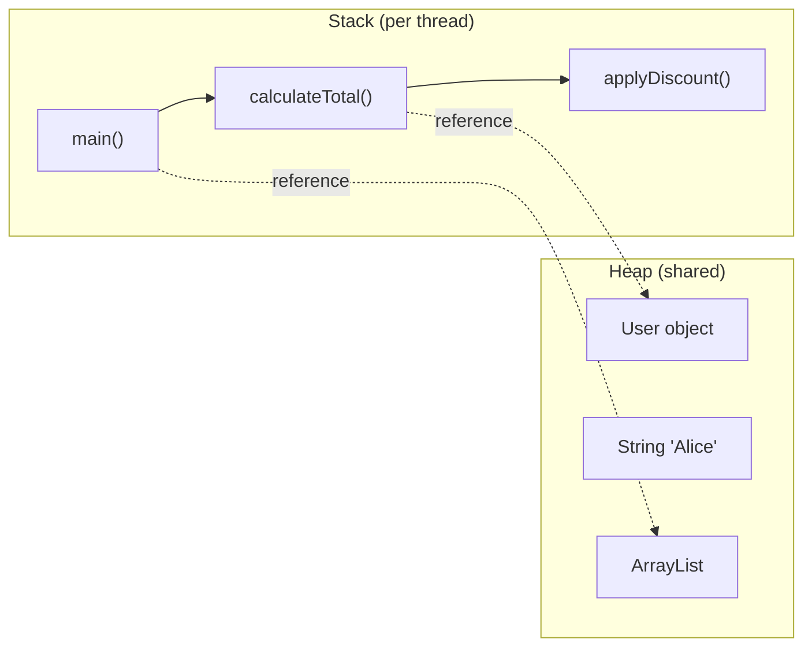
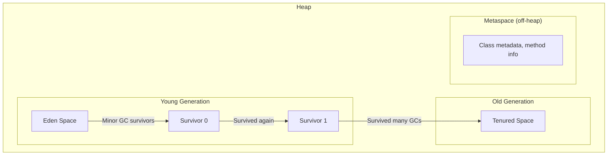

# Java Memory Model — Where Your Objects Live and Die

## The Apartment Building Analogy

Think of JVM memory as an apartment building:
- **Stack** = Each person's desk in their own room (private, small, fast)
- **Heap** = The shared warehouse in the basement (big, shared, needs management)
- **Garbage Collector** = The janitor who cleans up stuff nobody uses anymore

---

## 1. Stack vs Heap



### What goes where?

```java
public void processOrder() {
    int quantity = 5;                    // Stack — primitive
    double price = 29.99;               // Stack — primitive
    String name = "Alice";              // Stack: reference, Heap: String object
    Order order = new Order(name, 5);   // Stack: reference, Heap: Order object
    List<Item> items = new ArrayList<>(); // Stack: reference, Heap: ArrayList object
}
// When processOrder() returns → all stack variables are gone instantly
// Heap objects remain until GC collects them
```

| | Stack | Heap |
|---|-------|------|
| Stores | Primitives, references, method frames | Objects, arrays |
| Scope | Per thread (private) | Shared across threads |
| Speed | Very fast (LIFO) | Slower (needs GC) |
| Size | Small (~512KB-1MB per thread) | Large (configurable, GBs) |
| Cleanup | Automatic on method return | Garbage Collector |
| Error | `StackOverflowError` | `OutOfMemoryError` |

---

## 2. Heap Structure



### Object lifecycle

1. **New object** → created in **Eden**
2. **Minor GC** → surviving objects move to **Survivor** space
3. **After N minor GCs** (default 15) → promoted to **Old Generation**
4. **Major GC / Full GC** → cleans Old Generation (expensive, stop-the-world)

### Scenario: Why your app pauses

```
Your app creates millions of short-lived objects (e.g., in a loop).
Eden fills up fast → frequent Minor GCs (usually fast, ~10ms).
Some objects accidentally survive (held by a reference) → promoted to Old Gen.
Old Gen fills up → Full GC → STOP THE WORLD → 200ms-2s pause! 💥
```

---

## 3. Garbage Collection Algorithms

### How does GC know what to collect?

**Reachability analysis**: Start from "GC roots" (stack variables, static fields, thread objects). Anything reachable from roots is alive. Everything else is garbage.

```java
Object a = new Object();  // a is a GC root → Object is reachable
a = null;                  // no more reference → Object is garbage
```

### GC Types

| GC | Best For | Pause Behavior |
|----|----------|---------------|
| **Serial GC** | Small apps, single CPU | Stop-the-world, single thread |
| **Parallel GC** | Throughput (batch jobs) | Stop-the-world, multi-thread |
| **G1 GC** (default Java 9+) | Balanced latency/throughput | Mostly concurrent, short pauses |
| **ZGC** (Java 15+) | Ultra-low latency | < 1ms pauses, even with TB heaps |
| **Shenandoah** | Low latency | Concurrent compaction |

### JVM flags

```bash
# Set heap size
java -Xms512m -Xmx2g MyApp    # min 512MB, max 2GB

# Choose GC
java -XX:+UseG1GC MyApp        # G1 (default)
java -XX:+UseZGC MyApp          # ZGC (low latency)

# GC logging
java -Xlog:gc* MyApp            # see what GC is doing
```

---

## 4. Memory Leaks in Java — Yes, They Exist!

### Scenario 1: Forgotten collection references

```java
class Cache {
    private static final Map<String, Object> cache = new HashMap<>();

    public void add(String key, Object value) {
        cache.put(key, value);  // objects NEVER get removed → memory grows forever
    }
    // Fix: use WeakHashMap, or add eviction logic, or use Caffeine/Guava cache
}
```

### Scenario 2: Unclosed resources

```java
// ❌ Connection never closed → connection pool exhausted
public void query() {
    Connection conn = dataSource.getConnection();
    // ... use conn
    // forgot conn.close()!
}

// ✅ try-with-resources
public void query() {
    try (Connection conn = dataSource.getConnection()) {
        // ... use conn
    }  // auto-closed here
}
```

### Scenario 3: Inner class holding outer reference

```java
class Outer {
    private byte[] largeData = new byte[10_000_000];  // 10MB

    class Inner {
        // Inner implicitly holds reference to Outer
        // Even if Outer is "done", it can't be GC'd while Inner exists
    }

    // Fix: use static inner class
    static class StaticInner {
        // no reference to Outer
    }
}
```

### Scenario 4: ThreadLocal not cleaned up

```java
// ❌ In a thread pool, threads are reused — ThreadLocal values persist!
private static ThreadLocal<UserContext> context = new ThreadLocal<>();

public void handleRequest() {
    context.set(new UserContext(currentUser));
    // ... process request
    // forgot context.remove()! → memory leak in thread pools
}

// ✅ Always clean up
public void handleRequest() {
    try {
        context.set(new UserContext(currentUser));
        // ... process request
    } finally {
        context.remove();  // ALWAYS
    }
}
```

---

## 5. String Pool — Special Memory Area

```java
String s1 = "hello";           // goes to String Pool (in heap, special area)
String s2 = "hello";           // reuses same object from pool
String s3 = new String("hello"); // creates NEW object in heap (not pooled)

s1 == s2;      // true  (same reference from pool)
s1 == s3;      // false (different objects)
s1.equals(s3); // true  (same content)

s3.intern();   // returns the pooled version
s1 == s3.intern(); // true
```

---

## 6. Diagnosing Memory Issues

### Tools

| Tool | Purpose |
|------|---------|
| `jmap -heap <pid>` | Heap summary |
| `jmap -histo <pid>` | Object histogram |
| `jstat -gc <pid>` | GC statistics |
| `jvisualvm` | Visual profiler |
| `Eclipse MAT` | Heap dump analyzer |
| `-XX:+HeapDumpOnOutOfMemoryError` | Auto dump on OOM |

### Scenario: Finding a memory leak

```bash
# 1. Take heap dump
jmap -dump:format=b,file=heap.hprof <pid>

# 2. Open in Eclipse MAT
# 3. Look at "Leak Suspects" report
# 4. Check "Dominator Tree" — who's holding the most memory?
# 5. Find the reference chain keeping objects alive
```

---

## 7. Quick Reference

```
JVM Memory Layout
├── Stack (per thread)
│   ├── Method frames
│   ├── Local primitives (int, double, boolean)
│   └── Object references (pointers to heap)
├── Heap (shared)
│   ├── Young Generation
│   │   ├── Eden (new objects born here)
│   │   ├── Survivor 0
│   │   └── Survivor 1
│   ├── Old Generation (long-lived objects)
│   └── String Pool
├── Metaspace (off-heap, since Java 8)
│   ├── Class metadata
│   ├── Method bytecode
│   └── Constant pool
└── Native Memory
    ├── Thread stacks
    ├── Direct ByteBuffers
    └── JNI allocations
```

---

---

## 🎯 Interview Corner

<div class="callout-interview">

**Q: "Explain the difference between stack and heap memory. What goes where?"**

Stack stores method frames, local primitives (int, boolean, double), and object references (pointers). Each thread gets its own stack (~512KB-1MB). When a method returns, its entire frame is popped instantly — no GC needed. Heap stores all objects and arrays, shared across threads. When you write `User user = new User()`, the reference `user` is on the stack, the actual User object is on the heap. Heap is managed by the garbage collector. Stack overflow happens from deep recursion (too many frames). OutOfMemoryError happens when the heap is full and GC can't free enough space.

</div>

<div class="callout-interview">

**Q: "How does garbage collection work in Java? Walk me through the generational model."**

The heap is divided into Young Generation (Eden + two Survivor spaces) and Old Generation. New objects are born in Eden. When Eden fills up, a Minor GC runs — it copies surviving objects to a Survivor space and clears Eden. Objects that survive multiple Minor GCs (default 15) get promoted to Old Generation. When Old Gen fills up, a Major/Full GC runs, which is much more expensive and causes stop-the-world pauses. The generational hypothesis is that most objects die young — so Minor GCs are frequent but fast (only scanning young objects), while Major GCs are rare. G1 GC (default since Java 9) divides the heap into regions and collects the regions with the most garbage first, giving predictable pause times.

**Follow-up trap**: "When would you choose ZGC over G1?" → ZGC guarantees sub-millisecond pauses even with terabyte heaps. Use it for latency-sensitive applications like trading systems or real-time APIs where even a 50ms GC pause is unacceptable. G1 is better for general-purpose workloads where throughput matters more than worst-case latency.

</div>

<div class="callout-interview">

**Q: "How do you identify and fix a memory leak in a Java application?"**

First, monitor heap usage over time — if it keeps growing and Full GCs can't reclaim space, you have a leak. Take a heap dump: `jmap -dump:format=b,file=heap.hprof <pid>` or use `-XX:+HeapDumpOnOutOfMemoryError` to auto-capture. Open it in Eclipse MAT, check the Leak Suspects report and Dominator Tree to find which objects hold the most memory. Follow the reference chain to find what's keeping them alive. Common culprits: static collections that grow forever (use bounded caches like Caffeine), unclosed resources (connections, streams — use try-with-resources), ThreadLocal not cleaned up in thread pools, and inner classes holding references to outer class instances (use static inner classes).

</div>

<div class="callout-interview">

**Q: "Your production app has frequent Full GC pauses of 2-3 seconds. How do you fix it?"**

First, enable GC logging (`-Xlog:gc*`) to understand what's happening. Check if Old Gen is filling up because objects are being promoted too quickly — this means either your Young Gen is too small (increase with `-Xmn`) or objects are living just long enough to get promoted but dying shortly after (increase tenuring threshold). If the heap is genuinely full, either you have a memory leak (heap dump analysis) or you need more heap (`-Xmx`). If the heap is large and pauses are the problem, switch from G1 to ZGC (`-XX:+UseZGC`) for sub-ms pauses. Also check for object allocation hotspots — creating millions of short-lived objects in a loop puts pressure on GC. Reuse objects or use primitives where possible.

</div>

<div class="callout-tip">

**Applying this** — In production, always set `-XX:+HeapDumpOnOutOfMemoryError -XX:HeapDumpPath=/var/dumps/` so you get a heap dump when things go wrong. Monitor GC metrics (pause time, frequency, heap usage) via Micrometer → Prometheus → Grafana. Set alerts on Old Gen usage > 80% and GC pause time > 500ms. For most Spring Boot services, start with `-Xms512m -Xmx2g -XX:+UseG1GC` and tune from there based on actual behavior.

</div>

---

> **The one thing to remember**: In Java, you don't manage memory — but you must **respect** it. Close your resources, limit your caches, clean your ThreadLocals, and let the GC do its job. The best memory management is writing code that doesn't fight the garbage collector.
