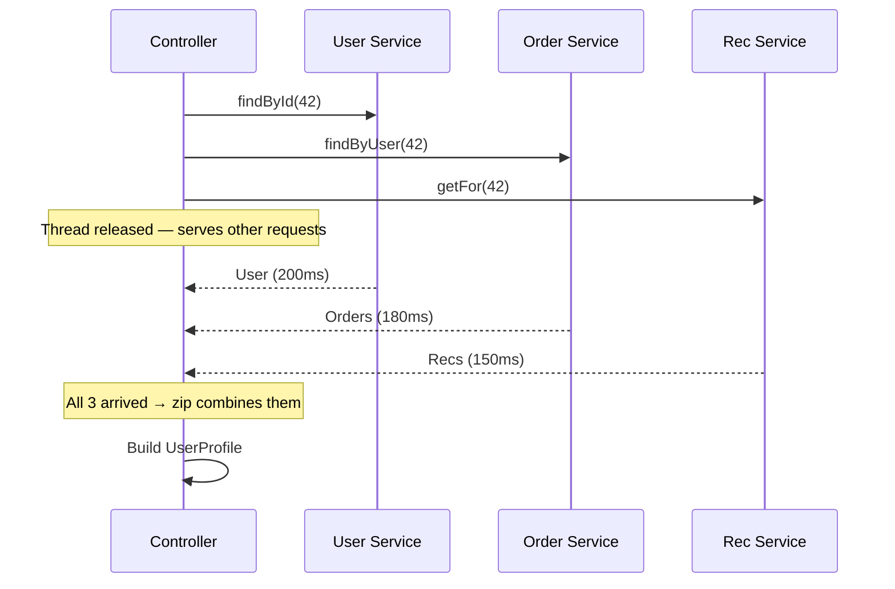
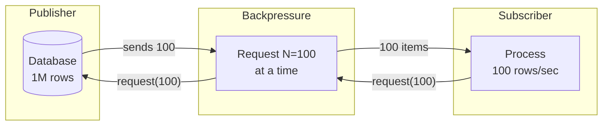

# Reactive Programming in Java — Complete Scenario-Based Guide

## The Problem Reactive Solves

You have an API that fetches user profile, their orders, and recommendations — 3 downstream calls, each taking 200ms.

```
Traditional (blocking):
  fetchUser()       → 200ms (thread blocked, doing nothing)
  fetchOrders()     → 200ms (thread blocked, doing nothing)
  fetchRecommendations() → 200ms (thread blocked, doing nothing)
  Total: 600ms, 1 thread occupied the entire time

Reactive (non-blocking):
  fetchUser()       ─┐
  fetchOrders()     ─┼─ all fire simultaneously → 200ms total
  fetchRecommendations() ─┘
  Total: 200ms, thread released between calls
```

**Blocking** = thread sits idle waiting for I/O. At 200 threads and 1000 RPS, you run out of threads. Requests queue up. Latency spikes. Users leave.

**Reactive** = thread starts the I/O, goes to serve another request, comes back when I/O completes. Same 200 threads handle 10,000+ RPS.

---

## The Core Concepts — In 5 Minutes

### Publisher → Subscriber Model

```
Publisher (data source)
    │
    ▼
Operator (transform, filter, combine)
    │
    ▼
Subscriber (consumes data)
```

Everything is a **stream**. A database query returns a stream. An HTTP call returns a stream. Even a single value is a stream of one.

### Mono vs Flux — The Two Building Blocks

```java
// Mono<T> — 0 or 1 element (like Optional, but async)
Mono<User> user = userService.findById(42);

// Flux<T> — 0 to N elements (like List, but async + streamed)
Flux<Order> orders = orderService.findByUserId(42);
```

Think of it this way:
- `Mono` = a **promise** that will eventually give you one thing (or nothing)
- `Flux` = a **conveyor belt** that keeps sending items until it's done

### Nothing Happens Until You Subscribe

```java
// This does NOTHING — no HTTP call, no DB query, nothing
Mono<User> user = webClient.get()
    .uri("/users/42")
    .retrieve()
    .bodyToMono(User.class);

// THIS triggers the actual call
user.subscribe(u -> System.out.println(u.getName()));

// In Spring WebFlux, the framework subscribes for you when you return Mono/Flux from a controller
```

---

## Project Reactor — Hands-On

### Creating Mono and Flux

```java
// From values
Mono<String> mono = Mono.just("hello");
Flux<Integer> flux = Flux.just(1, 2, 3, 4, 5);

// From collections
Flux<String> fromList = Flux.fromIterable(List.of("a", "b", "c"));

// Empty / Error
Mono<String> empty = Mono.empty();
Mono<String> error = Mono.error(new RuntimeException("boom"));

// Deferred — created lazily when subscribed
Mono<Instant> now = Mono.defer(() -> Mono.just(Instant.now()));
// Each subscriber gets a different timestamp
```

### Transforming Data

```java
// map — synchronous transform (1:1)
Mono<String> name = userMono.map(user -> user.getName());

// flatMap — async transform (returns another Mono/Flux)
Mono<List<Order>> orders = userMono
    .flatMap(user -> orderService.findByUserId(user.getId()));

// flatMapMany — Mono to Flux
Flux<Order> orders = userMono
    .flatMapMany(user -> orderService.streamByUserId(user.getId()));
```

### The Critical Difference: map vs flatMap

```java
// map — use when transformation is instant (no I/O)
mono.map(user -> user.getName().toUpperCase());

// flatMap — use when transformation involves another async call
mono.flatMap(user -> fetchOrdersFromDb(user.getId()));
//                   ^^^^^^^^^^^^^^^^^ returns Mono/Flux

// ❌ WRONG — map with async call wraps Mono inside Mono
mono.map(user -> fetchOrdersFromDb(user.getId()));
// Result: Mono<Mono<List<Order>>> — nested, broken
```

<div class="callout-tip">

**Applying this** — Simple rule: if the lambda returns a plain value → `map`. If it returns a `Mono` or `Flux` → `flatMap`. Get this wrong and you'll have nested publishers that never execute.

</div>

---

## Real Scenario: Building a User Profile API

### The Blocking Way (Traditional Spring MVC)

```java
@GetMapping("/users/{id}/profile")
public UserProfile getProfile(@PathVariable Long id) {
    User user = userService.findById(id);           // 200ms blocked
    List<Order> orders = orderService.findByUser(id); // 200ms blocked
    List<String> recs = recService.getFor(id);        // 200ms blocked
    return new UserProfile(user, orders, recs);       // 600ms total
}
```

### The Reactive Way (Spring WebFlux)

```java
@GetMapping("/users/{id}/profile")
public Mono<UserProfile> getProfile(@PathVariable Long id) {
    Mono<User> user = userService.findById(id);
    Mono<List<Order>> orders = orderService.findByUser(id).collectList();
    Mono<List<String>> recs = recService.getFor(id).collectList();

    return Mono.zip(user, orders, recs)
        .map(tuple -> new UserProfile(tuple.getT1(), tuple.getT2(), tuple.getT3()));
    // All 3 calls fire in parallel → 200ms total
}
```

### What Mono.zip Does



`Mono.zip` waits for ALL publishers to complete, then combines results. Total time = max(individual times), not sum.

---

## Error Handling in Reactive

### onErrorReturn — Fallback Value

```java
Mono<User> user = userService.findById(id)
    .onErrorReturn(new User("Unknown", "guest@example.com"));
// If findById fails, return a default user instead of propagating error
```

### onErrorResume — Fallback Logic

```java
Mono<User> user = userService.findById(id)
    .onErrorResume(TimeoutException.class, ex -> {
        log.warn("User service timeout, falling back to cache");
        return cacheService.getCachedUser(id);
    })
    .onErrorResume(ex -> {
        log.error("All fallbacks failed", ex);
        return Mono.error(new ServiceUnavailableException("User service down"));
    });
```

### doOnError — Side Effects (Logging)

```java
Mono<User> user = userService.findById(id)
    .doOnError(ex -> log.error("Failed to fetch user={}", id, ex))
    .onErrorResume(ex -> Mono.empty());
// doOnError doesn't change the stream — just observes errors
```

### retry — Automatic Retries

```java
Mono<User> user = userService.findById(id)
    .retryWhen(Retry.backoff(3, Duration.ofMillis(500))
        .filter(ex -> ex instanceof TimeoutException)
        .onRetryExhaustedThrow((spec, signal) ->
            new ServiceUnavailableException("User service unreachable after 3 retries")));
// Retries 3 times with exponential backoff: 500ms, 1s, 2s
// Only retries on TimeoutException — not on 404 or validation errors
```

<div class="callout-scenario">

**Scenario**: Your payment service calls a bank API that's flaky — times out 5% of the time. With blocking code, a timeout holds a thread for 30 seconds. At 100 RPS, that's 5 threads stuck per second. In 60 seconds, your thread pool is exhausted. **With reactive**: timeout releases the thread immediately, retry fires after backoff, and the thread serves other requests in between. Same 200 threads handle the load without breaking a sweat.

</div>

---

## Backpressure — The Killer Feature

### The Problem

```
Database returns 1,000,000 rows
    ↓
Your service processes 100 rows/sec
    ↓
Without backpressure: OOM — all 1M rows loaded into memory
With backpressure: database sends 100 at a time, waits for "give me more" signal
```

### How Backpressure Works

```java
// Flux with backpressure — subscriber controls the pace
Flux<Order> allOrders = orderRepository.findAll();

allOrders
    .limitRate(100)  // request 100 items at a time from upstream
    .flatMap(order -> processOrder(order), 10)  // process 10 concurrently
    .subscribe();

// The database doesn't dump 1M rows — it sends 100, waits, sends 100 more
```

### Backpressure Strategies

```java
// onBackpressureBuffer — buffer excess items (careful with memory)
flux.onBackpressureBuffer(1000)  // buffer up to 1000, error if exceeded

// onBackpressureDrop — drop items subscriber can't keep up with
flux.onBackpressureDrop(dropped -> log.warn("Dropped: {}", dropped))

// onBackpressureLatest — keep only the latest item
flux.onBackpressureLatest()  // useful for real-time dashboards (show latest value)
```



<div class="callout-interview">

**🎯 Interview Ready** — "What is backpressure?" → It's a flow control mechanism where the consumer tells the producer how much data it can handle. Without it, a fast producer overwhelms a slow consumer — causing OOM or dropped messages. In Project Reactor, `Flux` implements the Reactive Streams spec where `Subscriber.request(n)` controls the flow. Practical example: streaming 1M database rows — `limitRate(100)` ensures only 100 are in memory at a time.

</div>

---

## Spring WebFlux — The Full Picture

### Controller Layer

```java
@RestController
@RequestMapping("/api/orders")
public class OrderController {

    private final OrderService orderService;

    @GetMapping("/{id}")
    public Mono<Order> getOrder(@PathVariable String id) {
        return orderService.findById(id);
    }

    @GetMapping
    public Flux<Order> getAllOrders() {
        return orderService.findAll();
    }

    @PostMapping
    @ResponseStatus(HttpStatus.CREATED)
    public Mono<Order> createOrder(@RequestBody Mono<OrderRequest> request) {
        return request.flatMap(orderService::create);
        // Note: request body is also a Mono — fully non-blocking
    }

    // Server-Sent Events — streaming to client
    @GetMapping(value = "/stream", produces = MediaType.TEXT_EVENT_STREAM_VALUE)
    public Flux<Order> streamOrders() {
        return orderService.streamNewOrders();
        // Client receives orders as they're created — real-time
    }
}
```

### Service Layer

```java
@Service
public class OrderService {

    private final OrderRepository orderRepo;
    private final InventoryClient inventoryClient;
    private final NotificationService notificationService;

    public Mono<Order> create(OrderRequest request) {
        return inventoryClient.checkStock(request.getItems())
            .flatMap(available -> {
                if (!available) {
                    return Mono.error(new OutOfStockException(request.getItems()));
                }
                return orderRepo.save(Order.from(request));
            })
            .flatMap(order ->
                notificationService.sendConfirmation(order)
                    .thenReturn(order)  // send notification, but return the order
            );
    }

    public Flux<Order> findAll() {
        return orderRepo.findAll();
    }
}
```

### R2DBC — Reactive Database Access

```java
// Traditional JPA (blocking)
public interface OrderRepository extends JpaRepository<Order, Long> { }

// R2DBC (non-blocking)
public interface OrderRepository extends ReactiveCrudRepository<Order, String> {

    Flux<Order> findByUserId(String userId);

    @Query("SELECT * FROM orders WHERE status = :status ORDER BY created_at DESC")
    Flux<Order> findByStatus(String status);

    Mono<Long> countByStatus(String status);
}
```

### WebClient — Reactive HTTP Client

```java
@Component
public class InventoryClient {

    private final WebClient webClient;

    public InventoryClient(WebClient.Builder builder) {
        this.webClient = builder
            .baseUrl("http://inventory-service")
            .defaultHeader(HttpHeaders.CONTENT_TYPE, MediaType.APPLICATION_JSON_VALUE)
            .build();
    }

    public Mono<Boolean> checkStock(List<Item> items) {
        return webClient.post()
            .uri("/api/inventory/check")
            .bodyValue(items)
            .retrieve()
            .onStatus(HttpStatusCode::is5xxServerError,
                resp -> Mono.error(new InventoryServiceException("Inventory service error")))
            .bodyToMono(StockResponse.class)
            .map(StockResponse::isAvailable)
            .timeout(Duration.ofSeconds(5))
            .retryWhen(Retry.backoff(2, Duration.ofMillis(300)));
    }
}
```

<div class="callout-tip">

**Applying this** — When migrating to WebFlux, start with the HTTP client layer. Replace `RestTemplate` with `WebClient` — this alone gives you non-blocking outbound calls even in a Spring MVC app. Then migrate controllers. Database layer (R2DBC) comes last because it requires schema changes and doesn't support JPA features like lazy loading or entity relationships.

</div>

---

## When Reactive Makes Sense (And When It Doesn't)

### ✅ Use Reactive When

| Scenario | Why |
|----------|-----|
| API Gateway / BFF | High concurrency, mostly I/O (proxying requests) |
| Streaming data (SSE, WebSocket) | Natural fit — data flows continuously |
| High-concurrency microservice | 10K+ RPS with downstream I/O calls |
| Real-time dashboards | Push updates to clients as data changes |
| File/data streaming | Process large files without loading into memory |

### ❌ Don't Use Reactive When

| Scenario | Why |
|----------|-----|
| CPU-bound processing | Reactive doesn't help — you need more CPU, not fewer threads |
| Simple CRUD app (< 1K RPS) | Complexity not worth it — Spring MVC handles this fine |
| Team has no reactive experience | Debugging reactive code is 10x harder — stack traces are useless |
| Heavy JPA/Hibernate usage | JPA is fundamentally blocking — you'd need to rewrite the data layer |
| Batch processing | Spring Batch is better suited — reactive adds no value here |

### The Honest Comparison

```
Spring MVC (blocking):
  ✅ Simple, everyone knows it
  ✅ Stack traces make sense
  ✅ JPA/Hibernate works perfectly
  ✅ Easy to debug
  ❌ 1 thread per request — limited concurrency
  ❌ Thread pool exhaustion under high I/O load

Spring WebFlux (reactive):
  ✅ Handles 10K+ concurrent connections with few threads
  ✅ Backpressure built-in
  ✅ Streaming support (SSE, WebSocket)
  ✅ Lower memory footprint at scale
  ❌ Steep learning curve
  ❌ Stack traces are unreadable
  ❌ Debugging is painful
  ❌ No JPA — must use R2DBC (limited features)
  ❌ Blocking calls in reactive pipeline = silent performance killer
```

<div class="callout-scenario">

**Scenario**: Your team of 5 is building an internal tool used by 50 people. Someone suggests "let's use WebFlux for better performance." **Don't.** Spring MVC with a 200-thread pool handles 50 users without breaking a sweat. WebFlux adds complexity your team will fight for months. Save reactive for when you actually have a concurrency problem — not when you imagine one.

</div>

---

## Common Pitfalls

### 1. Blocking Inside Reactive Pipeline

```java
// ❌ SILENT KILLER — blocks the event loop thread
Mono<User> user = Mono.fromCallable(() -> {
    return jdbcTemplate.queryForObject("SELECT ...", User.class);  // BLOCKING!
});

// ✅ Offload blocking calls to a bounded elastic scheduler
Mono<User> user = Mono.fromCallable(() -> {
    return jdbcTemplate.queryForObject("SELECT ...", User.class);
}).subscribeOn(Schedulers.boundedElastic());
// boundedElastic = thread pool for blocking I/O (capped, won't exhaust)
```

### 2. Forgetting to Subscribe

```java
// ❌ This notification is NEVER sent
public Mono<Order> createOrder(OrderRequest req) {
    Order order = buildOrder(req);
    notificationService.send(order);  // returns Mono — but nobody subscribes!
    return Mono.just(order);
}

// ✅ Chain it into the pipeline
public Mono<Order> createOrder(OrderRequest req) {
    Order order = buildOrder(req);
    return notificationService.send(order)
        .thenReturn(order);  // notification completes, then return order
}
```

### 3. Using .block() Everywhere

```java
// ❌ Defeats the entire purpose of reactive
@GetMapping("/users/{id}")
public User getUser(@PathVariable Long id) {
    return userService.findById(id).block();  // blocking in a reactive pipeline!
}

// ✅ Return the Mono — let the framework handle subscription
@GetMapping("/users/{id}")
public Mono<User> getUser(@PathVariable Long id) {
    return userService.findById(id);
}
```

### 4. Not Handling Empty Mono

```java
// ❌ switchIfEmpty is often forgotten
Mono<User> user = userRepo.findById(id);
// If user doesn't exist, downstream gets empty signal — no error, just... nothing

// ✅ Handle the empty case explicitly
Mono<User> user = userRepo.findById(id)
    .switchIfEmpty(Mono.error(new UserNotFoundException(id)));
```

---

## Testing Reactive Code

### StepVerifier — The Essential Tool

```java
@Test
void findById_existingUser_returnsUser() {
    Mono<User> result = userService.findById("42");

    StepVerifier.create(result)
        .assertNext(user -> {
            assertThat(user.getId()).isEqualTo("42");
            assertThat(user.getName()).isEqualTo("John");
        })
        .verifyComplete();  // stream completed successfully
}

@Test
void findById_nonExistent_throwsNotFound() {
    Mono<User> result = userService.findById("999");

    StepVerifier.create(result)
        .expectError(UserNotFoundException.class)
        .verify();
}

@Test
void findAll_returnsMultipleOrders() {
    Flux<Order> result = orderService.findAll();

    StepVerifier.create(result)
        .expectNextCount(3)
        .verifyComplete();
}

@Test
void streamOrders_emitsInOrder() {
    Flux<Order> result = orderService.streamNewOrders().take(3);

    StepVerifier.create(result)
        .assertNext(o -> assertThat(o.getStatus()).isEqualTo("CREATED"))
        .assertNext(o -> assertThat(o.getStatus()).isEqualTo("CREATED"))
        .assertNext(o -> assertThat(o.getStatus()).isEqualTo("CREATED"))
        .verifyComplete();
}
```

### Testing with Virtual Time

```java
@Test
void retryWithBackoff_retriesThreeTimes() {
    // Simulate a service that fails twice then succeeds
    AtomicInteger attempts = new AtomicInteger(0);
    Mono<String> flaky = Mono.defer(() -> {
        if (attempts.incrementAndGet() < 3) {
            return Mono.error(new TimeoutException("timeout"));
        }
        return Mono.just("success");
    });

    StepVerifier.withVirtualTime(() ->
        flaky.retryWhen(Retry.backoff(3, Duration.ofSeconds(1))))
        .expectSubscription()
        .thenAwait(Duration.ofSeconds(10))  // fast-forward time
        .expectNext("success")
        .verifyComplete();
}
```

<div class="callout-interview">

**🎯 Interview Ready** — "When would you choose WebFlux over Spring MVC?" → When the service is I/O-bound with high concurrency — API gateways, BFF layers, or services making many downstream calls. The thread-per-request model in MVC caps out at ~500 concurrent connections per instance. WebFlux with Netty handles 10K+ on the same hardware. But if the team doesn't have reactive experience, or the app is CPU-bound or uses JPA heavily, stick with MVC. The performance gain isn't worth the debugging pain and learning curve for most CRUD applications.

</div>

---

## Reactive vs CompletableFuture — When to Use Which

| Aspect | CompletableFuture | Project Reactor (Mono/Flux) |
|--------|-------------------|----------------------------|
| Single async value | ✅ Great | ✅ Mono |
| Stream of values | ❌ Not designed for it | ✅ Flux |
| Backpressure | ❌ None | ✅ Built-in |
| Lazy execution | ❌ Starts immediately | ✅ Nothing until subscribe |
| Operator richness | Basic (thenApply, thenCompose) | 400+ operators |
| Spring integration | Works in MVC | Native in WebFlux |
| Learning curve | Low | High |
| Debugging | Reasonable | Painful |

```java
// CompletableFuture — good for "fire 3 calls, combine results"
CompletableFuture<User> user = CompletableFuture.supplyAsync(() -> fetchUser(id));
CompletableFuture<List<Order>> orders = CompletableFuture.supplyAsync(() -> fetchOrders(id));

CompletableFuture.allOf(user, orders).join();
return new Profile(user.get(), orders.get());

// Reactor — good for the same, PLUS streaming, backpressure, retry, timeout
Mono.zip(fetchUser(id), fetchOrders(id))
    .map(tuple -> new Profile(tuple.getT1(), tuple.getT2()))
    .timeout(Duration.ofSeconds(5))
    .retryWhen(Retry.backoff(2, Duration.ofMillis(500)));
```

**Rule of thumb**: If you're in Spring MVC and need parallel calls → `CompletableFuture`. If you're building a high-concurrency service or need streaming → Reactor/WebFlux.

---

## Quick Reference

| Operation | Code |
|-----------|------|
| Single async value | `Mono.just(value)` |
| Multiple values | `Flux.just(a, b, c)` |
| Async transform | `.flatMap(v -> asyncCall(v))` |
| Sync transform | `.map(v -> transform(v))` |
| Parallel calls | `Mono.zip(mono1, mono2, mono3)` |
| Error fallback | `.onErrorResume(ex -> fallback())` |
| Retry | `.retryWhen(Retry.backoff(3, Duration.ofMillis(500)))` |
| Timeout | `.timeout(Duration.ofSeconds(5))` |
| Backpressure | `.limitRate(100)` |
| Empty handling | `.switchIfEmpty(Mono.error(...))` |
| Block (testing only) | `.block()` |
| Test | `StepVerifier.create(mono).expectNext(...).verifyComplete()` |
