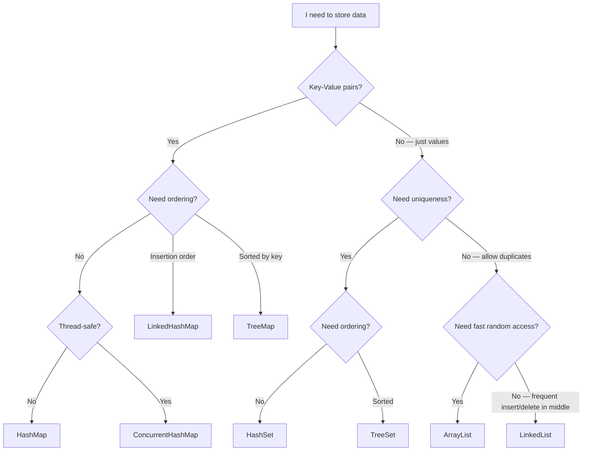
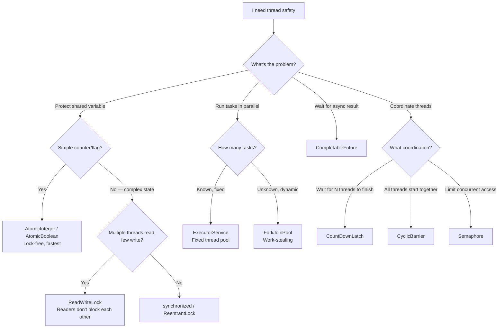
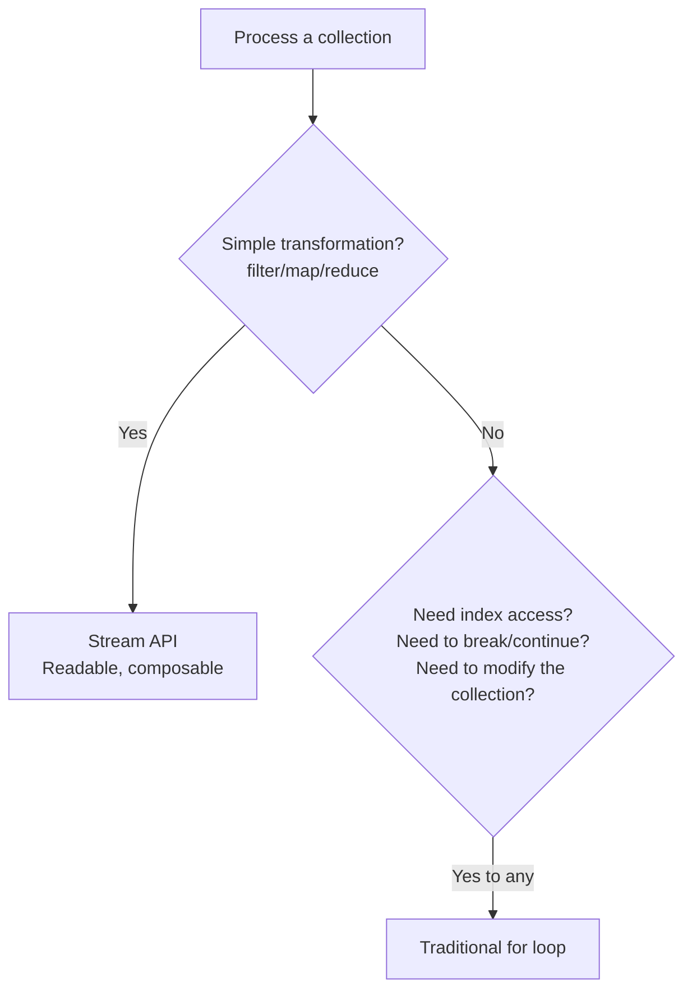
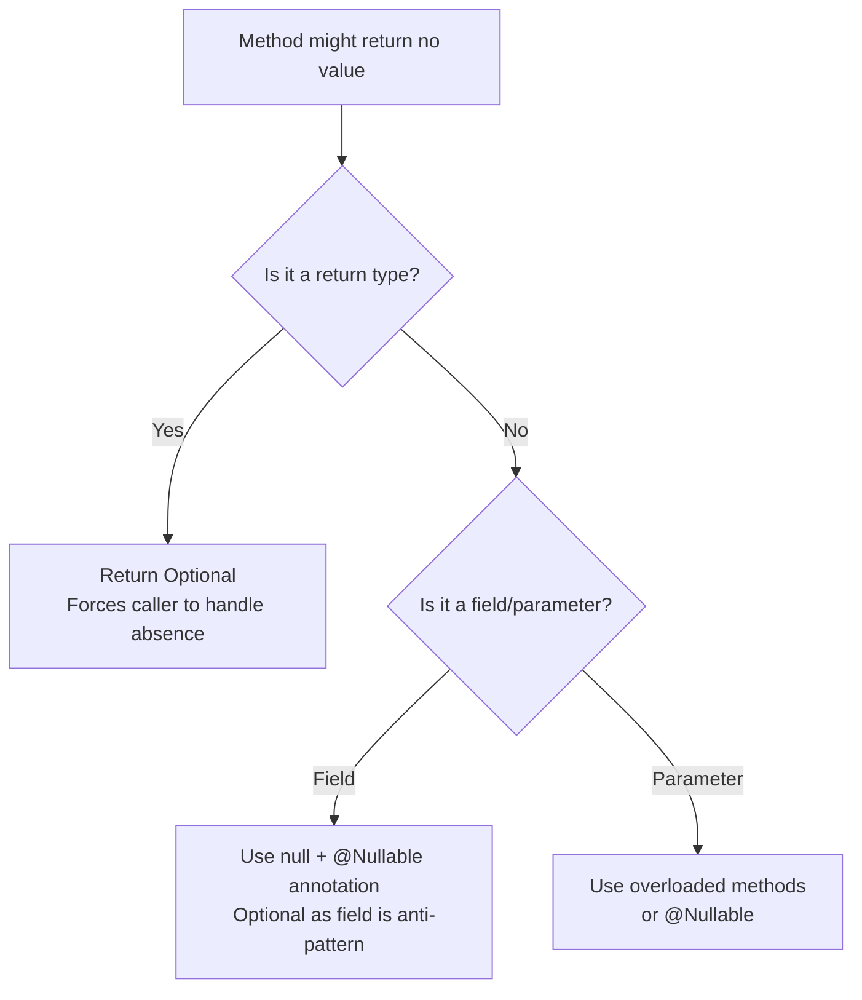
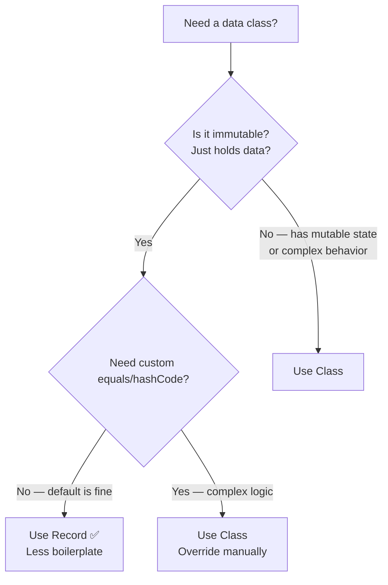

# How to Think in Java — Picking the Right Tool for the Right Job

## Why This Tutorial Exists

Java has 50+ collection types, 10+ concurrency tools, and features spanning Java 8 to 21. Most developers memorize "use HashMap for key-value" without understanding WHEN HashMap is wrong. This tutorial teaches you the **decision-making process** — so you can pick the right tool for ANY problem, even ones you haven't seen before.

---

## Framework 1: Choosing the Right Collection

Don't memorize all collections. Learn to ask the right questions:



### The Decision Table

| I need... | Use | Why NOT the alternative |
|-----------|-----|----------------------|
| Fast lookup by key | **HashMap** | TreeMap is O(log n) vs HashMap's O(1) |
| Sorted keys | **TreeMap** | HashMap doesn't maintain order |
| Preserve insertion order | **LinkedHashMap** | HashMap doesn't guarantee order |
| Thread-safe map | **ConcurrentHashMap** | Collections.synchronizedMap locks the ENTIRE map |
| Unique elements, fast lookup | **HashSet** | ArrayList.contains() is O(n) |
| Sorted unique elements | **TreeSet** | HashSet doesn't sort |
| Fast index access | **ArrayList** | LinkedList is O(n) for get(i) |
| Frequent add/remove at head | **LinkedList/ArrayDeque** | ArrayList shifts all elements on add(0) |
| FIFO queue | **ArrayDeque** | LinkedList has higher memory overhead |
| Thread-safe queue | **ConcurrentLinkedQueue** | ArrayDeque is not thread-safe |
| Priority-based processing | **PriorityQueue** | Regular queue is FIFO only |

<div class="callout-scenario">

**Scenario**: You need to cache the last 100 API responses. When the 101st arrives, the oldest should be evicted. Which collection?

**Thinking process**: Need key-value (URL → response) ✅. Need ordering (to know which is oldest) ✅. Need size limit with auto-eviction ✅. **Answer**: `LinkedHashMap` with `removeEldestEntry()` overridden — it maintains insertion order and can auto-evict when size exceeds limit. This is literally how you build an LRU cache in Java.

```java
Map<String, Response> cache = new LinkedHashMap<>(100, 0.75f, true) {
    @Override
    protected boolean removeEldestEntry(Map.Entry eldest) {
        return size() > 100;
    }
};
```

</div>

---

## Framework 2: Choosing the Right Concurrency Tool



### When to Use What — The Concurrency Cheat Sheet

| Problem | Tool | Why THIS tool, not that one |
|---------|------|---------------------------|
| Increment a counter from 10 threads | `AtomicInteger` | `synchronized` works but is 10x slower for simple operations |
| Cache that's read 99%, written 1% | `ReadWriteLock` | `synchronized` blocks ALL access during reads — wasteful |
| Call 3 APIs in parallel, combine results | `CompletableFuture.allOf()` | Manual thread management is error-prone |
| Process 1M items in parallel | `parallelStream()` | Simple, uses ForkJoinPool internally |
| Rate limit to 10 concurrent DB connections | `Semaphore(10)` | Thread pool works too, but Semaphore is more explicit |
| Wait for 5 worker threads to finish | `CountDownLatch(5)` | `Thread.join()` works but doesn't compose well |

<div class="callout-warn">

**Warning — The #1 Concurrency Mistake**: Using `synchronized` everywhere "just to be safe." Synchronization has a cost — thread contention, context switching, reduced throughput. Ask: "Do I ACTUALLY have shared mutable state?" If the data is read-only, or each thread has its own copy, you don't need synchronization at all. The fastest lock is the one you don't need.

</div>

<div class="callout-tip">

**Applying this** — Before adding any synchronization, ask three questions: (1) Is this data shared between threads? If no → no sync needed. (2) Is this data mutable? If no (immutable/final) → no sync needed. (3) Is the operation already atomic? (AtomicInteger, ConcurrentHashMap) If yes → no additional sync needed. Only if all three are "yes, it's shared, mutable, and not atomic" do you need explicit synchronization.

</div>

---

## Framework 3: Choosing the Right Java Feature

### Streams vs Loops — When to Use Which



```java
// ✅ Stream — clean for filter + transform + collect
List<String> names = users.stream()
    .filter(u -> u.getAge() > 18)
    .map(User::getName)
    .sorted()
    .collect(Collectors.toList());

// ✅ Loop — when you need index or early exit
for (int i = 0; i < items.size(); i++) {
    if (items.get(i).isInvalid()) {
        log.warn("Invalid item at index " + i);
        break; // can't do this cleanly with streams
    }
}
```

### Optional vs Null — The Decision



```java
// ✅ Good — Optional as return type
public Optional<User> findByEmail(String email) {
    return Optional.ofNullable(userMap.get(email));
}

// ❌ Bad — Optional as field (memory overhead, serialization issues)
class User {
    private Optional<String> middleName; // DON'T do this
}

// ✅ Good — nullable field with annotation
class User {
    @Nullable private String middleName; // clear intent
}
```

### Records vs Classes — When to Use Records



---

## Framework 4: The "Why Not" Thinking

For every Java decision, train yourself to ask "Why NOT the alternative?"

| You chose | Ask yourself | If the answer is... |
|-----------|-------------|-------------------|
| HashMap | Why not TreeMap? | "I don't need sorted keys" → HashMap is correct |
| ArrayList | Why not LinkedList? | "I need random access by index" → ArrayList is correct |
| synchronized | Why not AtomicInteger? | "It's just a counter" → switch to AtomicInteger |
| Stream | Why not loop? | "I need to break early" → switch to loop |
| CompletableFuture | Why not parallel stream? | "I need to combine results from different sources" → CF is correct |

<div class="callout-interview">

🎯 **Interview Ready** — When an interviewer asks "Why did you use HashMap here?", don't just say "for fast lookup." Say: "I chose HashMap over TreeMap because I don't need sorted keys — I only need O(1) lookup by user ID. If the requirement changes to 'show users sorted by name,' I'd switch to TreeMap which gives O(log n) sorted access. The trade-off is HashMap uses more memory (hash table overhead) but gives constant-time access."

</div>

---

## 🎯 Interview Corner

<div class="callout-interview">

**Q: "HashMap vs ConcurrentHashMap — when would you use each?"**

HashMap when there's no concurrent access — single-threaded code, or data that's built once and then only read (effectively immutable). ConcurrentHashMap when multiple threads read AND write simultaneously. The key difference isn't just "thread safety" — it's HOW they achieve it. HashMap with `Collections.synchronizedMap()` locks the ENTIRE map on every operation. ConcurrentHashMap locks only the affected bucket (or uses CAS). So with 16 threads accessing different keys, synchronizedMap has 15 threads waiting while ConcurrentHashMap has all 16 running in parallel. I'd never use synchronizedMap in production — if I need thread safety, ConcurrentHashMap is always better.

**Follow-up trap**: "What about Hashtable?" → Legacy class from Java 1.0. Synchronized on every method (like synchronizedMap). No reason to use it in modern Java. ConcurrentHashMap replaced it entirely.

</div>

<div class="callout-interview">

**Q: "When would you use parallelStream() vs CompletableFuture?"**

parallelStream for CPU-bound work on a single collection — processing 1M items where each item needs computation. It uses ForkJoinPool internally and splits the collection across cores. CompletableFuture for I/O-bound work or combining results from DIFFERENT sources — calling 3 APIs in parallel, then combining results. The mistake is using parallelStream for I/O (API calls) — it blocks ForkJoinPool threads, which are shared across the entire JVM. For I/O, use CompletableFuture with a custom executor that has enough threads for the expected concurrency.

</div>

---

## Quick Reference

| Decision | Ask this question | Answer guides you to |
|----------|------------------|---------------------|
| Which collection? | Key-value? Ordered? Thread-safe? Unique? | See collection flowchart |
| Which concurrency tool? | Shared state? Counter? Parallel tasks? Coordination? | See concurrency flowchart |
| Stream vs Loop? | Simple transform? Need index/break? | Stream for transform, loop for control flow |
| Optional vs Null? | Return type? Field? Parameter? | Optional for returns, null+annotation for fields |
| synchronized vs Atomic? | Simple counter or complex state? | Atomic for simple, synchronized for complex |

---

> **Java mastery isn't knowing every API. It's knowing which API to reach for when you see a problem. The expert doesn't have more tools — they pick the right tool faster.**
