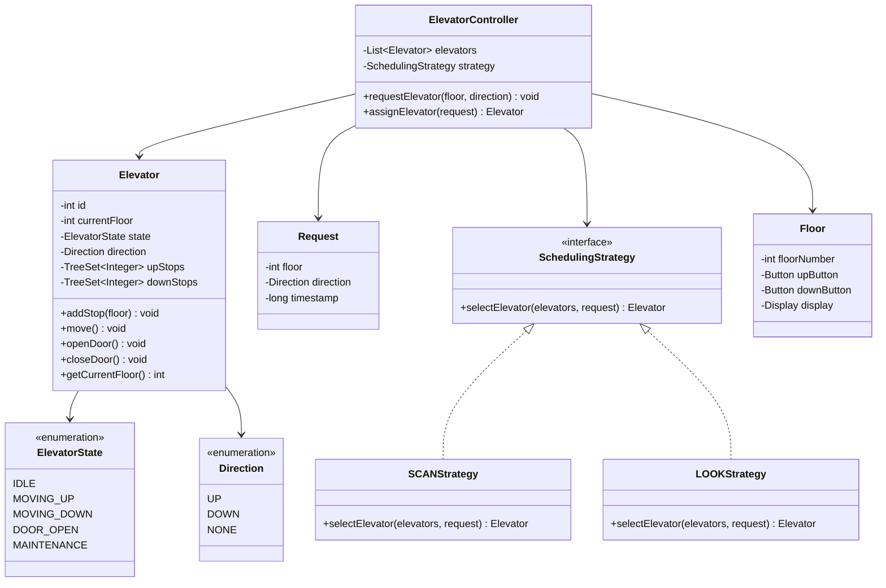
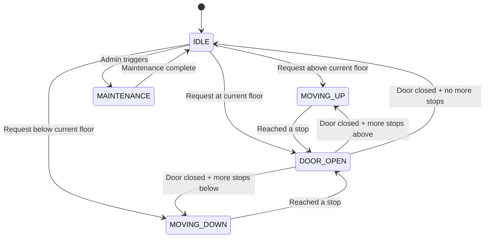

# Design Elevator System — Applying the 7-Step LLD Framework

> **Prerequisite**: Read [How to Think in LLD](./lld-thinking-framework.md) first. This tutorial applies that framework step by step.

## The Restaurant Waiter Analogy

Imagine a restaurant with 3 waiters serving 20 floors of tables. A customer on floor 12 presses a button — "I need service." Which waiter goes? The nearest one? The one already heading that direction? What if 5 customers press at the same time? That's an elevator system — multiple elevators serving multiple floors with smart scheduling.

---

## 1. Requirements

- Building with N floors and M elevators
- Users press UP/DOWN button on a floor (external request)
- Users press a floor number inside the elevator (internal request)
- Elevator moves up/down, opens/closes doors
- Smart scheduling — minimize wait time
- Handle concurrent requests from multiple floors
- Display current floor and direction on each floor

---

## 2. Key Design Patterns Used

| Pattern | Where | Why |
|---------|-------|-----|
| **State Pattern** | Elevator states (IDLE, MOVING_UP, MOVING_DOWN, DOOR_OPEN) | Clean state transitions |
| **Strategy Pattern** | Scheduling algorithm (SCAN, LOOK, FCFS) | Swap algorithms without changing elevator code |
| **Observer Pattern** | Floor displays observe elevator position | Decouple display from elevator logic |
| **Singleton** | ElevatorController | One controller manages all elevators |

---

## 3. Class Diagram



---

## 4. State Machine — Elevator Lifecycle



---

## 5. Core Implementation

### Elevator Class

```java
public class Elevator {
    private final int id;
    private int currentFloor;
    private ElevatorState state;
    private Direction direction;
    private final TreeSet<Integer> upStops;    // floors to stop going UP
    private final TreeSet<Integer> downStops;  // floors to stop going DOWN

    public Elevator(int id) {
        this.id = id;
        this.currentFloor = 0;
        this.state = ElevatorState.IDLE;
        this.direction = Direction.NONE;
        this.upStops = new TreeSet<>();
        this.downStops = new TreeSet<>();
    }

    public synchronized void addStop(int floor) {
        if (floor > currentFloor) {
            upStops.add(floor);
        } else if (floor < currentFloor) {
            downStops.add(floor);
        } else {
            openDoor(); // already at requested floor
        }
    }

    public void move() {
        while (!upStops.isEmpty() || !downStops.isEmpty()) {
            processUpStops();
            processDownStops();
        }
        state = ElevatorState.IDLE;
        direction = Direction.NONE;
    }

    private void processUpStops() {
        state = ElevatorState.MOVING_UP;
        direction = Direction.UP;

        while (!upStops.isEmpty()) {
            int nextStop = upStops.first();
            while (currentFloor < nextStop) {
                currentFloor++;
                System.out.println("Elevator " + id + " at floor " + currentFloor);
            }
            upStops.pollFirst();
            openDoor();
        }
    }

    private void processDownStops() {
        state = ElevatorState.MOVING_DOWN;
        direction = Direction.DOWN;

        while (!downStops.isEmpty()) {
            int nextStop = downStops.last();
            while (currentFloor > nextStop) {
                currentFloor--;
                System.out.println("Elevator " + id + " at floor " + currentFloor);
            }
            downStops.pollLast();
            openDoor();
        }
    }

    private void openDoor() {
        state = ElevatorState.DOOR_OPEN;
        System.out.println("Elevator " + id + " DOOR OPEN at floor " + currentFloor);
        // simulate door open time
        try { Thread.sleep(2000); } catch (InterruptedException e) {}
        state = direction == Direction.UP ? ElevatorState.MOVING_UP : ElevatorState.MOVING_DOWN;
    }

    public int getCurrentFloor() { return currentFloor; }
    public ElevatorState getState() { return state; }
    public Direction getDirection() { return direction; }
    public int getId() { return id; }
    public boolean isIdle() { return state == ElevatorState.IDLE; }
}
```

### Scheduling Strategy — LOOK Algorithm

```java
public interface SchedulingStrategy {
    Elevator selectElevator(List<Elevator> elevators, Request request);
}

public class LOOKStrategy implements SchedulingStrategy {
    @Override
    public Elevator selectElevator(List<Elevator> elevators, Request request) {
        Elevator best = null;
        int minCost = Integer.MAX_VALUE;

        for (Elevator elevator : elevators) {
            if (elevator.getState() == ElevatorState.MAINTENANCE) continue;

            int cost = calculateCost(elevator, request);
            if (cost < minCost) {
                minCost = cost;
                best = elevator;
            }
        }
        return best;
    }

    private int calculateCost(Elevator elevator, Request request) {
        int distance = Math.abs(elevator.getCurrentFloor() - request.getFloor());

        // Idle elevator — cost is just distance
        if (elevator.isIdle()) return distance;

        // Moving toward the request in same direction — lowest cost
        if (elevator.getDirection() == request.getDirection()) {
            if (request.getDirection() == Direction.UP
                && elevator.getCurrentFloor() <= request.getFloor()) {
                return distance; // will pass by on the way
            }
            if (request.getDirection() == Direction.DOWN
                && elevator.getCurrentFloor() >= request.getFloor()) {
                return distance;
            }
        }

        // Moving away — high cost (has to finish current direction first)
        return distance + 20; // penalty for direction change
    }
}
```

### Elevator Controller

```java
public class ElevatorController {
    private final List<Elevator> elevators;
    private final SchedulingStrategy strategy;

    public ElevatorController(int numElevators, SchedulingStrategy strategy) {
        this.elevators = new ArrayList<>();
        for (int i = 0; i < numElevators; i++) {
            elevators.add(new Elevator(i));
        }
        this.strategy = strategy;
    }

    public void requestElevator(int floor, Direction direction) {
        Request request = new Request(floor, direction);
        Elevator assigned = strategy.selectElevator(elevators, request);

        if (assigned != null) {
            assigned.addStop(floor);
            System.out.println("Assigned Elevator " + assigned.getId()
                + " for floor " + floor + " (" + direction + ")");
        }
    }

    // Internal request — user inside elevator presses a floor
    public void selectFloor(int elevatorId, int floor) {
        elevators.get(elevatorId).addStop(floor);
    }
}
```

<div class="callout-scenario">

**Scenario**: Building has 3 elevators. Elevator 1 is at floor 5 going UP. Elevator 2 is at floor 10 going DOWN. Elevator 3 is IDLE at floor 1. A user on floor 7 presses UP. **Decision**: LOOK algorithm picks Elevator 1 — it's at floor 5 going UP and will pass floor 7 on its way. Cost = 2 floors. Elevator 3 (IDLE at floor 1) would cost 6 floors. Elevator 2 is going DOWN — it would need to finish its downward trip first.

</div>

---

## 6. Scheduling Algorithms Compared

| Algorithm | How it works | Pros | Cons |
|-----------|-------------|------|------|
| **FCFS** | First Come First Served | Simple | Terrible performance — elevator zigzags |
| **SCAN** | Go all the way up, then all the way down (like disk arm) | Fair, no starvation | Goes to top/bottom even if no requests there |
| **LOOK** | Like SCAN but reverses when no more requests in current direction | Efficient, no wasted trips | Slightly more complex |
| **Nearest First** | Always go to closest request | Low wait for nearest | Starvation for far floors |

<div class="callout-tip">

**Applying this** — In real buildings, LOOK is the standard. For high-rise buildings (50+ floors), use **destination dispatch** — users enter their destination floor BEFORE entering the elevator. The system groups people going to similar floors into the same elevator. This reduces stops by 30-40%.

</div>

---

## 7. Concurrency Considerations

```java
// Thread-safe stop management using ConcurrentSkipListSet
private final ConcurrentSkipListSet<Integer> upStops = new ConcurrentSkipListSet<>();
private final ConcurrentSkipListSet<Integer> downStops = new ConcurrentSkipListSet<>();

// Multiple threads can add stops simultaneously
// The elevator's move() loop reads from these thread-safe sets
```

<div class="callout-warn">

**Warning**: The elevator's `currentFloor` must be accessed atomically. Use `AtomicInteger` or synchronize access. Two threads reading `currentFloor` while the elevator is moving could get inconsistent values — one sees floor 5, another sees floor 6.

</div>

---

## 8. SOLID Principles Applied

| Principle | How it's applied |
|-----------|-----------------|
| **S** — Single Responsibility | Elevator handles movement, Controller handles scheduling, Strategy handles algorithm |
| **O** — Open/Closed | New scheduling algorithms (SCAN, LOOK, FCFS) added without modifying Elevator or Controller |
| **L** — Liskov Substitution | Any SchedulingStrategy implementation works with Controller |
| **I** — Interface Segregation | SchedulingStrategy has only one method — no bloated interfaces |
| **D** — Dependency Inversion | Controller depends on SchedulingStrategy interface, not concrete implementations |

---

## 🎯 Interview Corner

<div class="callout-interview">

**Q: "How would you handle the case where all elevators are busy and a user has been waiting for 5 minutes?"**

I'd implement a priority escalation mechanism. Each request has a timestamp. A background thread checks pending requests every 30 seconds. If a request has been waiting longer than a threshold (say 3 minutes), its priority is boosted — the next elevator that becomes idle or changes direction is forcefully assigned to that request, even if it's not the optimal choice. This prevents starvation. Additionally, I'd track average wait times per floor and adjust the scheduling weights — floors with historically high wait times get a slight priority boost in the cost calculation.

**Follow-up trap**: "What if the building has 100 floors and 6 elevators?" → Use zone-based allocation. Elevators 1-2 serve floors 1-33, Elevators 3-4 serve 34-66, Elevators 5-6 serve 67-100. This reduces travel distance and improves throughput. During off-peak hours, switch to full-building mode.

</div>

<div class="callout-interview">

**Q: "Which design patterns did you use and why?"**

Four patterns: (1) **State Pattern** for elevator states — IDLE, MOVING_UP, MOVING_DOWN, DOOR_OPEN. Each state defines valid transitions and behavior. This avoids massive if-else chains. (2) **Strategy Pattern** for scheduling — LOOK, SCAN, FCFS are interchangeable algorithms. The controller doesn't know which algorithm it's using. (3) **Observer Pattern** — floor displays observe elevator position changes. When an elevator moves, all subscribed displays update. (4) **Singleton** for ElevatorController — there's exactly one controller managing all elevators. I chose these because they make the system extensible — adding a new scheduling algorithm or elevator state requires zero changes to existing code.

</div>

<div class="callout-interview">

**Q: "How do you handle emergency situations — fire alarm, earthquake?"**

Emergency mode overrides all normal operations. On fire alarm: (1) All elevators immediately stop accepting new requests. (2) Elevators at floors above the fire floor go DOWN to ground floor. (3) Elevators below the fire floor go to the nearest safe floor. (4) Doors open and elevators enter MAINTENANCE state. (5) Fire service elevator (one designated elevator) becomes available only to firefighters with a key. This is implemented as a special `EmergencyState` that overrides the normal state machine. The transition to emergency mode is irreversible until manually reset by building management.

</div>

---

## Quick Reference

| Concept | One-Liner |
|---------|-----------|
| LOOK Algorithm | Move in one direction until no more requests, then reverse |
| SCAN Algorithm | Move all the way to top/bottom, then reverse |
| Destination Dispatch | Users enter destination before boarding — groups similar floors |
| State Pattern | Each elevator state (IDLE, MOVING, DOOR_OPEN) is a separate class |
| Strategy Pattern | Scheduling algorithm is pluggable — swap without changing elevator code |
| TreeSet for stops | Sorted set — always know the next stop in O(log n) |
| Zone Allocation | Divide floors among elevator groups for high-rise buildings |

---

> **An elevator system teaches you the essence of LLD — it's not about the elevator, it's about how objects collaborate. The Elevator doesn't know about scheduling. The Controller doesn't know about door mechanics. Each class does one thing well.**
