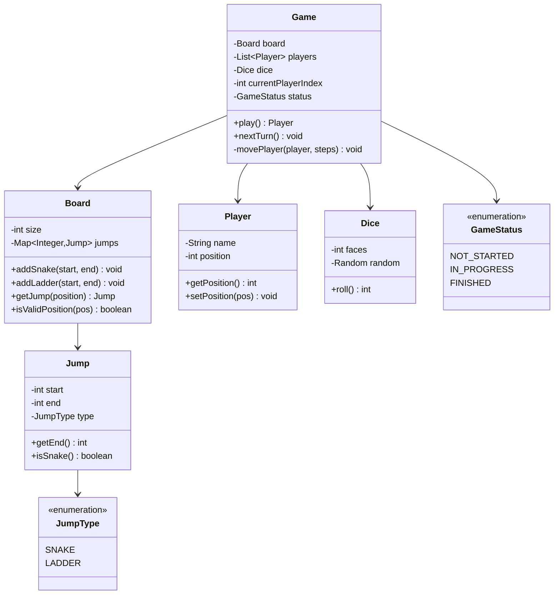

# Design Snake & Ladder Game — The Board Game Blueprint

## The Blueprint Analogy

Snake & Ladder is deceptively simple — roll a dice, move forward, climb ladders, slide down snakes. But designing it as software reveals core OOP concepts: separation of concerns (Board doesn't know about Players), polymorphism (Snake and Ladder are both "jumps"), and state management (whose turn? who won?).

---

## 1. Requirements

- Board with configurable size (default 100 cells)
- Configurable snakes and ladders (start → end positions)
- 2-4 players, turn-based
- Dice roll (1-6), move player, check for snake/ladder
- Win condition: exact landing on last cell
- If roll overshoots the board, player stays in place

---

## 2. Class Diagram



---

## 3. Core Implementation

### Board

```java
public class Board {
    private final int size;
    private final Map<Integer, Jump> jumps; // position → jump (snake or ladder)

    public Board(int size) {
        this.size = size;
        this.jumps = new HashMap<>();
    }

    public void addSnake(int head, int tail) {
        validate(head, tail, true);
        jumps.put(head, new Jump(head, tail, JumpType.SNAKE));
    }

    public void addLadder(int bottom, int top) {
        validate(bottom, top, false);
        jumps.put(bottom, new Jump(bottom, top, JumpType.LADDER));
    }

    private void validate(int start, int end, boolean isSnake) {
        if (start < 1 || start >= size || end < 1 || end >= size)
            throw new IllegalArgumentException("Positions must be within board");
        if (isSnake && end >= start)
            throw new IllegalArgumentException("Snake head must be above tail");
        if (!isSnake && end <= start)
            throw new IllegalArgumentException("Ladder top must be above bottom");
        if (jumps.containsKey(start))
            throw new IllegalArgumentException("Position " + start + " already has a jump");
    }

    public Jump getJump(int position) { return jumps.get(position); }
    public int getSize() { return size; }
    public boolean isWinningPosition(int pos) { return pos == size; }
}
```

### Game Engine

```java
public class Game {
    private final Board board;
    private final List<Player> players;
    private final Dice dice;
    private int currentPlayerIndex;
    private GameStatus status;

    public Game(Board board, List<Player> players, Dice dice) {
        this.board = board;
        this.players = players;
        this.dice = dice;
        this.currentPlayerIndex = 0;
        this.status = GameStatus.IN_PROGRESS;
    }

    public Player play() {
        while (status == GameStatus.IN_PROGRESS) {
            Player current = players.get(currentPlayerIndex);
            int rolled = dice.roll();
            System.out.println(current.getName() + " rolled " + rolled);

            movePlayer(current, rolled);

            if (board.isWinningPosition(current.getPosition())) {
                status = GameStatus.FINISHED;
                System.out.println("🎉 " + current.getName() + " WINS!");
                return current;
            }

            currentPlayerIndex = (currentPlayerIndex + 1) % players.size();
        }
        return null;
    }

    private void movePlayer(Player player, int steps) {
        int newPos = player.getPosition() + steps;

        // Overshoot — stay in place
        if (newPos > board.getSize()) {
            System.out.println("  Overshoot! Stays at " + player.getPosition());
            return;
        }

        player.setPosition(newPos);
        System.out.println("  Moved to " + newPos);

        // Check for snake or ladder
        Jump jump = board.getJump(newPos);
        if (jump != null) {
            player.setPosition(jump.getEnd());
            if (jump.isSnake()) {
                System.out.println("  🐍 Snake! Slides down to " + jump.getEnd());
            } else {
                System.out.println("  🪜 Ladder! Climbs up to " + jump.getEnd());
            }
        }
    }
}
```

### Dice

```java
public class Dice {
    private final int faces;
    private final Random random;

    public Dice(int faces) {
        this.faces = faces;
        this.random = new Random();
    }

    public int roll() {
        return random.nextInt(faces) + 1;
    }
}
```

### Putting It Together

```java
public class Main {
    public static void main(String[] args) {
        Board board = new Board(100);

        // Add snakes (head → tail)
        board.addSnake(99, 10);
        board.addSnake(65, 25);
        board.addSnake(45, 6);

        // Add ladders (bottom → top)
        board.addLadder(2, 38);
        board.addLadder(15, 55);
        board.addLadder(50, 90);

        List<Player> players = List.of(
            new Player("Alice"),
            new Player("Bob")
        );

        Dice dice = new Dice(6);
        Game game = new Game(board, players, dice);
        Player winner = game.play();
    }
}
```

<div class="callout-tip">

**Applying this** — Notice how Board doesn't know about Players, Players don't know about Dice, and Game orchestrates everything. This is the **Mediator pattern** in action. If you want to add a "power-up" feature, you only modify the Board class (add a new Jump type) — nothing else changes.

</div>

---

## 4. Design Decisions & Trade-offs

<div class="callout-scenario">

**Scenario**: Interviewer asks "What if a ladder's top lands on a snake's head?" **Decision**: Process jumps in sequence. Player lands on ladder → moves to top → check if top has a snake → if yes, slide down. This creates chain reactions. Implement with a while loop:

```java
private void movePlayer(Player player, int steps) {
    int newPos = player.getPosition() + steps;
    if (newPos > board.getSize()) return;

    player.setPosition(newPos);

    // Chain reaction — keep checking until no more jumps
    Jump jump;
    while ((jump = board.getJump(player.getPosition())) != null) {
        player.setPosition(jump.getEnd());
    }
}
```

</div>

<div class="callout-scenario">

**Scenario**: "How would you make the dice configurable — maybe 2 dice, or a loaded dice for testing?" **Decision**: Extract Dice as an interface. `StandardDice`, `DoubleDice`, `LoadedDice` (always returns a specific value for testing) all implement it. The Game class depends on the Dice interface, not a concrete class. This is **Dependency Inversion**.

</div>

---

## 5. SOLID Principles Applied

| Principle | How |
|-----------|-----|
| **S** | Board manages jumps, Game manages turns, Dice manages randomness |
| **O** | Add new jump types (teleport, power-up) without modifying Game |
| **L** | Any Dice implementation (standard, double, loaded) works in Game |
| **I** | Jump has minimal interface — just start, end, type |
| **D** | Game depends on Board/Dice abstractions, not concrete classes |

---

## 🎯 Interview Corner

<div class="callout-interview">

**Q: "How would you extend this to support multiplayer online?"**

I'd separate the game engine from the transport layer. The Game class stays the same — it's pure logic. I'd add a GameServer that: (1) Creates a game room with a unique ID. (2) Players connect via WebSocket. (3) On each turn, server sends "your turn" to the current player. (4) Player sends "roll" command. (5) Server executes the roll, computes the move, and broadcasts the new state to ALL players. The key is that the server is the source of truth — clients only send commands, never modify game state directly. This prevents cheating.

**Follow-up trap**: "What about latency?" → The game is turn-based, so latency isn't critical. A 200ms round-trip is fine. The server processes moves synchronously — no race conditions.

</div>

<div class="callout-interview">

**Q: "How would you test this system?"**

I'd use a `LoadedDice` that returns predetermined values — this makes tests deterministic. Test cases: (1) Player lands on ladder → position jumps up. (2) Player lands on snake → position drops. (3) Player overshoots board → stays in place. (4) Player lands exactly on 100 → wins. (5) Chain reaction: ladder top is snake head. (6) Two players alternate turns correctly. (7) Board validation rejects invalid snake/ladder positions. The LoadedDice is the key — without it, tests are non-deterministic because of random dice rolls.

</div>

<div class="callout-interview">

**Q: "What's the time and space complexity?"**

Time: Each turn is O(1) — dice roll is O(1), position update is O(1), jump lookup is O(1) via HashMap. The game runs for at most O(board_size × players) turns in the worst case. Space: O(S + L) for snakes and ladders stored in the HashMap, O(P) for players. The board itself is virtual — we don't store 100 cells, just the jumps. This is a key insight: the board is a sparse data structure, not a 2D array.

</div>

---

## Quick Reference

| Concept | One-Liner |
|---------|-----------|
| Board | Sparse map of position → jump (snake or ladder) |
| Jump | Polymorphic — both snakes and ladders are "jumps" with start/end |
| Game Engine | Mediator that orchestrates Board, Players, Dice |
| Chain Reaction | While loop checks for consecutive jumps at new position |
| LoadedDice | Test double that returns predetermined values |
| Overshoot Rule | If roll exceeds board size, player stays in place |

---

> **Snake & Ladder is the perfect LLD warm-up — simple enough to code in 30 minutes, deep enough to demonstrate OOP, SOLID, design patterns, and testability. If you can design this cleanly, you can design anything.**
