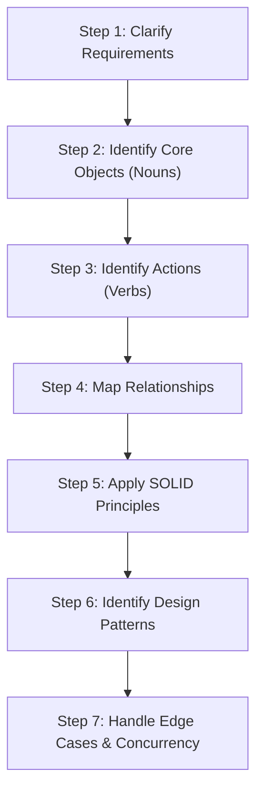
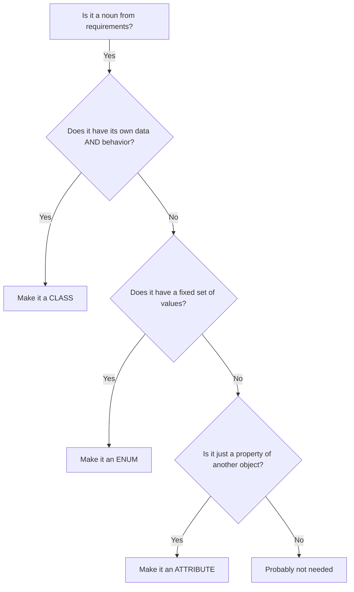
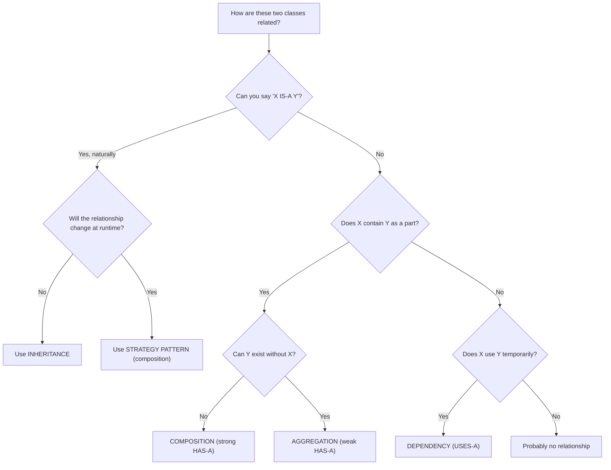
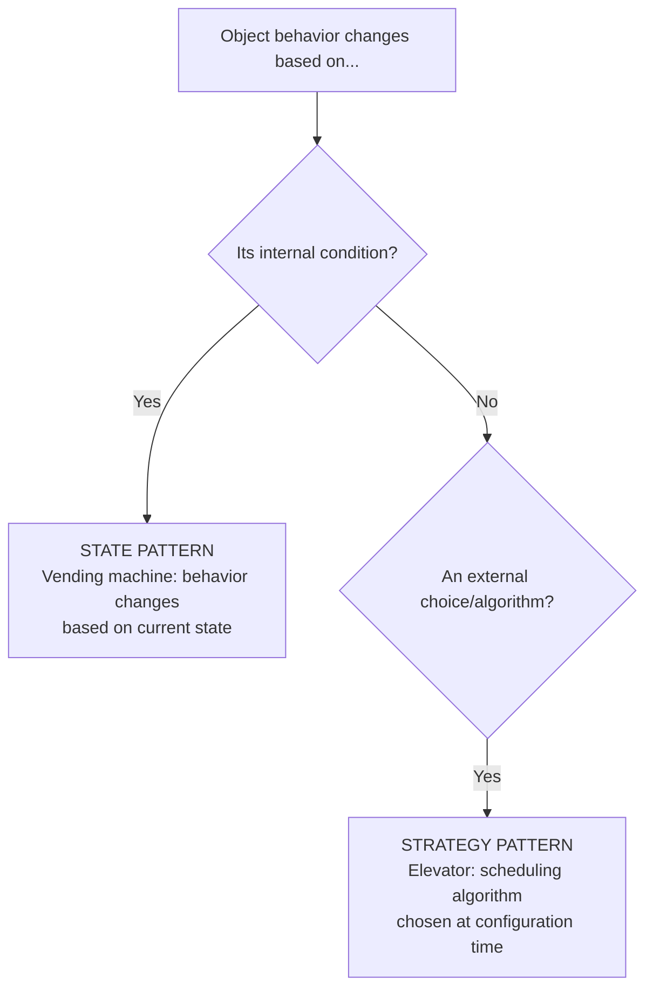
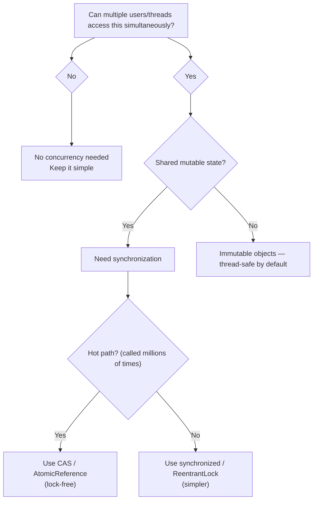

# How to Think in LLD — The Architect's Blueprint Mindset

## Why This Tutorial Exists

Most LLD tutorials show you the final class diagram and say "here's the answer." That's like showing someone a finished building and saying "now you know architecture." **You don't.** You need to understand the PROCESS — how did the architect decide where to put the walls, doors, and windows?

This tutorial teaches you the **thinking framework** — a step-by-step mental process you can apply to ANY LLD problem, even ones you've never seen before.

---

## The 7-Step LLD Framework



Let's learn each step with a real example. We'll design a **Vending Machine** from scratch — thinking out loud at every step.

---

## Step 1: Clarify Requirements — Ask Before You Code

**The mistake**: Jumping straight into classes and code.

**The right approach**: Ask questions. In an interview, this shows maturity.

```
❌ "Let me start with a VendingMachine class..."
✅ "Before I design, let me clarify a few things..."
```

**Questions to ask for ANY LLD problem:**

| Question | Why it matters |
|----------|---------------|
| What are the main **actors**? (who uses the system?) | Identifies entry points |
| What are the main **actions**? (what can actors do?) | Identifies methods |
| What are the **constraints**? (limits, rules) | Identifies validation logic |
| What **states** can the system be in? | Identifies state machines |
| Does it need to handle **concurrency**? | Identifies thread-safety needs |
| What are the **edge cases**? | Identifies error handling |

<div class="callout-scenario">

**Scenario — Vending Machine**: "Can the machine accept multiple coin types? Can a user cancel mid-transaction? What happens if the machine runs out of a product? Can two users use it simultaneously?"

**Answers shape the design**: If it accepts multiple coins → you need a CoinHandler. If users can cancel → you need a refund mechanism. If products run out → you need inventory tracking. If single-user → no concurrency needed.

</div>

---

## Step 2: Identify Core Objects — The Noun Technique

**Read the requirements and underline every NOUN.** Each noun is a potential class.

```
"A vending machine that accepts COINS, displays PRODUCTS with PRICES,
lets the USER select a PRODUCT, dispenses the ITEM, and returns CHANGE."
```

**Nouns found:**
- Vending Machine → `VendingMachine`
- Coin → `Coin`
- Product → `Product`
- Price → attribute of Product (not a separate class)
- User → external actor (not a class — they interact via the machine's interface)
- Item → same as Product (don't create duplicate classes)
- Change → collection of Coins (not a separate class)

<div class="callout-info">

**Key insight**: Not every noun becomes a class. Ask: "Does this noun have its OWN data AND behavior?" If it only has data, it might be an attribute. If it has no behavior, it might be an enum. Price is just a number — it's an attribute of Product, not a class.

</div>

### The Decision Tree for "Should This Be a Class?"



**Applying to Vending Machine:**

| Noun | Decision | Why |
|------|----------|-----|
| VendingMachine | **Class** | Has data (inventory, balance) AND behavior (selectProduct, dispense) |
| Product | **Class** | Has data (name, price, code) AND behavior (could be extended) |
| Coin | **Enum** | Fixed set: PENNY, NICKEL, DIME, QUARTER — no behavior, just values |
| Inventory | **Class** | Has data (product → count map) AND behavior (add, remove, check) |
| State | **Enum/Interface** | Fixed states: IDLE, COIN_INSERTED, PRODUCT_SELECTED, DISPENSING |

<div class="callout-tip">

**Applying this** — In your interview, literally write down all nouns on the whiteboard first. Then cross out the ones that are just attributes or enums. What remains are your classes. This takes 2 minutes and prevents you from missing important classes or creating unnecessary ones.

</div>

---

## Step 3: Identify Actions — The Verb Technique

**Now underline every VERB in the requirements.** Each verb becomes a method.

```
"User INSERTS coin, SELECTS product, machine VALIDATES payment,
DISPENSES product, RETURNS change, user can CANCEL transaction."
```

**Verbs found:**
- Insert coin → `insertCoin(Coin)`
- Select product → `selectProduct(String code)`
- Validate payment → `hasSufficientPayment()` (internal)
- Dispense product → `dispenseProduct()` (internal)
- Return change → `returnChange()` 
- Cancel → `cancelTransaction()`

### Which Class Gets Which Method?

**Rule: A method belongs to the class that has the DATA needed to perform it.**

| Method | Needs what data? | Belongs to |
|--------|-----------------|------------|
| insertCoin() | Current balance | VendingMachine |
| selectProduct() | Product catalog | VendingMachine |
| hasSufficientPayment() | Balance + product price | VendingMachine |
| dispenseProduct() | Inventory | Inventory |
| returnChange() | Current balance | VendingMachine |
| addProduct() | Product count | Inventory |
| getPrice() | Price | Product |

<div class="callout-warn">

**Warning — The God Class Anti-Pattern**: If ALL methods end up in one class, you have a God Class. Split it. VendingMachine shouldn't manage inventory directly — delegate to an Inventory class. VendingMachine shouldn't calculate change — delegate to a ChangeCalculator. Each class should have ONE reason to change (Single Responsibility).

</div>

---

## Step 4: Map Relationships — How Objects Connect

There are only 4 types of relationships in OOP:

### 4.1 — "HAS-A" (Composition / Aggregation)

```
VendingMachine HAS-A Inventory
VendingMachine HAS-A current balance
Inventory HAS-A map of Products
```

```java
class VendingMachine {
    private Inventory inventory;      // HAS-A (composition)
    private double currentBalance;    // HAS-A (attribute)
}
```

**Composition vs Aggregation — When to use which:**

| | Composition | Aggregation |
|---|---|---|
| **Lifecycle** | Child dies when parent dies | Child can exist independently |
| **Example** | VendingMachine → Inventory (inventory doesn't exist without the machine) | Library → Book (book exists even if library closes) |
| **Java** | Created inside constructor | Passed via constructor/setter |

### 4.2 — "IS-A" (Inheritance)

```
Snake IS-A Jump
Ladder IS-A Jump
```

**When to use inheritance:**
- Objects share behavior AND identity
- You can say "X IS-A Y" naturally

**When NOT to use inheritance:**
- Just to share code (use composition instead)
- When the relationship might change at runtime (use Strategy pattern)

<div class="callout-scenario">

**Scenario**: You're designing a game with different character types — Warrior, Mage, Archer. Each has different attack behavior. Should you use inheritance?

**Wrong**: `Warrior extends Character` with `attack()` overridden. What if a Warrior wants to switch to magic mid-game?

**Right**: `Character` HAS-A `AttackStrategy`. Warrior gets `SwordAttack`, Mage gets `SpellAttack`. Strategies are swappable at runtime. This is the **Strategy Pattern** — prefer composition over inheritance.

</div>

### 4.3 — "USES-A" (Dependency)

```
VendingMachine USES-A CoinValidator (to validate coins)
Game USES-A Dice (to generate random numbers)
```

Temporary relationship — used in a method, not stored as a field.

### 4.4 — "IMPLEMENTS" (Interface)

```
SCANStrategy IMPLEMENTS SchedulingStrategy
LOOKStrategy IMPLEMENTS SchedulingStrategy
```

Used when multiple classes share the same contract but different implementations.

### Relationship Decision Tree



---

## Step 5: Apply SOLID — The Quality Check

After you have your classes and relationships, run the SOLID checklist:

### S — Single Responsibility

**Test**: "Can I describe this class in ONE sentence without using 'and'?"

```java
// ❌ Bad — does too many things
class VendingMachine {
    void insertCoin() { ... }
    void selectProduct() { ... }
    void calculateChange() { ... }    // should be separate
    void trackInventory() { ... }     // should be separate
    void logTransaction() { ... }     // should be separate
}

// ✅ Good — each class has one job
class VendingMachine { /* orchestrates the flow */ }
class Inventory { /* tracks product stock */ }
class ChangeCalculator { /* calculates coin change */ }
class TransactionLogger { /* logs transactions */ }
```

### O — Open/Closed

**Test**: "Can I add new behavior WITHOUT modifying existing code?"

```java
// ❌ Bad — adding a new coin type requires modifying this method
double getCoinValue(String coinType) {
    if (coinType.equals("QUARTER")) return 0.25;
    if (coinType.equals("DIME")) return 0.10;
    // have to add new if-else for every new coin
}

// ✅ Good — new coins are just new enum values
enum Coin {
    PENNY(0.01), NICKEL(0.05), DIME(0.10), QUARTER(0.25);
    private final double value;
    Coin(double value) { this.value = value; }
    public double getValue() { return value; }
}
```

### L — Liskov Substitution

**Test**: "Can I replace a parent class with any child class without breaking anything?"

```java
// ❌ Bad — Penguin breaks the contract of Bird
class Bird { void fly() { ... } }
class Penguin extends Bird { void fly() { throw new UnsupportedOperationException(); } }

// ✅ Good — separate flying from non-flying
interface Bird { void eat(); }
interface FlyingBird extends Bird { void fly(); }
class Sparrow implements FlyingBird { /* can fly */ }
class Penguin implements Bird { /* can't fly, doesn't pretend to */ }
```

### I — Interface Segregation

**Test**: "Does any class implement methods it doesn't need?"

```java
// ❌ Bad — VendingMachine forced to implement methods it doesn't need
interface Machine {
    void insertCoin();
    void selectProduct();
    void printReceipt();     // not all machines print receipts
    void acceptCreditCard(); // not all machines accept cards
}

// ✅ Good — split into focused interfaces
interface CoinAcceptor { void insertCoin(); }
interface ProductSelector { void selectProduct(); }
interface ReceiptPrinter { void printReceipt(); }
```

### D — Dependency Inversion

**Test**: "Does my high-level class depend on a concrete class or an interface?"

```java
// ❌ Bad — VendingMachine depends on concrete GreedyChangeCalculator
class VendingMachine {
    private GreedyChangeCalculator calculator = new GreedyChangeCalculator();
}

// ✅ Good — depends on interface, injected from outside
class VendingMachine {
    private final ChangeCalculator calculator; // interface
    VendingMachine(ChangeCalculator calculator) {
        this.calculator = calculator; // injected
    }
}
```

<div class="callout-tip">

**Applying this** — In an interview, after drawing your class diagram, explicitly say: "Let me verify SOLID. Single Responsibility — each class has one job ✅. Open/Closed — I can add new product types without modifying VendingMachine ✅." This shows the interviewer you're not just memorizing patterns — you're thinking about design quality.

</div>

---

## Step 6: Identify Design Patterns — The Pattern Matching Game

Don't memorize 23 GoF patterns. Instead, learn to **recognize the PROBLEM** and the pattern follows naturally.

### Pattern Recognition Cheat Sheet

| When you see this problem... | Use this pattern | Real example |
|------------------------------|-----------------|--------------|
| Object goes through distinct states with rules | **State** | Vending Machine (IDLE → COIN_INSERTED → DISPENSING) |
| Multiple algorithms for the same task, swappable | **Strategy** | Elevator scheduling (SCAN, LOOK, FCFS) |
| Need to notify multiple objects when something changes | **Observer** | Floor displays update when elevator moves |
| Build complex objects step by step | **Builder** | Pizza with optional toppings, sizes, crust types |
| Only one instance should exist | **Singleton** | Database connection pool, ElevatorController |
| Create objects without specifying exact class | **Factory** | Creating different Piece types in Chess (Rook, Bishop, etc.) |
| Add behavior to objects dynamically | **Decorator** | Adding toppings to a coffee order |
| Undo/redo operations | **Command** | Chess move history, text editor undo |
| Process a request through a chain of handlers | **Chain of Responsibility** | Coin validation (is it a valid coin? is it the right denomination?) |

### How to Decide: State vs Strategy

This is the most common confusion:



**State**: The object's behavior changes because its INTERNAL state changed. A vending machine in IDLE state ignores "dispense" commands. In DISPENSING state, it ignores "insert coin."

**Strategy**: The object's behavior changes because you CHOSE a different algorithm. An elevator controller uses LOOK algorithm today, SCAN tomorrow. The elevator itself doesn't change — only the scheduling logic does.

<div class="callout-interview">

🎯 **Interview Ready** — "How do you decide which design pattern to use?" → I don't start with patterns. I start with the problem. If I see an object with distinct states and transitions, I think State pattern. If I see interchangeable algorithms, I think Strategy. If I see "notify many when one changes," I think Observer. Patterns are solutions to recurring problems — identify the problem first, the pattern follows. I never force a pattern where it doesn't fit.

</div>

---

## Step 7: Handle Edge Cases & Concurrency

### Edge Cases Checklist

For ANY LLD problem, ask:

| Edge Case | Example |
|-----------|---------|
| **Empty/null inputs** | What if user selects a product code that doesn't exist? |
| **Boundary conditions** | What if balance is exactly equal to price? (not greater, not less) |
| **Resource exhaustion** | What if inventory is empty? What if machine has no coins for change? |
| **Concurrent access** | Two users pressing buttons at the same time? |
| **Timeout/cancellation** | User inserts coin but walks away — what happens? |
| **Failure mid-operation** | Machine jams while dispensing — money already deducted? |

### Concurrency Decision



<div class="callout-tip">

**Applying this** — In an interview, mention concurrency ONLY if the problem requires it. A single-user vending machine doesn't need thread safety. A parking lot with multiple entry gates does. Don't over-engineer — but don't ignore it when it matters.

</div>

---

## Putting It All Together — The Complete Thought Process

Here's how the 7 steps look in practice for a **Vending Machine**:

```
Step 1: Requirements → Single user, coins only, cancel allowed, change returned
Step 2: Nouns → VendingMachine, Product, Coin(enum), Inventory, State(enum)
Step 3: Verbs → insertCoin(), selectProduct(), dispense(), returnChange(), cancel()
Step 4: Relationships → VendingMachine HAS-A Inventory, HAS-A State, USES-A Product
Step 5: SOLID check → Split ChangeCalculator out of VendingMachine (SRP)
Step 6: Patterns → State pattern for machine states, Strategy for change calculation
Step 7: Edge cases → No change available, product out of stock, overpayment
```

**Time in interview**: Steps 1-2 (3 min) → Step 3-4 (5 min) → Step 5-6 (5 min) → Step 7 (2 min) → Code (15 min) = 30 minutes total.

---

## 🎯 Interview Corner

<div class="callout-interview">

**Q: "Walk me through how you'd approach an LLD problem you've never seen before."**

I follow a structured 7-step process. First, I clarify requirements by asking questions — what are the actors, actions, constraints, and edge cases. Second, I identify core objects using the noun technique — every noun in the requirements is a potential class. Third, I identify methods using the verb technique — every verb is a potential method. Fourth, I map relationships — HAS-A, IS-A, USES-A between classes. Fifth, I run a SOLID check — is each class doing one thing? Can I extend without modifying? Sixth, I look for pattern opportunities — if I see states, I think State pattern; if I see swappable algorithms, I think Strategy. Seventh, I handle edge cases and concurrency. This process works for ANY problem — I've used it for systems I'd never designed before and it consistently produces clean, extensible designs.

**Follow-up trap**: "What if you don't know the right pattern?" → That's fine. Not every problem needs a GoF pattern. If the code is clean, follows SOLID, and is easy to extend, it's a good design even without named patterns. Patterns are tools, not requirements.

</div>

<div class="callout-interview">

**Q: "When would you choose composition over inheritance?"**

Almost always. Inheritance creates tight coupling — changing the parent breaks all children. Composition is flexible — you can swap components at runtime. I use inheritance ONLY when there's a genuine IS-A relationship that won't change (Dog IS-A Animal). For behavior that might vary or be shared across unrelated classes, I use composition with interfaces. The classic example: instead of `FlyingBird extends Bird`, use `Bird` HAS-A `FlyBehavior`. Now a `RobotDuck` can also have `FlyBehavior` without inheriting from `Bird`. This is the Strategy pattern — and it's composition over inheritance in action.

**Follow-up trap**: "But inheritance gives you code reuse for free?" → Yes, but at the cost of flexibility. If I need code reuse without the IS-A relationship, I use a helper class or default interface methods (Java 8+). Inheritance for code reuse alone is an anti-pattern.

</div>

<div class="callout-interview">

**Q: "How do you know when your design is 'good enough'?"**

Three checks: (1) **Can I explain each class in one sentence?** If not, it's doing too much — split it. (2) **Can I add a new feature without modifying existing classes?** If I need to add a new product type or payment method, I should only ADD new classes, not MODIFY existing ones. (3) **Can I test each class independently?** If testing VendingMachine requires a real Inventory with real Products, the coupling is too tight — I need interfaces and dependency injection. A design that passes all three checks is good enough. Perfect is the enemy of good — in an interview, a clean design with 5 classes beats an over-engineered design with 15 classes.

</div>

<div class="callout-interview">

**Q: "SOLID sounds great in theory. How do you actually apply it in real code?"**

I don't think about SOLID while writing code — I think about it while REVIEWING code. After my first draft, I ask: "Does this class have more than one reason to change?" (SRP). "Would adding a new type require modifying this switch statement?" (OCP). "Can I replace this concrete class with a mock in tests?" (DIP). If any answer is "yes, and that's a problem," I refactor. SOLID is a diagnostic tool, not a prescription. I don't start with "I need to apply DIP here." I start with simple code, then use SOLID to identify where it's fragile and improve it.

</div>

---

## Quick Reference — The LLD Cheat Sheet

| Step | What to do | Time |
|------|-----------|------|
| 1. Requirements | Ask questions, clarify scope | 2-3 min |
| 2. Core Objects | Underline nouns → classes/enums/attributes | 2 min |
| 3. Actions | Underline verbs → methods, assign to classes | 3 min |
| 4. Relationships | HAS-A, IS-A, USES-A between classes | 3 min |
| 5. SOLID Check | SRP, OCP, LSP, ISP, DIP verification | 2 min |
| 6. Patterns | Match problems to patterns (State, Strategy, Observer, etc.) | 3 min |
| 7. Edge Cases | Null, empty, concurrent, timeout, failure | 2 min |

| Pattern | Recognize when... |
|---------|-------------------|
| State | Object behavior changes based on internal state |
| Strategy | Multiple interchangeable algorithms |
| Observer | One change should notify many objects |
| Factory | Create objects without specifying exact class |
| Builder | Complex object with many optional parameters |
| Singleton | Exactly one instance needed globally |
| Command | Need undo/redo or queue operations |
| Decorator | Add behavior dynamically without subclassing |

---

> **LLD is not about memorizing class diagrams. It's about developing a thinking muscle — the ability to look at any problem and decompose it into clean, extensible, testable objects. Once you have the framework, every new problem is just a new application of the same thinking process.**
