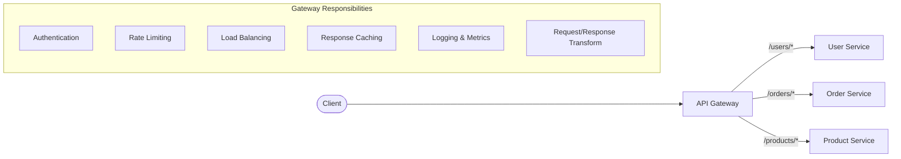
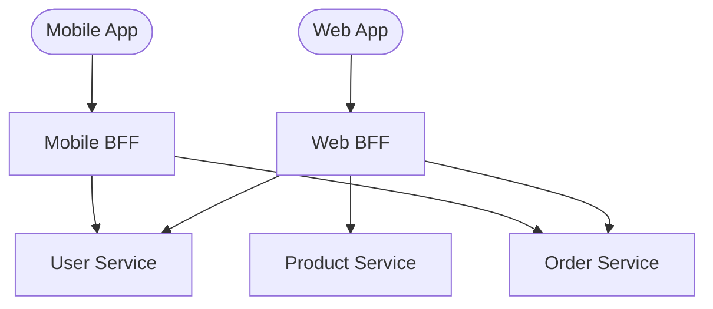

# API Gateway Pattern — The Front Door of Microservices

## The Hotel Reception Analogy

An API Gateway is like a **hotel reception desk**. Guests (clients) don't go directly to housekeeping, kitchen, or maintenance. They go to reception, which routes their request to the right department, handles authentication (checking their room key), and sometimes aggregates responses.

---

## 1. What Does an API Gateway Do?

| Responsibility | What It Does |
|---------------|-------------|
| **Routing** | Routes `/users/123` to User Service |
| **Authentication** | Validates JWT tokens before forwarding |
| **Rate Limiting** | 100 requests/min per API key |
| **Load Balancing** | Distributes across service instances |
| **Response Caching** | Cache GET responses for N seconds |
| **Request Aggregation** | Combine multiple service calls into one response |
| **Protocol Translation** | REST from client → gRPC to internal services |
| **Circuit Breaking** | Stop calling a failing service |

---

## 2. BFF Pattern (Backend for Frontend)

Different clients need different data:

- **Web BFF**: Returns full data with rich details
- **Mobile BFF**: Returns compact data, optimized for bandwidth
- Each BFF is tailored to its client's needs

---

## 3. Popular API Gateways

| Gateway | Best For |
|---------|---------|
| **Kong** | Plugin ecosystem, Lua-based |
| **AWS API Gateway** | Serverless, Lambda integration |
| **Spring Cloud Gateway** | Java/Spring ecosystem |
| **Envoy** | Service mesh sidecar |
| **NGINX** | High performance, simple routing |

---

## 4. Summary

| Aspect | Decision |
|--------|----------|
| Single entry point | Yes — simplifies client |
| Auth | Centralized at gateway |
| Rate limiting | Per client/API key at gateway |
| Internal communication | Gateway → services via gRPC |
| Multiple clients | BFF pattern |

---

---

## 🎯 Interview Corner

**Q: "What's the purpose of an API Gateway and what are the risks?"**

The API Gateway is the single entry point for all client requests. It handles cross-cutting concerns: authentication (validate JWT before forwarding), rate limiting (protect backends), routing (direct /users to User Service), response aggregation (combine multiple service calls into one response), and protocol translation (REST from client, gRPC to internal services). The risk: it becomes a single point of failure and a bottleneck. If the gateway goes down, everything goes down. Mitigation: keep it thin (routing + auth + rate limiting only, no business logic), deploy multiple instances behind a load balancer, and use circuit breakers for downstream calls.

**Q: "Explain the BFF (Backend for Frontend) pattern. When would you use it?"**

BFF means each client type (web, mobile, IoT) gets its own dedicated backend. The web BFF returns rich, detailed responses with full HTML-friendly data. The mobile BFF returns compact, bandwidth-optimized responses. Without BFF, you either build one API that serves all clients (over-fetching for mobile, under-fetching for web) or you put client-specific logic in the gateway (which makes it fat and hard to maintain). Use BFF when your clients have significantly different data needs. Each BFF is owned by the frontend team that uses it, so they can evolve independently.

**Follow-up trap**: "Doesn't BFF create code duplication?" → Yes, some. But the alternative is worse: a single API that's a compromise for everyone. Shared logic goes into the underlying microservices. BFFs only handle client-specific aggregation and transformation.

**Q: "How do you handle authentication in a microservices architecture?"**

Centralize authentication at the API Gateway. The gateway validates the JWT token (signature, expiration, issuer) and extracts claims (userId, roles). It forwards the validated claims to downstream services as headers (X-User-Id, X-Roles). Downstream services trust these headers because they only accept traffic from the gateway (network-level restriction via VPC/service mesh). This way, each microservice doesn't need to validate tokens independently. For service-to-service calls (no user context), use mTLS or service accounts with short-lived tokens.

**Applying this** — In production, use a battle-tested gateway (Kong, AWS API Gateway, Spring Cloud Gateway) rather than building your own. The most common mistake is putting business logic in the gateway — it should be a thin routing and security layer. If your gateway code has if/else statements about order types or user tiers, that logic belongs in a service.

---

> **Caution**: The API Gateway can become a bottleneck and single point of failure. Keep it thin — routing, auth, rate limiting. Don't put business logic in the gateway.
