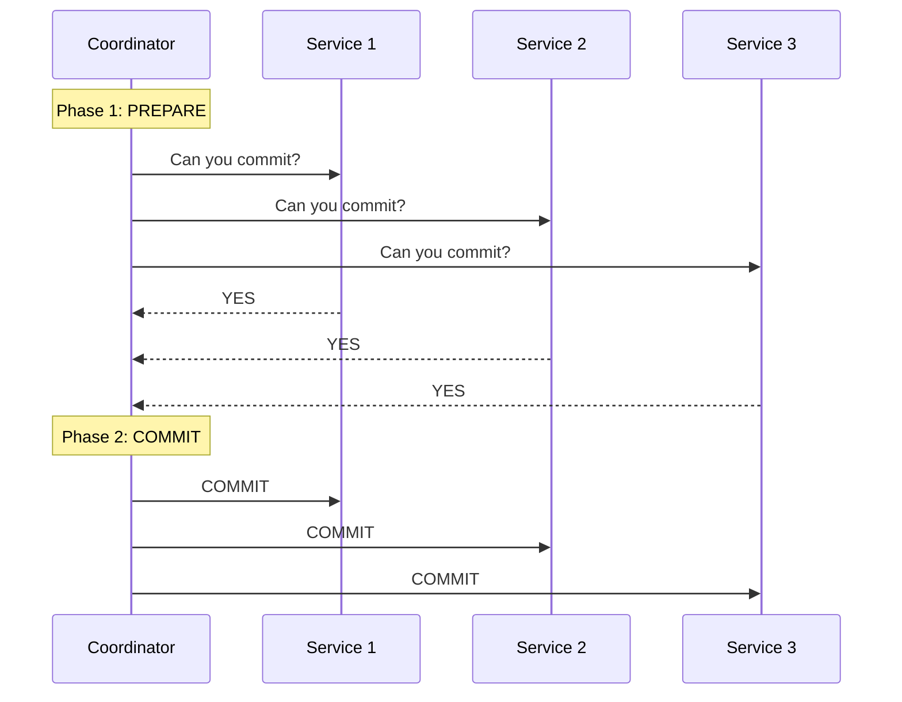
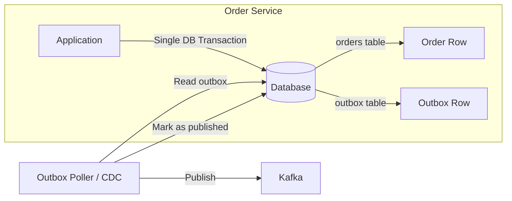

# Distributed Transactions — 2PC, Saga, Outbox Pattern

## The Problem

In a monolith, one database transaction handles everything. In microservices, each service has its own database. How do you ensure data consistency across services?

```
Order Service (DB1): Create order ✓
Payment Service (DB2): Charge customer ✓
Inventory Service (DB3): Reserve stock ✗ ← FAILED!

Now what? Order exists, payment charged, but no stock reserved. Inconsistent! 💥
```

---

## 1. Two-Phase Commit (2PC)

### How It Works



- **Phase 1 (Prepare)**: Coordinator asks all participants "Can you commit?"
- **Phase 2 (Commit)**: If ALL say yes → commit. If ANY says no → rollback all.

| Pros | Cons |
|------|------|
| Strong consistency (ACID) | Blocking — all participants locked during protocol |
| Simple mental model | Coordinator is single point of failure |
| | Poor performance at scale |
| | Not suitable for microservices (tight coupling) |

> **Verdict**: Avoid 2PC in microservices. Use it only within a single database cluster.

---

## 2. Saga Pattern (Preferred for Microservices)

Instead of one big transaction, break it into **local transactions + compensating actions**:

```
Step 1: Create Order → Compensate: Cancel Order
Step 2: Charge Payment → Compensate: Refund Payment
Step 3: Reserve Inventory → Compensate: Release Inventory
Step 4: Schedule Shipping → Compensate: Cancel Shipping
```

If Step 3 fails:
```
Execute: Compensate Step 2 (Refund) → Compensate Step 1 (Cancel Order)
```

### Choreography vs Orchestration

See the **Microservices Patterns** tutorial for detailed comparison.

---

## 3. Transactional Outbox Pattern

### The Problem

```java
// This is NOT atomic across DB and Kafka!
orderRepository.save(order);        // 1. Save to DB
kafkaTemplate.send("order-events", event);  // 2. Publish event

// What if the app crashes between step 1 and 2?
// Order saved but event never published → other services don't know!
```

### The Solution



1. In a **single database transaction**: save the order AND write the event to an `outbox` table
2. A separate process (poller or CDC) reads the outbox and publishes to Kafka
3. After publishing, mark the outbox entry as processed

```sql
-- Single transaction
BEGIN;
INSERT INTO orders (id, customer_id, total) VALUES (1, 123, 99.99);
INSERT INTO outbox (id, event_type, payload) VALUES (uuid(), 'ORDER_CREATED', '{"orderId":1,...}');
COMMIT;
```

### CDC (Change Data Capture) Alternative

Instead of polling, use **Debezium** to capture database changes and stream them to Kafka automatically:

```
Database WAL → Debezium → Kafka → Consumers
```

---

## 4. When to Use What

| Pattern | Consistency | Performance | Complexity | Use When |
|---------|------------|-------------|-----------|----------|
| 2PC | Strong | Poor | Medium | Single DB cluster |
| Saga (Choreography) | Eventual | Good | Medium | Simple flows, few services |
| Saga (Orchestration) | Eventual | Good | High | Complex flows, many services |
| Outbox | Eventual | Good | Low | Reliable event publishing |

---

---

## 🎯 Interview Corner

<div class="callout-interview">

**Q: "When would you use Saga over 2PC for distributed transactions?"**

Almost always in microservices. 2PC requires a coordinator that locks all participants during the protocol — if the coordinator crashes, all participants are stuck holding locks. It's blocking, slow, and creates tight coupling. Saga breaks the transaction into local transactions with compensating actions. If step 3 fails, you run compensations for steps 2 and 1. The trade-off: Saga gives you eventual consistency, not strong consistency. But in microservices, eventual consistency is acceptable for most business flows. I'd only use 2PC within a single database cluster where you need ACID guarantees.

</div>

<div class="callout-interview">

**Q: "Explain the Outbox pattern. Why can't you just save to DB and publish to Kafka in sequence?"**

Because those are two separate systems — there's no transaction spanning both. If your app saves the order to the database and then crashes before publishing the Kafka event, the order exists but downstream services never know about it. The Outbox pattern solves this: in a single database transaction, you save the order AND write the event to an outbox table. A separate process (CDC via Debezium, or a poller) reads the outbox and publishes to Kafka. Since both writes are in one DB transaction, they either both succeed or both fail. It's the "at least once" guarantee — the consumer must be idempotent.

**Follow-up trap**: "What if the poller publishes the event but crashes before marking it as processed?" → The event gets published again on next poll. That's why consumers must be idempotent — processing the same event twice should produce the same result.

</div>

<div class="callout-interview">

**Q: "Choreography vs Orchestration for Sagas — how do you decide?"**

Choreography: each service listens to events and reacts independently. Good for simple flows with 2-3 services. No central point of failure. But as the flow grows, it becomes hard to understand the overall process — the logic is scattered across services. Debugging is painful because there's no single place showing the flow state. Orchestration: a central orchestrator calls each service in sequence and handles compensations. Easy to understand, easy to debug, flow state is in one place. But the orchestrator is a single point of failure and can become a bottleneck. My rule: choreography for simple event-driven flows (order → notification), orchestration for complex multi-step business processes (order → payment → inventory → shipping).

</div>

<div class="callout-tip">

**Applying this** — Start with the Outbox pattern before you need Sagas. Most distributed consistency issues come from the dual-write problem (DB + message broker). Outbox solves 80% of cases. Only introduce Saga when you have a multi-step business process that spans 3+ services and needs compensating actions.

</div>

---

> **The mindset shift**: In microservices, embrace **eventual consistency**. Not everything needs to be instantly consistent. Design your system to handle temporary inconsistencies gracefully, and use compensating transactions to fix things when they go wrong.
