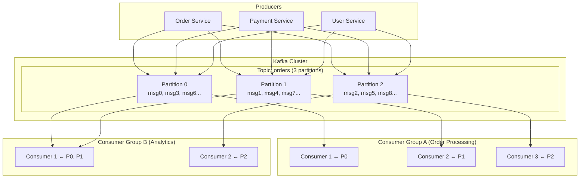
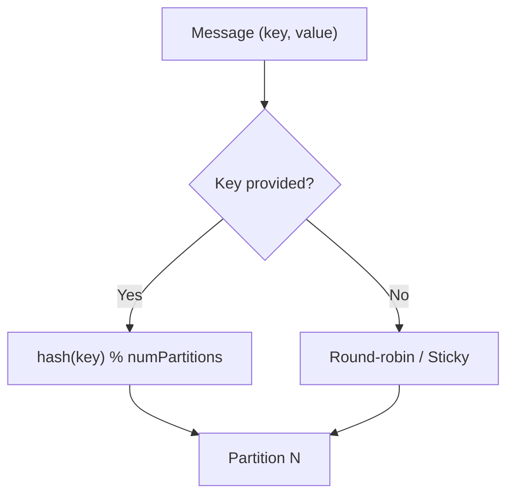
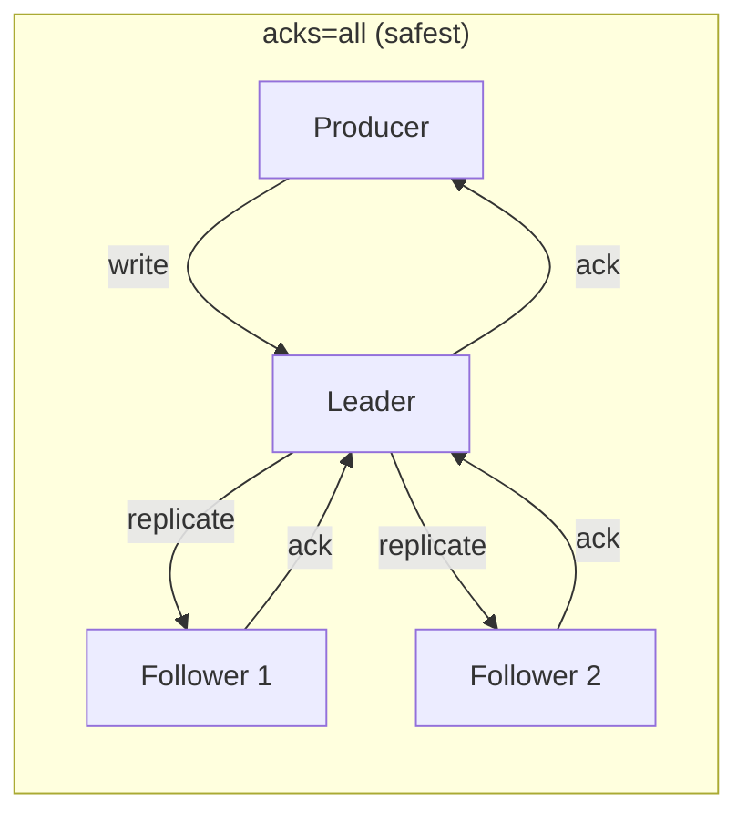
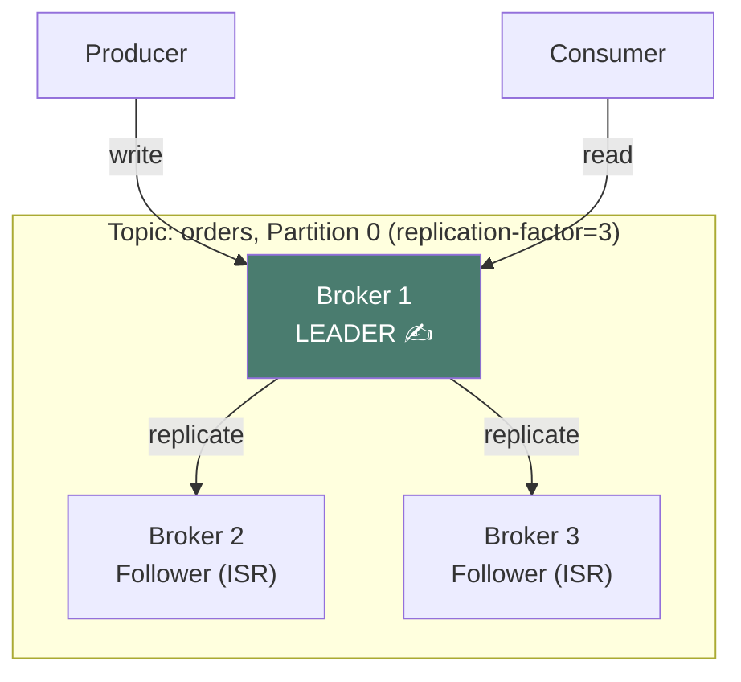
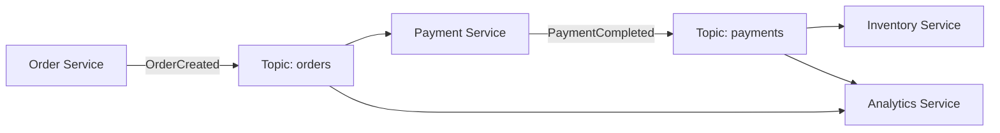
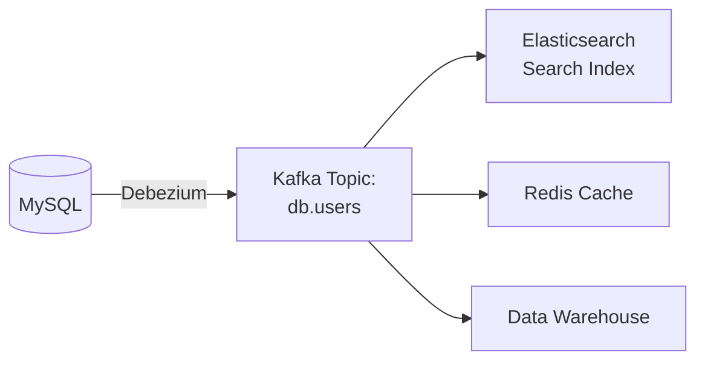

# Apache Kafka — Deep Dive

## The Post Office Analogy

Imagine a **super-fast post office** that never loses a letter:
- **Producers** = People dropping off letters
- **Topics** = Mailboxes organized by category (bills, personal, ads)
- **Partitions** = Multiple slots in each mailbox (for parallel processing)
- **Consumers** = Mail carriers picking up and delivering letters
- **Consumer Groups** = Teams of mail carriers — each letter is delivered by exactly ONE carrier in the team

The post office **keeps all letters on file** (retention) so if a carrier missed something, they can go back and re-read it.

---

## 1. Core Concepts Visualized



<div class="callout-tip">

**Key Rules to internalize:**
- Each **partition** is consumed by exactly **one consumer** within a group
- Different **consumer groups** read independently (each gets ALL messages)
- Messages within a partition are **strictly ordered**
- Messages across partitions have **no ordering guarantee**

</div>

---

## 2. The Log — Why Kafka Is Different

Kafka is NOT a traditional message queue. It's a **distributed commit log**:

```
Partition 0:
┌─────┬─────┬─────┬─────┬─────┬─────┬─────┐
│  0  │  1  │  2  │  3  │  4  │  5  │  6  │  ← offsets
│ msg │ msg │ msg │ msg │ msg │ msg │ msg │
└─────┴─────┴─────┴─────┴─────┴─────┴─────┘
                              ↑ Consumer A (offset 5)
                    ↑ Consumer B (offset 3) — reading at its own pace
```

- Messages are **appended** (never modified or deleted until retention expires)
- Each consumer tracks its own **offset** (position in the log)
- Consumers can **rewind** to re-read old messages

<div class="callout-scenario">

**When does this matter?** Imagine you deploy a buggy consumer that processes orders incorrectly for 2 hours. With RabbitMQ, those messages are gone. With Kafka, you fix the bug, reset the consumer offset, and **replay** all those messages. No data loss.

</div>

---

## 3. Partitioning — The Key Design Decision



<div class="callout-scenario">

**Real decision**: You're building an order system. Should you key by `userId` or `orderId`?
- **Key by userId** → All orders for same user land in same partition → you can process them in order per user. Choose this when order-of-operations matters (e.g., create → pay → ship must be sequential per user).
- **Key by orderId** → Better distribution, but no per-user ordering. Choose this when each order is independent.

</div>

### How many partitions?

| Factor | Guidance |
|--------|----------|
| Target throughput | partitions ≥ max(producer throughput, consumer throughput) |
| Consumer parallelism | partitions ≥ number of consumers in a group |
| Rule of thumb | Start with 6-12 for most use cases |
| Upper limit | Thousands possible, but more = more overhead |

---

## 4. Delivery Guarantees — Choosing Your Trade-off

### Producer side: `acks` setting



| Setting | Speed | Safety | When to use |
|---------|-------|--------|-------------|
| `acks=0` | Fastest | May lose messages | Metrics, logs where loss is acceptable |
| `acks=1` | Fast | Leader crash = loss | Most applications |
| `acks=all` | Slowest | No data loss | Financial transactions, critical events |

### Consumer side: Commit strategies

| Strategy | Guarantee | Trade-off |
|----------|-----------|-----------|
| Auto-commit | At-most-once risk | Simple but may lose messages on crash |
| Commit after process | At-least-once | May duplicate on crash, but no loss |
| Transactions (EOS) | Exactly-once | Complex, slight performance cost |

<div class="callout-info">

**Decision framework**: Start with `acks=all` + manual commit (at-least-once). Make your consumers **idempotent** (processing the same message twice produces the same result). This covers 95% of real-world needs without the complexity of exactly-once.

</div>

---

## 5. Replication & Fault Tolerance



- **Leader** handles all reads and writes for a partition
- **ISR (In-Sync Replicas)** = followers that are caught up
- If leader dies → one of the ISR followers becomes the new leader automatically

---

## 6. Real-World Application Scenarios

### Scenario 1: Order Processing Pipeline



### Scenario 2: CDC (Change Data Capture)



Database changes automatically streamed to Kafka → consumed by multiple downstream systems. This is how you keep your search index, cache, and data warehouse in sync without coupling services.

---

## 7. Kafka vs RabbitMQ — Decision Guide

| Feature | Kafka | RabbitMQ |
|---------|-------|----------|
| Model | Distributed log | Message queue |
| Throughput | Millions/sec | Thousands/sec |
| Replay | ✅ Re-read from any offset | ❌ Gone after consumption |
| Ordering | Per partition | Per queue |
| Best for | Event streaming, CDC, analytics | Task queues, RPC, complex routing |

```
Need to replay messages?          → Kafka
Need complex routing?             → RabbitMQ
High throughput (>100K msg/sec)?  → Kafka
Simple task queue?                → RabbitMQ
Event sourcing / CDC?             → Kafka
Multiple consumers per message?   → Kafka (consumer groups)
```

---

## 8. Common Pitfalls

| Pitfall | Problem | Fix |
|---------|---------|-----|
| Too few partitions | Can't scale consumers | Plan based on peak throughput |
| No message key | No ordering, random distribution | Use meaningful keys |
| Auto-commit | Message loss or duplicates | Manual commit + idempotent consumers |
| Large messages | Broker performance degrades | Keep < 1MB, use references |
| Consumer lag | Consumers can't keep up | Add consumers (up to partition count) |

---

---

## 🎯 Interview Corner

<div class="callout-interview">

**Q: "How does Kafka guarantee message ordering?"**

Kafka guarantees ordering only within a single partition, not across partitions. When a producer sends messages with the same key, they always go to the same partition (hash(key) % numPartitions), so they're ordered. Messages with different keys may land in different partitions and have no ordering guarantee. This is why partition key design is critical: if you need all events for a user to be processed in order, key by userId. If you need all events for an order to be ordered, key by orderId. If you need global ordering across all messages, use a single partition — but that kills parallelism.

</div>

<div class="callout-interview">

**Q: "Explain Kafka's delivery guarantees. How do you achieve exactly-once?"**

Three levels. At-most-once: consumer commits offset before processing — if it crashes mid-processing, the message is lost. At-least-once: consumer processes then commits — if it crashes after processing but before committing, the message is reprocessed on restart. Exactly-once: Kafka's transactional API (idempotent producer + transactional consumer) ensures each message is processed exactly once. But exactly-once is complex and has performance overhead. In practice, most systems use at-least-once with idempotent consumers — processing the same message twice produces the same result (e.g., using a deduplication key or upsert instead of insert).

**Follow-up trap**: "Is exactly-once really exactly-once?" → It's exactly-once within Kafka's boundary. If your consumer writes to an external database, the write + offset commit aren't atomic unless you use the Outbox pattern or store offsets in the same database as your results.

</div>

<div class="callout-interview">

**Q: "A consumer group is falling behind (consumer lag is growing). How do you fix it?"**

First, identify the bottleneck. If consumers are slow (processing takes too long), optimize the processing logic or increase concurrency within each consumer. If you need more parallelism, add more consumers to the group — but only up to the number of partitions (extra consumers sit idle). If you're already at max consumers = partitions, increase the partition count (note: this changes key-to-partition mapping, so existing ordering guarantees for in-flight messages may break). Also check: are consumers doing I/O in the processing loop? Batch writes to the database. Is deserialization slow? Use a faster serializer (Avro/Protobuf instead of JSON).

</div>

<div class="callout-interview">

**Q: "How would you design a Kafka-based event-driven architecture for an e-commerce platform?"**

Each domain event gets its own topic: `orders`, `payments`, `inventory`, `notifications`. Order Service publishes OrderCreated to the orders topic. Payment Service consumes it, processes payment, publishes PaymentCompleted to payments topic. Inventory Service consumes PaymentCompleted, reserves stock. Notification Service consumes from multiple topics to send emails/SMS. Each service is its own consumer group, so they read independently. Key by orderId for ordering within an order's lifecycle. Use `acks=all` with replication factor 3 for durability. Schema Registry (Avro) for contract evolution. Dead letter topics for messages that fail processing after retries.

</div>

<div class="callout-tip">

**Applying this** — In interviews, always mention: (1) partition key design and why it matters for ordering, (2) consumer group mechanics, (3) at-least-once + idempotent consumers as the practical default, (4) replication factor for durability. These four concepts cover 90% of Kafka interview questions.

</div>

---

## 📚 Deep Dive Sections

👉 [Practical Setup — Docker on Windows & Mac](./kafka-setup.md)

👉 [Java Producer & Consumer Code](./kafka-java-code.md)

---

> **The key insight**: Kafka is a **distributed commit log**, not a message queue. Messages are durable, replayable, and ordered within partitions. Think of it as a database of events that multiple systems can independently read at their own pace. When you're deciding whether to use Kafka in your architecture, ask: "Do I need replay? Do I need multiple independent consumers? Do I need high throughput?" If yes to any — Kafka is your answer.
