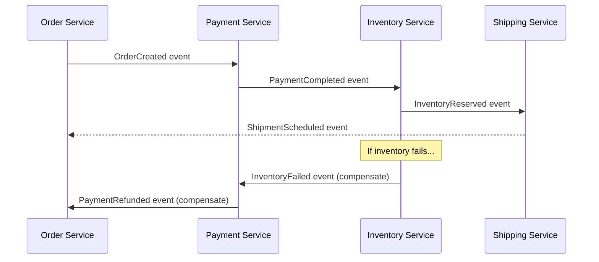
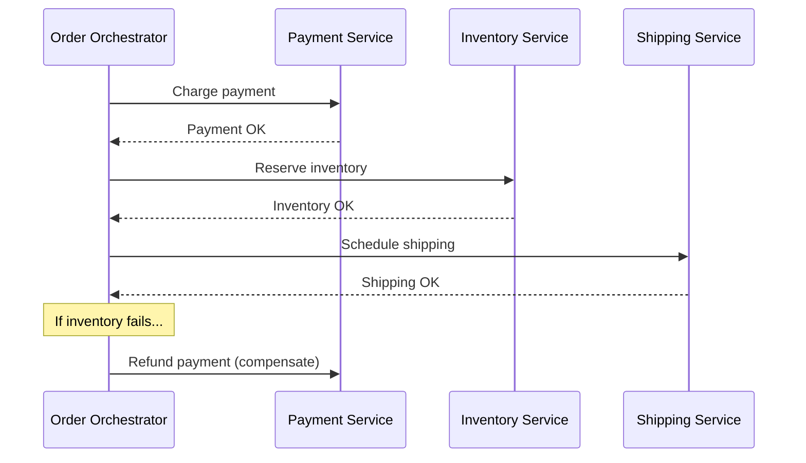
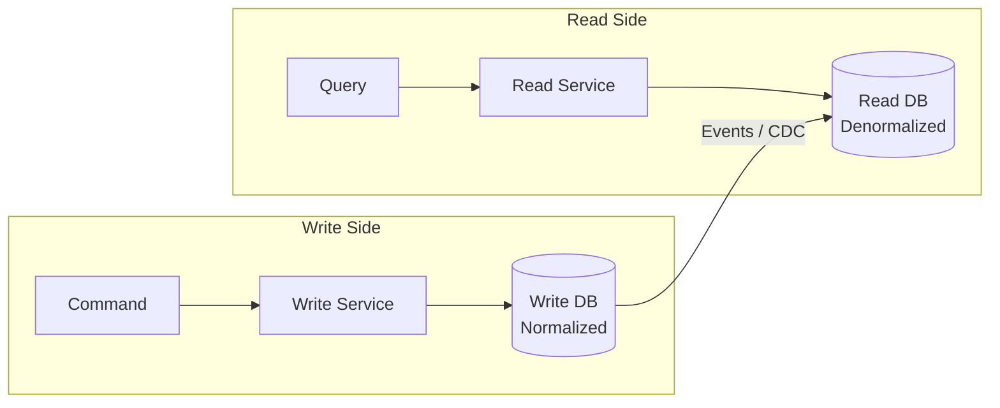
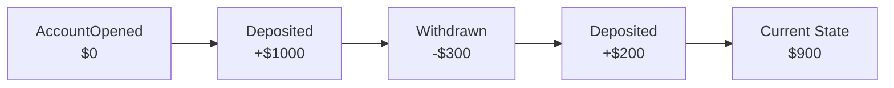
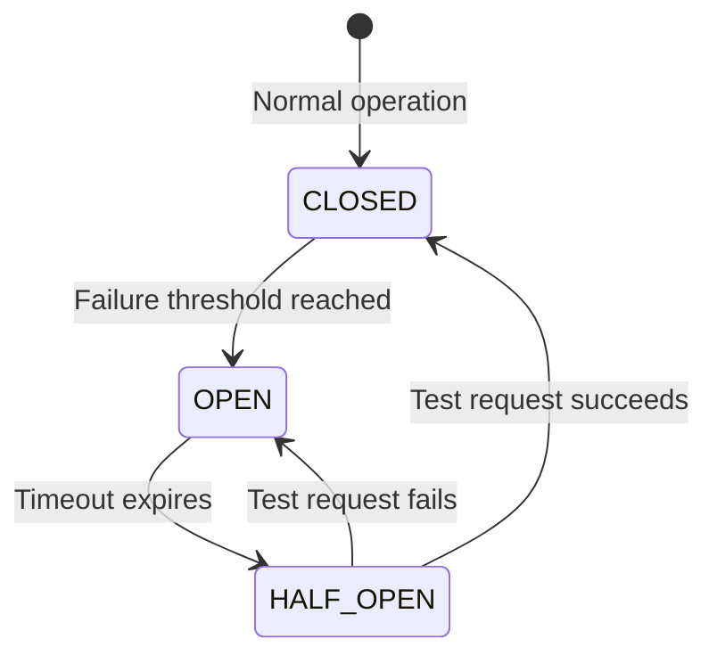
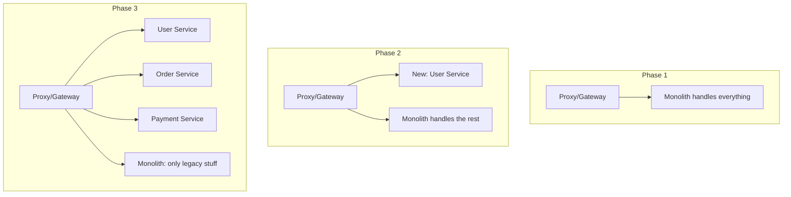

# Microservices Patterns — When and Why to Use Each

## The City Analogy

A monolith is like a **single mega-mall** — everything under one roof. If the food court catches fire, the entire mall shuts down.

Microservices are like a **city** — separate buildings (services) connected by roads (APIs). If one restaurant burns down, the rest of the city keeps running.

But a city needs **traffic rules, postal systems, and emergency protocols**. Those are the patterns we'll learn.

---

## 1. Saga Pattern — Distributed Transactions

### The Problem

In a monolith, you wrap everything in one database transaction. In microservices, each service has its own database. How do you ensure consistency across services?

### Scenario: E-commerce order

```
1. Order Service → Create order
2. Payment Service → Charge customer
3. Inventory Service → Reserve items
4. Shipping Service → Schedule delivery
```

If payment succeeds but inventory fails — you need to **undo the payment**. That's a Saga.

### Choreography (Event-Driven)



- Each service listens to events and reacts
- **Pros**: Loose coupling, simple
- **Cons**: Hard to track the overall flow, debugging is painful

### Orchestration (Central Coordinator)



- Central orchestrator controls the flow
- **Pros**: Easy to understand, easy to debug
- **Cons**: Orchestrator is a single point of failure

---

## 2. CQRS — Command Query Responsibility Segregation

### The Problem

Your read model and write model have different needs. Writes need validation, consistency. Reads need speed, denormalized data.

### The Pattern



### Scenario: Social media feed

- **Write**: User posts a message → validate, store in PostgreSQL (normalized)
- **Read**: Show feed → read from Redis/Elasticsearch (denormalized, pre-computed)
- **Sync**: Changes propagate via events (eventual consistency)

### When to use CQRS

| ✅ Use when | ❌ Don't use when |
|------------|------------------|
| Read/write patterns are very different | Simple CRUD app |
| Need different scaling for reads vs writes | Strong consistency required everywhere |
| Complex domain with many aggregates | Small team, simple domain |

---

## 3. Event Sourcing

### The Problem

Traditional: Store the **current state**. You know the balance is $500, but not *how* it got there.

Event Sourcing: Store **every event** that happened. Replay events to get current state.

### Scenario: Bank account

```
Events:
1. AccountOpened(amount: 0)
2. MoneyDeposited(amount: 1000)
3. MoneyWithdrawn(amount: 300)
4. MoneyDeposited(amount: 200)

Current state: 0 + 1000 - 300 + 200 = $900
```



### Benefits

- **Complete audit trail** — you know exactly what happened and when
- **Time travel** — rebuild state at any point in time
- **Debug production issues** — replay events to reproduce bugs

---

## 4. Circuit Breaker

### The Analogy

Like an electrical circuit breaker in your house. If there's a short circuit (service failure), the breaker trips to prevent damage (cascading failure).

### States



- **CLOSED**: Requests flow normally. Count failures.
- **OPEN**: All requests fail immediately (fast fail). Don't even try calling the service.
- **HALF_OPEN**: Allow one test request. If it succeeds → CLOSED. If it fails → OPEN again.

### Implementation with Resilience4j

```java
CircuitBreakerConfig config = CircuitBreakerConfig.custom()
    .failureRateThreshold(50)           // open after 50% failures
    .waitDurationInOpenState(Duration.ofSeconds(30))  // wait 30s before half-open
    .slidingWindowSize(10)              // evaluate last 10 calls
    .build();

CircuitBreaker breaker = CircuitBreaker.of("paymentService", config);

Supplier<Payment> decorated = CircuitBreaker
    .decorateSupplier(breaker, () -> paymentService.process(order));

Try<Payment> result = Try.ofSupplier(decorated)
    .recover(ex -> fallbackPayment(order));  // fallback when circuit is open
```

---

## 5. Bulkhead Pattern

### The Analogy

Ships have bulkheads — watertight compartments. If one compartment floods, the others stay dry. The ship doesn't sink.

### Scenario: Isolate service calls

```java
// Without bulkhead: if PaymentService is slow, ALL threads are stuck waiting
// With bulkhead: PaymentService gets max 10 threads, others are protected

BulkheadConfig config = BulkheadConfig.custom()
    .maxConcurrentCalls(10)
    .maxWaitDuration(Duration.ofMillis(500))
    .build();

Bulkhead bulkhead = Bulkhead.of("paymentService", config);
```

---

## 6. Strangler Fig Pattern — Migrating from Monolith

### The Approach

Don't rewrite everything at once. Gradually replace pieces of the monolith with microservices, like a strangler fig tree slowly wrapping around a host tree.



---

## Pattern Decision Matrix

| Problem | Pattern | Complexity |
|---------|---------|-----------|
| Distributed transactions | Saga | High |
| Different read/write needs | CQRS | Medium-High |
| Full audit trail needed | Event Sourcing | High |
| Cascading failures | Circuit Breaker | Low |
| Resource isolation | Bulkhead | Low |
| Monolith migration | Strangler Fig | Medium |
| Service-to-service auth | Sidecar / Service Mesh | Medium |

---

---

## 🎯 Interview Corner

<div class="callout-interview">

**Q: "Explain the Saga pattern with a real example. How do you handle failures?"**

Take an e-commerce order flow: Create Order → Charge Payment → Reserve Inventory → Schedule Shipping. Each step is a local transaction in its own service. Each step has a compensating action: Cancel Order, Refund Payment, Release Inventory. If Reserve Inventory fails after Payment succeeded, the orchestrator (or event chain) triggers Refund Payment then Cancel Order — in reverse order. The key design principle: every forward action must have an idempotent compensating action. "Idempotent" because the compensation might run twice if there's a retry — refunding the same payment twice should not double-refund.

</div>

<div class="callout-interview">

**Q: "What's the Circuit Breaker pattern and when would you use it?"**

It prevents cascading failures. If Service A calls Service B and B is down, without a circuit breaker, A keeps sending requests, its threads pile up waiting for timeouts, and eventually A goes down too — cascading failure. The circuit breaker has three states: CLOSED (normal, requests flow), OPEN (B is failing, all requests fail immediately without calling B), HALF-OPEN (after a cooldown, send one test request — if it succeeds, close the circuit; if it fails, stay open). I'd use it on every inter-service call in production. With Resilience4j, you configure failure rate threshold (e.g., open after 50% failures in last 10 calls) and wait duration before half-open.

**Follow-up trap**: "What's the difference between Circuit Breaker and Retry?" → Retry helps with transient failures (network blip). Circuit Breaker helps with sustained failures (service is down). Use both together: retry 2-3 times for transient errors, but if the failure rate crosses a threshold, open the circuit and stop retrying entirely. Retrying a dead service just adds load.

</div>

<div class="callout-interview">

**Q: "How would you migrate a monolith to microservices?"**

Strangler Fig pattern. Don't rewrite everything — that's a multi-year project that usually fails. Instead, put a proxy/API gateway in front of the monolith. For each new feature, build it as a microservice and route traffic through the gateway. For existing features, extract them one at a time: identify a bounded context (e.g., User Management), build the microservice, migrate data, route traffic to the new service, and decommission that part of the monolith. Start with the least coupled, most independently deployable piece. The monolith shrinks over time until only legacy code remains.

</div>

<div class="callout-interview">

**Q: "CQRS — when is it worth the complexity?"**

When your read and write patterns are fundamentally different. Example: an e-commerce product catalog. Writes are rare (admin updates products), reads are massive (millions of users browsing). The write model needs normalization and validation (PostgreSQL). The read model needs denormalized, pre-computed views optimized for queries (Elasticsearch or Redis). CQRS lets you scale reads and writes independently and optimize each for its access pattern. Don't use it for simple CRUD apps — the eventual consistency between read and write models adds complexity that isn't worth it unless you have a clear scaling or performance need.

</div>

<div class="callout-tip">

**Applying this** — In interviews, don't just name patterns — explain the problem they solve and when you'd NOT use them. "I'd use Saga for distributed transactions because 2PC doesn't scale, but for a simple 2-service flow, I'd just use the Outbox pattern — Saga is overkill." Showing you know when NOT to use a pattern is more impressive than knowing the pattern itself.

</div>

---

> **The golden rule**: Don't use a pattern just because it's cool. Every pattern adds complexity. Start simple, add patterns when you feel the pain they solve. If you don't have the problem, you don't need the pattern.
