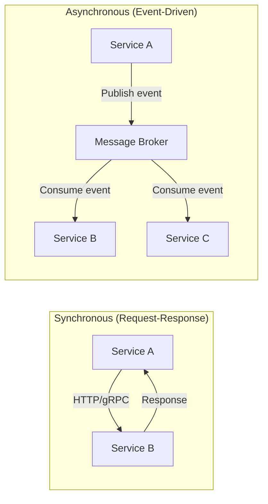
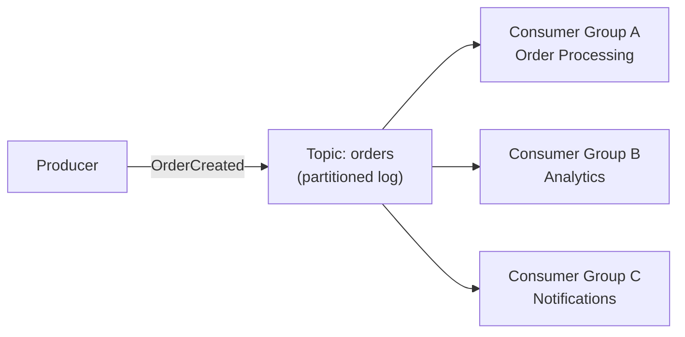
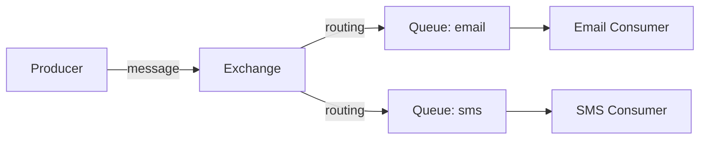
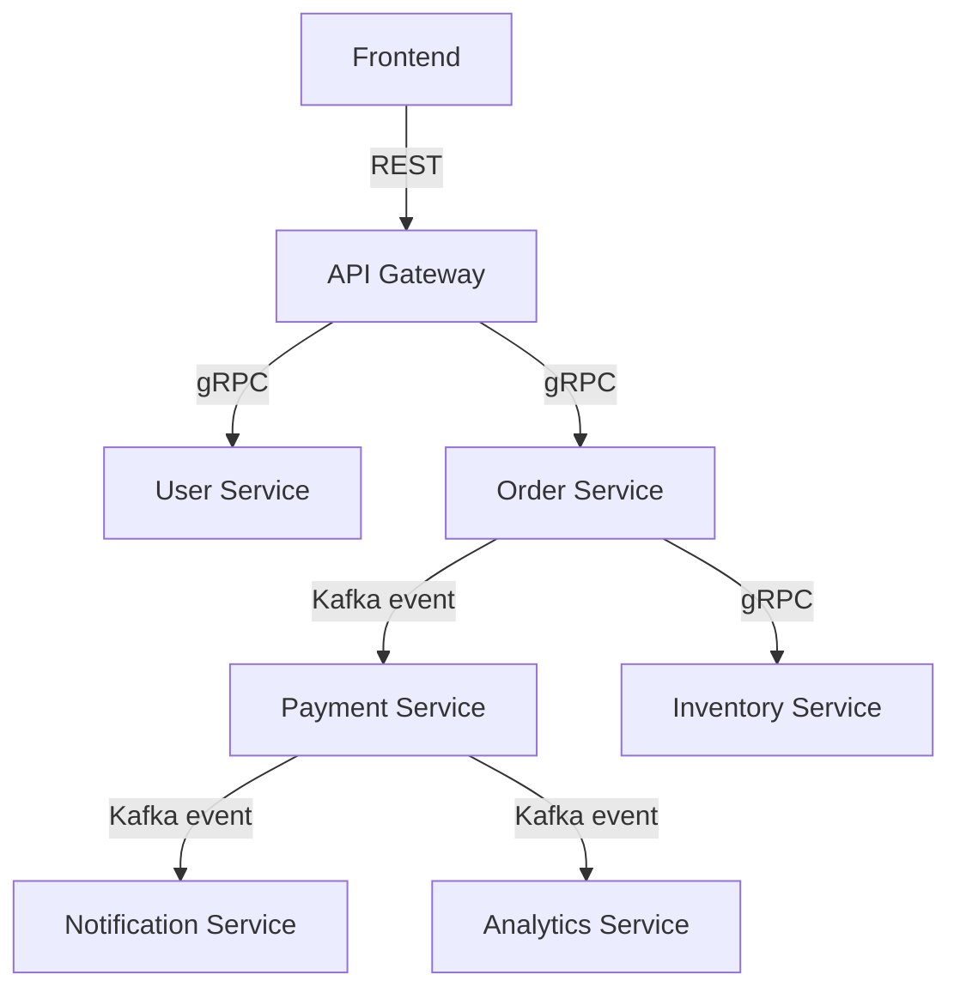

# Service Communication — REST vs gRPC vs Messaging

## The Phone Call Analogy

- **REST** = Sending a letter. Simple, everyone understands it, but slow for back-and-forth.
- **gRPC** = A phone call. Fast, real-time, but both sides need to speak the same language (protobuf).
- **Messaging (Kafka/RabbitMQ)** = Leaving a voicemail. You don't need the other person to be available right now.

---

## 1. Synchronous vs Asynchronous



| | Synchronous | Asynchronous |
|---|------------|-------------|
| Coupling | Tight — caller waits | Loose — fire and forget |
| Latency | Caller blocked until response | Caller continues immediately |
| Failure | If B is down, A fails | If B is down, message waits in queue |
| Use case | Need immediate response | Background processing, notifications |

---

## 2. REST — The Universal Language

```java
// Spring Boot REST endpoint
@RestController
@RequestMapping("/api/users")
public class UserController {

    @GetMapping("/{id}")
    public ResponseEntity<User> getUser(@PathVariable Long id) {
        return ResponseEntity.ok(userService.findById(id));
    }

    @PostMapping
    public ResponseEntity<User> createUser(@RequestBody CreateUserRequest request) {
        User user = userService.create(request);
        return ResponseEntity.status(HttpStatus.CREATED).body(user);
    }
}
```

### When to use REST

- Public APIs (everyone speaks HTTP)
- Simple CRUD operations
- When you need caching (HTTP caching is built-in)
- Browser-to-server communication

### REST Best Practices

| Practice | Example |
|----------|---------|
| Use nouns, not verbs | `/users/123` not `/getUser?id=123` |
| Use HTTP methods correctly | GET=read, POST=create, PUT=update, DELETE=delete |
| Version your API | `/api/v1/users` |
| Use proper status codes | 200, 201, 400, 404, 500 |
| Paginate large results | `?page=1&size=20` |

---

## 3. gRPC — The Fast Lane

### Why gRPC?

- **Binary protocol** (protobuf) — 5-10x faster than JSON
- **HTTP/2** — multiplexing, streaming, header compression
- **Strongly typed** — contract defined in `.proto` file
- **Code generation** — client/server stubs auto-generated

### Define the contract

```protobuf
// user.proto
syntax = "proto3";

service UserService {
  rpc GetUser (GetUserRequest) returns (User);
  rpc ListUsers (ListUsersRequest) returns (stream User);  // server streaming
}

message GetUserRequest {
  int64 id = 1;
}

message User {
  int64 id = 1;
  string name = 2;
  string email = 3;
}
```

### When to use gRPC

- Internal service-to-service communication
- High-performance, low-latency requirements
- Streaming data (real-time feeds, logs)
- Polyglot environments (Java ↔ Go ↔ Python)

---

## 4. Message Brokers — Kafka vs RabbitMQ

### Kafka — The Event Log



- Messages are **persisted** (replay anytime)
- **Ordered within a partition**
- Multiple consumer groups can read independently
- Best for: event streaming, audit logs, high throughput

### RabbitMQ — The Smart Router



- Messages are **consumed and deleted**
- Complex routing (direct, topic, fanout, headers)
- Best for: task queues, RPC, complex routing

### Comparison

| Feature | Kafka | RabbitMQ |
|---------|-------|----------|
| Model | Distributed log | Message queue |
| Persistence | Yes (configurable retention) | Until consumed |
| Ordering | Per partition | Per queue |
| Throughput | Millions/sec | Thousands/sec |
| Replay | Yes | No |
| Use case | Event streaming, CDC | Task queues, RPC |

---

## 5. Scenario: Choosing the Right Communication

### E-commerce system



| Communication | Why |
|--------------|-----|
| Frontend → Gateway: **REST** | Browser compatibility, simplicity |
| Gateway → Services: **gRPC** | Internal, fast, typed contracts |
| Order → Payment: **Kafka** | Async, decoupled, reliable |
| Payment → Notification: **Kafka** | Fire-and-forget, multiple consumers |
| Order → Inventory: **gRPC** | Need immediate response (is item in stock?) |

---

## Decision Flowchart

```
Need immediate response?
├── Yes → Need high performance?
│   ├── Yes → gRPC
│   └── No → REST
└── No → Need message replay?
    ├── Yes → Kafka
    └── No → Need complex routing?
        ├── Yes → RabbitMQ
        └── No → Kafka (simpler, more versatile)
```

---

---

## 🎯 Interview Corner

<div class="callout-interview">

**Q: "REST vs gRPC — when would you pick one over the other?"**

REST for external/public APIs — every client speaks HTTP, it's cacheable, and tooling is universal (Postman, curl, browsers). gRPC for internal service-to-service calls — binary protobuf is 5-10x faster than JSON, HTTP/2 gives multiplexing and streaming, and the .proto contract generates client/server code in any language. The trade-off: gRPC is harder to debug (binary, not human-readable), doesn't work in browsers without a proxy (grpc-web), and requires both sides to share the .proto file. In practice, most companies use REST at the edge (client → gateway) and gRPC internally (service → service).

</div>

<div class="callout-interview">

**Q: "When would you use async messaging (Kafka/RabbitMQ) instead of synchronous calls?"**

When the caller doesn't need an immediate response. Three scenarios: (1) Fire-and-forget — order placed, send confirmation email. The order service doesn't need to wait for the email to be sent. (2) Fan-out — one event triggers multiple consumers. Order created → payment, inventory, analytics, notifications all react independently. (3) Load leveling — if the downstream service can only handle 100 RPS but you get 1000 RPS bursts, a queue absorbs the spike. The key benefit: if the consumer is down, messages wait in the queue. With sync calls, the caller fails immediately.

**Follow-up trap**: "What about data consistency with async messaging?" → You get eventual consistency, not immediate. The order is created, but the inventory reservation happens milliseconds to seconds later. Design your UI to handle this — show "processing" states, use optimistic updates, and handle the case where a downstream step fails (compensating actions).

</div>

<div class="callout-interview">

**Q: "You're designing a new microservices system. How do you decide the communication pattern between services?"**

I ask three questions for each interaction: (1) Does the caller need an immediate response? If yes → sync (REST/gRPC). If no → async (messaging). (2) Is it a query or a command? Queries ("get user profile") are naturally sync. Commands ("process this order") can often be async. (3) How many consumers need this data? One consumer → direct call. Multiple consumers → event/message broker. For example, in an e-commerce system: "Is this item in stock?" → sync gRPC (need immediate answer). "Order was placed" → async Kafka event (payment, inventory, notifications all consume independently).

</div>

<div class="callout-tip">

**Applying this** — Start with REST for everything. It's simple, everyone knows it, and it works. When you measure latency and find internal calls are a bottleneck, switch those to gRPC. When you find services are tightly coupled or failing together, introduce async messaging for the decoupling. Don't over-engineer communication patterns on day one.

</div>

---

> **The pragmatic approach**: Start with REST for everything. When you feel the pain (latency, coupling, throughput), introduce gRPC for internal calls and Kafka for async flows. Don't over-engineer from day one.
