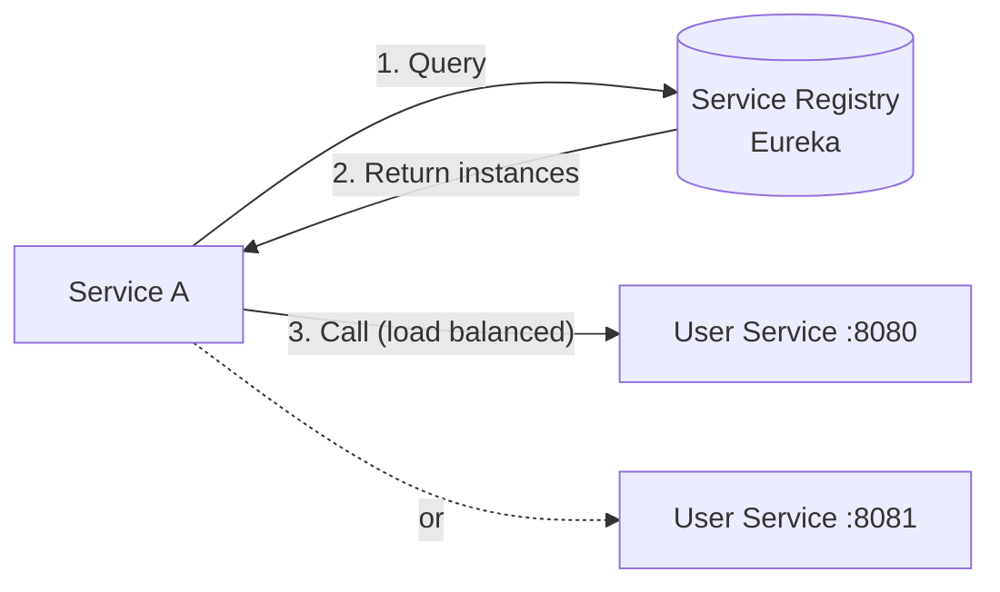
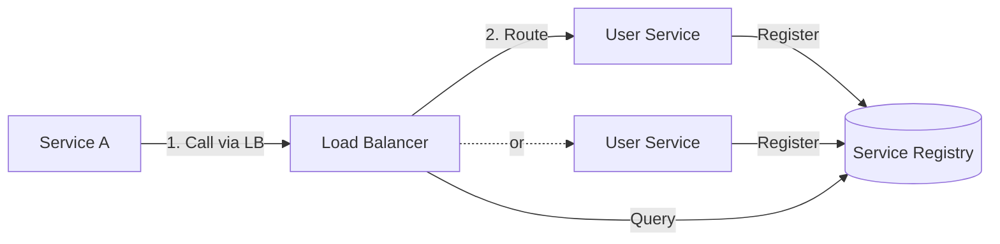
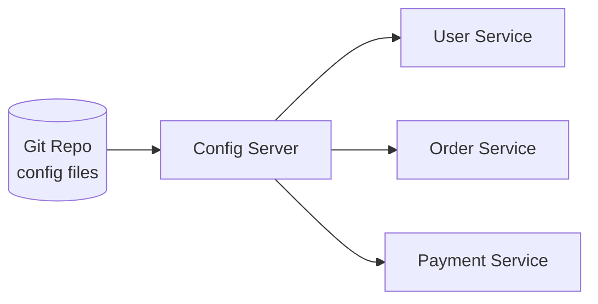

# Service Discovery & Configuration

## The Problem

In a monolith, everything is at `localhost`. In microservices, services run on different machines, ports change, instances scale up/down. How does Service A find Service B?

```
Service A needs to call User Service.
But User Service has 5 instances:
  - 10.0.1.5:8080
  - 10.0.1.6:8080
  - 10.0.2.3:8080
  - 10.0.2.4:8080  ← just started
  - 10.0.1.7:8080  ← just died

Which one to call? How to know which are alive?
```

---

## 1. Client-Side Discovery



- Client queries the registry and picks an instance
- **Eureka** (Netflix), **Consul** (HashiCorp)
- Pros: No extra hop, client controls load balancing
- Cons: Client needs discovery logic in every language

### Spring Cloud + Eureka Example

```java
// Service registers itself
@SpringBootApplication
@EnableEurekaClient
public class UserServiceApplication { }

// application.yml
eureka:
  client:
    serviceUrl:
      defaultZone: http://eureka-server:8761/eureka/
  instance:
    preferIpAddress: true

// Calling service uses service name, not URL
@FeignClient(name = "user-service")
public interface UserClient {
    @GetMapping("/users/{id}")
    User getUser(@PathVariable Long id);
}
```

---

## 2. Server-Side Discovery



- Load balancer handles discovery
- **AWS ALB/NLB**, **Kubernetes Services**
- Pros: Client is simple, language-agnostic
- Cons: Extra network hop through LB

---

## 3. Kubernetes DNS — The Modern Way

In Kubernetes, service discovery is built-in:

```yaml
# Kubernetes Service
apiVersion: v1
kind: Service
metadata:
  name: user-service
spec:
  selector:
    app: user-service
  ports:
    - port: 80
      targetPort: 8080
```

```java
// Just use the service name as hostname!
String url = "http://user-service/users/123";
// Kubernetes DNS resolves "user-service" to the right pod IPs
```

---

## 4. Externalized Configuration

### The Problem

```java
// Hardcoded config — need to redeploy to change!
String dbUrl = "jdbc:mysql://prod-db:3306/users";
int cacheTimeout = 3600;
```

### Spring Cloud Config Server



```yaml
# application-prod.yml (in Git)
database:
  url: jdbc:mysql://prod-db:3306/users
  pool-size: 20
cache:
  timeout: 3600
feature-flags:
  new-checkout: true
```

- Config stored in Git (versioned, auditable)
- Services fetch config at startup
- **@RefreshScope** allows runtime config updates without restart

---

## 5. Health Checks

Services must report their health so the registry can remove dead instances:

```java
@Component
public class CustomHealthIndicator implements HealthIndicator {
    @Override
    public Health health() {
        if (canConnectToDatabase()) {
            return Health.up().withDetail("db", "reachable").build();
        }
        return Health.down().withDetail("db", "unreachable").build();
    }
}
```

```
GET /actuator/health
{
  "status": "UP",
  "components": {
    "db": { "status": "UP" },
    "redis": { "status": "UP" },
    "diskSpace": { "status": "UP" }
  }
}
```

---

## 6. Comparison

| Solution | Best For | Complexity |
|----------|---------|-----------|
| Eureka | Spring Cloud ecosystem | Medium |
| Consul | Multi-language, key-value config | Medium |
| Kubernetes DNS | K8s-native apps | Low (built-in) |
| AWS Cloud Map | AWS-native apps | Low |

---

---

## 🎯 Interview Corner

<div class="callout-interview">

**Q: "How do microservices find each other? Explain service discovery."**

Two approaches. Client-side discovery: each service registers itself with a registry (Eureka, Consul). When Service A needs to call Service B, it queries the registry, gets a list of healthy instances, and picks one (client-side load balancing). Server-side discovery: services register with a registry, but a load balancer (ALB, Kubernetes Service) sits in between. Service A calls the load balancer, which routes to a healthy instance. In Kubernetes, it's built-in — you create a Service resource and use the DNS name (`http://user-service/users/123`). K8s DNS resolves it to a healthy pod IP. No external registry needed.

</div>

<div class="callout-interview">

**Q: "How do you manage configuration across 20 microservices without redeploying?"**

Externalized configuration. Store config in a central place (Spring Cloud Config Server backed by Git, AWS Parameter Store, HashiCorp Consul KV). Services fetch config at startup. For runtime changes without restart, use Spring's @RefreshScope with a /actuator/refresh endpoint, or Config Server's bus-refresh that broadcasts changes to all instances via a message broker. Sensitive values (DB passwords, API keys) go in a secrets manager (AWS Secrets Manager, HashiCorp Vault) — never in Git. Feature flags go in a dedicated system (LaunchDarkly, or a simple config property) so you can toggle features without deployment.

**Follow-up trap**: "What if the Config Server is down when a service starts?" → Services should cache the last known config locally and start with cached values. Spring Cloud Config has a fail-fast option — disable it in production so services can start even if the config server is temporarily unavailable.

</div>

<div class="callout-interview">

**Q: "Client-side vs server-side discovery — which do you prefer and why?"**

Depends on the platform. On Kubernetes, server-side discovery is the clear winner — it's built-in, zero code, works across languages. You just use the service DNS name. Off Kubernetes, client-side discovery with Eureka or Consul gives you more control: you can implement custom load balancing (weighted, zone-aware), and there's no extra network hop through a load balancer. The downside is every service needs a discovery client library, which is language-specific. In practice, most modern systems run on K8s and use its native discovery. Eureka/Consul are more common in legacy Spring Cloud setups.

</div>

<div class="callout-tip">

**Applying this** — If you're on Kubernetes, don't add Eureka or Consul — K8s service discovery is simpler and more reliable. If you're not on K8s, Consul is the most versatile (works across languages, includes health checking and KV store). For configuration, use a Git-backed config server for non-sensitive values and a secrets manager for credentials. Never hardcode URLs or credentials.

</div>

---

> **Modern recommendation**: If you're on Kubernetes, use its built-in service discovery (DNS). If not, Consul is the most versatile. Eureka is great if you're all-in on Spring Cloud. Don't build your own — it's a solved problem.
