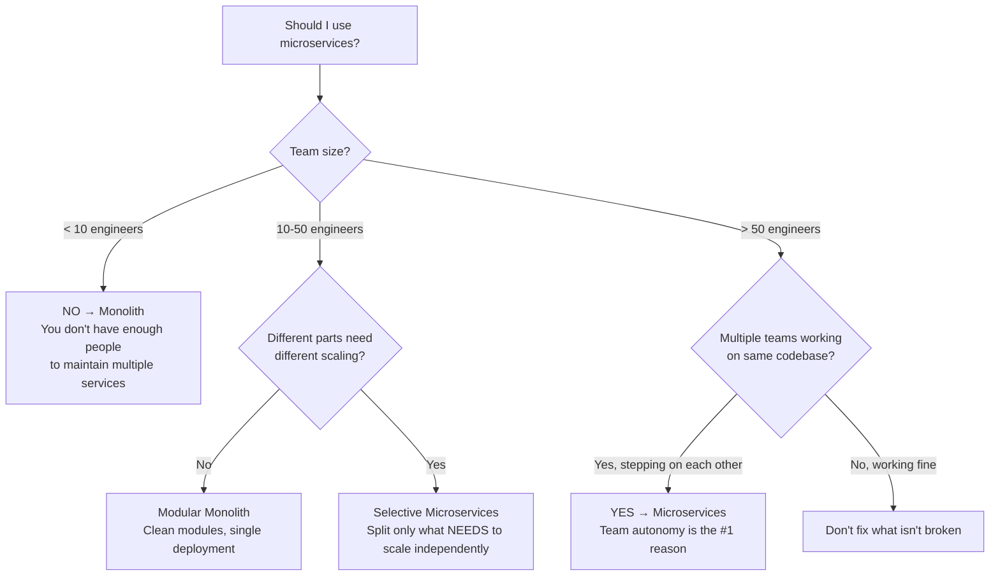
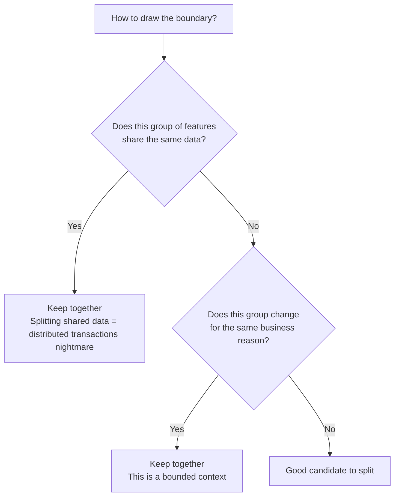
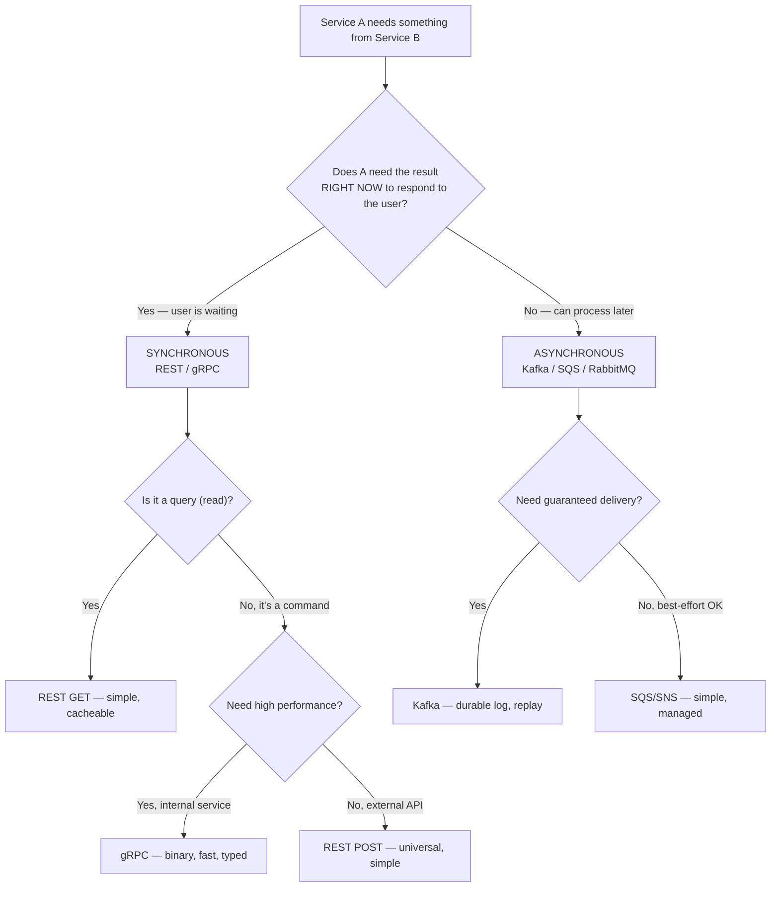
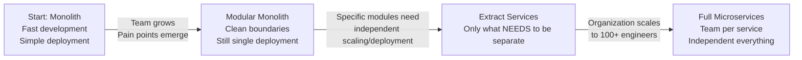

# How to Think in Microservices — When, Why, and How to Split

## Why This Tutorial Exists

Everyone knows microservices. Few understand WHEN to use them. The biggest mistake in the industry isn't building monoliths — it's splitting into microservices too early, for the wrong reasons. This tutorial teaches you the **decision-making framework** — so you can look at ANY system and know whether to split, what to split, and how to handle the consequences.

---

## The Core Question: Should You Even Use Microservices?

**Warning**: "Netflix uses microservices" is NOT a reason for YOUR startup to use them. Netflix has 2000+ engineers. They split because teams were blocking each other. If you have 5 engineers and split into 10 microservices, you've created 10x the operational overhead with 0x the benefit. **Microservices are an organizational solution, not a technical one.**

---

## The 5 Decision Frameworks for Microservices

### Framework 1: When to Split a Service

Don't split because "it feels too big." Split when you have a CONCRETE reason:

| Valid reason to split | Invalid reason to split |
|----------------------|------------------------|
| Two teams need to deploy independently | "The file is too long" |
| One part needs 100x more scaling than another | "Microservices are best practice" |
| One part needs a different tech stack | "Netflix does it" |
| One part changes weekly, another changes yearly | "It'll be easier to maintain" (it won't) |
| Failure in one part shouldn't crash the other | "We might need to scale someday" |

**Scenario**: Your e-commerce app has a product catalog (read-heavy, rarely changes) and an order system (write-heavy, changes daily). The catalog team deploys once a month. The order team deploys 5 times a day. Every order team deployment risks breaking the catalog.

**Decision**: Split into two services. The reason isn't "microservices are better" — it's that these two parts have **different change velocities and different scaling needs**. The catalog can be cached aggressively. The order system needs write optimization. Splitting lets each team optimize independently.

### Framework 2: How to Define Service Boundaries

**The Litmus Test**: If splitting two features would require a distributed transaction (2PC or Saga) for the COMMON case (not edge case), you've split wrong. Distributed transactions should be the exception, not the rule.

**Applying this** — User profile and user authentication should be ONE service (they share user data and change together). User profile and order history should be SEPARATE services (different data, different change reasons, different scaling needs). The boundary follows the DATA, not the UI.

### Framework 3: Sync vs Async Communication

🎯 **Interview Ready** — "How do you decide between sync and async?" → I ask one question: "Does the user need the result to see a response?" If yes → sync (REST/gRPC). If no → async (Kafka/queue). Example: "Place order" → user needs confirmation → sync call to payment service. "Send order confirmation email" → user doesn't wait for email → async event to notification service. The mistake is making everything sync (creates tight coupling and cascading failures) or everything async (adds complexity where it's not needed).

### Framework 4: Which Pattern Solves Which Problem

Don't memorize patterns. Recognize the PROBLEM:

| When you face this problem... | Use this pattern | Why THIS pattern |
|-------------------------------|-----------------|------------------|
| Service B is down, Service A keeps calling and failing | **Circuit Breaker** | Stop wasting resources on a dead service, fail fast, recover automatically |
| Need to update data across 3 services atomically | **Saga** | Distributed transactions without 2PC — each service does its part, compensates on failure |
| Read model is very different from write model | **CQRS** | Separate read/write databases — optimize each independently |
| Need to rebuild state from history | **Event Sourcing** | Store events, not state — replay to reconstruct any point in time |
| External clients need one API, but you have 10 services | **API Gateway** | Single entry point — routing, auth, rate limiting in one place |
| Services need to find each other dynamically | **Service Discovery** | Registry (Eureka/Consul) or DNS-based (K8s) — no hardcoded URLs |

### Framework 5: The "What Could Go Wrong" Checklist

For EVERY microservice design, ask:

| Failure mode | What happens? | How to handle? |
|-------------|--------------|----------------|
| Service B is down | Service A can't complete its work | Circuit breaker + fallback + retry with backoff |
| Network is slow | Requests timeout, users wait | Set aggressive timeouts (2-5 sec), async where possible |
| Database is overloaded | All services using it slow down | Each service owns its database (database per service) |
| Message queue loses a message | Data inconsistency | Kafka with replication, idempotent consumers |
| Deployment breaks one service | Cascading failure to dependents | Health checks, canary deployments, rollback automation |
| Data is inconsistent across services | User sees wrong information | Eventual consistency with reconciliation jobs |

**Scenario**: Order service calls Payment service. Payment service is slow (5 second response). Order service has 100 threads. Each thread is blocked waiting for Payment. In 20 seconds, all 100 threads are exhausted. Order service is now DOWN — not because it's broken, but because Payment is slow.

**This is a cascading failure.** Solution: Circuit breaker (Resilience4j) with 2-second timeout. After 5 failures, circuit opens — Order service returns "Payment processing, we'll confirm shortly" instead of hanging. This is WHY we use circuit breakers — not because it's a "best practice," but because without it, one slow service kills everything.

---

## The Monolith-First Approach — Why It's Usually Right

**Applying this** — In an interview, if the problem doesn't explicitly require microservices, say: "I'd start with a modular monolith with clean boundaries between modules. If we later find that the order module needs to scale independently or a separate team needs to own it, we can extract it into a service. The modular structure makes this extraction straightforward." This shows more maturity than jumping to microservices.

---

## 🎯 Interview Corner

**Q: "Your monolith is getting slow. Should you move to microservices?"**

Not necessarily. First, I'd diagnose WHY it's slow. Is it a database bottleneck? → Add caching, read replicas, or optimize queries. Is it CPU-bound? → Profile and optimize the hot path. Is it one module causing issues? → Extract ONLY that module. Microservices don't make code faster — they make it possible to scale parts independently. If the entire app is slow because of bad database queries, splitting into 10 services with the same bad queries just gives you 10 slow services. I'd fix the root cause first, then consider splitting only if different parts genuinely need different scaling strategies.

**Follow-up trap**: "But what about team velocity?" → That's a valid reason. If 5 teams are stepping on each other in the same codebase, microservices help by giving each team ownership. But the solution might also be a modular monolith with clear module ownership and separate CI pipelines per module. Microservices are ONE solution to the team coordination problem, not the only one.

**Q: "How do you handle data consistency across microservices?"**

Accept that strong consistency across services is impractical — it requires distributed transactions (2PC) which are slow and fragile. Instead, I design for eventual consistency with these tools: (1) **Saga pattern** for multi-service workflows — each service does its part and compensates on failure. (2) **Outbox pattern** for reliable event publishing — write to DB and outbox table in one transaction, a separate process publishes events from the outbox. (3) **Idempotent consumers** — if a message is delivered twice, the result is the same. (4) **Reconciliation jobs** — periodic background jobs that detect and fix inconsistencies. The key mindset shift: instead of preventing inconsistency (impossible in distributed systems), detect and resolve it quickly.

**Follow-up trap**: "What about the user experience during inconsistency?" → Show the user what you KNOW is true. "Order placed!" is true (order service confirmed). "Payment processing..." is honest (payment service hasn't confirmed yet). Don't show "Payment successful" until you actually know it is. Design the UI for eventual consistency.

**Q: "How do you decide the right size for a microservice?"**

There's no magic number of lines or classes. I use three heuristics: (1) **One team can own it** — if a service needs 3 teams to modify, it's too big. If one person maintains 5 services, they're too small. (2) **One business capability** — "Order Management" is a service. "Order Validation" alone is too granular — it's a module within Order Management. (3) **Independent deployability** — can I deploy this service without coordinating with other teams? If deploying Service A always requires deploying Service B simultaneously, they should be one service. The "two-pizza team" rule (Amazon) is a good proxy — if the team that owns the service can't be fed with two pizzas (~6-8 people), the service might be too big.

---

## Quick Reference

| Decision | Framework |
|----------|-----------|
| Monolith vs Microservices | Team size + scaling needs + change velocity |
| Where to draw boundaries | Shared data + same business reason = keep together |
| Sync vs Async | User waiting? → Sync. Can process later? → Async |
| Which pattern to use | Identify the PROBLEM first, pattern follows |
| How to handle failures | Circuit breaker + timeout + retry + fallback |
| Data consistency | Eventual consistency + Saga + Outbox + Reconciliation |

---

> **Microservices are not a goal. They're a tool. The goal is building software that's easy to change, easy to scale, and easy for teams to work on independently. Sometimes a monolith achieves that better than 50 microservices.**
