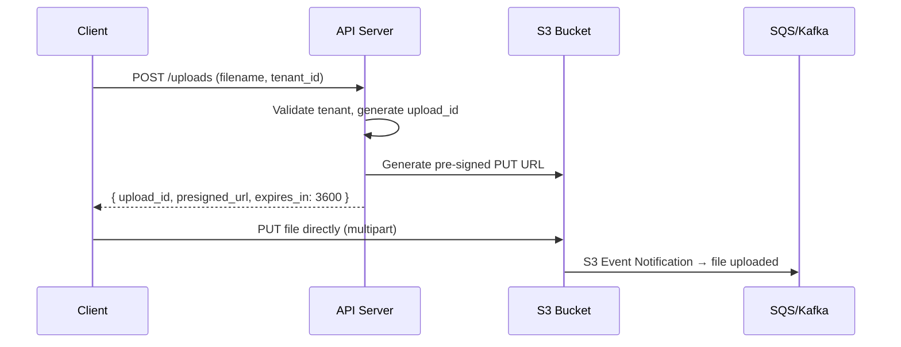
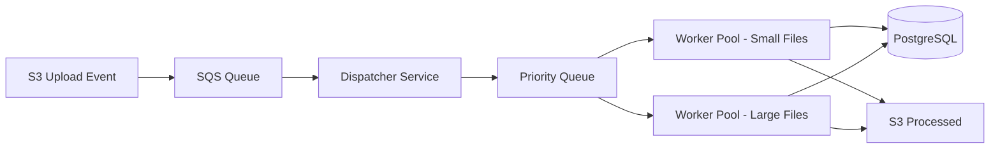
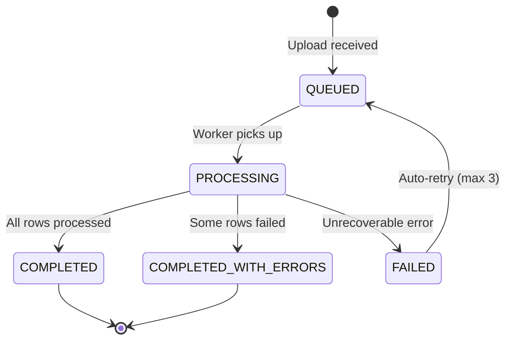
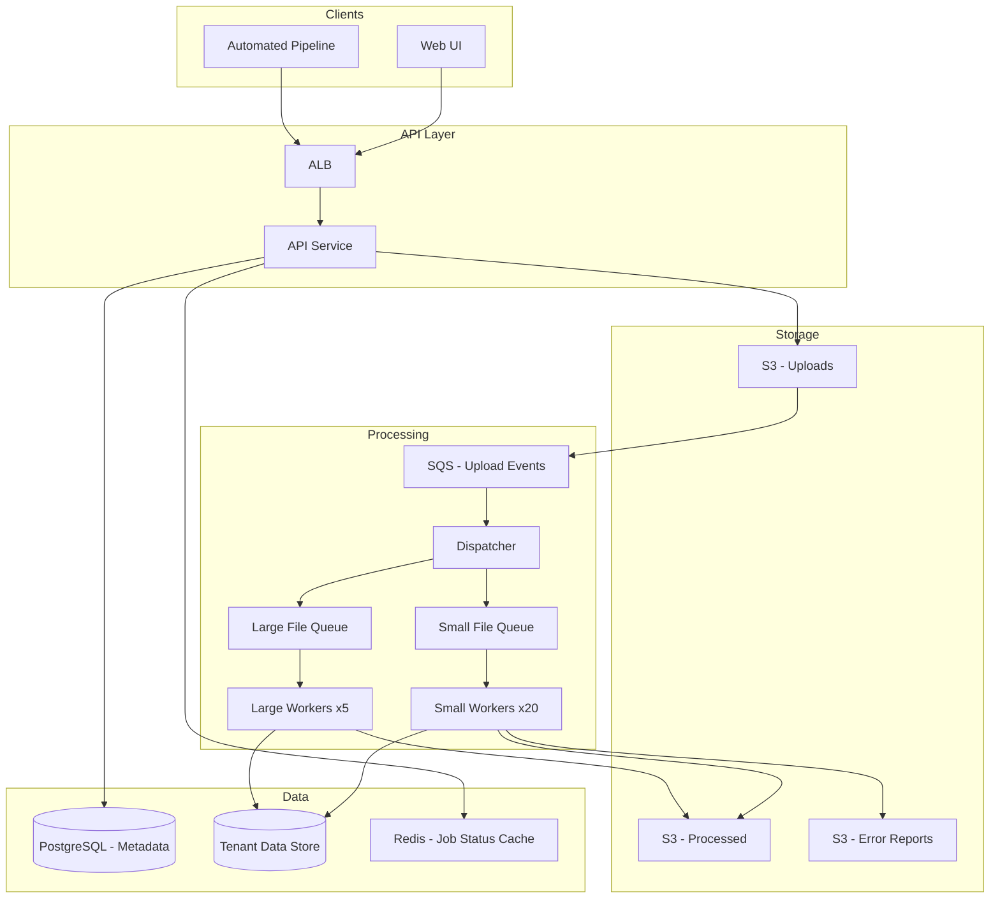

# Data Ingestion Platform

## The Problem — Real Scenario

Your company builds a SaaS analytics product. Customers (tenants) upload CSV files — some 10MB, some 5GB. Some upload manually via UI, others have automated pipelines pushing files every hour. You have 200 tenants today, growing to 2,000 next year.

**The hard parts:**
- Tenant A uploads a 4GB file. Tenant B uploads a 50KB file at the same time. Tenant B shouldn't wait 20 minutes.
- 15 tenants trigger automated uploads at midnight. All 15 hit your system simultaneously.
- One tenant's malformed CSV shouldn't crash processing for everyone.
- You need to track: who uploaded what, when, processing status, row-level errors.

---

## Step 1 — Upload Path

### Why NOT direct upload to your API server?

```
❌ Client → API Server → Write to disk → Process
```

If a 4GB file hits your API server, it holds a thread/connection for minutes. 10 concurrent uploads = your API is unresponsive.

### The right approach: Pre-signed URL upload to S3

```
Client → API Server (get pre-signed URL) → Client uploads directly to S3
```



<div class="callout-tip">

**Applying this** — Pre-signed URLs mean your API server never touches the file bytes. S3 handles multipart upload, resumability, and bandwidth. Your API stays lightweight — it just issues tokens and tracks metadata.

</div>

### Decision: S3 Multipart Upload

For files > 100MB, use S3 multipart upload:
- File is split into 5MB–5GB parts
- Parts upload in parallel
- If one part fails, retry just that part
- Client can resume after network failure

```java
// API generates pre-signed URL with conditions
PutObjectPresignRequest presignRequest = PutObjectPresignRequest.builder()
    .signatureDuration(Duration.ofHours(1))
    .putObjectRequest(b -> b
        .bucket("tenant-uploads")
        .key(tenantId + "/" + uploadId + "/" + filename)
        .contentLengthRange(1, 5_368_709_120L) // max 5GB
    )
    .build();
```

### Tenant Isolation in Storage

```
s3://data-ingestion-uploads/
  ├── tenant-001/
  │   ├── upload-abc123/
  │   │   └── transactions-2024.csv
  │   └── upload-def456/
  │       └── customers.csv
  ├── tenant-002/
  │   └── ...
```

Each tenant gets a prefix. S3 bucket policies restrict access per tenant. No tenant can see another's files.

---

## Step 2 — Processing Pipeline

### The Event-Driven Architecture

When S3 receives a file, it fires an event. This triggers the processing pipeline.



### Why separate worker pools?

| Pool | File Size | Workers | Timeout | Memory |
|------|-----------|---------|---------|--------|
| Small | < 100MB | 20 | 5 min | 512MB |
| Large | > 100MB | 5 | 60 min | 4GB |

<div class="callout-scenario">

**Scenario**: Without separation, a 4GB file occupies a worker for 30 minutes. If you have 10 workers and 3 large files arrive, 30% of your capacity is locked. Small files queue up behind them. With separate pools, small files always have dedicated workers.

</div>

### The Dispatcher Logic

```java
@Service
public class UploadDispatcher {

    @SqsListener("file-upload-events")
    public void handleUploadEvent(S3EventNotification event) {
        String key = event.getRecords().get(0).getS3().getObject().getKey();
        long size = event.getRecords().get(0).getS3().getObject().getSizeBytes();
        String tenantId = extractTenantId(key);

        // Check tenant's concurrent processing limit
        int activeJobs = jobRepository.countActiveByTenant(tenantId);
        if (activeJobs >= tenantConcurrencyLimit(tenantId)) {
            // Re-queue with delay — tenant is at capacity
            sqsClient.sendMessage(b -> b
                .queueUrl(QUEUE_URL)
                .messageBody(event.toJson())
                .delaySeconds(30)
            );
            return;
        }

        ProcessingJob job = ProcessingJob.builder()
            .tenantId(tenantId)
            .s3Key(key)
            .fileSize(size)
            .status(JobStatus.QUEUED)
            .build();

        jobRepository.save(job);

        // Route to appropriate worker pool
        String targetQueue = size > 100_000_000 ? "large-file-queue" : "small-file-queue";
        sqsClient.sendMessage(b -> b.queueUrl(targetQueue).messageBody(job.getId()));
    }
}
```

---

## Step 3 — Processing the CSV

### Streaming, Not Loading

```
❌ Read entire 4GB CSV into memory → Parse → Write to DB
✅ Stream line by line → Batch inserts → Checkpoint progress
```

```java
@Service
public class CsvProcessor {

    private static final int BATCH_SIZE = 5000;

    public ProcessingResult process(ProcessingJob job) {
        S3Object s3Object = s3Client.getObject(b -> b.bucket(BUCKET).key(job.getS3Key()));

        long totalRows = 0, errorRows = 0;
        List<ParsedRow> batch = new ArrayList<>(BATCH_SIZE);
        List<RowError> errors = new ArrayList<>();

        try (BufferedReader reader = new BufferedReader(
                new InputStreamReader(s3Object, StandardCharsets.UTF_8))) {

            String[] headers = parseCsvLine(reader.readLine());
            String line;

            while ((line = reader.readLine()) != null) {
                totalRows++;
                try {
                    ParsedRow row = parseAndValidate(headers, line, totalRows);
                    batch.add(row);

                    if (batch.size() >= BATCH_SIZE) {
                        writeBatch(job.getTenantId(), batch);
                        batch.clear();
                        updateProgress(job, totalRows);
                    }
                } catch (ValidationException e) {
                    errorRows++;
                    errors.add(new RowError(totalRows, e.getMessage()));
                }
            }

            // Flush remaining
            if (!batch.isEmpty()) {
                writeBatch(job.getTenantId(), batch);
            }
        }

        return new ProcessingResult(totalRows, errorRows, errors);
    }
}
```

### Why batch inserts of 5,000?

| Batch Size | Insert Time (100K rows) | DB Connections |
|-----------|------------------------|----------------|
| 1 (row by row) | 180 seconds | 1 held entire time |
| 100 | 12 seconds | 1 held entire time |
| 5,000 | 3.2 seconds | 1, released between batches |
| 50,000 | 2.8 seconds | High memory, risk of timeout |

5,000 is the sweet spot — fast enough, low memory, and you can checkpoint progress between batches.

---

## Step 4 — Multi-Tenant Fairness

### The Problem

Tenant A has a paid "Enterprise" plan. Tenant B is on "Free". Both upload at the same time. How do you ensure:
- Enterprise gets priority?
- Free tier doesn't starve?
- No single tenant monopolizes the system?

### Weighted Fair Queue

```java
public class TenantPriorityCalculator {

    public int calculatePriority(String tenantId, long fileSize) {
        TenantPlan plan = tenantService.getPlan(tenantId);
        int activeJobs = jobRepository.countActiveByTenant(tenantId);

        int basePriority = switch (plan) {
            case ENTERPRISE -> 1;   // highest
            case PROFESSIONAL -> 3;
            case FREE -> 5;         // lowest
        };

        // Penalize tenants with many active jobs (fairness)
        int concurrencyPenalty = activeJobs * 2;

        // Bonus for small files (they finish fast, don't block)
        int sizeBonus = fileSize < 10_000_000 ? -1 : 0;

        return basePriority + concurrencyPenalty + sizeBonus;
    }
}
```

### Concurrency Limits Per Tenant

| Plan | Max Concurrent Jobs | Max File Size | Rate Limit |
|------|-------------------|---------------|------------|
| Free | 2 | 500MB | 10 uploads/hour |
| Professional | 10 | 2GB | 100 uploads/hour |
| Enterprise | 50 | 5GB | Unlimited |

<div class="callout-tip">

**Applying this** — Concurrency limits prevent a single tenant from consuming all workers. The weighted queue ensures Enterprise tenants get faster processing without completely starving Free tenants. Small files get a priority bonus because they free up workers quickly.

</div>

---

## Step 5 — Error Handling & Observability

### Row-Level Error Tracking

Not every row in a CSV will be valid. You need to:
- Continue processing despite errors
- Report exactly which rows failed and why
- Let the tenant download an error report

```json
{
  "upload_id": "abc-123",
  "status": "COMPLETED_WITH_ERRORS",
  "total_rows": 1500000,
  "processed_rows": 1499847,
  "error_rows": 153,
  "error_report_url": "s3://reports/tenant-001/abc-123/errors.csv",
  "errors_sample": [
    { "row": 4521, "field": "email", "error": "Invalid email format" },
    { "row": 8903, "field": "amount", "error": "Negative value not allowed" }
  ]
}
```

### Job Status State Machine



---

## Step 6 — The Complete Architecture



### Why these technology choices?

| Component | Choice | Why |
|-----------|--------|-----|
| Upload storage | S3 | Unlimited scale, multipart upload, event notifications, cheap |
| Event queue | SQS | Managed, dead-letter queues, delay support, no ops overhead |
| Worker compute | ECS Fargate | Auto-scaling per queue depth, no server management |
| Metadata DB | PostgreSQL | ACID for job tracking, tenant metadata, relational queries |
| Tenant data | PostgreSQL (schema-per-tenant) | Isolation, familiar tooling, can migrate to dedicated DB later |
| Job status cache | Redis | Sub-ms reads for status polling, TTL for auto-cleanup |

<div class="callout-interview">

**🎯 Interview Ready** — "How would you handle a tenant uploading a 5GB file while 50 other tenants are uploading small files?" → Pre-signed URL to S3 (API never touches bytes), separate worker pools for large/small files, per-tenant concurrency limits, weighted priority queue. The key insight: decouple upload from processing, and never let one tenant's workload affect another's experience.

</div>

---

## Scaling Decisions

### When to scale what?

| Signal | Action |
|--------|--------|
| SQS queue depth > 100 for 5 min | Add more workers (ECS auto-scaling) |
| Average processing time > 2x baseline | Check for hot tenant, add workers |
| S3 PUT latency > 500ms | Check region, enable transfer acceleration |
| PostgreSQL connections > 80% | Add read replicas, or switch to connection pooling (PgBouncer) |
| Single tenant > 40% of all jobs | Throttle tenant, notify account team |

### Cost Optimization

- **Spot instances** for large file workers (they're fault-tolerant — jobs retry on failure)
- **S3 Intelligent-Tiering** for processed files (most are accessed once then rarely)
- **Reserved capacity** for small file workers (always running, predictable load)
- **SQS long polling** to reduce empty receives (cost per request)

<div class="callout-tip">

**Applying this** — The entire design follows one principle: **isolate the blast radius**. Tenant isolation in storage, separate worker pools by file size, per-tenant concurrency limits, and independent scaling per queue. Any single failure affects only one tenant's one upload — never the system.

</div>
