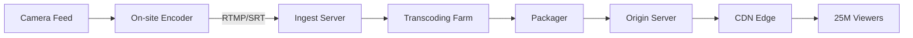
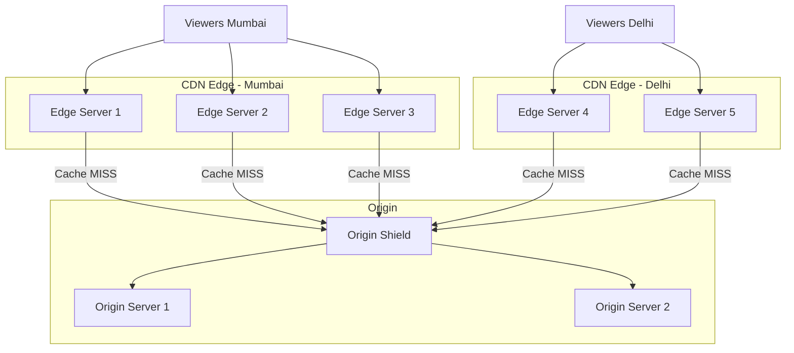
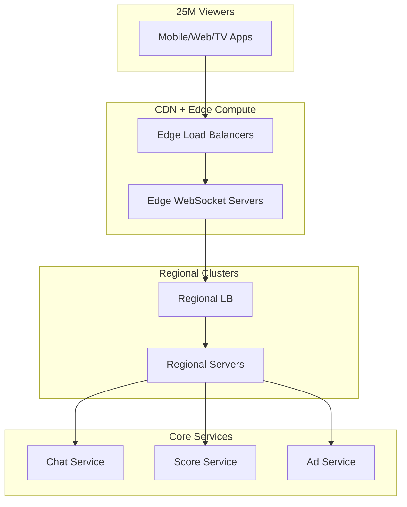
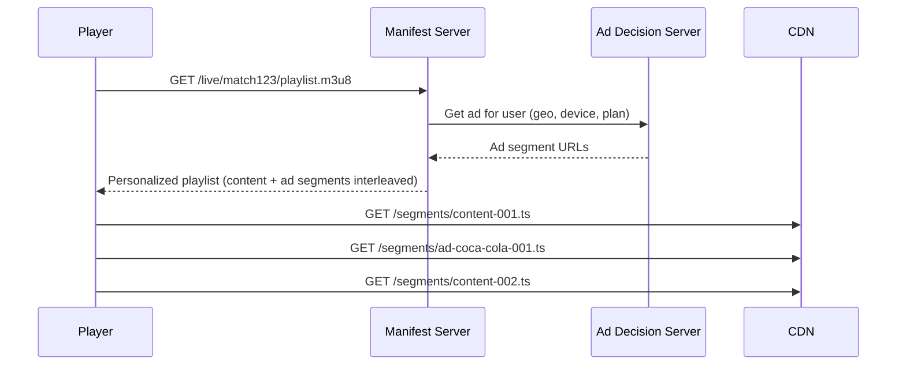
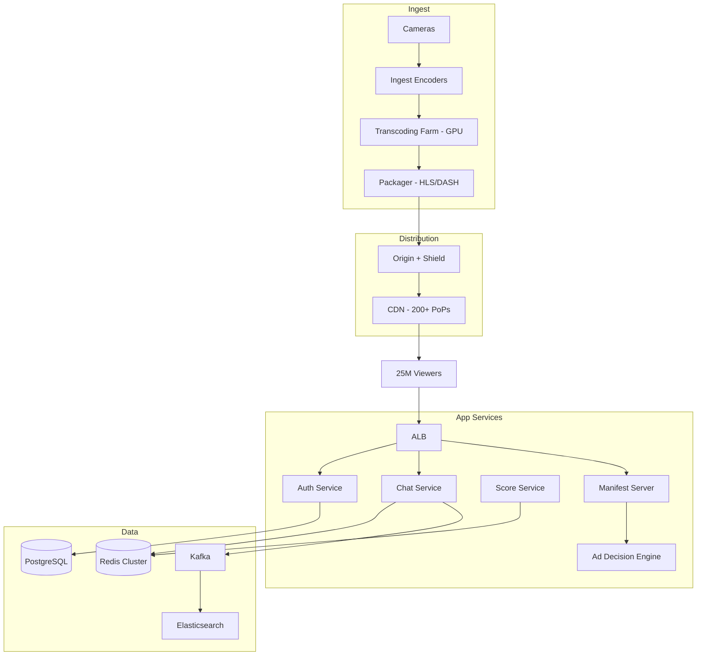

# Live Streaming Platform — HotStar Scale

## The Problem

IPL final. 25 million concurrent viewers. Each viewer's device requests a new video segment every 2-4 seconds. That's **~10 million requests per second** just for video. Add live chat, real-time scores, ads, and authentication — you're looking at 30-50 million RPS.

Your system cannot buffer. Cannot lag. Cannot crash. If it goes down for 30 seconds during a wicket, it's national news.

---

## The Numbers That Drive Every Decision

| Metric | Value | Impact |
|--------|-------|--------|
| Concurrent viewers | 25 million | Connection handling, state management |
| Video segment requests | ~10M RPS | CDN capacity, origin shielding |
| Segment duration | 2-4 seconds | Latency budget, cache TTL |
| Bitrate variants | 6 (240p to 4K) | Storage multiplier, transcoding cost |
| Live chat messages | ~500K/sec | WebSocket connections, fan-out |
| Glass-to-glass latency target | < 30 seconds | Encoding pipeline speed |

---

## Step 1 — Video Ingest & Transcoding

### From Camera to Segments



### Why HLS over DASH?

| Protocol | Apple Devices | Android | Browser | Latency |
|----------|--------------|---------|---------|---------|
| HLS | ✅ Native | ✅ ExoPlayer | ✅ hls.js | 6-30s |
| DASH | ❌ No | ✅ Native | ✅ dash.js | 6-30s |
| LL-HLS | ✅ Native | ✅ | ✅ | 2-5s |

HLS wins because of Apple device support (40%+ of premium users). Low-Latency HLS (LL-HLS) gets you close to real-time.

### Adaptive Bitrate Ladder

```
4K    — 16 Mbps  — For smart TVs on fiber
1080p — 8 Mbps   — Desktop, good WiFi
720p  — 4 Mbps   — Mobile on WiFi
480p  — 2 Mbps   — Mobile on 4G
360p  — 1 Mbps   — Slow connections
240p  — 500 Kbps — Edge cases, 3G
```

The player automatically switches between these based on available bandwidth. No buffering — just lower quality.

<div class="callout-tip">

**Applying this** — You don't choose one quality. You encode ALL of them simultaneously. The player decides. This is why transcoding is the most expensive part of the pipeline — every second of live video becomes 6 parallel encoding jobs.

</div>

---

## Step 2 — CDN Architecture

### Why CDN is 95% of the Solution

Without CDN: 10M RPS hitting your origin servers. You'd need thousands of servers.

With CDN: 10M RPS hitting 200+ edge locations worldwide. Your origin handles maybe 50K RPS (0.5%).



### Origin Shield — The Critical Layer

Without origin shield: Every edge location independently requests segments from origin. 200 edge locations × cache miss = 200 requests to origin for the same segment.

With origin shield: One intermediate cache layer. Edge → Shield → Origin. Shield caches the segment, serves all edges. Origin sees 1 request instead of 200.

### Cache TTL Strategy for Live Content

```
Video segments (past)     → Cache 24 hours (they never change)
Video segments (current)  → Cache 2 seconds (matches segment duration)
Manifest/playlist file    → Cache 1 second (must update frequently)
Static assets (logos, UI) → Cache 30 days
```

<div class="callout-scenario">

**Scenario**: During IPL final, a wicket falls. 25M viewers are watching the same 2-second segment. CDN serves it from edge cache. Your origin server doesn't even know 25M people just watched that wicket — it served the segment once to the CDN.

</div>

---

## Step 3 — Handling 25 Million Connections

### Connection Architecture

You can't maintain 25M persistent connections to one server. You need a tiered approach.



### Per-Server Connection Limits

| Component | Connections per instance | Instances | Total capacity |
|-----------|------------------------|-----------|----------------|
| Edge WebSocket | 100K | 300 | 30M |
| Regional server | 10K | 100 | 1M (aggregated) |
| Core service | 1K | 50 | 50K |

The key: **fan-out at the edge, aggregate toward the core**. 25M viewers → 300 edge servers → 100 regional servers → 50 core servers.

---

## Step 4 — Live Chat at Scale

500K messages per second. Every message needs to reach relevant viewers within 1 second.

### Why NOT broadcast every message to every viewer?

25M viewers × 500K messages/sec = 12.5 trillion deliveries per second. Impossible.

### The Solution: Chat Rooms + Sampling

```
Match: IND vs AUS
├── Room: Hindi-General (500K viewers, show 1 in 50 messages)
├── Room: English-General (300K viewers, show 1 in 30 messages)
├── Room: Hindi-Mumbai (50K viewers, show 1 in 5 messages)
├── Room: Premium-All (10K viewers, show all messages)
└── ... 200+ rooms
```

Each viewer sees ~10-20 messages/second (curated). The system processes 500K/sec but delivers a sampled, relevant subset.

```java
public class ChatRouter {

    public void routeMessage(ChatMessage msg) {
        String roomId = msg.getRoomId();
        List<String> subscriberShards = roomRegistry.getShards(roomId);

        // Publish to Redis Pub/Sub per shard
        for (String shard : subscriberShards) {
            redisTemplate.convertAndSend("chat:" + shard, msg);
        }
    }
}
```

<div class="callout-tip">

**Applying this** — You never solve "deliver every message to every user." You solve "deliver the right messages to the right users." Chat rooms, sampling, and relevance filtering reduce the fan-out by 100-1000x.

</div>

---

## Step 5 — Ad Insertion

### Server-Side Ad Insertion (SSAI)

Why server-side? Client-side ad insertion gets blocked by ad blockers. SSAI stitches ads directly into the video stream — the player can't tell the difference between content and ads.



Each viewer gets a **personalized manifest** — same match, different ads. This is how you monetize 25M viewers with targeted advertising.

---

## Step 6 — Complete Architecture



### Technology Choices & Why

| Component | Choice | Why NOT alternatives |
|-----------|--------|---------------------|
| Video delivery | CloudFront + custom origin | Global PoPs, origin shield, Lambda@Edge for manifest |
| Transcoding | EC2 GPU instances (g4dn) | MediaConvert too slow for live, need sub-second encoding |
| Chat pub/sub | Redis Cluster | Kafka too high latency for real-time chat, Redis < 1ms |
| Chat persistence | Kafka → Elasticsearch | Kafka for durability, ES for search/replay |
| Ad decisions | Custom service + Redis | Sub-10ms decision needed, pre-computed targeting in Redis |
| Auth | Cognito + JWT | Stateless verification at edge, no DB call per request |
| Score updates | Redis Pub/Sub | Push-based, sub-second propagation to all edge servers |

<div class="callout-interview">

**🎯 Interview Ready** — "How would you handle 25M concurrent viewers?" → The answer is NOT "add more servers." It's: (1) CDN serves 99.5% of video requests — origin barely touched, (2) Origin shield prevents thundering herd, (3) Edge compute handles WebSocket connections — fan-out at edge, aggregate at core, (4) Chat uses rooms + sampling — never broadcast everything to everyone, (5) Personalized ad manifests per viewer — SSAI, not client-side.

</div>

---

## Failure Scenarios & Mitigations

| Failure | Impact | Mitigation |
|---------|--------|------------|
| Origin server down | CDN serves stale segments for 2-4 sec | Multi-AZ origin, health checks, auto-failover |
| CDN edge down | Viewers in that region buffer | Multi-CDN strategy (CloudFront + Akamai) |
| Transcoder crash | Stream freezes | Hot standby transcoders, auto-restart < 3 sec |
| Chat service overload | Messages delayed | Shed load — increase sampling ratio, drop non-premium |
| Database down | New signups fail | Auth is JWT-based, existing viewers unaffected |

<div class="callout-tip">

**Applying this** — At this scale, you design for failure, not against it. Every component has a degraded mode. Video continues even if chat dies. Chat continues even if ads fail. The match never stops because a supporting service crashed.

</div>
