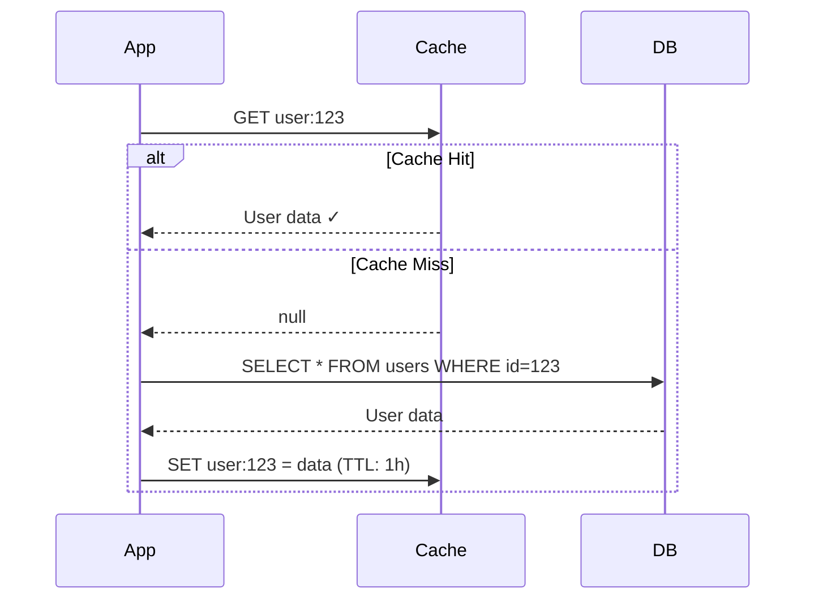
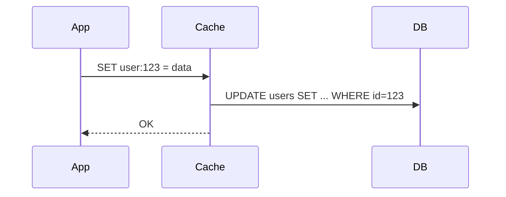
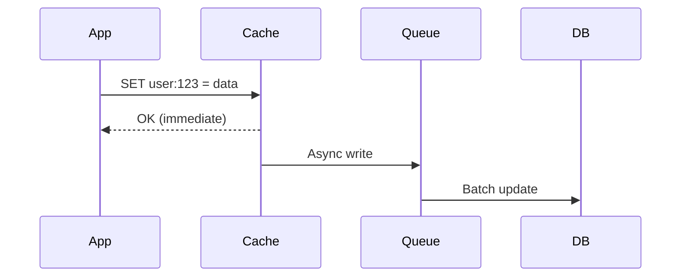
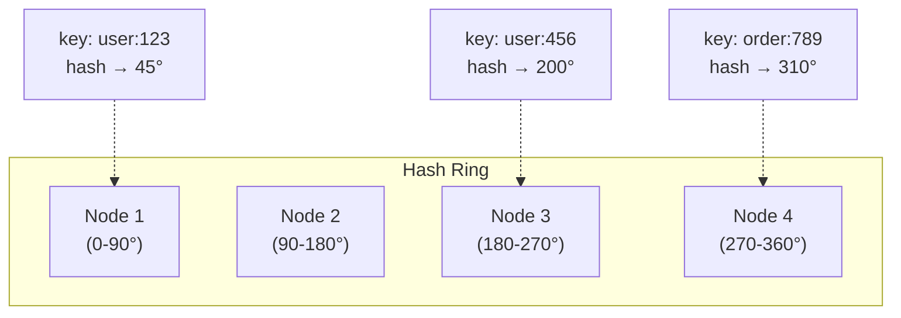
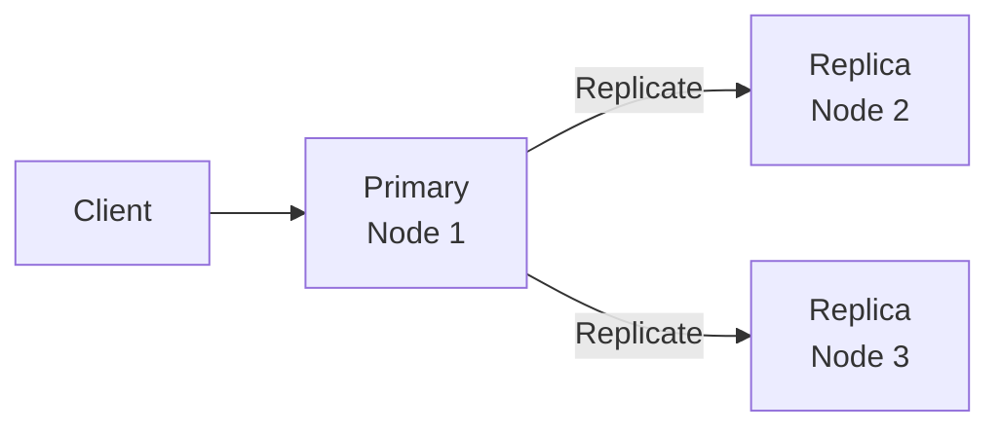

# Distributed Cache — Complete System Design

## The Analogy

Imagine a **library** (database) and a **desk** (cache). Every time you need a book, walking to the library takes 5 minutes. But if you keep frequently-used books on your desk, you grab them in 2 seconds.

A cache is that desk — but for millions of users, you need a **really big, shared desk** that everyone can access fast.

---

## 1. Why Cache?

| Without Cache | With Cache |
|--------------|-----------|
| DB query: ~10-50ms | Cache read: ~1-2ms |
| DB handles all traffic | DB handles only cache misses |
| DB becomes bottleneck | DB is protected |
| Scale DB (expensive) | Scale cache (cheap) |

---

## 2. Caching Strategies

### Cache-Aside (Lazy Loading) — Most Common



- **App** is responsible for loading cache
- **Pros**: Only caches what's actually requested
- **Cons**: First request is always slow (cache miss)

### Write-Through



- Every write goes through cache to DB
- **Pros**: Cache is always up-to-date
- **Cons**: Write latency increases, caches data that may never be read

### Write-Behind (Write-Back)



- Write to cache immediately, async write to DB
- **Pros**: Super fast writes
- **Cons**: Data loss risk if cache crashes before DB write

---

## 3. Eviction Policies

When cache is full, what do you remove?

| Policy | How It Works | Best For |
|--------|-------------|----------|
| **LRU** (Least Recently Used) | Remove what hasn't been accessed longest | General purpose |
| **LFU** (Least Frequently Used) | Remove what's accessed least often | Stable access patterns |
| **TTL** (Time To Live) | Remove after fixed time | Data that expires |
| **FIFO** | Remove oldest entry | Simple, predictable |
| **Random** | Remove random entry | When nothing else matters |

### LRU Implementation Idea

```
Access order: A, B, C, D, A, E (capacity = 4)

After A,B,C,D: [D, C, B, A]  (most recent first)
Access A:      [A, D, C, B]  (A moves to front)
Add E:         [E, A, D, C]  (B evicted — least recently used)
```

---

## 4. Distributed Cache Architecture

### Consistent Hashing — How to Distribute Keys



- Keys are hashed to a position on a ring
- Each node owns a range of the ring
- **Adding/removing a node** only affects neighboring keys (not all keys!)

### Replication



- Write to primary, replicate to N replicas
- Read from any replica (faster, but might be stale)

---

## 5. Cache Invalidation — The Hard Problem

> "There are only two hard things in Computer Science: cache invalidation and naming things." — Phil Karlton

### Strategies

| Strategy | How | Trade-off |
|----------|-----|-----------|
| **TTL-based** | Key expires after N seconds | Simple but stale data possible |
| **Event-based** | DB change → invalidate cache | Accurate but complex |
| **Version-based** | Key includes version: `user:123:v5` | No invalidation needed |

### Scenario: User updates their profile

```java
// Option 1: Delete from cache (next read will reload)
public void updateProfile(User user) {
    userRepository.save(user);
    cache.delete("user:" + user.getId());
}

// Option 2: Update cache immediately
public void updateProfile(User user) {
    userRepository.save(user);
    cache.set("user:" + user.getId(), user, Duration.ofHours(1));
}
```

---

## 6. Common Problems

### Cache Stampede (Thundering Herd)

**Problem**: Popular key expires → 1000 requests simultaneously hit DB

**Solution**: Locking

```java
public User getUser(Long id) {
    String key = "user:" + id;
    User cached = cache.get(key);
    if (cached != null) return cached;

    // Only ONE thread fetches from DB
    String lockKey = "lock:" + key;
    if (cache.setIfAbsent(lockKey, "1", Duration.ofSeconds(5))) {
        try {
            User user = db.findById(id);
            cache.set(key, user, Duration.ofHours(1));
            return user;
        } finally {
            cache.delete(lockKey);
        }
    }
    // Other threads wait and retry
    Thread.sleep(50);
    return getUser(id);
}
```

### Cache Penetration

**Problem**: Requests for keys that **don't exist** in DB always miss cache → DB hammered

**Solution**: Cache null results

```java
User user = db.findById(id);
if (user == null) {
    cache.set(key, NULL_MARKER, Duration.ofMinutes(5));  // cache the "not found"
}
```

### Cache Avalanche

**Problem**: Many keys expire at the same time → massive DB load

**Solution**: Add random jitter to TTL

```java
int baseTTL = 3600;  // 1 hour
int jitter = random.nextInt(300);  // 0-5 minutes random
cache.set(key, value, Duration.ofSeconds(baseTTL + jitter));
```

---

## 7. Redis — The Go-To Cache

```bash
# Basic operations
SET user:123 '{"name":"Alice"}' EX 3600    # set with 1h TTL
GET user:123                                 # get
DEL user:123                                 # delete

# Atomic operations
INCR page:views:homepage                     # atomic counter
SETNX lock:resource "owner"                  # set if not exists (distributed lock)

# Data structures
HSET user:123 name "Alice" age 30           # hash (like a mini-object)
LPUSH queue:tasks "task1"                    # list (queue)
SADD online:users "user:123"                # set (unique members)
ZADD leaderboard 100 "Alice"                # sorted set (rankings)
```

---

## 8. Summary

| Aspect | Decision |
|--------|----------|
| Strategy | Cache-aside for reads, write-through for critical data |
| Eviction | LRU with TTL |
| Distribution | Consistent hashing |
| Replication | Primary + 2 replicas |
| Invalidation | TTL + event-based for critical data |
| Technology | Redis Cluster |

---

---

## 🎯 Interview Corner

<div class="callout-interview">

**Q: "Walk me through the caching strategies. When would you use cache-aside vs write-through?"**

Cache-aside (lazy loading): application checks cache first, on miss loads from DB and populates cache. Best for read-heavy workloads where not all data is accessed — you only cache what's actually requested. Write-through: every write goes through cache to DB. Cache is always up-to-date, but you cache data that may never be read, and writes are slower (two writes). Write-behind: write to cache immediately, async write to DB later. Fastest writes, but risk of data loss if cache crashes before DB write. In practice, I use cache-aside for most read-heavy services (user profiles, product catalogs) and write-through only for data that's read immediately after write (session data, shopping carts).

</div>

<div class="callout-interview">

**Q: "What's cache stampede and how do you prevent it?"**

Cache stampede (thundering herd): a popular cache key expires, and hundreds of concurrent requests simultaneously miss the cache and hit the database. The DB gets overwhelmed. Three solutions: (1) Locking — only one thread fetches from DB, others wait for the cache to be populated. (2) Early refresh — refresh the cache before it expires (background thread refreshes at 80% of TTL). (3) Stale-while-revalidate — serve stale data while refreshing in the background. I prefer locking with a short timeout for critical paths, and early refresh for high-traffic keys.

**Follow-up trap**: "What about cache penetration?" → That's when requests come for keys that don't exist in the DB either — every request misses cache AND DB. Solution: cache the null result with a short TTL, or use a Bloom filter to reject keys that definitely don't exist.

</div>

<div class="callout-interview">

**Q: "How does consistent hashing work in a distributed cache?"**

Keys and cache nodes are both hashed onto a ring (0 to 2^32). Each key is assigned to the next node clockwise on the ring. When you add or remove a node, only the keys between the removed/added node and its predecessor are affected — not all keys. Without consistent hashing, adding a node to a 4-node cluster would invalidate ~75% of keys (hash % 4 ≠ hash % 5). With consistent hashing, only ~25% of keys move. Virtual nodes improve distribution: each physical node gets multiple positions on the ring, preventing hotspots when nodes are unevenly spaced.

</div>

<div class="callout-interview">

**Q: "Design a caching layer for a social media feed that serves 100K RPS."**

Multi-layer caching. L1: local in-memory cache (Caffeine) on each app server for the hottest data — zero network hop, sub-microsecond reads. L2: distributed Redis cluster for shared cache across all servers. For the feed, pre-compute and cache the feed per user on write (fan-out on write for users with < 1000 followers). For celebrity users (millions of followers), compute the feed on read (fan-out on read) and cache the result with a short TTL. Use Redis sorted sets for the feed (score = timestamp). Invalidation: when a user posts, invalidate their followers' cached feeds. TTL as a safety net — even if invalidation fails, stale data expires.

</div>

<div class="callout-tip">

**Applying this** — In system design interviews, always discuss: (1) what to cache (hot data, expensive queries), (2) caching strategy (cache-aside for reads), (3) invalidation approach (TTL + event-based), (4) failure mode (what happens if cache is down — system must still work, just slower), (5) consistency trade-off (stale data acceptable for how long?).

</div>

---

> **Remember**: A cache is not a database. It's a **performance optimization**. Your system must work correctly even if the cache disappears entirely. Design for cache failure, not just cache hits.
