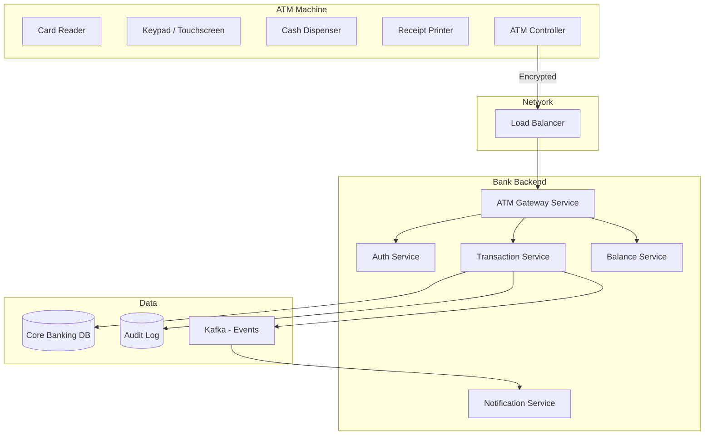
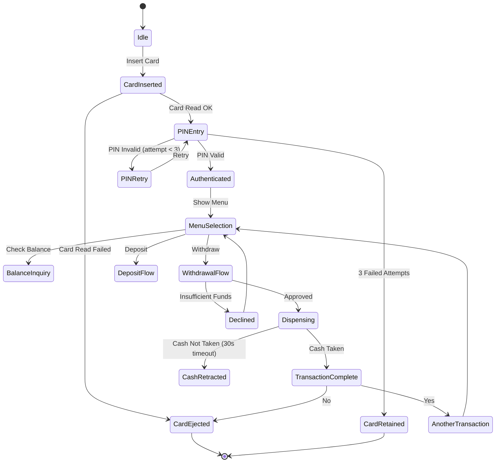
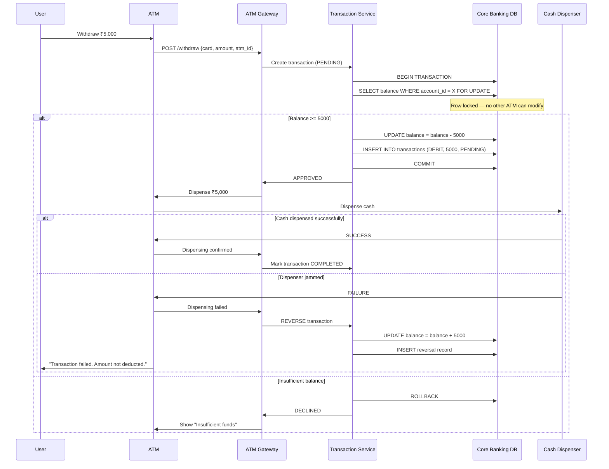
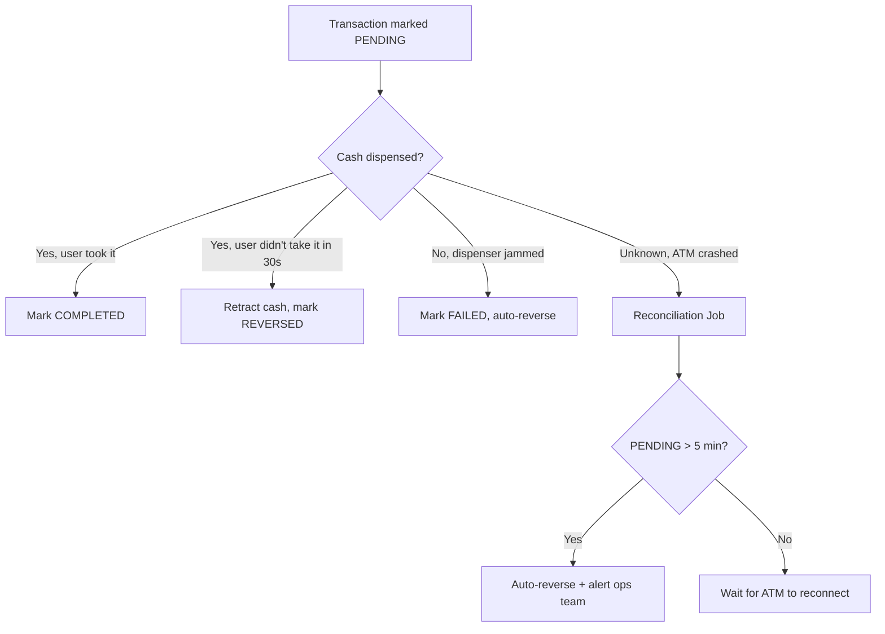
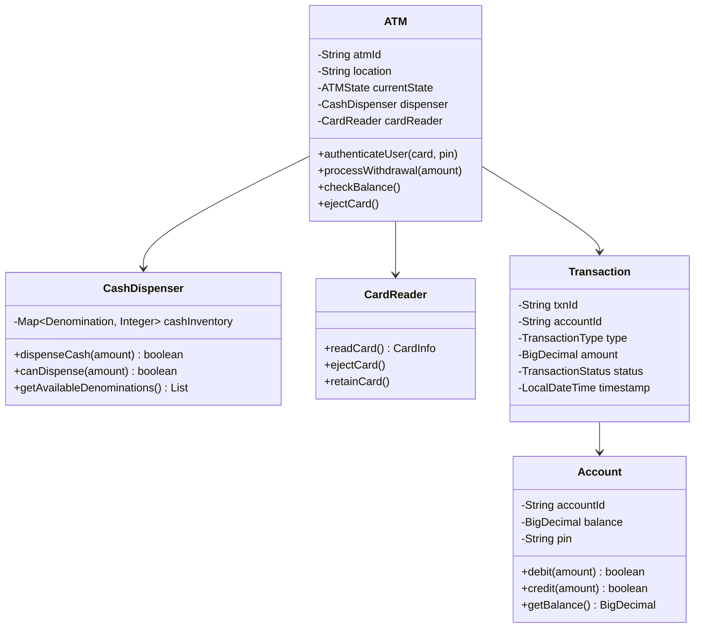

# Design ATM System — The Vending Machine With Trust Issues

## The Vending Machine Analogy

An ATM is like a vending machine — but instead of snacks, it dispenses cash. And instead of trusting you with a coin, it needs to verify your identity, check your bank balance, ensure the cash drawer has enough money, record every transaction, and handle the case where the machine jams mid-dispensing. Oh, and it must do all this while being offline-resilient, tamper-proof, and available 24/7.

---

## 1. Requirements

### Functional
- Authenticate user via card + 4-digit PIN
- Check account balance
- Withdraw cash (with denomination selection)
- Deposit cash/checks
- Transfer between accounts
- Print mini-statement / receipt

### Non-Functional
- **Availability**: 99.99% — ATMs must work 24/7
- **Security**: Encrypted communication, tamper detection
- **Consistency**: Account balance must be accurate (no double-dispensing)
- **Offline resilience**: Handle temporary network failures gracefully
- **Concurrency**: One transaction per ATM at a time, but millions of ATMs globally

---

## 2. High-Level Architecture



---

## 3. ATM State Machine — The Heart of the Design

Every ATM transaction follows a strict state machine:



<div class="callout-info">

**Key insight**: The state machine ensures the ATM can NEVER be in an ambiguous state. Every possible scenario (timeout, failure, user abandonment) has a defined transition. This is critical for financial systems.

</div>

---

## 4. The Withdrawal Flow — Where It Gets Tricky



<div class="callout-warn">

**Warning**: The most dangerous scenario is: money deducted from account BUT cash not dispensed. This is why the transaction is marked PENDING until the dispenser confirms. If dispensing fails, an automatic reversal kicks in. If the ATM crashes mid-dispensing, a reconciliation job detects PENDING transactions older than 5 minutes and reverses them.

</div>

---

## 5. Handling the "Money Deducted But Not Received" Problem

This is the #1 customer complaint. Here's how to handle it:



<div class="callout-scenario">

**Scenario**: User withdraws ₹10,000. Bank deducts the amount. ATM dispenser jams after dispensing only ₹5,000. **Decision**: The ATM detects partial dispensing via cash counter sensors. It reports to the gateway: "Dispensed ₹5,000 of ₹10,000." The transaction service reverses ₹5,000 and marks the transaction as PARTIAL. The user gets ₹5,000 cash + ₹5,000 reversed to account. An alert is raised for the ops team to refill/fix the dispenser.

</div>

---

## 6. Class Design (LLD)



### Cash Dispensing Algorithm

```java
// Greedy algorithm — use largest denominations first
public Map<Integer, Integer> calculateDenominations(int amount) {
    int[] denominations = {2000, 500, 200, 100};
    Map<Integer, Integer> result = new LinkedHashMap<>();

    for (int denom : denominations) {
        int available = cashInventory.getOrDefault(denom, 0);
        int needed = amount / denom;
        int used = Math.min(needed, available);

        if (used > 0) {
            result.put(denom, used);
            amount -= used * denom;
        }
    }

    if (amount > 0) {
        throw new InsufficientCashException("ATM cannot dispense exact amount");
    }
    return result;
}
```

<div class="callout-interview">

🎯 **Interview Ready** — "What if the ATM has ₹500 notes but the user wants ₹300?" → The ATM should check if it CAN dispense the exact amount before deducting from the account. If the smallest denomination is ₹500 and the user wants ₹300, show "Amount must be a multiple of ₹500" BEFORE processing. Never deduct first and figure out dispensing later.

</div>

---

## 7. Security Considerations

| Threat | Mitigation |
|--------|-----------|
| PIN interception | End-to-end encryption (ATM to bank), PIN block encryption using 3DES/AES |
| Card skimming | EMV chip cards (not magnetic stripe), jitter on card reader |
| Physical tampering | Tamper sensors, ink-staining cash on forced entry |
| Replay attacks | Unique transaction ID + timestamp + nonce for every request |
| Man-in-the-middle | TLS 1.3 with certificate pinning |
| Brute force PIN | Lock card after 3 failed attempts, retain card |

<div class="callout-tip">

**Applying this** — In your design, always mention that the PIN is NEVER stored or transmitted in plain text. It's encrypted at the keypad hardware level using a Hardware Security Module (HSM). The bank only receives an encrypted PIN block and validates it against the stored hash.

</div>

---

## 🎯 Interview Corner

<div class="callout-interview">

**Q: "What happens during a transaction timeout — money deducted but ATM didn't get the response?"**

The ATM sends the withdrawal request and starts a timer (say 30 seconds). If no response arrives, the ATM shows "Transaction could not be completed" and ejects the card WITHOUT dispensing cash. On the bank side, the transaction is in PENDING state. A reconciliation service runs every 5 minutes — it finds PENDING transactions where the ATM never confirmed dispensing, and auto-reverses them. The customer sees the amount credited back within 5-30 minutes. For immediate resolution, the customer can call the bank and the support team can see the PENDING status and trigger manual reversal.

**Follow-up trap**: "What if the response was sent but the ATM's network dropped before receiving it?" → This is why the bank marks it PENDING, not COMPLETED. The ATM must explicitly confirm "cash dispensed" for the transaction to be marked COMPLETED. No confirmation = auto-reversal.

</div>

<div class="callout-interview">

**Q: "How do you handle concurrent withdrawals from the same account at two different ATMs?"**

Database-level row locking. When ATM-1 initiates a withdrawal, the transaction service does `SELECT balance FROM accounts WHERE id = X FOR UPDATE`. This acquires an exclusive lock on that row. If ATM-2 tries to withdraw simultaneously, its query blocks until ATM-1's transaction commits or rolls back. This ensures the balance check and deduction are atomic. At scale, I'd use optimistic locking with version numbers — `UPDATE accounts SET balance = balance - 5000, version = version + 1 WHERE id = X AND version = 42`. If the version doesn't match, retry.

</div>

<div class="callout-interview">

**Q: "How would you design the ATM to work during network outages?"**

Offline mode with limits. The ATM stores a local cache of recently authenticated cards with their encrypted PINs and a pre-approved offline withdrawal limit (e.g., ₹5,000). During network outage, the ATM authenticates locally, allows withdrawals up to the offline limit, and queues transactions locally. When network restores, it syncs all queued transactions with the bank. The risk is that the account might be overdrawn if the user withdrew at multiple offline ATMs. Banks accept this risk for small amounts and reconcile later. The offline limit is configurable per card/account.

</div>

---

## Quick Reference

| Concept | One-Liner |
|---------|-----------|
| State Machine | Every ATM interaction follows defined states and transitions |
| PENDING Transaction | Deducted but not yet confirmed dispensed — auto-reverses if unconfirmed |
| FOR UPDATE | SQL row lock to prevent concurrent modifications |
| HSM | Hardware Security Module — encrypts PIN at hardware level |
| Reconciliation | Background job that detects and fixes stuck transactions |
| Denomination Algorithm | Greedy approach — largest notes first |
| Offline Mode | Limited transactions cached locally during network outage |
| Card Retention | Card kept by ATM after 3 failed PIN attempts |

---

> **An ATM is a trust machine — it must guarantee that every rupee deducted from your account ends up in your hand, or back in your account. There is no third option.**
