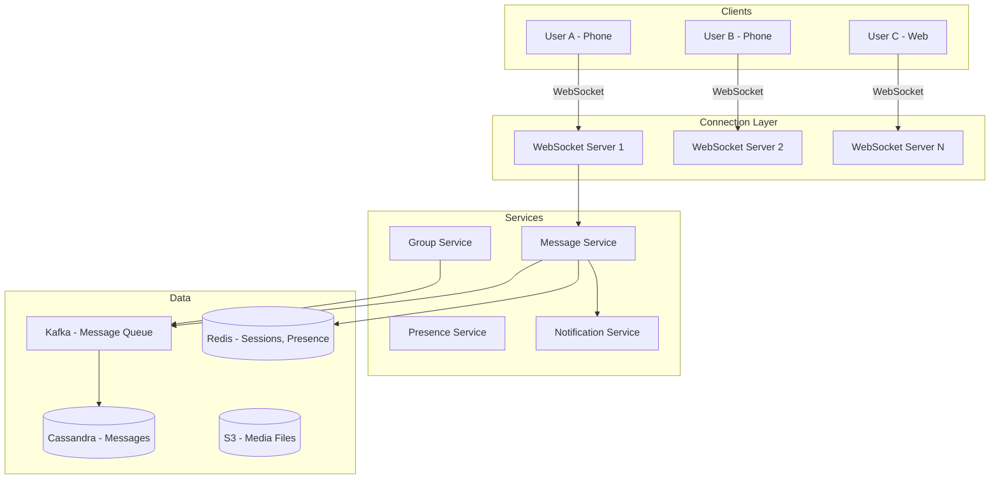
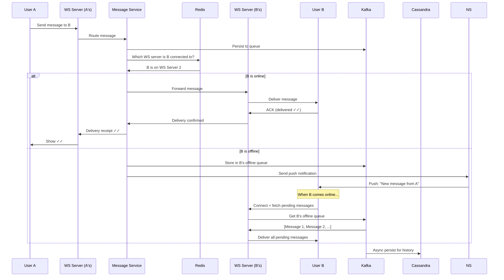
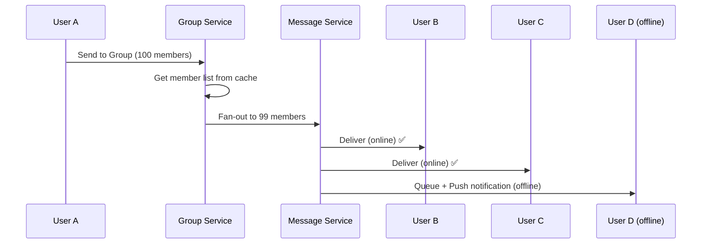
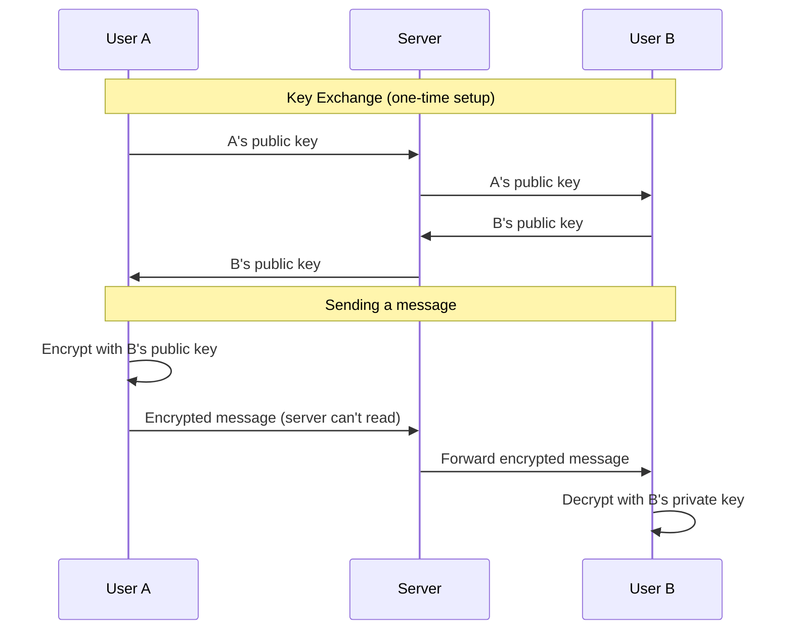

# Design WhatsApp / Messenger — The Post Office Analogy

## The Post Office Analogy

Imagine a post office that delivers letters instantly. You write a letter, hand it to the postman, and your friend receives it in milliseconds — even if they're on the other side of the world. If your friend isn't home, the letter waits at their local post office until they pick it up. If both of you are home, you can have a real-time conversation through letters. Now scale this to 2 billion people sending 100 billion messages per day. That's WhatsApp.

---

## 1. Requirements

### Functional
- One-on-one messaging (text, image, video, audio)
- Group chat (up to 1024 members)
- Message delivery status (sent ✓, delivered ✓✓, read 🔵)
- Online/offline presence indicator
- End-to-end encryption
- Push notifications for offline users
- Message history and search

### Non-Functional
- **Scale**: 2B users, 100B messages/day (~1.2M messages/sec)
- **Latency**: Message delivered in < 100ms (both online)
- **Reliability**: No message loss — every message must be delivered
- **Ordering**: Messages appear in the order they were sent
- **Security**: End-to-end encryption — even the server can't read messages

---

## 2. High-Level Architecture



---

## 3. Message Delivery — The Core Flow



<div class="callout-info">

**Key insight**: Messages are stored in Kafka first (durable queue), then asynchronously written to Cassandra (long-term storage). This ensures no message is lost even if Cassandra is temporarily down. The WebSocket connection is for real-time delivery; Kafka is the reliability backbone.

</div>

---

## 4. Connection Management — Session Registry

With 500M concurrent connections, you need to know which WebSocket server each user is connected to:

```java
// Redis session registry
// When user connects:
redis.set("session:userB", "ws-server-2", Duration.ofMinutes(30));

// When sending a message to userB:
String wsServer = redis.get("session:userB");
if (wsServer != null) {
    // Route message to that specific WS server
    routeToServer(wsServer, message);
} else {
    // User is offline — queue message + send push notification
    queueOfflineMessage(message);
    sendPushNotification(message);
}
```

<div class="callout-scenario">

**Scenario**: User B has WhatsApp open on both phone and web. Both devices have active WebSocket connections to different servers. **Decision**: Store multiple sessions per user in Redis: `session:userB → [ws-server-2, ws-server-7]`. Deliver the message to ALL active sessions. The first device to send a "read" receipt marks it as read across all devices.

</div>

---

## 5. Group Messaging



For a group with 1000 members, sending one message = 999 deliveries. This is write amplification.

<div class="callout-tip">

**Applying this** — For small groups (< 100 members), fan-out immediately. For large groups (100+), use a pull model — store the message once with the group ID. When members open the group, they pull recent messages. This avoids 999 individual deliveries. WhatsApp limits groups to 1024 members partly for this reason.

</div>

---

## 6. End-to-End Encryption



<div class="callout-info">

**Key insight**: With E2E encryption, the server is just a relay — it stores and forwards encrypted blobs. It cannot read message content. This means server-side search is impossible. WhatsApp search works only on the device (local database). This is a deliberate trade-off: privacy over server-side features.

</div>

---

## 7. Message Ordering

Messages must appear in the order they were sent. But in a distributed system, clocks aren't synchronized.

**Solution**: Use **Lamport timestamps** or **server-assigned sequence numbers** per conversation.

```java
// Server assigns monotonically increasing sequence per conversation
public long getNextSequence(String conversationId) {
    return redis.incr("seq:" + conversationId);
}
```

Each message gets a sequence number within its conversation. Clients display messages sorted by sequence number, not by local clock time.

---

## 8. Database Choice — Why Cassandra?

| Requirement | Why Cassandra |
|-------------|--------------|
| Write-heavy (100B messages/day) | Cassandra excels at writes |
| Time-series data | Messages are naturally time-ordered |
| Partition by conversation | `PRIMARY KEY (conversation_id, message_id)` |
| No complex joins needed | Messages are always queried by conversation |
| Global distribution | Multi-datacenter replication built-in |

```sql
CREATE TABLE messages (
    conversation_id UUID,
    message_id TIMEUUID,
    sender_id UUID,
    content BLOB,  -- encrypted
    content_type TEXT,
    created_at TIMESTAMP,
    PRIMARY KEY (conversation_id, message_id)
) WITH CLUSTERING ORDER BY (message_id DESC);
```

---

## 🎯 Interview Corner

<div class="callout-interview">

**Q: "How do you ensure no message is ever lost?"**

Multiple layers of reliability: (1) **Client-side**: Message is persisted to local SQLite before sending. Retry with exponential backoff if no server ACK within 5 seconds. (2) **Server-side**: Message is written to Kafka (durable, replicated) before attempting delivery. Even if the WebSocket server crashes, the message is in Kafka. (3) **Delivery ACK**: The recipient's device sends an ACK back to the server. Only after receiving the ACK does the server mark the message as delivered. If no ACK within 30 seconds, the server retries delivery. (4) **Offline queue**: If the recipient is offline, messages accumulate in Kafka. When they reconnect, all pending messages are delivered in order. The message lifecycle: Sent → Queued (Kafka) → Delivered (ACK) → Read (read receipt).

**Follow-up trap**: "What if Kafka itself goes down?" → Kafka is deployed with replication factor 3 across different AZs. For Kafka to lose a message, 3 brokers in different data centers must fail simultaneously — practically impossible. If the Kafka cluster is unreachable, the WebSocket server buffers messages in memory (bounded queue) and retries. If the buffer fills up, the client gets a "message not sent" error and retries.

</div>

<div class="callout-interview">

**Q: "How does the read receipt (blue ticks) work?"**

When User B reads a message, their client sends a "read" event to the server: `{messageId: X, readAt: timestamp}`. The server forwards this to User A's WebSocket connection. User A's client updates the UI from ✓✓ to blue. For group chats, the server tracks read receipts per member. The message shows blue ticks only when ALL members have read it (WhatsApp) or shows "Seen by 15 of 20" (Messenger). Read receipts are fire-and-forget — if the delivery fails, it's not critical. They're sent as lightweight events, not stored permanently.

</div>

<div class="callout-interview">

**Q: "How do you handle 500 million concurrent WebSocket connections?"**

No single server can handle this. Distribute across thousands of WebSocket servers. Each server handles ~50K-100K connections. Use a session registry (Redis) to map user → server. When a message needs to be delivered, the message service looks up the target user's server and routes the message there. For the WebSocket servers themselves, use epoll/kqueue for efficient connection handling (not one thread per connection). Each server uses ~10GB RAM for 100K connections. 500M connections ÷ 100K per server = 5,000 WebSocket servers. Load balance new connections using consistent hashing on user ID.

</div>

---

## Quick Reference

| Concept | One-Liner |
|---------|-----------|
| WebSocket | Persistent bidirectional connection for real-time messaging |
| Session Registry | Redis map of user → WebSocket server |
| Offline Queue | Kafka stores messages for offline users |
| E2E Encryption | Only sender and receiver can read messages |
| Read Receipt | Client sends "read" event, server forwards to sender |
| Fan-out | Deliver group message to all members individually |
| Sequence Number | Server-assigned ordering per conversation |
| Push Notification | FCM/APNs alert for offline users |

---

> **A chat system's job is simple: get this message from A to B, no matter what. The complexity is in the "no matter what" — offline, bad network, multiple devices, encrypted, at scale, in order, without losing a single message.**
