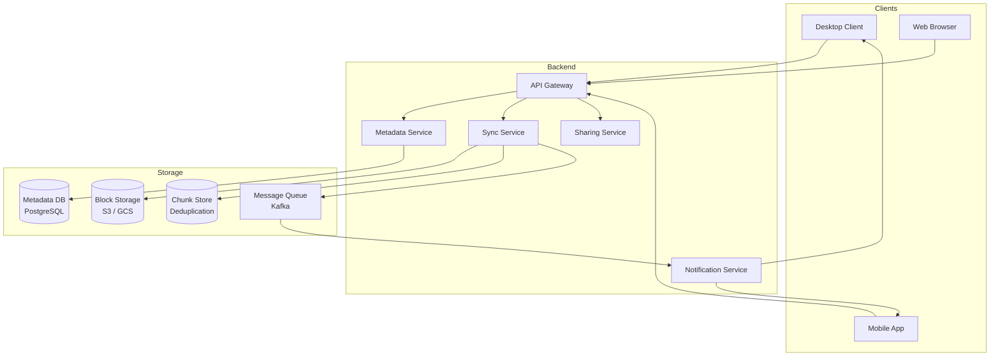
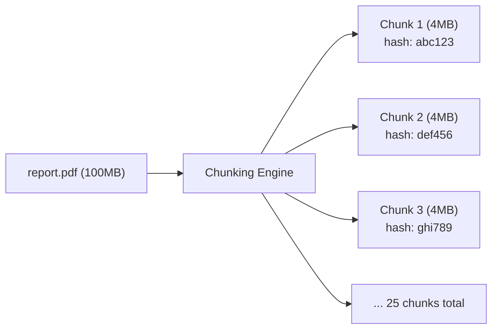
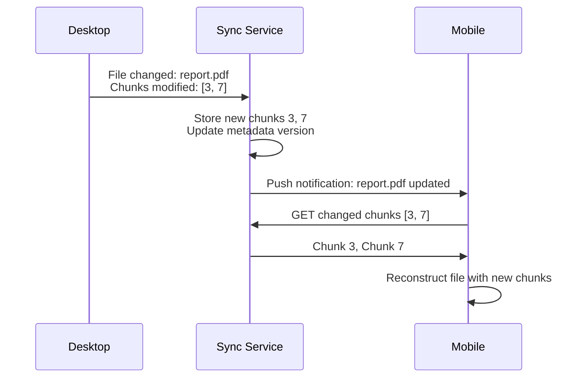
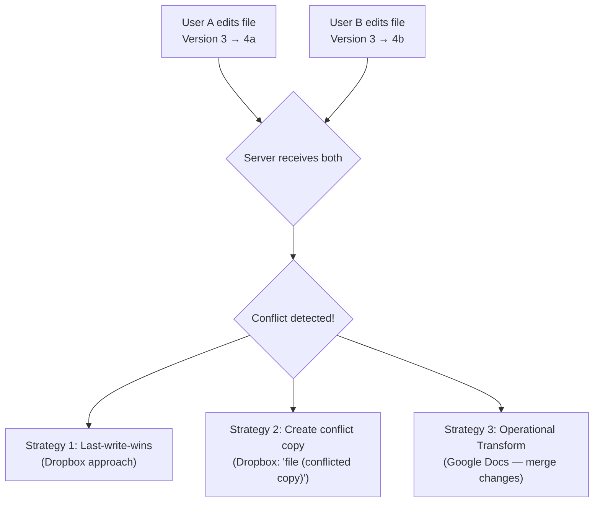
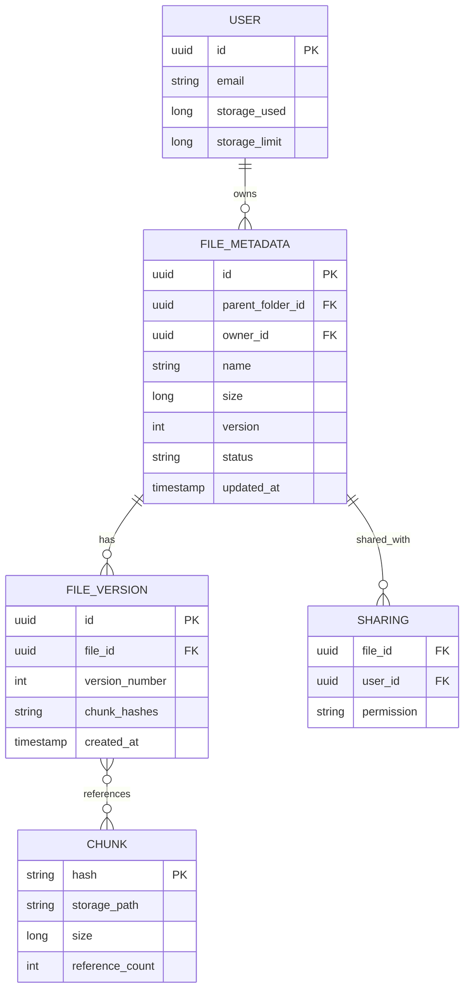

# Design Google Drive / Dropbox — The Shared Locker System

## The Shared Locker Analogy

Imagine a locker system where you put a document in your locker, and instantly your friend across the city sees the same document in their locker. If you both edit it at the same time, the system merges your changes without losing either. If the locker building burns down, your documents are safe because copies exist in three other buildings. That's cloud file storage.

---

## 1. Requirements

### Functional
- Upload, download, delete files (any size, any type)
- Sync files across multiple devices automatically
- Share files/folders with other users (view/edit permissions)
- File versioning — restore previous versions
- Offline editing — sync when back online

### Non-Functional
- **Reliability**: Never lose a file (99.999999999% durability — 11 nines)
- **Consistency**: All devices see the same file state eventually
- **Scale**: Billions of files, petabytes of storage
- **Bandwidth**: Minimize data transfer (don't re-upload entire file for small changes)

---

## 2. High-Level Architecture



---

## 3. Chunking — The Key Innovation

Instead of uploading entire files, split them into chunks (4MB each):



**Why chunking?**

| Benefit | Explanation |
|---------|------------|
| **Delta sync** | Edit page 5 of a 100MB PDF → only re-upload 1 chunk (4MB), not 100MB |
| **Deduplication** | If two users upload the same file, chunks are identical → store once |
| **Parallel upload** | Upload 25 chunks simultaneously instead of 1 large file |
| **Resume** | Upload interrupted? Resume from the last successful chunk |

```java
// Client-side chunking
public List<Chunk> chunkFile(File file) {
    List<Chunk> chunks = new ArrayList<>();
    byte[] buffer = new byte[4 * 1024 * 1024]; // 4MB
    try (InputStream is = new FileInputStream(file)) {
        int bytesRead;
        int index = 0;
        while ((bytesRead = is.read(buffer)) != -1) {
            byte[] data = Arrays.copyOf(buffer, bytesRead);
            String hash = sha256(data);
            chunks.add(new Chunk(index++, hash, data));
        }
    }
    return chunks;
}
```

<div class="callout-info">

**Key insight**: Before uploading a chunk, the client sends its hash to the server. If the server already has a chunk with that hash (from any user), it skips the upload. This is **content-addressable storage** — Dropbox reported 75% of uploads are deduplicated this way.

</div>

---

## 4. Sync Protocol — How Devices Stay in Sync



<div class="callout-scenario">

**Scenario**: User edits a 500MB video file on their laptop. Only the first 10 seconds changed (one 4MB chunk). **Decision**: The client detects which chunks changed by comparing hashes. Only the modified chunk (4MB) is uploaded instead of the entire 500MB file. The mobile device downloads only that 4MB chunk. This saves 99.2% bandwidth.

</div>

---

## 5. Conflict Resolution — The Hard Problem

What happens when two people edit the same file simultaneously?



| Strategy | When to use | Trade-off |
|----------|------------|-----------|
| **Last-write-wins** | Simple files, low collaboration | May lose changes |
| **Conflict copy** | Binary files (images, PDFs) | User must manually merge |
| **Operational Transform** | Text documents, real-time collab | Complex to implement |

<div class="callout-tip">

**Applying this** — For a Dropbox-like system, use conflict copies for binary files and OT/CRDT for text files. Always preserve both versions — never silently discard a user's changes. Notify the user about conflicts immediately.

</div>

---

## 6. Metadata Database Schema



---

## 🎯 Interview Corner

<div class="callout-interview">

**Q: "How would you handle a user uploading a 10GB file?"**

Chunking + parallel upload + resumability. Split the 10GB file into 2,500 chunks of 4MB each. Upload chunks in parallel (8-16 concurrent uploads). Before each chunk upload, send the hash — if the server has it (deduplication), skip it. If the upload is interrupted, the client resumes from the last successful chunk (server tracks which chunks are received). Use multipart upload to S3 — each chunk is a part. After all chunks are uploaded, the server assembles the file metadata (ordered list of chunk hashes). The actual chunks stay in S3 as individual objects. For download, the client fetches chunks in parallel and reassembles locally.

**Follow-up trap**: "What about the 11 nines durability?" → S3 provides this natively by replicating data across 3+ AZs. Each chunk is stored with S3's built-in redundancy. We don't need to implement replication ourselves.

</div>

<div class="callout-interview">

**Q: "How does sync work when the user is offline?"**

The desktop client maintains a local database (SQLite) tracking file states. When offline, all changes are recorded locally with timestamps. When the connection restores, the client sends a "diff" to the server — list of files changed, with their chunk hashes. The server compares with its state and identifies: (1) files only changed locally → upload, (2) files only changed remotely → download, (3) files changed both locally and remotely → conflict resolution. The sync protocol uses vector clocks or version numbers to determine ordering. Dropbox uses a "cursor" — a server-side pointer to the last sync state for each device.

</div>

<div class="callout-interview">

**Q: "How do you implement file sharing with permissions?"**

A sharing table maps (file_id, user_id, permission). Permissions: VIEWER (read-only), EDITOR (read-write), OWNER (full control). When User A shares a file with User B, an entry is created in the sharing table. When User B accesses the file, the API checks the sharing table. For shared folders, permissions cascade to all files within. For link sharing ("anyone with the link"), generate a unique token and store it with the file — no user_id needed, just validate the token. Revocation is instant — delete the sharing entry or invalidate the token.

</div>

---

## Quick Reference

| Concept | One-Liner |
|---------|-----------|
| Chunking | Split files into fixed-size blocks for efficient sync |
| Content-addressable | Store chunks by their hash — identical content stored once |
| Delta Sync | Only transfer changed chunks, not entire files |
| Conflict Copy | Create duplicate when two users edit simultaneously |
| Vector Clock | Track causality of changes across distributed devices |
| Multipart Upload | Upload large files as parallel parts to S3 |

---

> **The magic of cloud storage isn't storing files — it's making millions of devices believe they're all looking at the same folder, even when they're not.**
