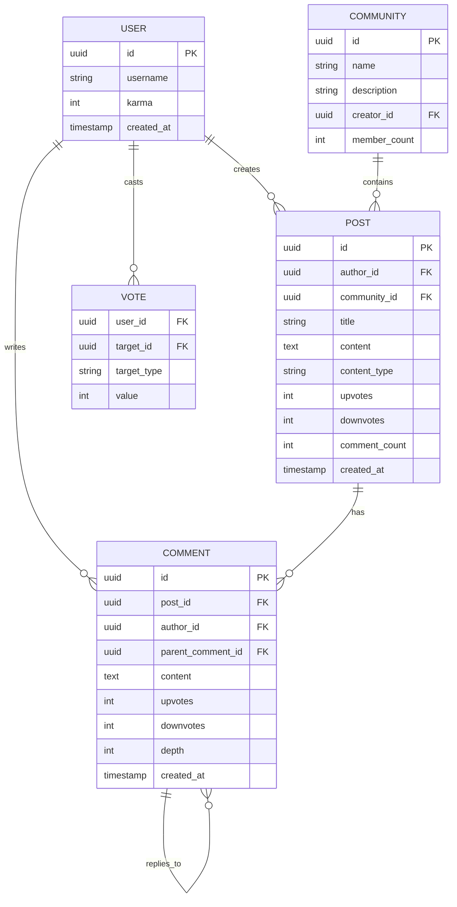
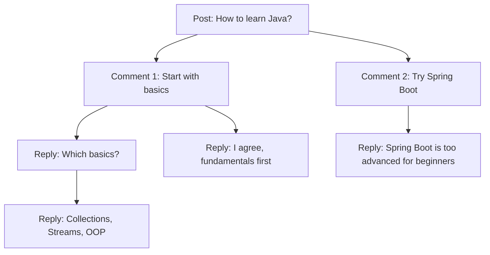
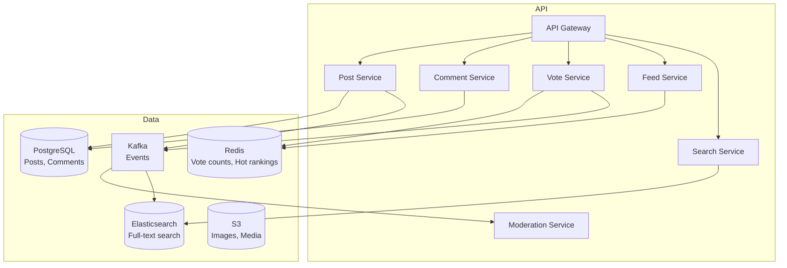

# Design Reddit / Quora / HackerNews — The Town Hall Analogy

## The Town Hall Analogy

Imagine a town hall where anyone can stand up and ask a question or share a story. Others vote on whether it's interesting (upvote) or not (downvote). The most popular topics rise to the top of the bulletin board. People can comment, reply to comments, and the whole thing is organized by topics (subreddits/tags). That's a forum system.

---

## 1. Requirements

### Functional
- Create posts with text, images, links
- Tag/categorize posts (subreddits, topics)
- Upvote/downvote posts and comments
- Nested comments (threaded discussions)
- Newsfeed based on followed tags/communities
- Search posts by content, tags, author
- Moderation (remove posts, ban users)

### Non-Functional
- **Scale**: Millions of posts, billions of votes
- **Real-time**: Comments appear instantly
- **Ranking**: Hot, Top, New, Controversial sorting
- **Search**: Full-text search across all posts

---

## 2. Data Model



---

## 3. Ranking Algorithms

### Reddit's Hot Ranking

```java
public double hotScore(int ups, int downs, long createdAtEpoch) {
    int score = ups - downs;
    double order = Math.log10(Math.max(Math.abs(score), 1));
    int sign = score > 0 ? 1 : (score < 0 ? -1 : 0);
    long seconds = createdAtEpoch - 1134028003; // Reddit epoch
    return sign * order + seconds / 45000.0;
}
```

**Key insight**: The time component (`seconds / 45000`) means newer posts get a boost. A post needs exponentially more votes to stay on top as it ages. A 1-day-old post with 1000 upvotes ranks similarly to a 1-hour-old post with 100 upvotes.

### HackerNews Ranking

```
Score = (votes - 1) / (age_in_hours + 2) ^ gravity

gravity = 1.8 (higher = faster decay)
```

| Sort | Algorithm | Use case |
|------|-----------|----------|
| **Hot** | Score + time decay | Default homepage |
| **Top** | Pure vote count (in time window) | "Best of all time" |
| **New** | Chronological | Discover fresh content |
| **Controversial** | High votes AND high downvotes | Divisive topics |

<div class="callout-scenario">

**Scenario**: A post gets 10,000 upvotes in 1 hour. Another gets 10,000 upvotes over 1 week. **Decision**: Hot ranking puts the 1-hour post much higher — velocity matters more than total count. This prevents old viral posts from permanently dominating the front page.

</div>

---

## 4. Nested Comments — Tree Structure



**Storage approaches:**

| Approach | Query | Write | Best for |
|----------|-------|-------|----------|
| **Adjacency List** (parent_id) | Recursive queries (slow) | Fast | Small threads |
| **Materialized Path** ("/1/3/7/") | LIKE query on path | Update all children on move | Medium threads |
| **Nested Set** (left/right numbers) | Single range query | Expensive writes | Read-heavy, rarely modified |
| **Closure Table** | Fast subtree queries | Extra table, more writes | Large threads, frequent reads |

<div class="callout-tip">

**Applying this** — For Reddit-scale comments, use adjacency list (parent_comment_id) with a `depth` column. Fetch comments in batches: first load top-level comments (depth=0), then load replies on-demand when user clicks "show replies." This avoids loading entire 10,000-comment threads at once. Cache hot threads in Redis as pre-built trees.

</div>

---

## 5. Architecture



---

## 6. Vote Handling at Scale

Votes are the most write-heavy operation. Reddit gets millions of votes per minute.

```java
// Don't update post table on every vote — use Redis + async sync
public void vote(String userId, String postId, int value) {
    // 1. Check if user already voted (prevent double-voting)
    String voteKey = "vote:" + userId + ":" + postId;
    Integer existing = redis.get(voteKey);

    if (existing != null && existing == value) return; // already voted same way

    // 2. Update vote in Redis
    redis.set(voteKey, value);

    // 3. Update post score atomically
    int delta = value - (existing != null ? existing : 0);
    redis.hincrby("post:" + postId, "score", delta);

    // 4. Async: persist to database
    kafka.send("votes", new VoteEvent(userId, postId, value));
}
```

<div class="callout-info">

**Key insight**: Vote counts in Redis are the source of truth for display. The database is updated asynchronously via Kafka. If Redis goes down, the database has the last-synced counts. This handles millions of votes/minute without database bottleneck.

</div>

---

## 🎯 Interview Corner

<div class="callout-interview">

**Q: "How would you design the feed for a user who follows 500 communities?"**

Pre-compute a personalized feed per user. When a post is created in a community, fanout to all members' feed caches (similar to Facebook newsfeed). For large communities (1M+ members), use fanout-on-read — fetch top posts from each community at read time. The feed service merges posts from all 500 communities, applies the hot ranking algorithm, and returns the top 50. Cache the computed feed in Redis with a 5-minute TTL. For real-time updates, use long polling — client asks "any new posts since my last fetch?" every 30 seconds.

**Follow-up trap**: "How do you handle a user joining a new community?" → Backfill their feed with the top 10 recent posts from that community. Don't recompute the entire feed — just merge the new community's posts into the existing cached feed.

</div>

<div class="callout-interview">

**Q: "How do you prevent vote manipulation (bots, brigading)?"**

Multiple layers: (1) **Rate limiting** — max 100 votes per user per hour. (2) **Account age** — new accounts (< 7 days) have reduced vote weight. (3) **IP tracking** — multiple accounts voting from the same IP get flagged. (4) **Behavioral analysis** — ML model detects patterns (voting on the same posts as a group, voting immediately after post creation). (5) **Shadow banning** — suspicious accounts' votes are counted locally (they see their vote) but not globally. (6) **Vote fuzzing** — Reddit shows approximate vote counts, not exact, to make it harder for manipulators to verify their impact.

</div>

---

## Quick Reference

| Concept | One-Liner |
|---------|-----------|
| Hot Ranking | Score + time decay — newer posts need fewer votes to rank high |
| Karma | User reputation based on accumulated upvotes |
| Nested Comments | Tree structure with parent_comment_id |
| Vote Fuzzing | Show approximate counts to prevent manipulation |
| Shadow Ban | User thinks they're active but their actions are invisible |
| Fanout | Push new posts to followers' feed caches |

---

> **A forum is democracy in action — the crowd decides what's important. Your job as the architect is to make sure the crowd's voice is heard fairly, at scale, in real-time.**
