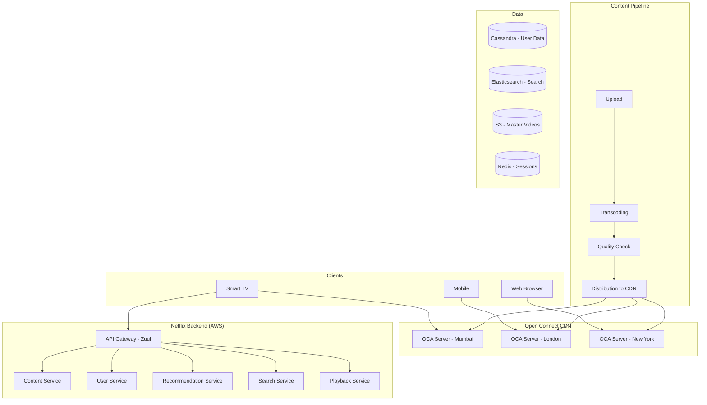
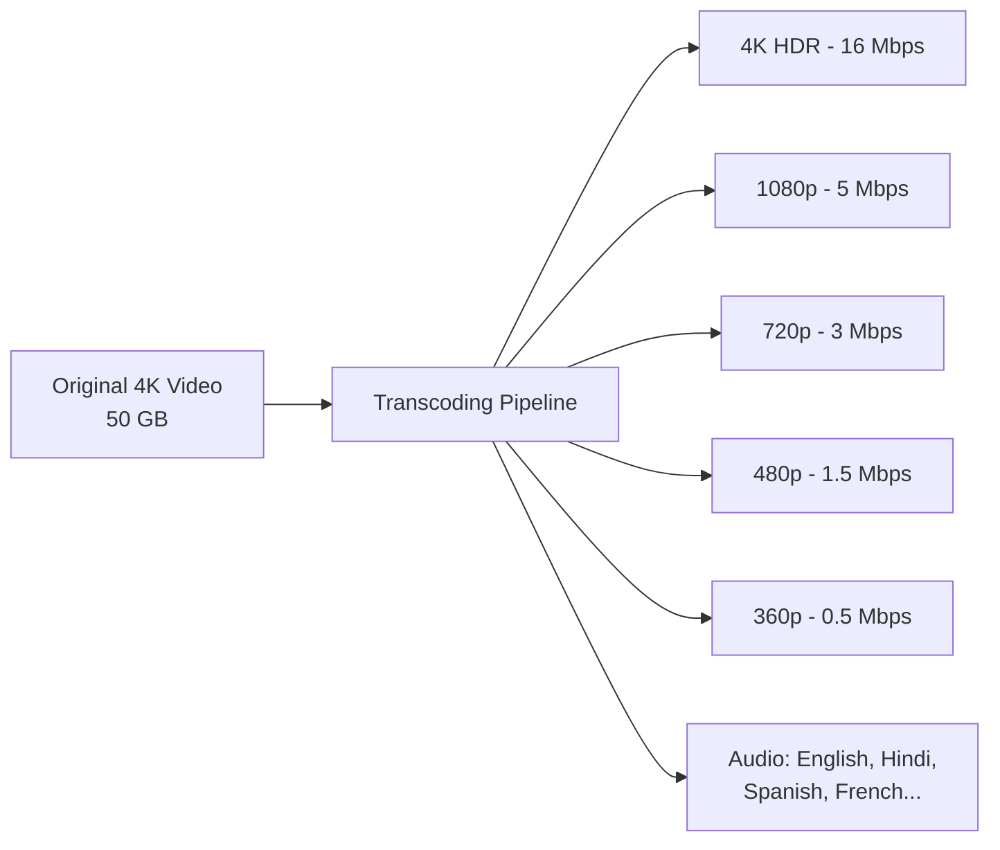
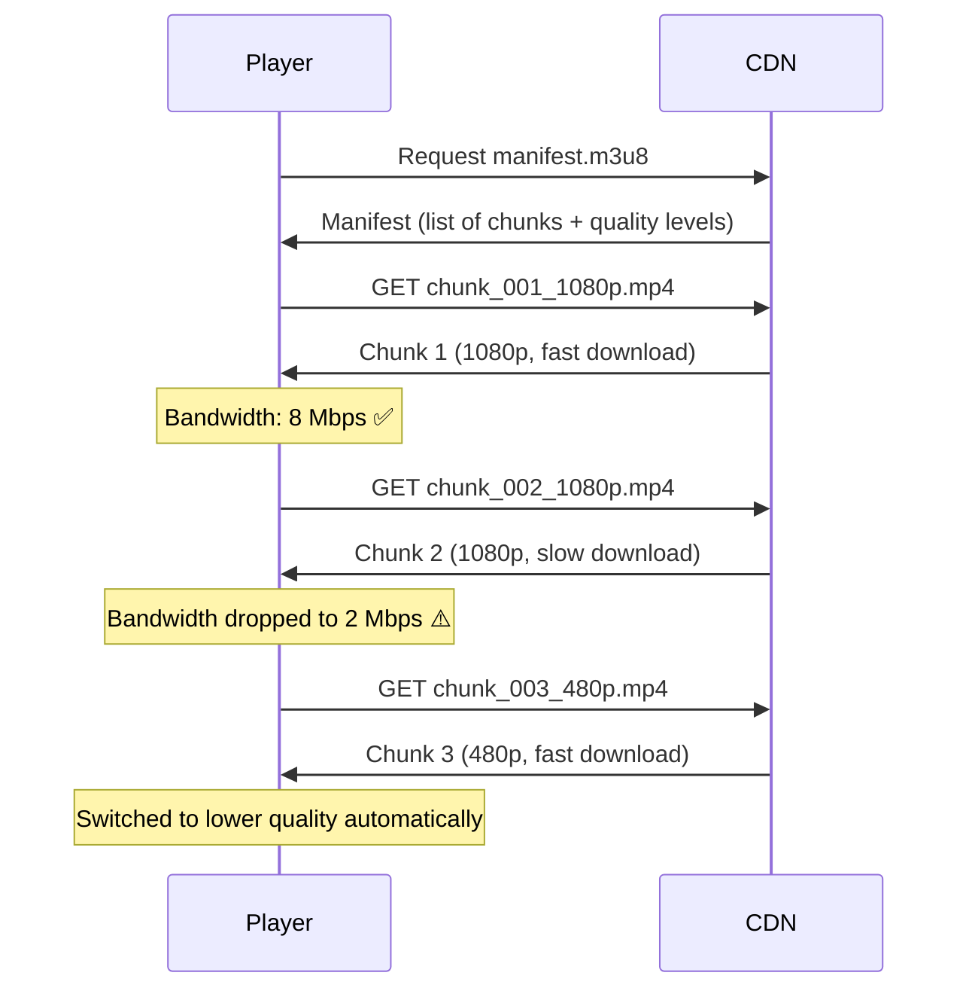
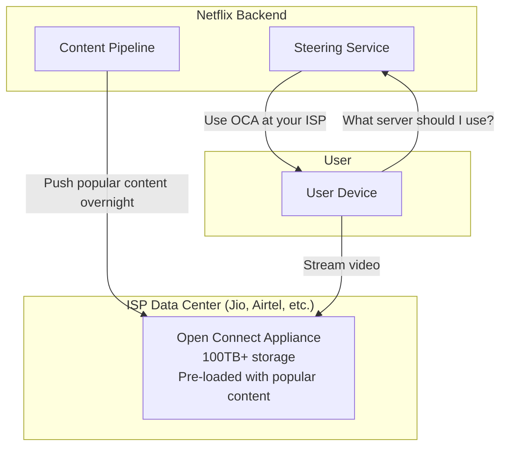
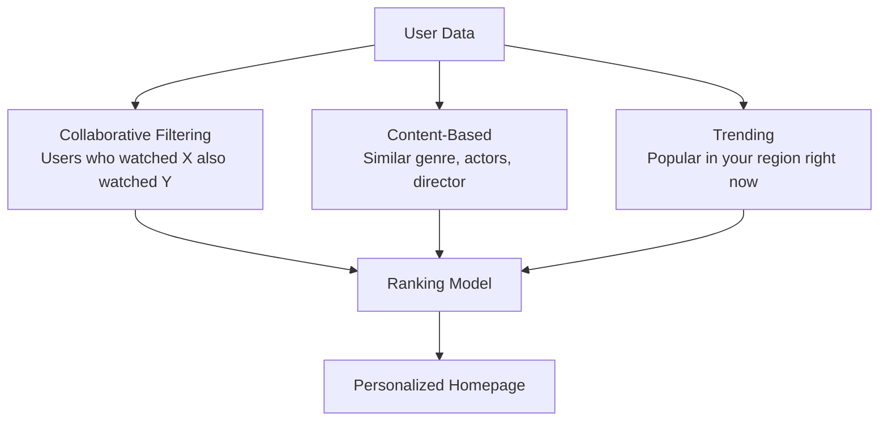

# Design Netflix — The Movie Theater Chain Analogy

## The Movie Theater Chain Analogy

Imagine a movie theater chain with 200 million members. Every member wants to watch a different movie, at any time, on any device, with zero buffering. You can't have one giant theater — you need thousands of screens worldwide, each pre-loaded with popular movies, adapting quality based on the viewer's seat (device/bandwidth). That's Netflix — a global video streaming platform.

---

## 1. Requirements

### Functional
- Upload and transcode videos (content team)
- Stream videos on-demand with adaptive quality
- Search and browse content catalog
- Personalized recommendations
- User profiles, watchlist, continue watching
- Likes, reviews, ratings

### Non-Functional
- **Scale**: 200M+ subscribers, 15M+ concurrent streams
- **Availability**: 99.99% — downtime = millions in lost revenue
- **Latency**: Video should start playing in < 2 seconds
- **Global**: Available in 190+ countries
- **Adaptive**: Adjust quality based on bandwidth in real-time

---

## 2. High-Level Architecture



---

## 3. Video Transcoding — The Most Expensive Part

A single movie uploaded in 4K must be converted into **hundreds of versions**:



**Why so many versions?**
- Different devices have different screen sizes
- Different networks have different bandwidth
- Different regions need different audio/subtitle tracks
- A single title can have **1,200+ encoded files**

<div class="callout-info">

**Key insight**: Netflix spends ~$1 billion/year on AWS, and a huge chunk goes to transcoding. They use a technique called **per-title encoding** — each title gets its own encoding ladder optimized for its content. An animated movie compresses better than an action movie, so it gets lower bitrates at the same quality.

</div>

### Chunked Encoding

Videos are split into small chunks (2-10 seconds each):

```
movie.mp4 → chunk_001.mp4 (0:00-0:04)
           → chunk_002.mp4 (0:04-0:08)
           → chunk_003.mp4 (0:08-0:12)
           → ... (each chunk in multiple qualities)
```

**Why chunks?** Adaptive Bitrate Streaming (ABR) — the player can switch quality mid-stream. If bandwidth drops, the next chunk loads in 480p instead of 1080p. Seamless to the user.

---

## 4. Adaptive Bitrate Streaming (ABR)



<div class="callout-scenario">

**Scenario**: User is watching on a train. Network fluctuates between 4G and 2G. **Decision**: ABR handles this automatically. The player's buffer algorithm monitors download speed and switches quality per-chunk. The user sees a brief quality drop but never experiences buffering. Netflix's ABR algorithm also considers device screen size — no point streaming 4K to a phone.

</div>

---

## 5. Netflix's CDN — Open Connect

Netflix doesn't use CloudFront or Akamai for video. They built their own CDN called **Open Connect**:



**Why build their own CDN?**
- Netflix is 15% of global internet traffic
- Placing servers INSIDE ISP data centers = zero transit costs
- Content is pre-positioned based on popularity predictions
- A single OCA box can serve 100 Gbps of video

<div class="callout-interview">

🎯 **Interview Ready** — "How does Netflix handle 15 million concurrent streams?" → They don't stream from AWS. Video comes from Open Connect Appliances placed inside ISP data centers worldwide. AWS handles only the control plane (user auth, recommendations, search). The data plane (actual video bytes) is served from OCAs. This separation is key — the most bandwidth-intensive part is handled at the edge, closest to users.

</div>

---

## 6. Recommendation Engine



Netflix's recommendation system drives **80% of content watched**. It's not just "you might like this" — it even personalizes the **thumbnail image** shown for each title based on your viewing history.

<div class="callout-tip">

**Applying this** — In system design interviews, mention that recommendations are computed offline (batch processing) and cached. Real-time personalization happens at the API layer by combining pre-computed scores with real-time signals (time of day, device, recent watches). Don't try to compute recommendations in real-time for 200M users — that's impossibly expensive.

</div>

---

## 7. Database Choices

| Data | Database | Why |
|------|----------|-----|
| User profiles, viewing history | Cassandra | Write-heavy, globally distributed, no single point of failure |
| Search index | Elasticsearch | Full-text search, faceted filtering |
| Session data | Redis | Ultra-fast reads, TTL-based expiry |
| Video metadata | MySQL/PostgreSQL | Relational, complex queries for content catalog |
| Recommendations | Cassandra + S3 | Pre-computed, read-heavy |
| Analytics | Spark + S3 | Batch processing of viewing data |

---

## 🎯 Interview Corner

<div class="callout-interview">

**Q: "How would you handle millions of users watching the same live event (like a boxing match) on Netflix?"**

Live streaming is fundamentally different from on-demand. For live: (1) **Ingest** — receive the live feed via RTMP from the venue. (2) **Transcode in real-time** — encode into multiple qualities with ultra-low latency (2-5 second delay). (3) **Chunk and distribute** — push 2-second chunks to all OCA servers simultaneously. (4) **Client pulls** — players request chunks as they become available. The challenge is the "thundering herd" — all users request the same chunk at the same time. Solution: CDN edge caching handles this naturally. The first request fetches from origin, all subsequent requests in that region get the cached chunk. For 10M concurrent viewers, each OCA serves its local users.

**Follow-up trap**: "What about the 2-5 second delay?" → For most live content, 5 seconds is acceptable. For sports betting or interactive content, you need WebRTC or LL-HLS (Low-Latency HLS) which can achieve < 2 second delay, but at higher infrastructure cost.

</div>

<div class="callout-interview">

**Q: "How does Netflix ensure a video starts playing in under 2 seconds?"**

Multiple optimizations: (1) **Predictive pre-fetching** — when you hover over a title, the player pre-loads the first few chunks. (2) **Start at low quality** — begin with 480p (small chunks, fast download), then upgrade to 1080p/4K within 5-10 seconds. (3) **CDN proximity** — OCA servers inside your ISP mean < 5ms latency. (4) **Manifest caching** — the playlist file is cached at the edge. (5) **TCP optimization** — Netflix uses custom congestion control algorithms optimized for video delivery. The perceived start time is the time to download the first chunk + decode it. At 480p with a 2-second chunk, that's ~375KB — downloadable in < 500ms on most connections.

</div>

<div class="callout-interview">

**Q: "What happens if many users access the same video concurrently?"**

This is actually the EASY case for a CDN. The first user triggers a cache miss — the OCA fetches the chunk from the origin. Every subsequent user in that region gets a cache hit. For popular content (new releases), Netflix pre-positions it on OCAs before launch — so there's no cache miss at all. The OCA can serve the same chunk to thousands of concurrent users from its local storage. The hard case is the "long tail" — obscure content that's rarely watched. For this, OCAs only cache popular content; rare content is fetched from a regional hub or directly from S3.

</div>

---

## Quick Reference

| Concept | One-Liner |
|---------|-----------|
| Transcoding | Converting video into multiple quality levels and formats |
| ABR | Adaptive Bitrate Streaming — switch quality based on bandwidth |
| HLS/DASH | Streaming protocols that serve video as small chunks |
| Open Connect | Netflix's custom CDN with servers inside ISP data centers |
| Per-title encoding | Optimize encoding settings per video based on content complexity |
| Manifest | Playlist file listing all available chunks and quality levels |
| Collaborative Filtering | Recommend based on similar users' behavior |
| Long Tail | Rarely watched content that's expensive to cache everywhere |

---

> **Netflix's genius isn't in making great shows — it's in delivering them to 200 million people simultaneously without a single buffer. The best technology is the one you never notice.**
