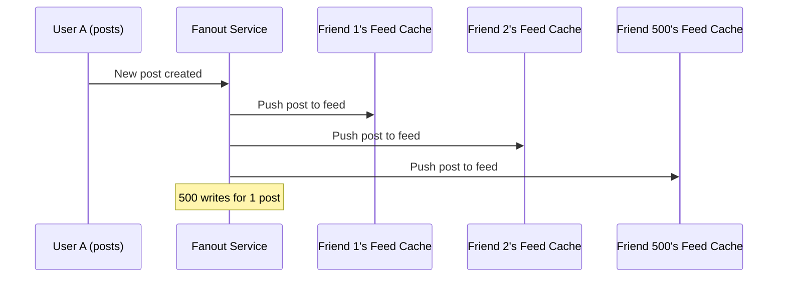
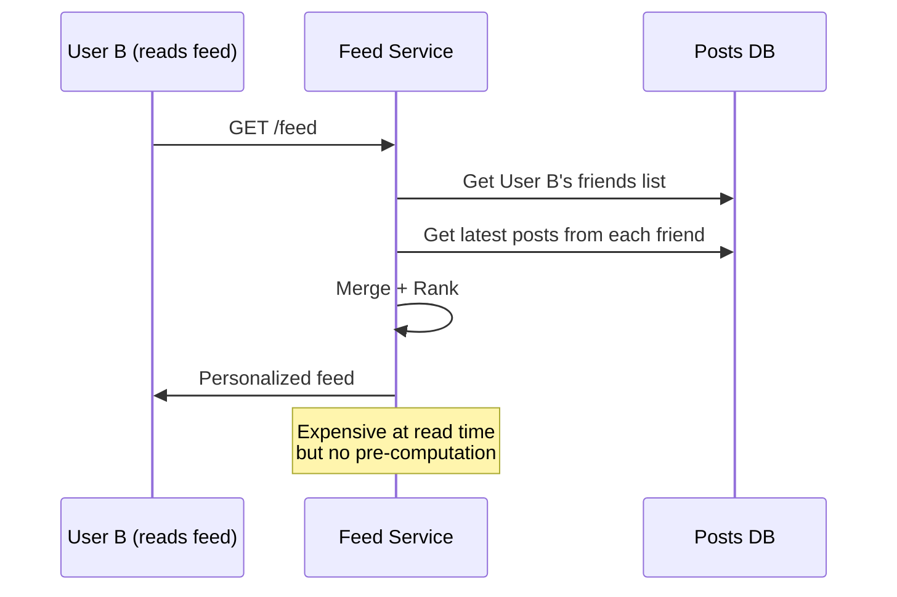
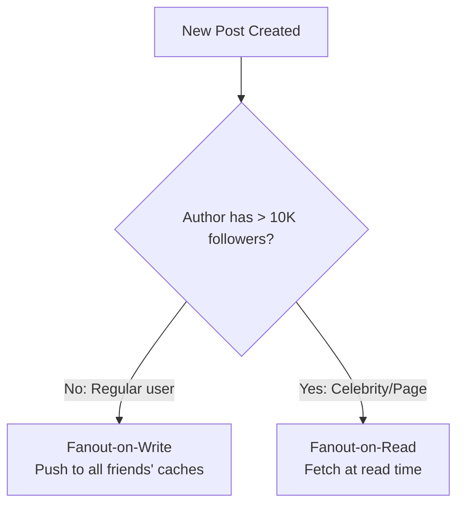
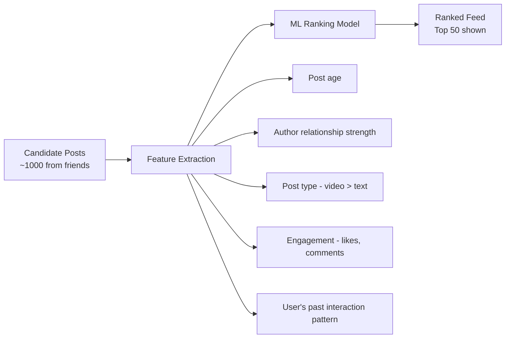
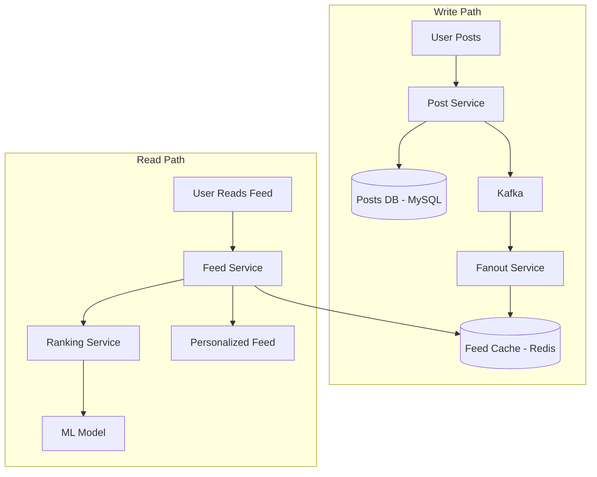
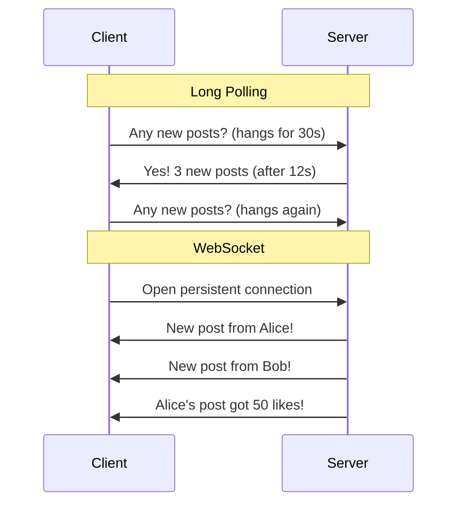

# Design Facebook Newsfeed — The Newspaper Editor Analogy

## The Newspaper Editor Analogy

Imagine a newspaper editor who creates a personalized edition for each of 3 billion readers. Each edition contains stories from the reader's friends, pages they follow, and groups they're in — ranked by relevance, not just time. Some stories are text, some photos, some videos. And the edition updates in real-time as new stories come in. That's Facebook's Newsfeed.

---

## 1. Requirements

### Functional
- Generate personalized feed from friends' posts, pages, groups
- Support text, image, video, link posts
- Real-time updates (new posts appear without refresh)
- Like, comment, share interactions
- Ranking by relevance (not just chronological)

### Non-Functional
- **Scale**: 3B users, 500K posts/second
- **Latency**: Feed loads in < 500ms
- **Freshness**: New posts appear within seconds
- **Availability**: 99.99%

---

## 2. The Core Problem — Fanout

When User A creates a post, how do their 500 friends see it?

### Fanout-on-Write (Push Model)

### Fanout-on-Read (Pull Model)

### Hybrid Approach (What Facebook Actually Does)

**Scenario**: A celebrity with 50 million followers posts a photo. Fanout-on-write would mean 50 million cache writes for ONE post. **Decision**: Use fanout-on-read for celebrities. When a user opens their feed, the service fetches celebrity posts on-demand and merges with the pre-computed friend posts. This is the "celebrity problem" — the most famous interview question about newsfeed design.

---

## 3. Feed Ranking — Not Just Chronological

**Ranking signals:**
- How often you interact with this friend
- Post type (video > photo > link > text in engagement)
- How many others engaged with this post
- Recency (newer posts score higher)
- Content type preference (you watch more videos → show more videos)

🎯 **Interview Ready** — "How does Facebook rank the newsfeed?" → It's a multi-stage pipeline. Stage 1: Candidate generation — collect ~1000 recent posts from friends, pages, groups. Stage 2: Feature extraction — compute 1000+ features per post (author affinity, post type, engagement velocity, recency). Stage 3: ML ranking — a neural network scores each post. Stage 4: Policy filters — remove duplicates, enforce diversity (don't show 5 posts from same person), apply content policies. The final feed shows ~50 posts ranked by predicted engagement.

---

## 4. Architecture

**Storage:**
| Data | Store | Why |
|------|-------|-----|
| Posts | MySQL (sharded by user_id) | Relational, strong consistency |
| Feed cache | Redis (sorted set per user) | Fast reads, sorted by score |
| Social graph | TAO (Facebook's graph DB) | Friend relationships, efficient traversal |
| Media | S3 + CDN | Images, videos served from edge |
| Engagement counts | Redis + async DB write | Real-time like/comment counts |

---

## 5. Real-Time Updates — Long Polling vs WebSocket

**Applying this** — Facebook uses long polling for the newsfeed (not WebSocket). Why? With 2 billion concurrent users, maintaining 2 billion WebSocket connections is expensive. Long polling is stateless — any server can handle the response. For chat (Messenger), they DO use WebSocket because real-time latency matters more there.

---

## 🎯 Interview Corner

**Q: "How do you handle the celebrity problem in newsfeed?"**

The celebrity problem: a user with 50M followers posts → fanout-on-write means 50M cache writes. Solution: hybrid fanout. For regular users (< 10K friends), use fanout-on-write — push posts to friends' feed caches. For celebrities/pages (> 10K followers), use fanout-on-read — don't pre-compute. When a user opens their feed, the service merges: (1) pre-computed friend posts from cache + (2) on-demand celebrity/page posts fetched at read time. The merge is fast because celebrity posts are few (user follows maybe 50 pages) vs friend posts (hundreds). This reduces write amplification from billions to millions.

**Follow-up trap**: "What about a celebrity who is also your friend?" → Treat them as celebrity for fanout purposes. The friendship doesn't change the scaling problem. Their posts are fetched on-read regardless.

**Q: "How would you shard the posts database?"**

Shard by `user_id` (author). All posts by User A are on the same shard. This makes writes fast (single shard) and "get all posts by user" queries efficient. For the newsfeed, the feed service queries multiple shards (one per friend) in parallel and merges results. The fan-out read is parallelized — 500 friends across maybe 50 shards, each query takes 5ms, total ~10ms with parallel execution. Alternative: shard by `post_id` — distributes writes evenly but makes "get all posts by user" expensive (scatter-gather across all shards). For social networks, shard by user_id is standard.

**Q: "How do you handle a post going viral — millions of likes in minutes?"**

Don't update the database on every like. Use a write-behind pattern: (1) Increment a Redis counter atomically (`INCR post:123:likes`). (2) Periodically flush Redis counts to the database (every 5-10 seconds). (3) The feed shows the Redis count (real-time) while the database has a slightly stale count (acceptable). For the notification "Your post got 1M likes", batch notifications — don't send 1M individual notifications. Show "1M people liked your post" as a single aggregated notification. For the post author's feed, cache the viral post's engagement metrics separately to avoid hot-key issues in Redis (use local caching on feed servers).

---

## Quick Reference

| Concept | One-Liner |
|---------|-----------|
| Fanout-on-Write | Push post to all friends' caches at write time |
| Fanout-on-Read | Fetch friends' posts at read time |
| Celebrity Problem | High-follower users cause write amplification |
| Feed Ranking | ML model scores posts by predicted engagement |
| Social Graph | Data structure storing friend/follow relationships |
| Write-Behind | Buffer writes in Redis, flush to DB periodically |

---

> **The newsfeed isn't just a list of posts — it's a personalized newspaper generated in real-time for 3 billion people. The algorithm decides what you see, and what you see shapes what you think.**
