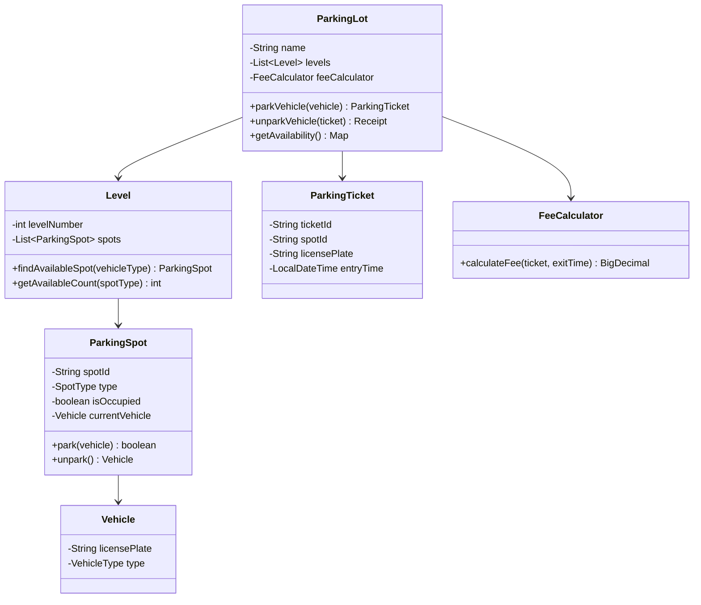

# Design Parking Lot System — The Hotel Room Booking Analogy

## The Hotel Analogy

A parking lot is like a hotel — different room types (single, double, suite) for different guests (motorcycle, car, bus). You need to check availability, assign the right room, track check-in/check-out, calculate billing, and handle the case where all rooms are full. The twist: guests arrive and leave unpredictably, and you need real-time availability.

---

## 1. Requirements

### Functional
- Multiple levels, each with multiple rows of spots
- Spot types: Compact, Regular, Large (for motorcycles, cars, buses)
- Assign nearest available spot of appropriate size
- Track entry/exit with timestamps
- Calculate parking fee based on duration and vehicle type
- Display real-time availability per level

### Non-Functional
- **Real-time**: Availability updates instantly on entry/exit
- **Concurrent**: Handle multiple vehicles entering/exiting simultaneously
- **Fair pricing**: Accurate billing, no overcharging

---

## 2. Class Design (LLD)



---

## 3. Spot Assignment Algorithm

```java
public ParkingSpot findBestSpot(VehicleType vehicleType) {
    SpotType requiredType = getMinimumSpotType(vehicleType);

    // Strategy: Find nearest spot of the smallest suitable type
    for (Level level : levels) {
        // First try exact match (don't waste large spots on small vehicles)
        ParkingSpot spot = level.findSpot(requiredType);
        if (spot != null) return spot;

        // If no exact match, try next larger type
        for (SpotType larger : SpotType.largerThan(requiredType)) {
            spot = level.findSpot(larger);
            if (spot != null) return spot;
        }
    }
    throw new ParkingFullException("No available spots for " + vehicleType);
}
```

<div class="callout-scenario">

**Scenario**: A motorcycle arrives but all compact spots are taken. Regular spots are available. **Decision**: Allow the motorcycle to use a regular spot, but prefer compact spots first. Never assign a compact spot to a bus. The assignment follows: smallest suitable spot → next larger → next larger. This maximizes lot utilization.

</div>

---

## 4. Pricing Strategy

```java
public BigDecimal calculateFee(ParkingTicket ticket, LocalDateTime exitTime) {
    long minutes = Duration.between(ticket.getEntryTime(), exitTime).toMinutes();
    long hours = (long) Math.ceil(minutes / 60.0);

    BigDecimal baseRate = getRatePerHour(ticket.getVehicleType());

    // First hour: full rate, subsequent hours: 80% rate
    BigDecimal fee = baseRate; // first hour
    if (hours > 1) {
        fee = fee.add(baseRate.multiply(BigDecimal.valueOf(0.8))
                              .multiply(BigDecimal.valueOf(hours - 1)));
    }

    // Daily cap
    BigDecimal dailyCap = getDailyCap(ticket.getVehicleType());
    return fee.min(dailyCap);
}
```

| Vehicle Type | Rate/Hour | Daily Cap |
|-------------|-----------|-----------|
| Motorcycle | ₹20 | ₹150 |
| Car | ₹40 | ₹300 |
| Bus | ₹100 | ₹800 |

---

## 5. Concurrency — Multiple Entries Simultaneously

```java
// Thread-safe spot assignment using CAS
public class ParkingSpot {
    private final AtomicReference<Vehicle> currentVehicle = new AtomicReference<>(null);

    public boolean park(Vehicle vehicle) {
        return currentVehicle.compareAndSet(null, vehicle); // atomic
    }

    public Vehicle unpark() {
        return currentVehicle.getAndSet(null);
    }
}
```

<div class="callout-tip">

**Applying this** — Use `AtomicReference.compareAndSet()` for lock-free spot assignment. Two vehicles arriving simultaneously both try to CAS the same spot — only one succeeds, the other retries with the next available spot. No locks, no deadlocks, high throughput.

</div>

---

## 🎯 Interview Corner

<div class="callout-interview">

**Q: "How would you handle the parking lot being full?"**

Multiple strategies: (1) **Display board** at entrance showing "FULL" — prevent vehicles from entering. (2) **Waitlist queue** — vehicle gets a notification when a spot opens. (3) **Reservation system** — allow pre-booking spots for a time window. (4) **Overflow routing** — direct to nearby partner parking lots. For the display board, use an event-driven approach — every park/unpark event updates a counter. The entrance gate checks the counter before allowing entry. Use Redis for the counter if multiple entrances need to share state.

**Follow-up trap**: "What about the race condition between checking availability and parking?" → The gate allows entry based on approximate availability. The actual spot assignment happens inside with CAS. If by the time the vehicle reaches a spot it's taken, they get the next available. The gate counter is eventually consistent — a vehicle might enter when the lot is technically full, but they'll find a spot within seconds as others leave.

</div>

<div class="callout-interview">

**Q: "How would you extend this to a smart parking system with sensors?"**

Each spot gets an IoT sensor (ultrasonic or magnetic) that detects vehicle presence. Sensors publish events to an MQTT broker → processed by a streaming service (Kafka) → updates the real-time availability database. Benefits: (1) Exact real-time availability (no relying on entry/exit counts). (2) Detect vehicles parked without tickets (enforcement). (3) Guide drivers to empty spots via LED indicators on each spot. (4) Analytics — peak hours, average duration, revenue optimization. The sensor data also enables dynamic pricing — charge more during peak hours, less during off-peak.

</div>

---

## Quick Reference

| Concept | One-Liner |
|---------|-----------|
| Spot Assignment | Smallest suitable type first, then upgrade |
| CAS | Compare-And-Set for lock-free concurrent parking |
| Daily Cap | Maximum charge regardless of duration |
| Display Board | Real-time availability counter at entrance |
| Overflow Routing | Redirect to partner lots when full |

---

> **A parking lot system teaches you OOP fundamentals better than any textbook — inheritance (vehicle types), composition (lot → levels → spots), strategy pattern (pricing), and concurrency (multiple entries).**
