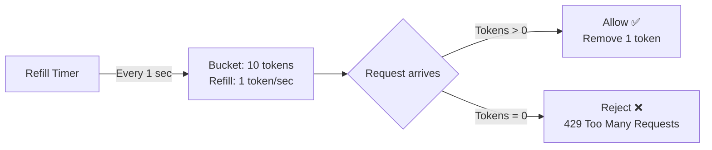
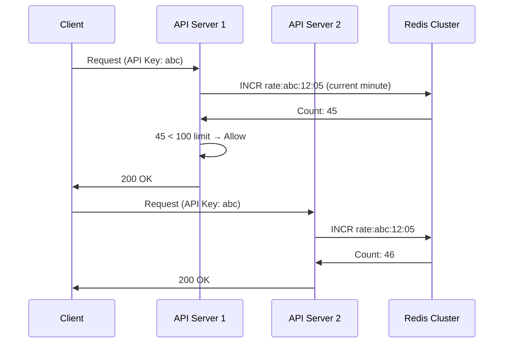
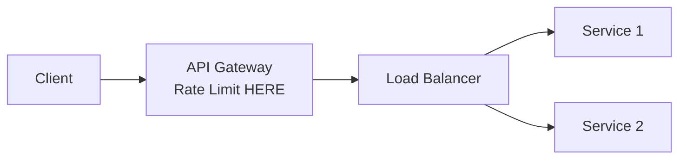

# Design Distributed Rate Limiter — The Bouncer at a Club

## The Bouncer Analogy

A nightclub bouncer counts how many people enter per hour. If the limit is 200/hour and 201st person arrives, they're told "come back later." Now imagine 10 entrances to the same club, each with a bouncer. They need to coordinate — the total across ALL entrances can't exceed 200. That's a distributed rate limiter.

---

## 1. Requirements

### Functional
- Limit API requests per user/IP/API key within a time window
- Support different limits for different API tiers (free: 100/hr, premium: 10K/hr)
- Return appropriate HTTP 429 with `Retry-After` header
- Support both per-second and per-minute/hour windows

### Non-Functional
- **Latency**: < 1ms overhead per request (rate check must be fast)
- **Distributed**: Work across multiple API servers consistently
- **Accuracy**: Slight over-limit is acceptable (not a billing system)
- **Fault tolerant**: If rate limiter is down, allow traffic (fail-open)

---

## 2. Algorithms Compared

### Token Bucket



```java
public class TokenBucket {
    private final int maxTokens;
    private final double refillRate; // tokens per second
    private double tokens;
    private long lastRefillTime;

    public synchronized boolean allowRequest() {
        refill();
        if (tokens >= 1) {
            tokens -= 1;
            return true;
        }
        return false;
    }

    private void refill() {
        long now = System.nanoTime();
        double elapsed = (now - lastRefillTime) / 1_000_000_000.0;
        tokens = Math.min(maxTokens, tokens + elapsed * refillRate);
        lastRefillTime = now;
    }
}
```

### Sliding Window Log

```
Window: 1 minute | Limit: 100 requests

Timeline: [12:00:01, 12:00:15, 12:00:30, ..., 12:00:59]
Request at 12:01:05 → Remove entries before 12:00:05 → Count remaining
If count < 100 → Allow, else Reject
```

### Sliding Window Counter (Best for distributed)

```
Current window (12:00-12:01): 80 requests
Previous window (11:59-12:00): 60 requests
Current position: 12:00:45 (75% through current window)

Weighted count = 80 + (60 × 0.25) = 95
Limit: 100 → Allow ✅
```

| Algorithm | Pros | Cons | Best for |
|-----------|------|------|----------|
| **Token Bucket** | Allows bursts, smooth | Needs per-user state | API rate limiting |
| **Sliding Window Log** | Most accurate | Memory-heavy (stores timestamps) | Low-volume, high-accuracy |
| **Sliding Window Counter** | Memory-efficient, good accuracy | Approximate | High-volume distributed systems |
| **Fixed Window** | Simplest | Burst at window edges | Simple use cases |

<div class="callout-scenario">

**Scenario**: Your API allows 100 requests/minute. With fixed window, a user sends 100 requests at 12:00:59 and 100 more at 12:01:01 — 200 requests in 2 seconds! **Decision**: Use sliding window to prevent edge-of-window bursts. Token bucket also works — it naturally smooths traffic.

</div>

---

## 3. Distributed Rate Limiting with Redis



```java
// Redis-based sliding window counter
public boolean isAllowed(String key, int limit, int windowSeconds) {
    String redisKey = "rate:" + key + ":" + (System.currentTimeMillis() / 1000 / windowSeconds);

    Long count = redis.incr(redisKey);
    if (count == 1) {
        redis.expire(redisKey, windowSeconds); // auto-cleanup
    }

    return count <= limit;
}
```

<div class="callout-tip">

**Applying this** — Use Redis `INCR` + `EXPIRE` for the simplest distributed rate limiter. It's atomic, fast (~0.1ms), and handles multiple API servers naturally since Redis is the single source of truth. For token bucket in Redis, use a Lua script to make the refill + check atomic.

</div>

---

## 4. Rate Limiter Placement



<div class="callout-info">

**Best practice**: Rate limit at the API Gateway level (Kong, AWS API Gateway, Envoy). This catches abuse before it reaches your services. For service-to-service rate limiting, use a sidecar proxy (Envoy/Istio) or library-level limiter (Resilience4j).

</div>

---

## 5. Handling Rate Limiter Failures

| Failure | Strategy | Why |
|---------|----------|-----|
| Redis down | **Fail-open** (allow all traffic) | Better to serve some bad actors than block all users |
| Redis slow | Local in-memory fallback | Each server maintains approximate local counts |
| Network partition | Accept slight over-limit | Distributed systems can't be perfectly accurate |

<div class="callout-warn">

**Warning**: Never fail-closed (block all traffic) when the rate limiter is down. Your rate limiter should protect your system, not become a single point of failure. If Redis is unreachable, fall back to local in-memory rate limiting with relaxed limits.

</div>

---

## 🎯 Interview Corner

<div class="callout-interview">

**Q: "How would you design a rate limiter for a system handling 1 million requests per second?"**

At this scale, even Redis becomes a bottleneck if every request hits it. I'd use a two-tier approach: (1) **Local rate limiter** on each API server — in-memory token bucket that handles 90% of checks without any network call. (2) **Global rate limiter** in Redis — periodically sync local counts to Redis (every 1-5 seconds) for global coordination. Each server gets a "quota" from Redis (e.g., 1000 req/sec out of the global 10K limit). If a server exhausts its local quota, it requests more from Redis. This reduces Redis calls from 1M/sec to ~1000/sec (one per server per sync interval).

**Follow-up trap**: "Doesn't the local limiter allow over-limit?" → Yes, slightly. With 10 servers each allowing 1000/sec locally, the actual limit might be 10,500 instead of 10,000 during sync gaps. For rate limiting, this 5% margin is acceptable. It's not a billing system.

</div>

<div class="callout-interview">

**Q: "Token Bucket vs Sliding Window — which would you choose for an API gateway?"**

Token Bucket. It naturally handles bursty traffic — a user who hasn't made requests for a while has accumulated tokens and can burst. Sliding window is stricter — it counts exact requests in the window. For an API gateway, you WANT to allow some bursts (a mobile app might batch requests on startup). Token bucket also maps naturally to API pricing tiers: free tier = 10 tokens, refill 1/sec; premium = 100 tokens, refill 10/sec. The bucket size controls burst allowance, the refill rate controls sustained throughput.

</div>

<div class="callout-interview">

**Q: "How do you rate limit by different dimensions — per user, per IP, per API endpoint?"**

Use composite keys in Redis: `rate:{user_id}:{endpoint}:{window}`. For example, `rate:user123:/api/search:2024-01-15T12:05`. This lets you enforce different limits per dimension. A user might be allowed 100 requests/min globally, but only 10 requests/min to the `/api/export` endpoint. Check all applicable limits and reject if ANY is exceeded. For IP-based limiting (DDoS protection), use a separate fast path — check IP limit first (cheapest check), then user limit, then endpoint limit.

</div>

---

## Quick Reference

| Concept | One-Liner |
|---------|-----------|
| Token Bucket | Tokens refill at fixed rate, each request consumes one |
| Sliding Window | Count requests in a rolling time window |
| Fixed Window | Count requests in discrete time blocks |
| 429 Status | HTTP "Too Many Requests" response |
| Retry-After | Header telling client when to retry |
| Fail-Open | Allow traffic when rate limiter is down |
| Lua Script | Atomic Redis operations for token bucket |

---

> **A rate limiter is like a fuse in an electrical circuit — it protects the system by cutting off excess before it causes damage. And like a fuse, it should never be the thing that causes the outage.**
