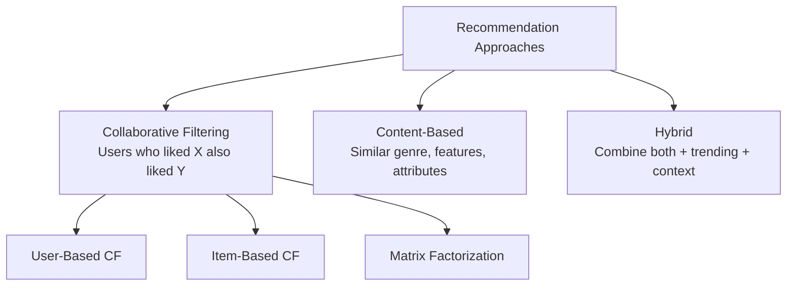
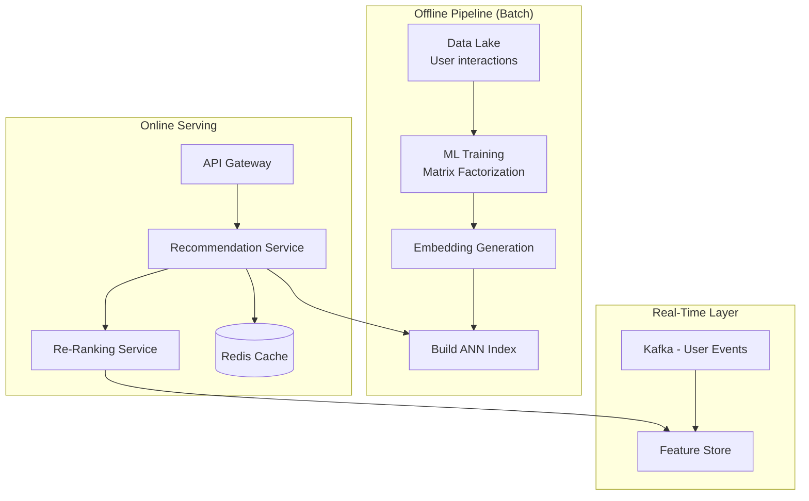
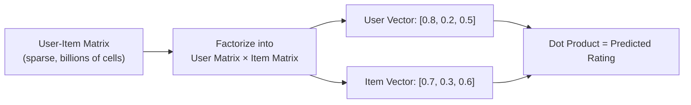

# Design Recommendation System — The Personal Shopper Analogy

## The Personal Shopper Analogy

Imagine a personal shopper who knows every item you've ever bought, every store you've browsed, and what millions of similar shoppers purchased. When you walk into a mall, they instantly curate a personalized storefront just for you. That's a recommendation engine — Netflix, Amazon, Spotify, YouTube all use one.

---

## 1. Requirements

### Functional
- Recommend items based on user's history (views, purchases, ratings)
- Show "Similar items" on product pages
- Display "Trending" and "Popular in your area"
- Support real-time updates (just watched a horror movie → recommend more horror)

### Non-Functional
- **Latency**: < 200ms to generate recommendations
- **Scale**: 100M+ users, billions of items
- **Freshness**: Incorporate recent behavior within minutes
- **Diversity**: Don't create filter bubbles — mix familiar with new

---

## 2. Recommendation Approaches



### Collaborative Filtering — "People Like You"

```
User A: Liked [Movie1, Movie2, Movie3, Movie5]
User B: Liked [Movie1, Movie2, Movie3, Movie4]

User A and B are similar (3 common likes)
→ Recommend Movie4 to User A
→ Recommend Movie5 to User B
```

### Content-Based — "Items Like This"

```
Movie X: {genre: thriller, director: Nolan, actors: [DiCaprio], year: 2010}
Movie Y: {genre: thriller, director: Nolan, actors: [Hardy], year: 2017}

Similarity score: 0.85 → Recommend Y to users who liked X
```

<div class="callout-scenario">

**Scenario**: A new user signs up with zero history (cold start problem). Collaborative filtering can't work — no data to find similar users. **Decision**: Use content-based recommendations initially (popular items, trending in their region). After 5-10 interactions, switch to hybrid. Ask for preferences during onboarding ("Pick 3 genres you like") to bootstrap the model.

</div>

---

## 3. Architecture



**Key insight**: Recommendations are computed in two phases:
1. **Offline** (hourly/daily): Train ML models, generate user/item embeddings, build candidate lists
2. **Online** (per request): Fetch pre-computed candidates, re-rank using real-time signals (time of day, device, recent clicks)

<div class="callout-tip">

**Applying this** — Never compute recommendations from scratch at request time for 100M users. Pre-compute candidate lists offline and cache them. The online layer only re-ranks and filters. This keeps latency under 200ms.

</div>

---

## 4. Matrix Factorization — How Netflix Does It



Each user and item is represented as a vector in a latent space. The dot product of user vector and item vector predicts how much the user will like the item. Dimensions might represent abstract concepts like "action-ness", "romance-ness", "complexity."

---

## 5. Handling the Cold Start Problem

| Scenario | Solution |
|----------|---------|
| **New user, no history** | Popular items, trending, demographic-based |
| **New item, no ratings** | Content-based similarity to existing items |
| **New user + new item** | Global popularity + onboarding preferences |

<div class="callout-interview">

🎯 **Interview Ready** — "How do you handle the cold start problem?" → Three strategies: (1) For new users, show globally popular and trending items. During onboarding, ask for 3-5 preferences to bootstrap. (2) For new items, use content features (genre, description, metadata) to find similar existing items and piggyback on their recommendations. (3) Use a multi-armed bandit approach — show new items to a small percentage of users, measure engagement, and promote items that perform well. This balances exploitation (showing known good items) with exploration (discovering new items).

</div>

---

## 🎯 Interview Corner

<div class="callout-interview">

**Q: "How would you design a recommendation system for an e-commerce site with 50 million products?"**

I'd use a two-stage architecture. **Stage 1 — Candidate Generation**: Use multiple sources to generate ~1000 candidates per user. (a) Collaborative filtering — items liked by similar users. (b) Content-based — items similar to user's purchase history. (c) Trending — popular items in user's category/region. I'd use Approximate Nearest Neighbor (ANN) search with FAISS or Pinecone on item embeddings for fast retrieval. **Stage 2 — Ranking**: A neural network re-ranks the 1000 candidates using features like: user demographics, item freshness, price range, real-time session context. Output: top 20 personalized recommendations. Pre-compute Stage 1 offline, run Stage 2 online.

**Follow-up trap**: "How do you avoid filter bubbles?" → Add a diversity constraint — ensure recommendations span at least 3 categories. Use exploration (10% of recommendations are random from outside the user's usual preferences). Track and optimize for long-term engagement, not just click-through rate.

</div>

<div class="callout-interview">

**Q: "Collaborative filtering vs content-based — when would you use each?"**

Collaborative filtering works best when you have rich user interaction data (millions of users with ratings/purchases). It discovers non-obvious patterns — "users who bought diapers also bought beer." Content-based works best for new items or niche domains where user data is sparse. It uses item features (genre, description, price) to find similar items. In practice, always use hybrid. Netflix uses collaborative filtering for the main recommendation, content-based for "Because you watched X", and trending for "Popular on Netflix." The hybrid approach covers each method's weaknesses.

</div>

<div class="callout-interview">

**Q: "How do you evaluate if your recommendation system is working?"**

Offline metrics: Precision@K (how many of top K recommendations were relevant), Recall@K, NDCG (ranking quality), AUC. Online metrics: Click-Through Rate (CTR), conversion rate, time spent, user retention. The most important metric depends on the business — Netflix optimizes for watch time, Amazon for purchase conversion, Spotify for listening duration. Always A/B test changes — deploy new model to 5% of users, compare metrics against the control group. A model with better offline metrics doesn't always win online — user behavior is complex.

</div>

---

## Quick Reference

| Concept | One-Liner |
|---------|-----------|
| Collaborative Filtering | Recommend based on similar users' behavior |
| Content-Based | Recommend based on item feature similarity |
| Matrix Factorization | Decompose user-item matrix into latent vectors |
| Cold Start | No data for new users/items — use fallback strategies |
| ANN Search | Fast approximate nearest neighbor for embedding lookup |
| Re-Ranking | Online model that re-orders candidates using real-time features |
| Filter Bubble | User only sees content similar to past behavior |
| A/B Testing | Compare recommendation models on real users |

---

> **A great recommendation system doesn't just show you what you want — it shows you what you didn't know you wanted. That's the difference between search and discovery.**
