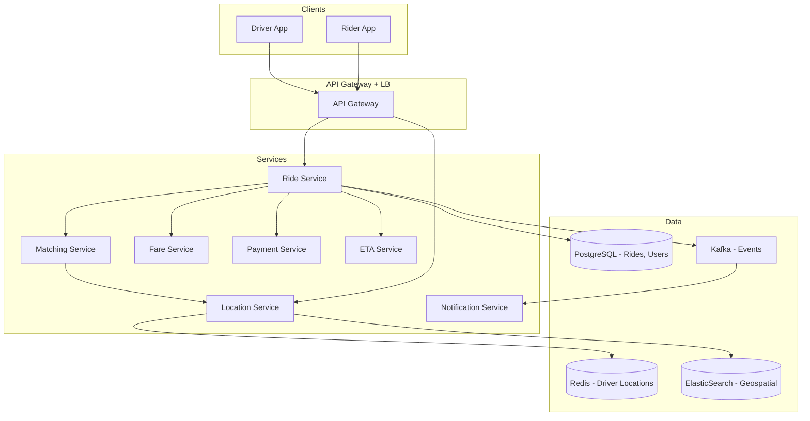
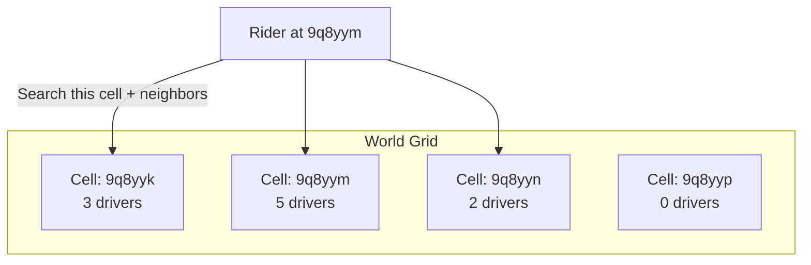
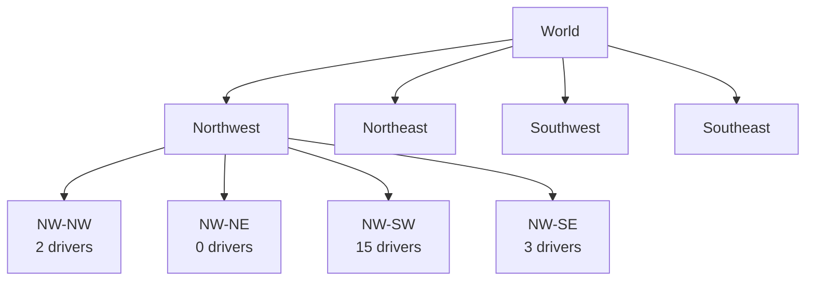
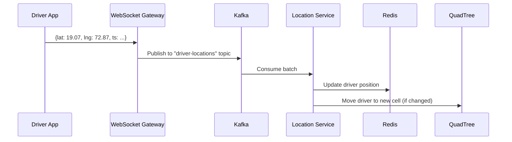
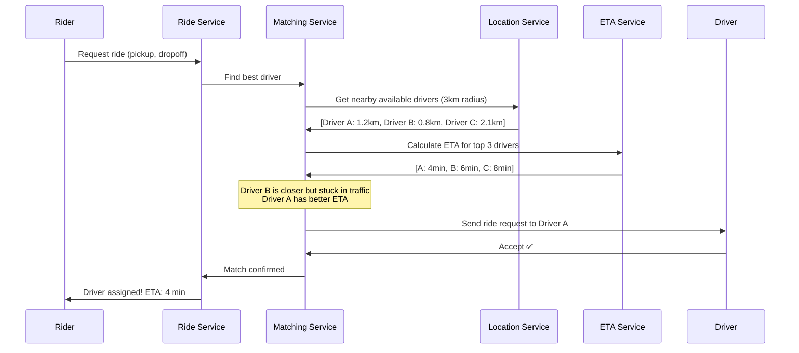
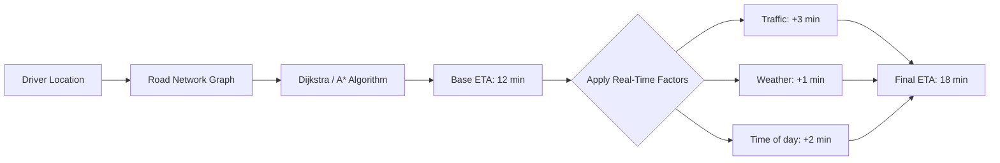
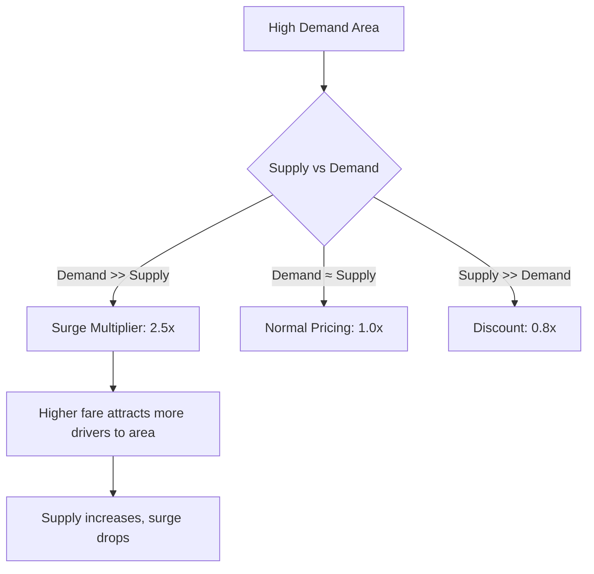
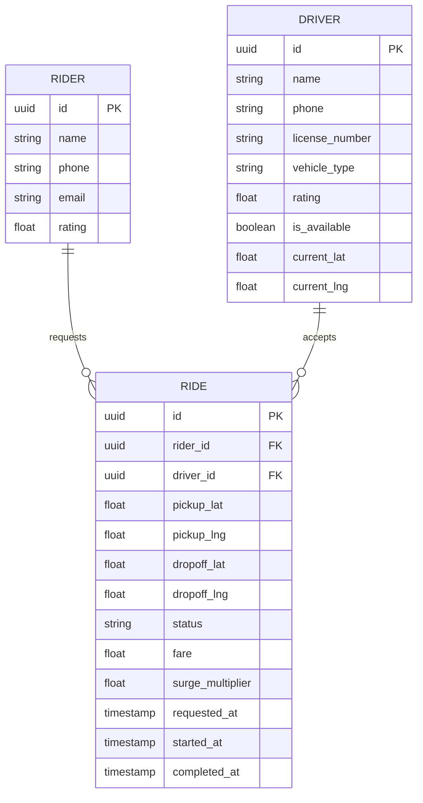

# Design Uber / Ola / Lyft — The Matchmaking Service Analogy

## The Matchmaking Analogy

Think of a wedding matchmaker in a small town. People come to her saying "I need a partner." She knows everyone in town — who's available, where they live, what they're looking for. She matches people based on proximity, compatibility, and availability. Now scale that to a city with 10 million people, all looking for matches in real-time, and the "partners" (drivers) are constantly moving.

**That's Uber** — a real-time matchmaking system between riders and drivers, where the "partners" are on the move, and the match must happen in seconds.

---

## 1. Requirements — What Are We Building?

### Functional Requirements
- Rider requests a ride from location A to location B
- System finds the nearest available driver and assigns the ride
- Real-time tracking of driver location (before and during ride)
- ETA calculation — when will driver arrive? When will ride end?
- Fare calculation based on distance, time, surge pricing
- Payment processing after ride completion
- Rating system for both riders and drivers

### Non-Functional Requirements
- **Low latency**: Match rider to driver in < 5 seconds
- **High availability**: 99.99% uptime — people depend on this for transportation
- **Scalability**: Handle millions of concurrent rides globally
- **Real-time**: Driver location updates every 3-5 seconds
- **Consistency**: A driver can only be assigned to ONE ride at a time

---

## 2. High-Level Architecture



---

## 3. The Core Problem — Geospatial Indexing

The hardest part of Uber isn't the app — it's answering: **"Which drivers are within 3 km of this rider, right now?"**

### Approach 1: Naive — Query All Drivers

```sql
-- ❌ Terrible — scans ALL drivers
SELECT * FROM drivers
WHERE is_available = true
AND calculate_distance(driver_lat, driver_lng, rider_lat, rider_lng) < 3.0;
```

With 500K active drivers, this query takes seconds. Unacceptable.

### Approach 2: Geohashing — The Smart Way

Divide the world into a grid. Each cell gets a unique hash. Drivers in the same cell share the same geohash prefix.



```java
// Geohash-based driver lookup
public List<Driver> findNearbyDrivers(double lat, double lng, double radiusKm) {
    String riderGeohash = Geohash.encode(lat, lng, 6); // precision 6 = ~1.2km cell
    Set<String> neighborCells = Geohash.neighbors(riderGeohash);
    neighborCells.add(riderGeohash);

    List<Driver> candidates = new ArrayList<>();
    for (String cell : neighborCells) {
        // Redis: each cell is a key, drivers are in a sorted set
        candidates.addAll(redis.smembers("drivers:" + cell));
    }

    // Filter by exact distance and availability
    return candidates.stream()
        .filter(Driver::isAvailable)
        .filter(d -> haversineDistance(lat, lng, d.getLat(), d.getLng()) <= radiusKm)
        .sorted(Comparator.comparingDouble(d -> haversineDistance(lat, lng, d.getLat(), d.getLng())))
        .collect(Collectors.toList());
}
```

<div class="callout-info">

**Why Geohash?** Instead of scanning 500K drivers, you only scan drivers in 9 cells (~50-100 drivers). That's a 5000x reduction in search space. Redis lookup is O(1) per cell.

</div>

### Approach 3: QuadTree — Uber's Actual Approach



QuadTree recursively divides space into 4 quadrants. Dense areas (city centers) get subdivided more. Sparse areas (rural) stay as large cells. This adapts to driver density automatically.

<div class="callout-scenario">

**Scenario**: Mumbai city center has 10,000 drivers in a 5km radius. Rural Maharashtra has 50 drivers in 100km. **Decision**: QuadTree adapts — city center cells are tiny (100m), rural cells are huge (10km). Geohash with fixed precision can't do this. For Uber-scale, QuadTree wins.

</div>

---

## 4. Driver Location Updates — The Firehose

Every driver sends location every 3-5 seconds. With 1 million active drivers:

**1M drivers × 1 update/4 sec = 250,000 location updates per second**



<div class="callout-tip">

**Applying this** — Don't update the QuadTree on every location ping. Only update when the driver crosses a cell boundary. Most updates are within the same cell (driver moved 50 meters). This reduces QuadTree writes by ~90%.

</div>

---

## 5. Ride Matching — The Dispatch Algorithm



**Matching factors (not just distance):**
- ETA (road distance, not straight line)
- Driver rating
- Driver's heading direction (already driving toward rider?)
- Vehicle type match (rider requested SUV)
- Driver acceptance rate history

<div class="callout-warn">

**Warning**: Never assign based on straight-line distance alone. A driver 500m away across a river might take 20 minutes. A driver 2km away on the same road might take 3 minutes. Always use road-network ETA.

</div>

---

## 6. ETA Calculation



**How Uber calculates ETA:**
1. **Road network graph** — map data from OpenStreetMap or HERE Maps
2. **Historical travel times** — "This road segment takes 5 min at 8 AM on Monday"
3. **Real-time GPS traces** — aggregate speed from all active drivers on that road
4. **ML model** — trained on billions of past trips to predict ETA

<div class="callout-interview">

🎯 **Interview Ready** — "How would you calculate ETA?" → I'd use a graph-based approach with road segments as edges and intersections as nodes. Edge weights are travel times, not distances. Base weights come from historical data, adjusted in real-time using GPS traces from active drivers. For the shortest path, I'd use A* (faster than Dijkstra for point-to-point). The ML layer on top adjusts for time-of-day, weather, and events. Uber's actual system (DeepETA) uses a transformer model trained on billions of trips.

</div>

---

## 7. Surge Pricing — Supply and Demand



<div class="callout-scenario">

**Scenario**: Concert ends at 11 PM. 5,000 people request rides simultaneously in a 1km area. Only 200 drivers nearby. **Decision**: Surge pricing kicks in at 3x. This does two things: (1) discourages non-urgent riders, (2) attracts drivers from nearby areas who see higher earnings. Within 15 minutes, supply catches up and surge drops to 1.5x.

</div>

---

## 8. Database Design



**Storage decisions:**
| Data | Store | Why |
|------|-------|-----|
| User profiles, ride history | PostgreSQL | Relational, ACID, complex queries |
| Driver real-time locations | Redis (Geospatial) | Ultra-fast reads, `GEORADIUS` command |
| Location history (analytics) | Cassandra / S3 | Write-heavy, time-series, append-only |
| Ride events | Kafka | Event streaming, decoupling |
| Geospatial search | QuadTree in memory | Fastest spatial queries |

---

## 9. Handling Failures

| Failure | Impact | Solution |
|---------|--------|----------|
| Driver app crashes mid-ride | Rider stranded | Server-side ride state machine. If no driver heartbeat for 60s, alert rider + assign new driver |
| Payment fails | Ride completed but unpaid | Queue payment retry. Don't block ride completion for payment |
| Matching service down | No new rides | Circuit breaker + fallback to simple nearest-driver matching |
| Location service lag | Stale driver positions | TTL on location data. If location > 30s old, mark driver as "uncertain" |

<div class="callout-tip">

**Applying this** — Always design ride state as a state machine: `REQUESTED → MATCHED → DRIVER_EN_ROUTE → ARRIVED → IN_PROGRESS → COMPLETED → PAID`. Each transition is an event in Kafka. If any service crashes, you can rebuild state from the event log.

</div>

---

## 🎯 Interview Corner

<div class="callout-interview">

**Q: "How would you store and query driver locations efficiently?"**

I'd use a two-layer approach. **Layer 1: Redis** with geospatial commands — `GEOADD` to update driver positions, `GEORADIUS` to find drivers within X km. This gives O(log N) performance. **Layer 2: In-memory QuadTree** for the matching service — it adapts cell sizes to driver density (small cells in cities, large in rural). Drivers update Redis every 3-5 seconds. The QuadTree only updates when a driver crosses a cell boundary. For 1M active drivers, Redis handles 250K writes/sec easily. The QuadTree search returns candidates in microseconds.

**Follow-up trap**: "What about consistency between Redis and QuadTree?" → They're eventually consistent, which is fine. A driver's position being 5 seconds stale doesn't matter — the matching service recalculates ETA using the latest position anyway.

</div>

<div class="callout-interview">

**Q: "How do you prevent two riders from being matched to the same driver?"**

Distributed locking. When the matching service selects a driver, it acquires a Redis lock on that driver's ID with a short TTL (10 seconds). If another matching request tries the same driver, the lock fails and it picks the next best driver. After the driver accepts/rejects, the lock is released. I'd use Redis `SET NX EX` (set if not exists, with expiry) for atomic lock acquisition. This is simpler and faster than database-level locking.

**Follow-up trap**: "What if the lock expires before the driver responds?" → Set TTL slightly longer than the driver response timeout (e.g., lock TTL = 15s, driver timeout = 10s). If the driver doesn't respond in 10s, the ride is re-queued and the lock expires naturally.

</div>

<div class="callout-interview">

**Q: "How would you handle a city-wide event where demand spikes 10x?"**

Three things: (1) **Auto-scaling** — matching service and ride service scale horizontally based on request queue depth. (2) **Surge pricing** — automatically kicks in to balance supply/demand. Higher fares attract drivers from neighboring areas. (3) **Request queuing** — instead of rejecting requests, queue them with estimated wait times. Process in order as drivers become available. I'd also pre-position drivers near the event venue based on historical data (e.g., we know a cricket match at Wankhede ends at 10 PM every time). Proactive supply positioning is better than reactive surge.

</div>

<div class="callout-interview">

**Q: "Design the ride state machine and handle edge cases."**

States: `REQUESTED → MATCHING → DRIVER_ASSIGNED → DRIVER_EN_ROUTE → DRIVER_ARRIVED → RIDE_IN_PROGRESS → RIDE_COMPLETED → PAYMENT_PROCESSED`. Edge cases: (1) **Driver cancels after accepting** — move back to MATCHING, find new driver, penalize driver's acceptance score. (2) **Rider cancels after driver is en route** — charge cancellation fee if driver is within 2 min of pickup. (3) **Driver goes offline mid-ride** — server detects missing heartbeat, alerts rider, attempts to contact driver, if no response in 2 min, assign rescue driver. (4) **GPS signal lost** — use last known position + estimated speed to interpolate. Resume tracking when signal returns. Each state transition is an event in Kafka for audit trail and analytics.

</div>

---

## Quick Reference

| Concept | One-Liner |
|---------|-----------|
| Geohash | Encode lat/lng into a string, nearby locations share prefix |
| QuadTree | Recursive spatial index, adapts to density |
| GEORADIUS | Redis command to find points within radius |
| Surge Pricing | Dynamic pricing based on supply/demand ratio |
| Dispatch | Algorithm to match riders with optimal drivers |
| ETA | Estimated time using road network + real-time traffic |
| Haversine | Formula to calculate distance between two lat/lng points |
| State Machine | Ride lifecycle managed as state transitions |
| Heartbeat | Periodic signal from driver app to confirm connectivity |

---

> **Uber isn't a taxi company — it's a real-time matching engine. The magic isn't in the car, it's in the algorithm that connects the right driver to the right rider in seconds.**
