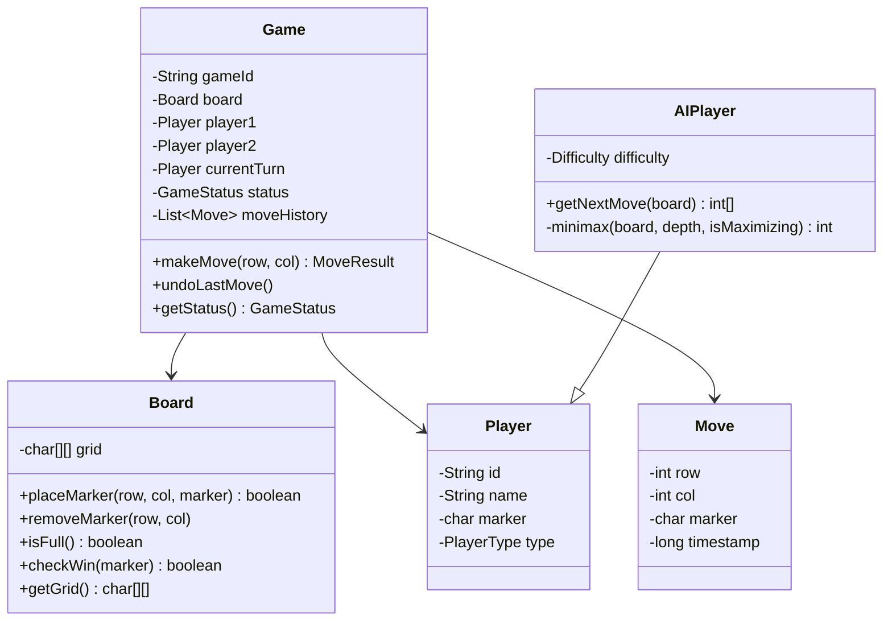
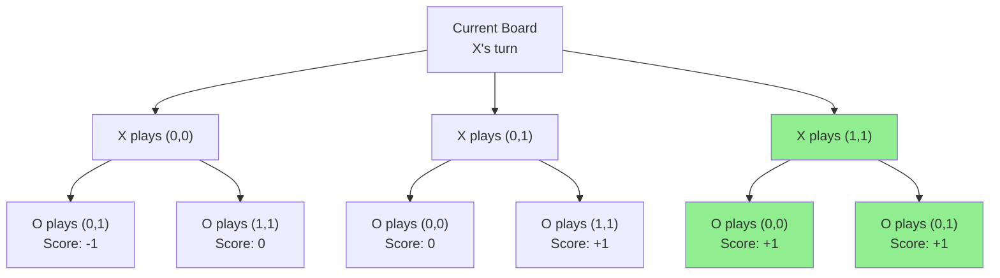
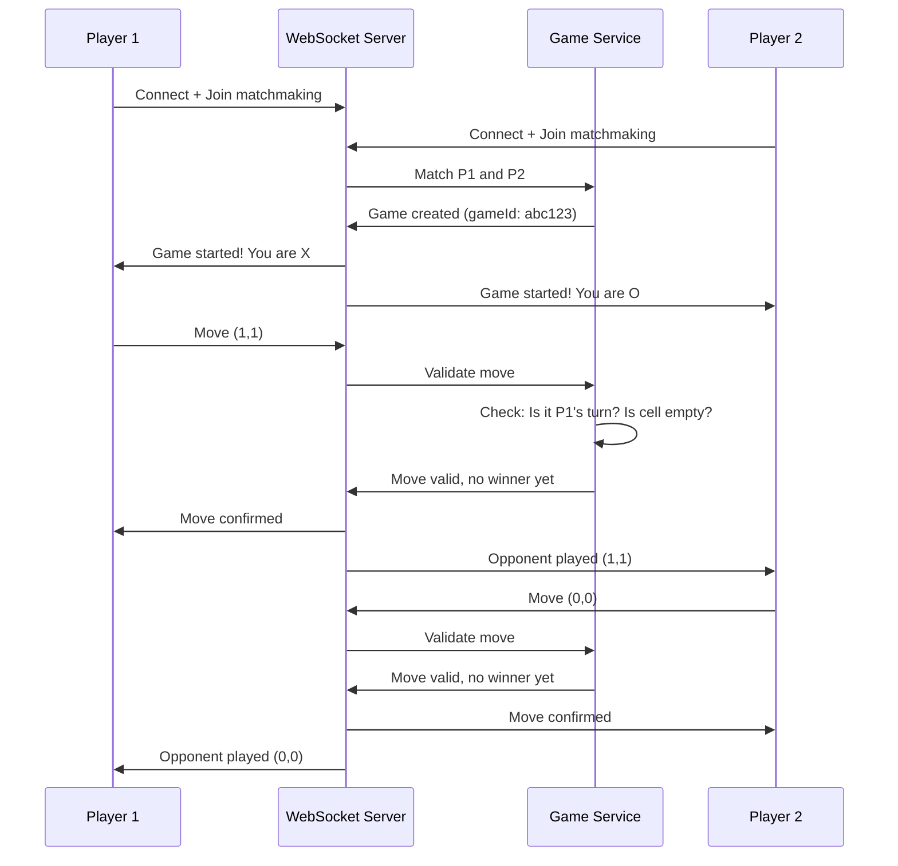

# Design Tic-Tac-Toe Game — The Strategy Board Analogy

## The Strategy Board Analogy

Tic-Tac-Toe seems simple — a 3×3 grid, two players, first to get three in a row wins. But designing it as a system reveals interesting challenges: game state management, AI opponents, win detection algorithms, and if you make it multiplayer online — real-time synchronization, cheating prevention, and matchmaking.

---

## 1. Requirements

### Functional
- Two-player game (Human vs Human or Human vs Computer)
- 3×3 grid, players alternate placing X and O
- Detect win (row/column/diagonal), draw, or ongoing
- Support undo/redo moves
- Online multiplayer with matchmaking

### Non-Functional
- **Real-time**: Move reflected on opponent's screen in < 100ms
- **Fair**: Prevent cheating (playing out of turn, modifying board)
- **Scalable**: Support thousands of concurrent games

---

## 2. Class Design (LLD)



---

## 3. Win Detection — The O(1) Approach

### Naive: Check All Lines After Every Move — O(n²)

```java
// ❌ Checks all rows, columns, diagonals every time
public boolean checkWin(char[][] grid, char marker) {
    // Check rows, columns, diagonals...
    // Works but inefficient for larger boards
}
```

### Smart: Track Counts — O(1) Per Move

```java
public class WinDetector {
    private int[] rowCounts;    // sum per row
    private int[] colCounts;    // sum per column
    private int diagCount;       // main diagonal sum
    private int antiDiagCount;   // anti-diagonal sum
    private int n;

    public WinDetector(int size) {
        this.n = size;
        rowCounts = new int[n];
        colCounts = new int[n];
    }

    // Returns true if this move wins
    public boolean recordMove(int row, int col, char marker) {
        int value = (marker == 'X') ? 1 : -1;

        rowCounts[row] += value;
        colCounts[col] += value;
        if (row == col) diagCount += value;
        if (row + col == n - 1) antiDiagCount += value;

        // Win if any line sums to +n (X wins) or -n (O wins)
        return Math.abs(rowCounts[row]) == n
            || Math.abs(colCounts[col]) == n
            || Math.abs(diagCount) == n
            || Math.abs(antiDiagCount) == n;
    }
}
```

<div class="callout-info">

**Key insight**: Instead of scanning the entire board, track running sums. X adds +1, O adds -1. If any row/column/diagonal sum reaches +3 or -3, that player wins. This is O(1) per move regardless of board size.

</div>

---

## 4. AI Opponent — Minimax Algorithm



```java
public int minimax(char[][] board, int depth, boolean isMaximizing) {
    if (checkWin(board, 'X')) return 10 - depth;  // X wins (AI), prefer faster wins
    if (checkWin(board, 'O')) return depth - 10;   // O wins (human), prefer slower losses
    if (isBoardFull(board)) return 0;              // Draw

    if (isMaximizing) {
        int bestScore = Integer.MIN_VALUE;
        for (int[] move : getAvailableMoves(board)) {
            board[move[0]][move[1]] = 'X';
            int score = minimax(board, depth + 1, false);
            board[move[0]][move[1]] = ' '; // undo
            bestScore = Math.max(bestScore, score);
        }
        return bestScore;
    } else {
        int bestScore = Integer.MAX_VALUE;
        for (int[] move : getAvailableMoves(board)) {
            board[move[0]][move[1]] = 'O';
            int score = minimax(board, depth + 1, true);
            board[move[0]][move[1]] = ' '; // undo
            bestScore = Math.min(bestScore, score);
        }
        return bestScore;
    }
}
```

<div class="callout-scenario">

**Scenario**: Both players play optimally in Tic-Tac-Toe. **Decision**: The game ALWAYS ends in a draw. Minimax proves this mathematically. That's why Tic-Tac-Toe is a "solved game." For difficulty levels: Easy = random moves, Medium = minimax with depth limit, Hard = full minimax (unbeatable).

</div>

---

## 5. Online Multiplayer Architecture



<div class="callout-tip">

**Applying this** — NEVER trust the client. All game logic (turn validation, win detection, move legality) must happen on the server. The client only sends "I want to place at (row, col)." The server validates and broadcasts the result. This prevents cheating.

</div>

---

## 🎯 Interview Corner

<div class="callout-interview">

**Q: "How would you extend this to a larger board (e.g., 15×15 Gomoku — five in a row)?"**

The O(1) win detection with row/column sums doesn't work for "five in a row" on a 15×15 board because you need consecutive marks, not just total count. I'd switch to checking only the lines passing through the last move — 4 directions (horizontal, vertical, two diagonals), count consecutive marks in each direction from the placed position. This is O(k) where k is the win length (5), not O(n²). For the AI, minimax is too slow for 15×15 (225 cells). I'd use Alpha-Beta pruning to cut the search tree, limit depth to 4-5 moves ahead, and use a heuristic evaluation function that scores board positions based on open-ended sequences.

**Follow-up trap**: "What's the time complexity of minimax for Tic-Tac-Toe?" → O(9!) in the worst case = 362,880 states. With alpha-beta pruning, it drops to ~O(9^(9/2)) ≈ ~20,000 states. For 3×3, even brute force is instant. For larger boards, pruning is essential.

</div>

<div class="callout-interview">

**Q: "How do you handle a player disconnecting mid-game?"**

Start a reconnection timer (30 seconds). If the player reconnects within the window, restore the game state from the server (server is the source of truth). If they don't reconnect, the opponent wins by forfeit. For the reconnecting player, send the full game state (board, whose turn, move history) so they can resume seamlessly. Use WebSocket heartbeats (ping/pong every 5 seconds) to detect disconnections quickly rather than waiting for TCP timeout.

</div>

---

## Quick Reference

| Concept | One-Liner |
|---------|-----------|
| Minimax | Algorithm that assumes both players play optimally |
| Alpha-Beta Pruning | Optimization that skips branches that can't affect the result |
| O(1) Win Detection | Track row/col/diagonal sums instead of scanning board |
| Server Authority | All game logic validated server-side to prevent cheating |
| WebSocket | Bidirectional real-time communication for multiplayer |
| Solved Game | Tic-Tac-Toe always draws with optimal play from both sides |

---

> **Tic-Tac-Toe teaches you more about system design than you'd expect — state machines, AI algorithms, real-time sync, and the golden rule: never trust the client.**
