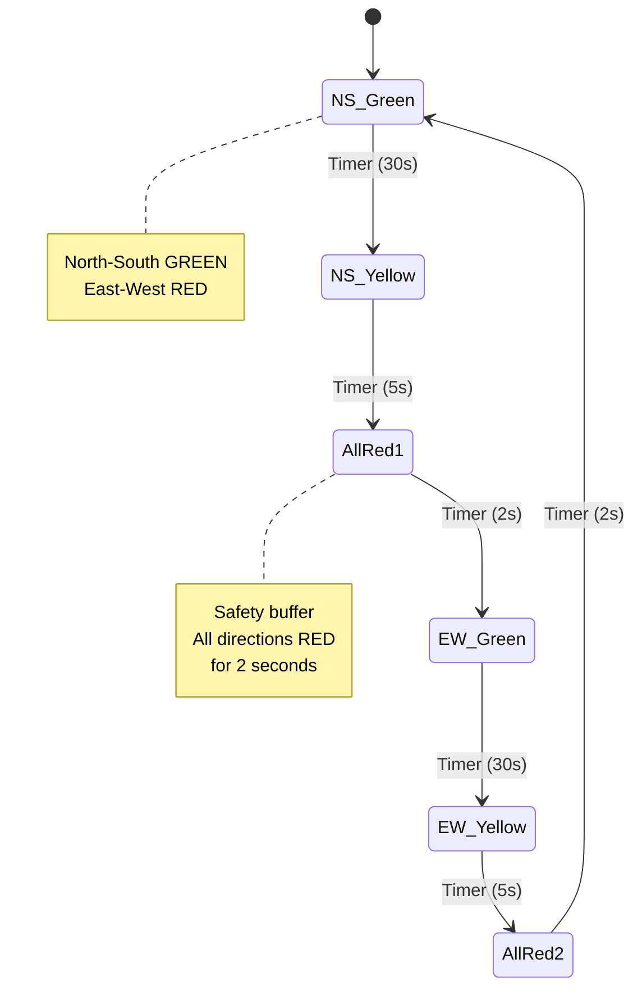
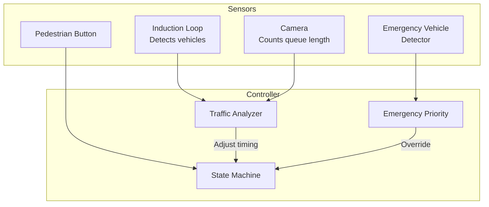
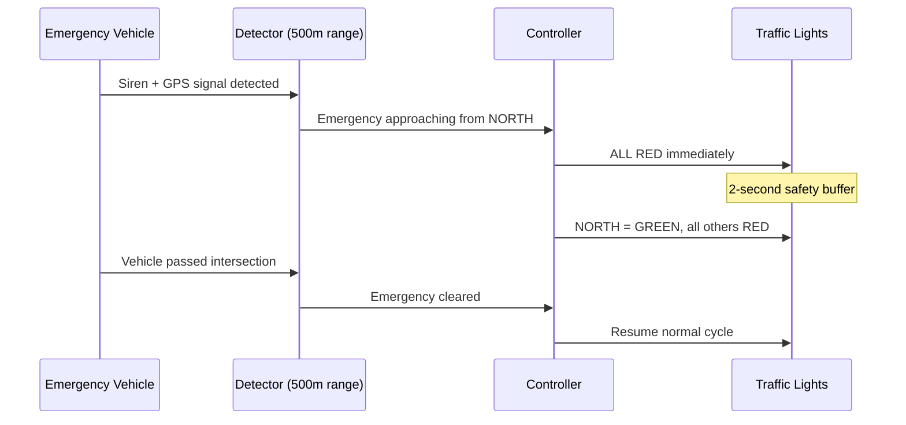
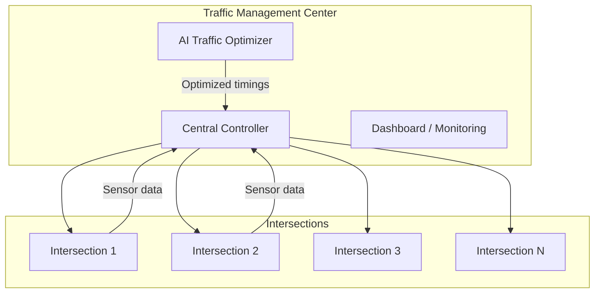

# Design Traffic Control System — The Orchestra Conductor Analogy

## The Orchestra Conductor Analogy

A traffic control system is like an orchestra conductor. Each intersection is a musician, each road is an instrument. The conductor must ensure no two instruments clash (no two green lights conflict), maintain rhythm (timing cycles), and adapt to the audience (traffic volume). A bad conductor causes chaos — a bad traffic system causes accidents.

---

## 1. Requirements

### Functional
- Control traffic lights at intersections (RED, YELLOW, GREEN)
- Ensure no conflicting directions get GREEN simultaneously
- Support timed cycles and sensor-triggered changes
- Emergency vehicle override (all RED except emergency path)
- Pedestrian crossing signals

### Non-Functional
- **Safety**: NEVER show GREEN for conflicting directions — this is life-critical
- **Real-time**: Light changes must happen within milliseconds
- **Fault tolerance**: Default to flashing RED (all-way stop) on failure
- **Scalability**: Support thousands of intersections in a city

---

## 2. State Machine — The Core Design



<div class="callout-warn">

**Warning**: The ALL-RED phase between transitions is non-negotiable. It accounts for vehicles that entered the intersection during YELLOW. Skipping it causes accidents. Typical duration: 1-3 seconds depending on intersection size.

</div>

---

## 3. Smart Traffic — Sensor-Based Adaptation



### Adaptive Timing Algorithm

```java
public int calculateGreenDuration(IntersectionData data) {
    int baseGreen = 30; // seconds
    int queueLength = data.getVehicleCount();
    int waitingTime = data.getMaxWaitTime();

    // Extend green if heavy traffic
    if (queueLength > 20) baseGreen += 15;
    else if (queueLength > 10) baseGreen += 8;

    // Cap at 60 seconds to prevent starvation
    return Math.min(baseGreen, 60);
}
```

<div class="callout-scenario">

**Scenario**: It's 2 AM. North-South road has zero traffic. East-West has one car waiting. Fixed timer would make that car wait 30 seconds for no reason. **Decision**: Use sensor-triggered mode at night — light stays GREEN for the direction with traffic. Changes only when a vehicle is detected on the other road. Saves fuel, reduces wait times, and is safer (less temptation to run red lights).

</div>

---

## 4. Emergency Vehicle Override



<div class="callout-tip">

**Applying this** — In a real system, emergency preemption uses either optical sensors (detecting strobe lights) or GPS-based systems (vehicle broadcasts its position). The controller creates a "green wave" — turning multiple consecutive intersections green along the emergency route. This can reduce emergency response times by 20-30%.

</div>

---

## 5. Conflict Matrix — Safety Guarantee

The conflict matrix defines which signal phases can NEVER be green simultaneously:

| | North Straight | North Left | East Straight | East Left | Pedestrian N-S | Pedestrian E-W |
|---|---|---|---|---|---|---|
| **North Straight** | - | ✅ | ❌ | ❌ | ❌ | ✅ |
| **North Left** | ✅ | - | ❌ | ❌ | ❌ | ❌ |
| **East Straight** | ❌ | ❌ | - | ✅ | ✅ | ❌ |
| **East Left** | ❌ | ❌ | ✅ | - | ❌ | ❌ |

✅ = Can be green together | ❌ = CONFLICT — never green together

```java
// Safety check before ANY state transition
public boolean isSafeTransition(SignalPhase newPhase, Set<SignalPhase> currentGreen) {
    for (SignalPhase active : currentGreen) {
        if (conflictMatrix[active.ordinal()][newPhase.ordinal()]) {
            return false; // CONFLICT — block this transition
        }
    }
    return true;
}
```

<div class="callout-info">

**Key insight**: The conflict matrix is the ULTIMATE safety net. Even if the software has a bug, the hardware controller checks the conflict matrix before energizing any green signal. If a conflict is detected, the system goes to flashing RED (fail-safe mode). This is a hardware-level guarantee, not just software.

</div>

---

## 6. Centralized City-Wide Control



**Green Wave**: Coordinate consecutive intersections so a vehicle traveling at the speed limit hits all green lights. This requires synchronizing cycle offsets across intersections on the same corridor.

---

## 🎯 Interview Corner

<div class="callout-interview">

**Q: "What happens in the worst case where the system shows GREEN for conflicting directions?"**

This is a life-safety scenario. The system has multiple layers of protection: (1) **Software layer** — conflict matrix check before every transition. (2) **Hardware layer** — a Conflict Monitor Unit (CMU) is a separate hardware device that continuously monitors signal outputs. If it detects conflicting greens, it immediately forces ALL signals to flashing RED and disconnects the controller. (3) **Fail-safe default** — if the controller crashes or loses power, signals default to flashing RED (all-way stop). The CMU is independent of the controller software — even if the software is completely compromised, the hardware prevents dangerous states.

**Follow-up trap**: "Can you guarantee this with just software?" → No. Safety-critical systems always have hardware interlocks. Software can have bugs. The CMU is a simple, proven circuit that's been used for decades. It's the last line of defense.

</div>

<div class="callout-interview">

**Q: "How would you design this using design patterns?"**

I'd use the **State Pattern** for the traffic light states (Green, Yellow, Red, FlashingRed). Each state knows its duration and the next state. The **Observer Pattern** for sensors notifying the controller of vehicle detection. The **Strategy Pattern** for different timing algorithms (fixed timer, adaptive, emergency override). The **Command Pattern** for queuing and executing signal changes. This makes the system extensible — adding a new signal phase or sensor type doesn't require modifying existing code.

</div>

<div class="callout-interview">

**Q: "How do you determine the optimal timing for each phase?"**

Webster's formula is the classic approach: optimal cycle length = (1.5L + 5) / (1 - Y), where L is total lost time and Y is the sum of critical flow ratios. In practice, modern systems use reinforcement learning — the AI observes queue lengths, wait times, and throughput, then adjusts timings to minimize total delay. Google's Project Green Light uses AI to optimize traffic signals and has reduced stops by 30% and emissions by 10% at pilot intersections. The key metric is **intersection delay** — the average time a vehicle waits at the intersection.

</div>

---

## Quick Reference

| Concept | One-Liner |
|---------|-----------|
| Phase | A set of non-conflicting signal indications shown together |
| Cycle | One complete sequence of all phases |
| All-Red | Safety buffer where all directions are RED |
| Conflict Matrix | Defines which phases can never be green simultaneously |
| CMU | Hardware device that prevents conflicting greens |
| Green Wave | Synchronized signals for continuous flow on a corridor |
| Preemption | Emergency vehicle override of normal signal timing |
| Actuation | Sensor-triggered signal changes vs fixed timer |

---

> **A traffic control system's #1 job isn't moving cars faster — it's making sure no one dies. Safety first, efficiency second.**
