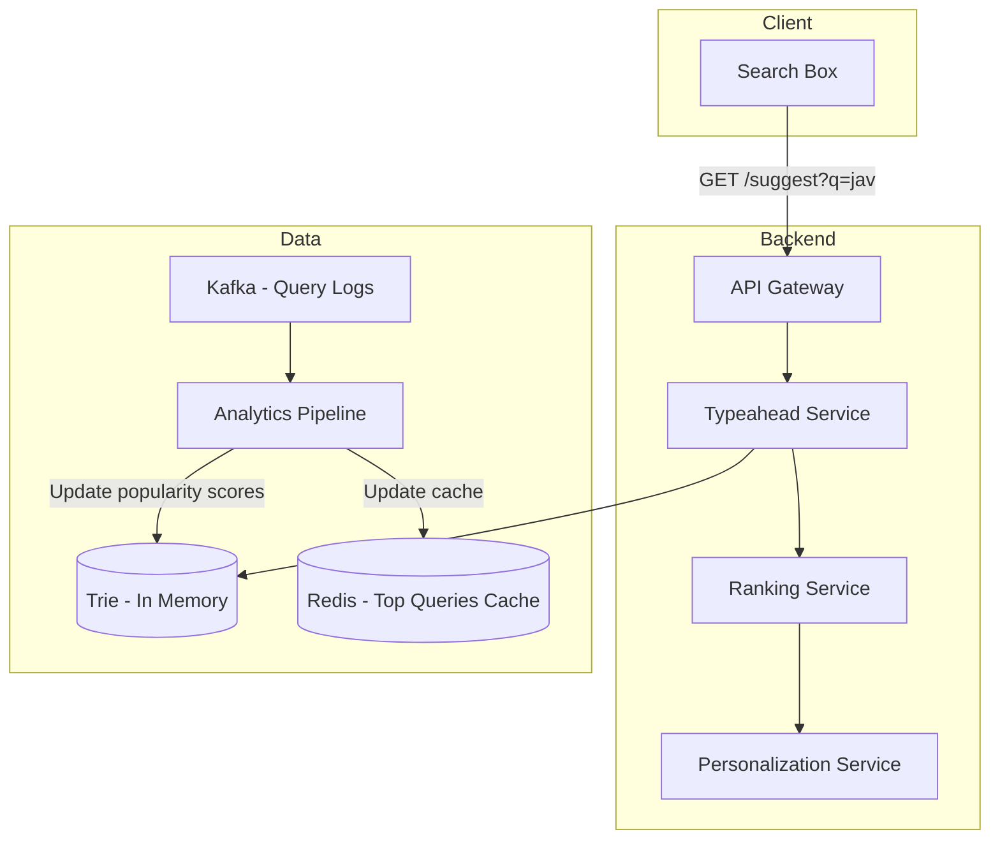
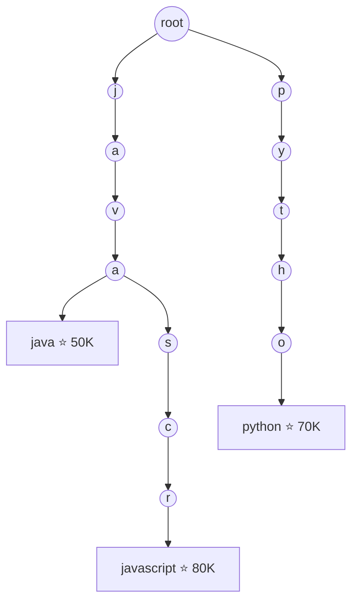
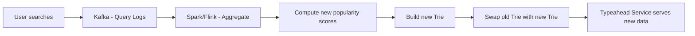

# Design Typeahead / Autocomplete — The Librarian Who Finishes Your Sentences

## The Librarian Analogy

Imagine a librarian who, the moment you say "I'm looking for a book about quant—", immediately suggests "Quantum Physics?", "Quantitative Finance?", "Quantum Computing?" — ranked by what most people search for. She does this in under 100ms, for millions of visitors simultaneously. That's typeahead search.

---

## 1. Requirements

### Functional
- Show top 5-10 suggestions as user types
- Suggestions ranked by popularity/relevance
- Update suggestions with each keystroke
- Support personalization (user's past searches)
- Handle typos and fuzzy matching

### Non-Functional
- **Latency**: < 100ms per keystroke (users type fast)
- **Scale**: 100K queries per second
- **Availability**: 99.99%
- **Freshness**: New trending queries appear within minutes

---

## 2. High-Level Architecture



---

## 3. Trie Data Structure — The Core

A Trie (prefix tree) stores all searchable phrases. Each node represents a character, and paths from root to leaves form complete phrases.



```java
class TrieNode {
    Map<Character, TrieNode> children = new HashMap<>();
    List<String> topSuggestions = new ArrayList<>(); // pre-computed top 10
    boolean isEndOfWord;
    long searchCount;
}

public List<String> getSuggestions(String prefix) {
    TrieNode node = root;
    for (char c : prefix.toCharArray()) {
        node = node.children.get(c);
        if (node == null) return Collections.emptyList();
    }
    return node.topSuggestions; // O(1) — pre-computed!
}
```

<div class="callout-info">

**Key insight**: Don't traverse the trie to find suggestions at query time. Pre-compute the top 10 suggestions at EVERY node. When user types "jav", you just return the pre-computed list at the "v" node. This makes query time O(prefix length), not O(total phrases).

</div>

---

## 4. Ranking Suggestions

Not all suggestions are equal. Rank by:

| Factor | Weight | Example |
|--------|--------|---------|
| **Global popularity** | High | "java" searched 50K times/day |
| **Recency** | Medium | "java 24 features" trending this week |
| **Personalization** | Medium | User previously searched "java streams" |
| **Freshness** | Low | New query appeared 1 hour ago |

```java
public double calculateScore(String query, UserContext user) {
    double globalPopularity = getSearchCount(query) * 0.4;
    double recencyBoost = isRecentlyTrending(query) ? 0.3 : 0.0;
    double personalScore = user.hasSearched(query) ? 0.2 : 0.0;
    double freshnessScore = isNewQuery(query) ? 0.1 : 0.0;
    return globalPopularity + recencyBoost + personalScore + freshnessScore;
}
```

<div class="callout-scenario">

**Scenario**: User types "cov" in January 2021. Global top result is "cover letter template." But "covid vaccine" is trending massively. **Decision**: Recency/trending boost pushes "covid vaccine" to #1 despite "cover letter" having higher all-time search count. The ranking model must balance historical popularity with real-time trends.

</div>

---

## 5. Handling Fast Typing — Debouncing

Users type fast. "javascript" = 10 keystrokes. You don't want 10 API calls.

```javascript
// Client-side debouncing — wait 150ms after last keystroke
let debounceTimer;
searchInput.addEventListener('input', (e) => {
    clearTimeout(debounceTimer);
    debounceTimer = setTimeout(() => {
        fetchSuggestions(e.target.value);
    }, 150);
});
```

<div class="callout-tip">

**Applying this** — Debounce on the client (150-200ms). Also, cancel in-flight requests when a new keystroke arrives. If user types "j", "ja", "jav" quickly, cancel the "j" and "ja" requests — only "jav" matters. This reduces server load by 60-70%.

</div>

---

## 6. Updating the Trie — Offline Pipeline



<div class="callout-warn">

**Warning**: Never update the Trie in real-time with every search query. Build a new Trie periodically (every 15-30 minutes) from aggregated data and swap it atomically. This avoids concurrency issues and keeps the serving path fast.

</div>

---

## 7. Scaling — Sharding the Trie

For billions of phrases, one server can't hold the entire Trie:

| Shard | Prefix Range | Server |
|-------|-------------|--------|
| Shard 1 | a-f | Server 1 |
| Shard 2 | g-m | Server 2 |
| Shard 3 | n-s | Server 3 |
| Shard 4 | t-z | Server 4 |

The API gateway routes based on the first character of the query.

---

## 🎯 Interview Corner

<div class="callout-interview">

**Q: "How would you handle typeahead for a system with 5 billion searchable phrases?"**

A single Trie can't fit in memory. I'd shard by prefix — partition phrases across multiple servers based on the first 2 characters (676 shards for a-z × a-z). Each shard holds its portion of the Trie in memory. The API gateway routes requests to the correct shard based on the query prefix. For redundancy, each shard has 3 replicas. For the ranking layer, I'd pre-compute top suggestions at each Trie node offline using a MapReduce pipeline that processes search logs. The serving path is just a Trie lookup — O(prefix length) with pre-computed results.

**Follow-up trap**: "What about multi-word queries?" → Treat the entire query as the key, not individual words. "how to learn java" is stored as a single path in the Trie. For word-level matching, combine Trie results with an inverted index.

</div>

<div class="callout-interview">

**Q: "How do you handle typos in typeahead?"**

Two approaches: (1) **Edit distance** — for each query, find Trie entries within Levenshtein distance 1-2. "javscript" matches "javascript" (1 deletion). This is expensive at query time. (2) **Phonetic matching** — use Soundex or Metaphone to match by pronunciation. "javasript" sounds like "javascript." (3) **Hybrid** — pre-compute common misspellings offline and store them as aliases in the Trie pointing to the correct entry. Google does this with "Did you mean..." which is computed from aggregate user behavior — if 80% of users who type "javscript" then search "javascript", learn that mapping.

</div>

<div class="callout-interview">

**Q: "Trie vs Elasticsearch for typeahead — when would you use each?"**

Trie is better for pure prefix matching with pre-computed rankings — it's O(prefix length) and serves from memory. Elasticsearch is better when you need fuzzy matching, multi-field search, or complex ranking. For a search engine like Google, use Trie for the fast typeahead dropdown. For an e-commerce site where you search across product names, descriptions, and categories, use Elasticsearch with its `completion` suggester. In practice, many systems use both — Trie for the instant dropdown, Elasticsearch for the full search results page.

</div>

---

## Quick Reference

| Concept | One-Liner |
|---------|-----------|
| Trie | Prefix tree — O(prefix length) lookup for suggestions |
| Pre-computed suggestions | Store top 10 results at every Trie node |
| Debouncing | Wait for user to stop typing before sending request |
| Edit Distance | Number of character changes to transform one string to another |
| Sharding | Split Trie across servers by prefix range |
| Atomic Swap | Replace old Trie with new one without downtime |

---

> **The best typeahead feels like the system is reading your mind. In reality, it's reading everyone else's searches and betting you want the same thing.**
