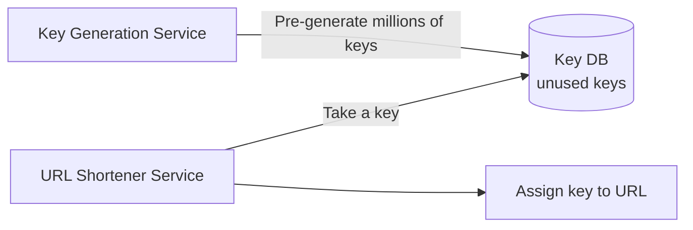
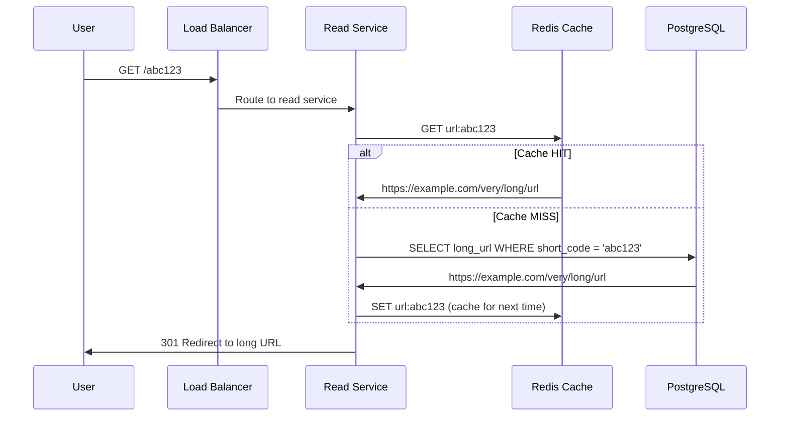
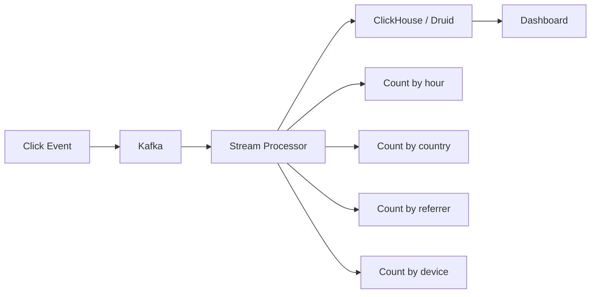

# Design URL Shortener (Interview Edition) — The Complete Walkthrough

## The Library Card Catalog Analogy

A URL shortener is like a library card catalog. Instead of remembering "Building 3, Floor 2, Aisle 7, Shelf 4, Position 12" (the long URL), you get a short code "B3-2712" that maps to the exact location. The catalog must be fast to look up, never assign the same code to two books, and handle millions of lookups per second.

---

## 1. Requirements & Estimation

### Functional
- Given a long URL, generate a short URL
- Redirect short URL to original long URL
- Custom short URLs (optional)
- Link expiration (optional)
- Analytics (click count, referrer, geography)

### Back-of-Envelope Math
- 100M new URLs/month = ~40 URLs/sec (write)
- Read:Write ratio = 100:1 → 4,000 redirects/sec (read)
- URL length: 7 characters, base62 = 62^7 = 3.5 trillion unique URLs
- Storage: 100M/month × 12 months × 5 years × 500 bytes = ~300 GB

---

## 2. Short URL Generation — Three Approaches

### Approach 1: Hash + Truncate

```java
String hash = md5(longUrl);           // "5d41402abc4b2a76b9719d911017c592"
String shortCode = hash.substring(0, 7); // "5d41402"
```

**Problem**: Collisions. Two different URLs might produce the same 7-char prefix.

### Approach 2: Base62 Counter (Recommended)

```java
// Auto-increment counter → Base62 encode
long id = database.nextId();  // 1000000001
String shortCode = base62Encode(id);  // "15FTGf"

public String base62Encode(long num) {
    String chars = "0123456789abcdefghijklmnopqrstuvwxyzABCDEFGHIJKLMNOPQRSTUVWXYZ";
    StringBuilder sb = new StringBuilder();
    while (num > 0) {
        sb.append(chars.charAt((int)(num % 62)));
        num /= 62;
    }
    return sb.reverse().toString();
}
```

**No collisions** — each counter value is unique.

### Approach 3: Pre-generated Key Service



| Approach | Pros | Cons |
|----------|------|------|
| Hash + Truncate | Simple, no coordination | Collisions, need retry logic |
| Base62 Counter | No collisions, predictable | Counter is single point of failure |
| Pre-generated Keys | No collisions, distributed | Extra service, key exhaustion risk |

<div class="callout-scenario">

**Scenario**: You're running 10 URL shortener servers. Using a single counter means all servers contend for the next ID. **Decision**: Use range-based allocation. Server 1 gets IDs 1-1M, Server 2 gets 1M-2M, etc. Each server has its own local counter within its range. No coordination needed. When a range is exhausted, request a new range from a coordinator (ZooKeeper or DB sequence).

</div>

---

## 3. Architecture

```mermaid
graph TB
    subgraph API
        AG[API Gateway / LB]
        WS[Write Service<br/>Create short URL]
        RS[Read Service<br/>Redirect]
        AS[Analytics Service]
    end

    subgraph Data
        DB[(PostgreSQL<br/>URL mappings)]
        CA[(Redis Cache<br/>Hot URLs)]
        KF[Kafka<br/>Click events]
        AN[(ClickHouse<br/>Analytics)]
    end

    AG -->|POST /shorten| WS
    AG -->|GET /abc123| RS
    WS --> DB
    RS --> CA
    CA -->|MISS| DB
    RS --> KF
    KF --> AS
    AS --> AN
```



### Redirect Flow



<div class="callout-info">

**301 vs 302 redirect**: 301 (Permanent) — browser caches the redirect, subsequent visits skip your server. Good for performance, bad for analytics. 302 (Temporary) — browser always hits your server. Slower but you can track every click. **Use 302 if you need analytics, 301 if you don't.**

</div>

---

## 4. Handling Custom URLs

```java
public String createShortUrl(String longUrl, String customCode) {
    if (customCode != null) {
        // Check if custom code is available
        if (urlRepository.existsByShortCode(customCode)) {
            throw new ConflictException("Custom URL already taken");
        }
        urlRepository.save(new UrlMapping(customCode, longUrl));
        return customCode;
    }
    // Auto-generate
    String code = base62Encode(idGenerator.nextId());
    urlRepository.save(new UrlMapping(code, longUrl));
    return code;
}
```

<div class="callout-warn">

**Warning**: Custom URLs must be validated — block offensive words, reserved paths (`/api`, `/admin`, `/health`), and extremely short codes (1-2 chars). Also rate-limit custom URL creation to prevent squatting.

</div>

---

## 5. Analytics



Don't update analytics synchronously on every click — it would slow down redirects. Publish click events to Kafka and process asynchronously.

---

## 🎯 Interview Corner

<div class="callout-interview">

**Q: "How would you handle 10,000 redirects per second?"**

The redirect path is read-heavy and latency-sensitive. (1) **Redis cache** — cache the top 20% of URLs (Pareto principle — 20% of URLs get 80% of traffic). Cache hit rate should be 90%+. (2) **Read replicas** — PostgreSQL read replicas for cache misses. (3) **Stateless services** — read service is stateless, scale horizontally behind a load balancer. (4) **CDN** — for extremely popular short URLs, the 301 redirect can be cached at the CDN edge. At 10K RPS, a single Redis instance handles this easily (Redis does 100K+ ops/sec). The bottleneck is never the redirect — it's the analytics pipeline.

**Follow-up trap**: "What if Redis goes down?" → Fall back to database reads. PostgreSQL with proper indexing on `short_code` handles 10K reads/sec. The latency increases from 1ms (Redis) to 5ms (DB) — still acceptable. Redis is an optimization, not a dependency.

</div>

<div class="callout-interview">

**Q: "What if two users submit the same long URL — should they get the same short URL?"**

It depends on the product requirement. **Option A: Same short URL** — hash the long URL and use it as a lookup key. If it exists, return the existing short URL. Saves storage but means you can't have per-user analytics. **Option B: Different short URLs** — always generate a new short code. Each user gets their own link with separate analytics. This is what Bitly does — it allows the same long URL to have multiple short URLs with different tracking. For most systems, Option B is better because analytics per link is more valuable than saving a few bytes of storage.

</div>

<div class="callout-interview">

**Q: "How do you handle link expiration?"**

Add an `expires_at` column to the URL mapping table. On redirect, check if `expires_at < now()`. If expired, return 410 Gone. For cleanup, run a background job that deletes expired URLs from the database and invalidates them from Redis cache. Don't rely on Redis TTL alone — the database is the source of truth. For URLs without expiration, set a default (e.g., 5 years) to prevent infinite storage growth.

</div>

---

## Quick Reference

| Concept | One-Liner |
|---------|-----------|
| Base62 | Encode counter to alphanumeric string (0-9, a-z, A-Z) |
| 301 vs 302 | Permanent (cached by browser) vs Temporary (always hits server) |
| Range-based ID | Each server gets a pre-allocated ID range to avoid contention |
| Cache-aside | Check Redis first, fall back to DB on miss |
| Click Analytics | Async via Kafka, never block the redirect |

---

> **A URL shortener is the "Hello World" of system design interviews — simple enough to discuss in 30 minutes, deep enough to reveal your understanding of databases, caching, scaling, and trade-offs.**
