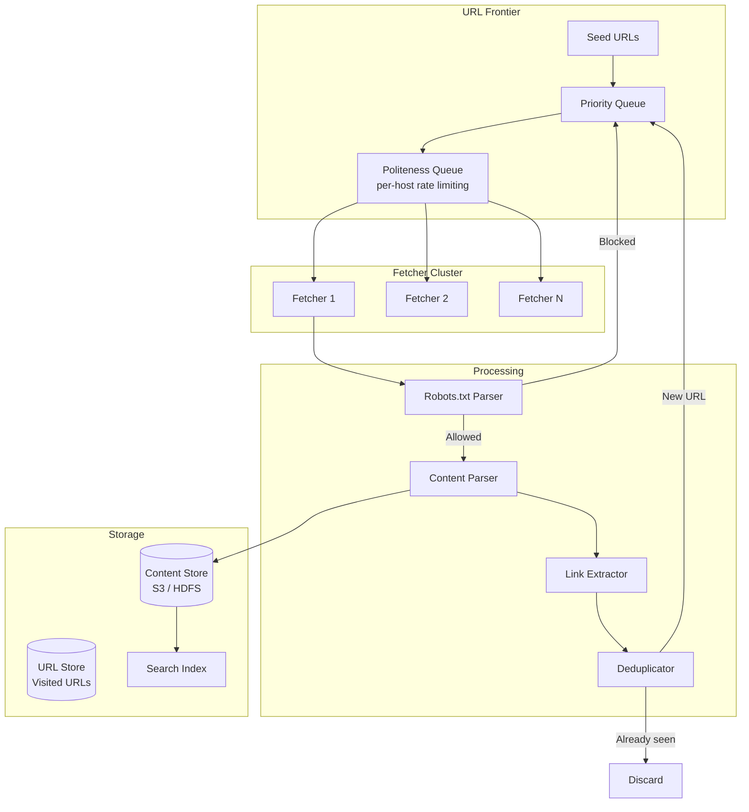
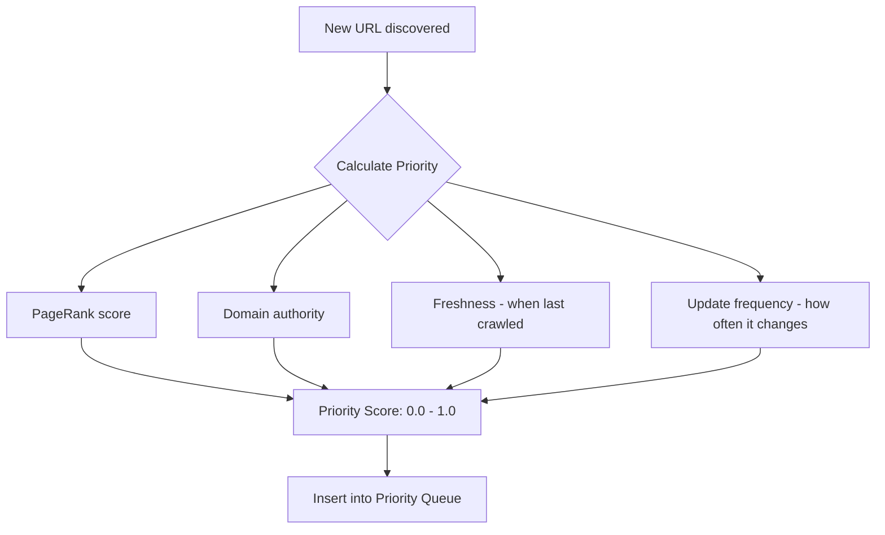
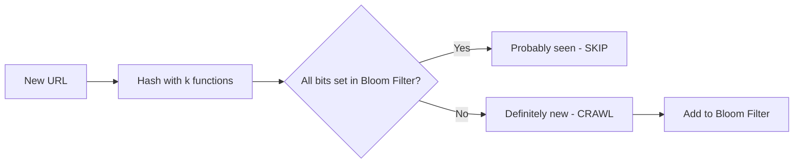
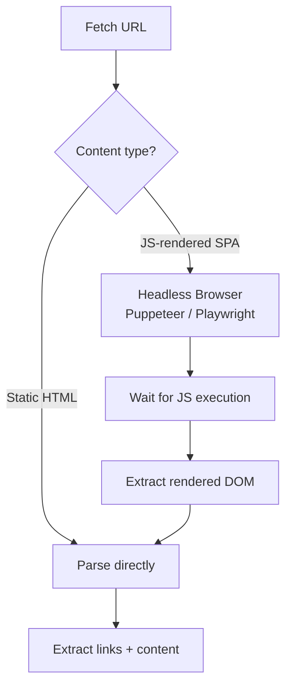

# Design Web Crawler — The Library Cataloger Analogy

## The Library Cataloger Analogy

Imagine you're hired to catalog every book in every library in the world. You start at one library, note every book, then follow references in those books to find other libraries. You visit those libraries, catalog their books, follow more references — and so on. But you must be polite (don't overwhelm any library), avoid revisiting libraries you've already cataloged, and prioritize important libraries first.

**That's a web crawler** — it systematically browses the internet, downloading web pages, extracting links, and following them to discover new pages.

---

## 1. Requirements

### Functional
- Start from a set of seed URLs
- Download web pages and extract content
- Extract links from pages and add to crawl queue
- Store crawled content for indexing
- Respect `robots.txt` (politeness)
- Handle different content types (HTML, PDF, images)

### Non-Functional
- **Scale**: Crawl 1 billion pages per month (~400 pages/second)
- **Politeness**: Don't overwhelm any single website
- **Freshness**: Re-crawl important pages frequently
- **Deduplication**: Don't crawl the same page twice
- **Fault tolerance**: Resume from where it stopped after crashes

### Back-of-envelope math
- 1B pages/month = ~400 pages/sec
- Average page size: 500KB
- Storage: 1B × 500KB = 500TB/month
- Bandwidth: 400 × 500KB = 200MB/sec

---

## 2. High-Level Architecture



---

## 3. URL Frontier — The Brain of the Crawler

The URL Frontier decides **what to crawl next**. It has two responsibilities:

### Priority Queue — What's Important?



### Politeness Queue — Don't Be a Jerk

```
❌ Bad: Crawl 1000 pages from example.com in 1 second
✅ Good: Crawl 1 page from example.com every 2 seconds
```

```java
// Per-host rate limiter
public class PolitenessEnforcer {
    private final Map<String, Long> lastCrawlTime = new ConcurrentHashMap<>();
    private final long minDelayMs = 2000; // 2 seconds between requests to same host

    public boolean canCrawl(String host) {
        Long lastTime = lastCrawlTime.get(host);
        if (lastTime == null) return true;
        return System.currentTimeMillis() - lastTime >= minDelayMs;
    }

    public void recordCrawl(String host) {
        lastCrawlTime.put(host, System.currentTimeMillis());
    }
}
```

<div class="callout-warn">

**Warning**: Always check `robots.txt` before crawling ANY page. It's not just politeness — ignoring it can get your crawler's IP banned or even lead to legal issues. Google respects `robots.txt` religiously.

</div>

---

## 4. Deduplication — The Billion-URL Problem

With billions of URLs, how do you check "have I seen this URL before?" efficiently?

### URL Deduplication — Bloom Filter



**Bloom Filter**: A probabilistic data structure that can tell you:
- "Definitely NOT seen" (100% accurate)
- "Probably seen" (small false positive rate ~1%)

For 1 billion URLs with 1% false positive rate: **~1.2 GB memory**. Compare to storing all URLs in a HashSet: **~50 GB memory**.

### Content Deduplication — SimHash

Different URLs can have the same content (mirrors, duplicates). Use SimHash to detect near-duplicate content:

```java
// SimHash fingerprint — similar content produces similar hashes
long hash1 = simHash(page1Content); // 0x1A2B3C4D5E6F7080
long hash2 = simHash(page2Content); // 0x1A2B3C4D5E6F7081
int hammingDistance = Long.bitCount(hash1 ^ hash2);
boolean isDuplicate = hammingDistance <= 3; // threshold
```

<div class="callout-tip">

**Applying this** — Use Bloom Filter for URL dedup (fast, memory-efficient) and SimHash for content dedup (catches mirrors and near-duplicates). This two-layer approach catches 99%+ of duplicates.

</div>

---

## 5. Distributed Crawling — Scaling to Billions

A single machine can crawl ~50 pages/sec. For 400 pages/sec, you need a cluster:

```mermaid
graph TB
    subgraph Coordinator
        UF[URL Frontier]
        HA[Host Assigner]
    end

    subgraph Workers["Crawler Workers"]
        W1["Worker 1<br/>Handles: a-f domains"]
        W2["Worker 2<br/>Handles: g-m domains"]
        W3["Worker 3<br/>Handles: n-s domains"]
        W4["Worker 4<br/>Handles: t-z domains"]
    end

    UF --> HA
    HA -->|hash(hostname)| W1
    HA -->|hash(hostname)| W2
    HA -->|hash(hostname)| W3
    HA -->|hash(hostname)| W4
```

<div class="callout-scenario">

**Scenario**: You have 10 crawler workers. `amazon.com` has millions of pages. If all workers crawl Amazon simultaneously, you'll overwhelm their servers and get banned. **Decision**: Use consistent hashing on hostname — ALL Amazon URLs go to Worker 3 only. Worker 3 enforces the politeness delay. This guarantees per-host rate limiting even in a distributed system.

</div>

---

## 6. Handling Dynamic Content (JavaScript-Rendered Pages)

Modern websites render content with JavaScript. A simple HTTP GET returns an empty HTML shell.



<div class="callout-scenario">

**Scenario**: You need to crawl a React SPA where all content loads via JavaScript. A simple `curl` returns `<div id="root"></div>`. **Decision**: Use a headless browser (Puppeteer) for JS-heavy sites. But headless browsers are 10x slower and use 10x more memory. So classify URLs: use simple HTTP fetch for 90% of sites, headless browser only for known SPAs. This hybrid approach balances coverage and performance.

</div>

---

## 7. Crawl Freshness — Re-crawling Strategy

Not all pages need re-crawling at the same frequency:

| Page Type | Re-crawl Frequency | Why |
|-----------|-------------------|-----|
| News homepage | Every 15 minutes | Content changes constantly |
| Product page | Every 24 hours | Prices/availability change daily |
| Wikipedia article | Every 7 days | Changes occasionally |
| Government archive | Every 30 days | Rarely changes |

```java
// Adaptive re-crawl scheduling
public Duration calculateRecrawlInterval(PageMetadata page) {
    if (page.getChangeFrequency() > 10) return Duration.ofMinutes(15);  // changes often
    if (page.getChangeFrequency() > 2)  return Duration.ofHours(24);    // changes daily
    if (page.getChangeFrequency() > 0)  return Duration.ofDays(7);      // changes weekly
    return Duration.ofDays(30);                                          // static
}
```

---

## 🎯 Interview Corner

<div class="callout-interview">

**Q: "How would you design a web crawler that can crawl 1 billion pages per month?"**

I'd design it as a distributed system with these components: (1) **URL Frontier** — a priority queue backed by Kafka, with per-host politeness queues. (2) **Fetcher cluster** — 10-20 workers, each handling specific hostname ranges via consistent hashing. Each worker fetches ~40 pages/sec. (3) **Deduplication** — Bloom filter for URL dedup (1.2GB for 1B URLs), SimHash for content dedup. (4) **Storage** — S3 for raw HTML, Elasticsearch for indexing. (5) **Coordinator** — assigns URLs to workers, tracks crawl progress. The key bottleneck is network I/O, not CPU. I'd use async HTTP clients (Netty) with connection pooling. For robots.txt, cache it per domain with 24h TTL.

**Follow-up trap**: "How do you handle crawler traps (infinite URLs)?" → Limit crawl depth per domain (e.g., max 1000 pages per domain per crawl cycle). Detect URL patterns that generate infinite variations (e.g., calendar pages with `?date=2024-01-01`, `?date=2024-01-02`...). Use URL normalization to collapse equivalent URLs.

</div>

<div class="callout-interview">

**Q: "How is crawling different from scraping?"**

Crawling is about **discovery** — systematically following links to find all pages on the web. Scraping is about **extraction** — pulling specific data from known pages (prices, reviews, etc.). A crawler doesn't care about the content structure; it just downloads and indexes. A scraper has page-specific parsers that extract structured data. Google is a crawler. A price comparison site is a scraper. Legally, crawling public pages is generally accepted (if you respect robots.txt). Scraping can be legally gray, especially if it violates ToS or extracts copyrighted data.

</div>

<div class="callout-interview">

**Q: "Your crawler is getting blocked by websites. How do you handle it?"**

Several strategies: (1) **Respect robots.txt** — the #1 reason for blocking. (2) **Rotate User-Agents** — use realistic browser User-Agent strings. (3) **Rate limiting** — don't hit the same host more than once every 2-5 seconds. (4) **IP rotation** — use a pool of IPs across different subnets. (5) **Respect HTTP 429 (Too Many Requests)** — back off exponentially. (6) **Use residential proxies** for sites that block datacenter IPs. But ethically, if a site clearly doesn't want to be crawled, respect that. The goal is to be a good citizen of the web.

</div>

---

## Quick Reference

| Concept | One-Liner |
|---------|-----------|
| URL Frontier | Queue that decides what to crawl next |
| Politeness | Rate-limit requests per host to avoid overwhelming servers |
| robots.txt | File that tells crawlers what they can/can't crawl |
| Bloom Filter | Memory-efficient probabilistic set for URL dedup |
| SimHash | Fingerprint for detecting near-duplicate content |
| Consistent Hashing | Assign hostname ranges to specific crawler workers |
| Headless Browser | Browser without UI for rendering JavaScript pages |
| Crawl Depth | How many links deep from seed URL to follow |
| Adaptive Re-crawl | Frequently changing pages get crawled more often |

---

> **A good web crawler is like a good journalist — thorough, respectful, efficient, and never visits the same source twice without reason.**
