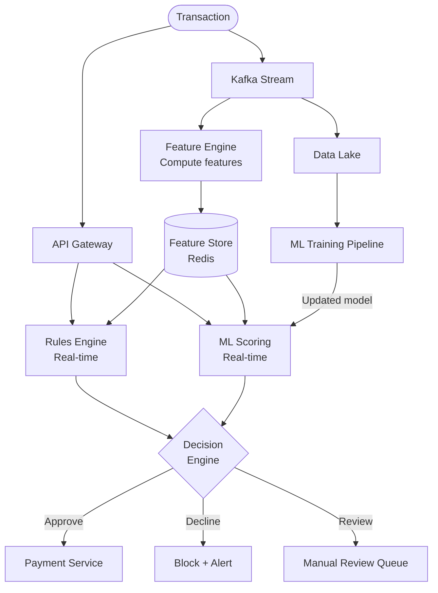
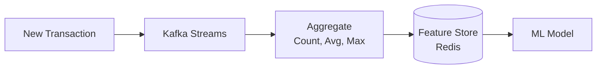
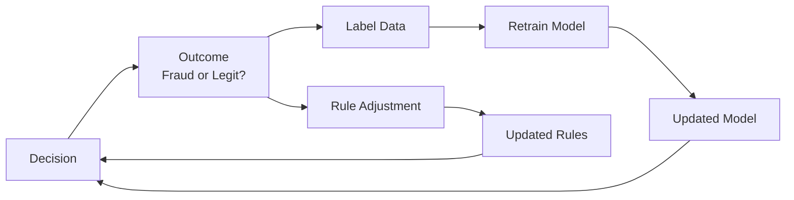

# Fraud Detection System — Complete System Design

## 1. Problem Statement

Design a real-time fraud detection system that:
- Analyzes every financial transaction **in real-time** (< 100ms)
- Flags suspicious transactions before they're processed
- Learns from historical patterns to improve detection
- Minimizes false positives (blocking legitimate transactions is bad for business)

---

## 2. Types of Fraud

| Type | Example | Detection Signal |
|------|---------|-----------------|
| **Card-not-present** | Stolen card used online | Unusual location, device fingerprint |
| **Account takeover** | Hacker logs into your account | New device, unusual time, password change |
| **Velocity abuse** | 50 transactions in 1 minute | Rate of transactions |
| **Amount anomaly** | Usually spends $50, suddenly $5000 | Deviation from spending pattern |
| **Geographic anomaly** | Transaction in NYC, then Tokyo 1 hour later | Impossible travel |

---

## 3. High-Level Design



---

## 4. Two-Layer Detection

### Layer 1: Rules Engine (Deterministic)

Fast, explainable, catches obvious fraud:

```java
public class FraudRules {

    public RuleResult evaluate(Transaction txn, UserProfile profile) {
        // Rule 1: Velocity check
        if (profile.getTransactionsLastHour() > 10) {
            return RuleResult.flag("VELOCITY_EXCEEDED");
        }

        // Rule 2: Amount anomaly
        if (txn.getAmount() > profile.getAvgAmount() * 5) {
            return RuleResult.flag("AMOUNT_ANOMALY");
        }

        // Rule 3: Impossible travel
        if (isImpossibleTravel(txn.getLocation(), profile.getLastLocation(), profile.getLastTxnTime())) {
            return RuleResult.flag("IMPOSSIBLE_TRAVEL");
        }

        // Rule 4: High-risk country
        if (HIGH_RISK_COUNTRIES.contains(txn.getCountry())) {
            return RuleResult.addRisk(30);
        }

        return RuleResult.pass();
    }
}
```

### Layer 2: ML Model (Probabilistic)

Catches subtle patterns humans can't write rules for:

```
Input features:
- Transaction amount, time, location, merchant category
- User's historical avg amount, frequency, usual locations
- Device fingerprint, IP reputation
- Time since last transaction
- Number of failed attempts recently

Output: Fraud probability (0.0 to 1.0)

Decision:
- Score < 0.3 → Approve
- Score 0.3-0.7 → Manual review
- Score > 0.7 → Decline
```

---

## 5. Feature Store — Real-Time Features

The ML model needs **features** computed in real-time:

```java
// Features computed and stored in Redis for instant lookup
public class UserFeatures {
    int transactionsLast1Hour;
    int transactionsLast24Hours;
    double avgTransactionAmount30Days;
    double maxTransactionAmount30Days;
    String lastTransactionCountry;
    long secondsSinceLastTransaction;
    int uniqueMerchantsLast7Days;
    int failedAttemptsLast1Hour;
    double distanceFromLastTransaction;
}
```



Features are updated **incrementally** with each transaction using Kafka Streams — no batch processing delay.

---

## 6. Decision Engine

Combines rules + ML score into a final decision:

```java
public Decision evaluate(Transaction txn) {
    RuleResult ruleResult = rulesEngine.evaluate(txn, getProfile(txn.getUserId()));
    double mlScore = mlModel.score(getFeatures(txn.getUserId()), txn);

    double combinedScore = ruleResult.getRiskScore() * 0.4 + mlScore * 100 * 0.6;

    if (ruleResult.isHardBlock()) return Decision.DECLINE;
    if (combinedScore > 70) return Decision.DECLINE;
    if (combinedScore > 40) return Decision.MANUAL_REVIEW;
    return Decision.APPROVE;
}
```

---

## 7. Feedback Loop — Learning from Mistakes



- **Chargebacks** = confirmed fraud → positive label
- **No chargeback after 90 days** = legitimate → negative label
- Model is retrained periodically with new labeled data

---

## 8. Summary

| Aspect | Decision |
|--------|----------|
| Real-time processing | Kafka Streams for feature computation |
| Feature storage | Redis (sub-ms reads) |
| Rules engine | Deterministic, explainable, fast |
| ML model | Gradient boosting or neural network |
| Decision latency | < 100ms end-to-end |
| Feedback | Chargeback-based labeling, periodic retraining |

---

---

## 🎯 Interview Corner

<div class="callout-interview">

**Q: "How would you design a real-time fraud detection system that processes transactions in under 100ms?"**

Two-layer approach. Layer 1: a rules engine for deterministic checks — velocity (too many transactions per hour), amount anomaly (5x above user's average), impossible travel (NYC then Tokyo in 1 hour), high-risk country. These are fast, explainable, and catch obvious fraud. Layer 2: an ML model that scores each transaction based on features like spending patterns, device fingerprint, merchant category, and time-of-day. The decision engine combines both scores: hard blocks from rules override ML, otherwise it's a weighted combination. Features are pre-computed and stored in Redis (sub-ms reads) using Kafka Streams for real-time aggregation. The entire pipeline — feature lookup, rules evaluation, ML scoring, decision — must complete in < 100ms.

</div>

<div class="callout-interview">

**Q: "Why use both rules and ML? Why not just ML?"**

Three reasons. First, rules are explainable — regulators and compliance teams need to understand why a transaction was blocked. "The ML model said 0.85" isn't acceptable; "velocity exceeded 10 transactions per hour" is. Second, rules catch known patterns instantly without training data. If a new fraud pattern emerges (e.g., gift card draining), you can deploy a rule in minutes. ML needs labeled data and retraining. Third, ML catches subtle patterns that humans can't write rules for — combinations of features that individually look normal but together indicate fraud. Rules handle the known, ML handles the unknown.

**Follow-up trap**: "How do you handle false positives?" → False positives (blocking legitimate transactions) hurt revenue and customer trust. Use a three-tier decision: approve, decline, or send to manual review. Tune thresholds per merchant category and user risk profile. Track false positive rate as a key metric and retrain the model when it drifts.

</div>

<div class="callout-interview">

**Q: "How does the feature store work and why is it critical?"**

The ML model needs real-time features: "how many transactions has this user made in the last hour?" "what's their average spend in the last 30 days?" Computing these on every request from raw data would be too slow. The feature store (Redis) holds pre-computed features per user, updated incrementally by Kafka Streams as each transaction flows through. When a new transaction arrives, the model reads the user's features from Redis (< 1ms), scores the transaction, and the feature store is updated with the new transaction's data. This separation of feature computation (streaming) from model inference (request-time) is what makes sub-100ms latency possible.

</div>

<div class="callout-tip">

**Applying this** — In a system design interview, emphasize the real-time pipeline: transaction → Kafka → feature computation (Kafka Streams) → feature store (Redis) → rules + ML scoring → decision. The key insight is that features are computed asynchronously and stored, not computed at request time. Also discuss the feedback loop: chargebacks label fraud, which retrains the model. Without feedback, the model degrades over time as fraud patterns evolve.

</div>

---

> **Key insight**: The best fraud systems combine **rules** (fast, explainable, catches known patterns) with **ML** (catches unknown patterns). Neither alone is sufficient. And always remember — blocking a legitimate customer is almost as bad as letting fraud through.
