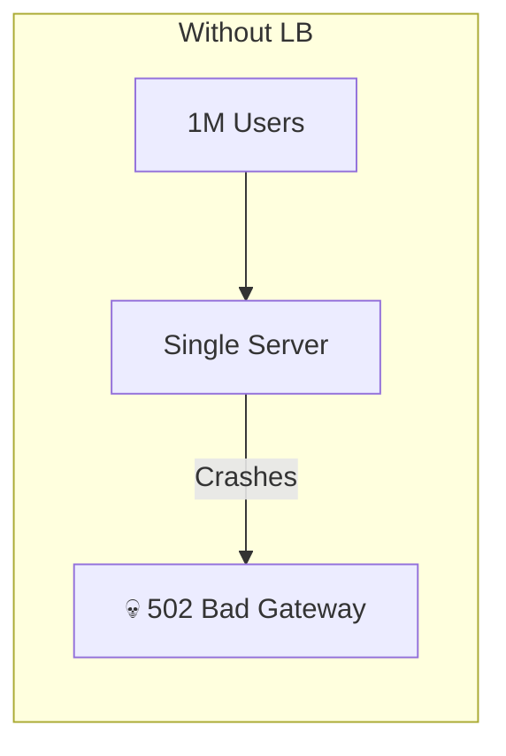
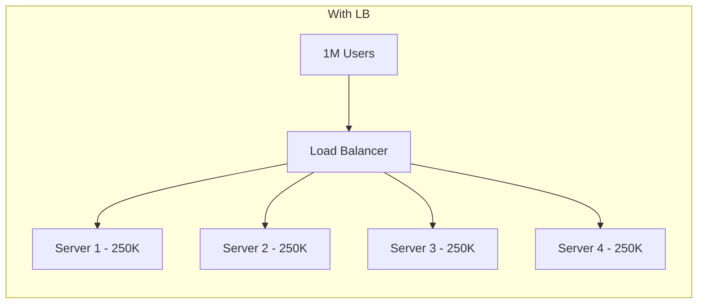
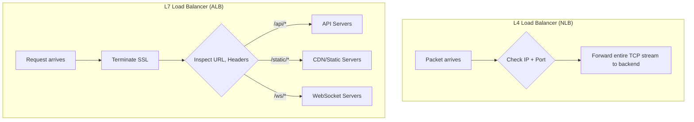
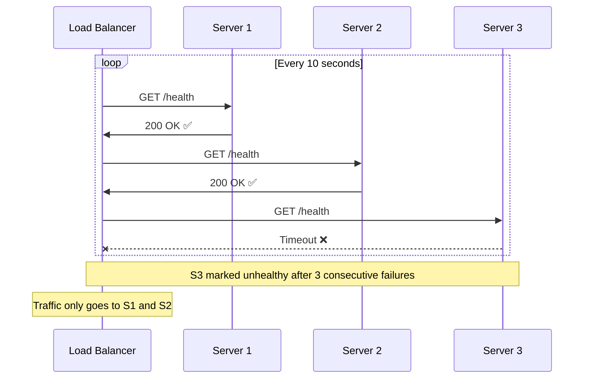
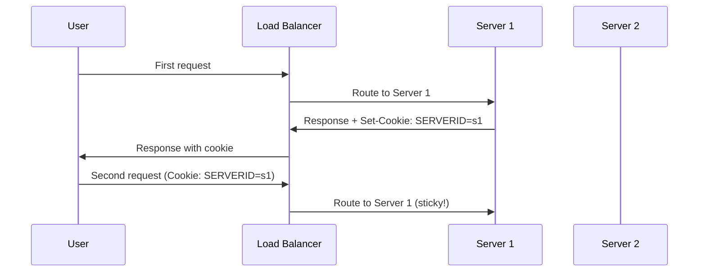
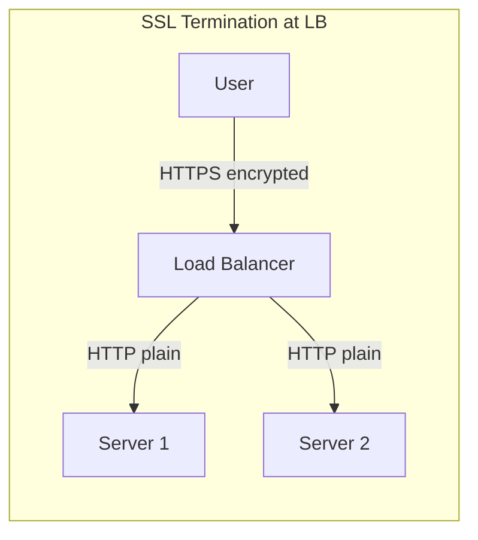
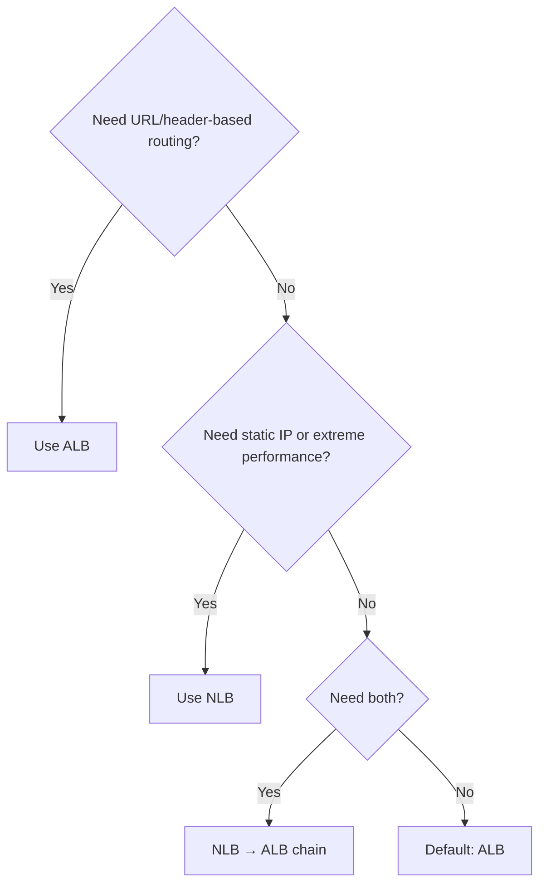
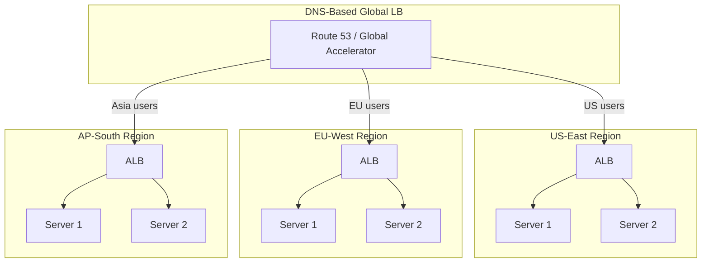
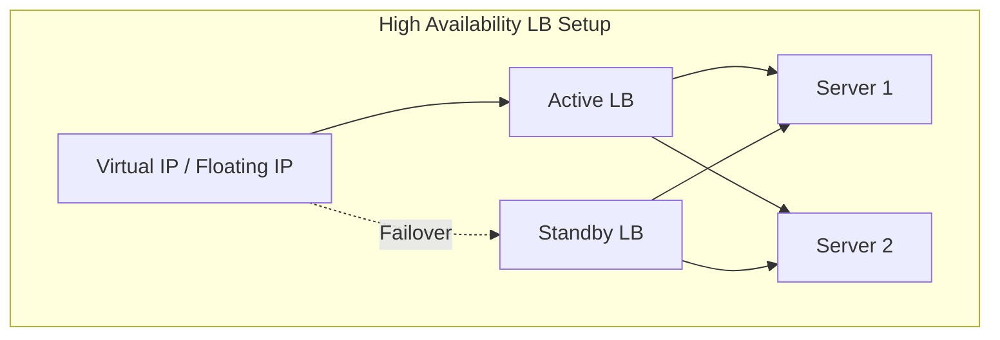

# Load Balancing — The Complete Guide — The Airport Security Analogy

## The Airport Security Analogy

Imagine an airport with 10 security check lanes but only 1 is open. The queue stretches for hours. Now open all 10 lanes and put a coordinator at the entrance who directs passengers to the shortest queue. That coordinator is your **load balancer** — it distributes incoming traffic across multiple servers so no single server gets overwhelmed.

But here's the twist — some lanes have faster scanners, some passengers have priority boarding, and some lanes handle only carry-on. A smart coordinator considers all of this. That's what makes load balancing interesting.

---

## 1. Why Load Balancing? — The Problem





<div class="callout-info">

**Key insight**: Load balancing isn't just about distributing traffic — it's about **high availability**. If Server 2 dies, the load balancer stops sending traffic to it. Users never notice. Zero downtime.

</div>

---

## 2. L4 vs L7 Load Balancing — The Fundamental Split

This is the most important concept to understand:

| Feature | L4 (Transport Layer) | L7 (Application Layer) |
|---------|---------------------|----------------------|
| **Operates at** | TCP/UDP level | HTTP/HTTPS level |
| **Sees** | IP addresses, ports | URLs, headers, cookies, body |
| **Speed** | Faster (no payload inspection) | Slower (inspects content) |
| **Routing decisions** | Based on IP/port only | Based on URL path, headers, cookies |
| **SSL termination** | No (passes through) | Yes (decrypts, inspects, re-encrypts) |
| **Use case** | Database connections, gaming, IoT | Web apps, APIs, microservices |
| **AWS equivalent** | NLB (Network Load Balancer) | ALB (Application Load Balancer) |



<div class="callout-scenario">

**Scenario**: You have a microservices app with separate services for users, orders, and payments. You need to route `/api/users/*` to user-service, `/api/orders/*` to order-service. **Decision**: Use L7 (ALB) — only L7 can inspect the URL path and route accordingly. L4 can't see the URL.

</div>

<div class="callout-scenario">

**Scenario**: You're running a multiplayer game server that uses raw TCP connections with millions of concurrent players. **Decision**: Use L4 (NLB) — it's faster, handles raw TCP, and you don't need URL-based routing. L7 would add unnecessary overhead.

</div>

---

## 3. Load Balancing Algorithms — How Traffic Gets Distributed

### Round Robin — The Simplest

```
Request 1 → Server A
Request 2 → Server B
Request 3 → Server C
Request 4 → Server A  (back to start)
```

**Problem**: What if Server A is a powerful machine and Server C is weak? They get equal traffic but unequal capacity.

### Weighted Round Robin

```
Server A (weight: 5) → Gets 5 out of 8 requests
Server B (weight: 2) → Gets 2 out of 8 requests
Server C (weight: 1) → Gets 1 out of 8 requests
```

### Least Connections

```
Server A: 150 active connections
Server B: 80 active connections   ← Next request goes here
Server C: 200 active connections
```

**Best for**: Long-lived connections (WebSocket, database pools) where some requests take much longer than others.

### IP Hash

```
hash(client_IP) % num_servers = target_server
```

**Best for**: When you need the same client to always hit the same server (poor man's sticky sessions).

### Comparison Table

| Algorithm | Best for | Drawback |
|-----------|---------|----------|
| **Round Robin** | Equal servers, stateless apps | Ignores server load |
| **Weighted Round Robin** | Mixed server capacities | Manual weight configuration |
| **Least Connections** | Long-lived connections, varying request times | Slightly more overhead |
| **IP Hash** | Session affinity without cookies | Uneven distribution if IP ranges cluster |
| **Least Response Time** | Performance-critical APIs | Requires health monitoring |
| **Random** | Simple, surprisingly effective at scale | Can be uneven with few servers |

<div class="callout-interview">

🎯 **Interview Ready** — "Which algorithm would you pick for a stateless REST API?" → Round Robin or Least Connections. Since the API is stateless, any server can handle any request. Least Connections is slightly better because it accounts for slow requests that tie up a server. But for most cases, Round Robin with health checks is perfectly fine.

</div>

---

## 4. Health Checks — How LB Knows a Server is Alive



**Health check types:**

| Type | What it checks | Example |
|------|---------------|---------|
| **TCP** | Can I connect to the port? | Port 8080 open? |
| **HTTP** | Does the endpoint return 200? | `GET /health` → 200 |
| **Deep health** | Is the app actually working? | Check DB connection, cache, dependencies |

```java
// ✅ Good health check endpoint
@GetMapping("/health")
public ResponseEntity<Map<String, String>> health() {
    Map<String, String> status = new HashMap<>();
    status.put("status", "UP");
    status.put("db", checkDatabase() ? "OK" : "FAIL");
    status.put("cache", checkRedis() ? "OK" : "FAIL");

    boolean healthy = status.values().stream().allMatch(v -> !"FAIL".equals(v));
    return healthy
        ? ResponseEntity.ok(status)
        : ResponseEntity.status(503).body(status);
}
```

<div class="callout-warn">

**Warning**: Don't make health checks too expensive. If your health endpoint queries the database on every call and you have 50 servers checked every 10 seconds, that's 300 DB queries/minute just for health checks. Use connection pool validation, not full queries.

</div>

---

## 5. Sticky Sessions — When Statelessness Isn't an Option

Sometimes a user MUST hit the same server (e.g., shopping cart stored in server memory, WebSocket connections):



<div class="callout-warn">

**Warning**: Sticky sessions break horizontal scaling. If Server 1 dies, all its sticky users lose their sessions. **Better approach**: Store sessions in Redis/Memcached so any server can serve any user. Then you don't need sticky sessions at all.

</div>

<div class="callout-tip">

**Applying this** — In production, avoid sticky sessions. Use externalized session stores (Redis, DynamoDB). This lets you scale servers up/down freely and handle server failures gracefully. The only exception is WebSocket connections which are inherently sticky.

</div>

---

## 6. SSL/TLS Termination



| Approach | Pros | Cons |
|----------|------|------|
| **Terminate at LB** | Offloads CPU from servers, easier cert management | Traffic between LB and servers is unencrypted |
| **SSL Passthrough** | End-to-end encryption | Servers handle SSL (CPU overhead), LB can't inspect traffic |
| **Re-encryption** | End-to-end encryption + LB can inspect | Double encryption overhead |

<div class="callout-tip">

**Applying this** — For most apps, terminate SSL at the load balancer. Use internal network security (VPC, security groups) to protect LB-to-server traffic. Only use re-encryption if compliance requires end-to-end encryption (PCI-DSS, HIPAA).

</div>

---

## 7. AWS Load Balancers — ALB vs NLB vs CLB

| Feature | ALB | NLB | CLB (Legacy) |
|---------|-----|-----|-------------|
| **Layer** | L7 (HTTP/HTTPS) | L4 (TCP/UDP) | L4 + L7 |
| **Routing** | Path, host, header, query string | Port-based only | Basic |
| **WebSocket** | ✅ | ✅ | ❌ |
| **Static IP** | ❌ (use Global Accelerator) | ✅ | ❌ |
| **Performance** | Good | Millions of RPS, ultra-low latency | Moderate |
| **Cost** | Per LCU (request-based) | Per NLCU (connection-based) | Per hour |
| **Best for** | Web apps, microservices, APIs | Gaming, IoT, gRPC, extreme performance | Don't use (legacy) |



<div class="callout-scenario">

**Scenario**: Your API needs to be whitelisted by a partner using a static IP, but you also need path-based routing. **Decision**: Put NLB in front (gives static IP) → routes to ALB (gives path-based routing). This is a common pattern in enterprise integrations.

</div>

---

## 8. Global Load Balancing — Multi-Region



**Routing policies:**
- **Latency-based**: Route to region with lowest latency
- **Geolocation**: Route based on user's country
- **Failover**: Primary region → secondary if primary is down
- **Weighted**: 80% to US, 20% to EU (for gradual migration)

<div class="callout-interview">

🎯 **Interview Ready** — "How do you handle a region going down?" → Use Route 53 health checks with failover routing. If US-East health check fails, DNS automatically routes all traffic to EU-West. Combine with database replication (Aurora Global Database or DynamoDB Global Tables) so the failover region has up-to-date data. RTO can be under 60 seconds.

</div>

---

## 9. Load Balancer as Single Point of Failure?

"If everything goes through the load balancer, isn't IT the single point of failure?"



**How it's solved:**
- **Active-Passive**: Two LBs, standby takes over if active dies (VRRP protocol)
- **Active-Active**: Both LBs handle traffic, DNS returns both IPs
- **Managed services**: AWS ALB/NLB are inherently HA — AWS manages redundancy across AZs

<div class="callout-tip">

**Applying this** — If you're on AWS, use ALB/NLB — they're automatically deployed across multiple AZs. You never manage LB redundancy yourself. If self-hosting (HAProxy/Nginx), always deploy in active-passive pairs with keepalived for failover.

</div>

---

## 🎯 Interview Corner

<div class="callout-interview">

**Q: "You're designing a system that handles 100K requests per second. How do you set up load balancing?"**

First, I'd use a multi-tier approach: DNS-level load balancing (Route 53) for global distribution across regions. Within each region, an NLB for raw TCP performance at the entry point, routing to an ALB for HTTP-level routing to different microservices. Each service has an auto-scaling group behind the ALB target group. For 100K RPS, a single ALB can handle this — ALB scales automatically. I'd enable cross-zone load balancing so traffic is evenly distributed across AZs. Health checks every 10 seconds with a 3-failure threshold. Connection draining enabled so in-flight requests complete during deployments.

**Follow-up trap**: "What about WebSocket connections at this scale?" → WebSockets are long-lived, so Least Connections algorithm is better than Round Robin. ALB supports WebSocket natively. But at 100K concurrent WebSocket connections, consider NLB for lower latency and static IPs.

</div>

<div class="callout-interview">

**Q: "What's the difference between load balancing and reverse proxy?"**

A reverse proxy (Nginx, Envoy) sits in front of servers and can do many things: SSL termination, caching, compression, rate limiting, AND load balancing. A load balancer is specifically focused on distributing traffic. In practice, Nginx IS both a reverse proxy and a load balancer. AWS ALB is primarily a load balancer with some reverse proxy features (SSL termination, header manipulation). The distinction matters architecturally: you might use Nginx as a reverse proxy on each server for local concerns (compression, caching) while using ALB as the load balancer for traffic distribution.

</div>

<div class="callout-interview">

**Q: "How do you do zero-downtime deployments with a load balancer?"**

Two approaches: (1) **Rolling deployment** — update servers one at a time. LB health check detects the server going down, stops sending traffic, server updates, comes back healthy, LB resumes traffic. (2) **Blue-Green** — spin up entirely new set of servers (green), point LB target group to green, drain connections from blue, terminate blue. ALB supports this natively with weighted target groups — you can shift 10% traffic to green, validate, then shift 100%. The key is **connection draining** — ALB waits for in-flight requests to complete (default 300s) before removing a server from rotation.

**Follow-up trap**: "What if the new version has a bug?" → With blue-green, instant rollback — just point LB back to blue. With rolling, you need to detect the issue fast (health checks, error rate monitoring) and halt the rollout.

</div>

---

## Quick Reference

| Concept | One-Liner |
|---------|-----------|
| L4 LB | Routes based on IP/port, doesn't inspect content |
| L7 LB | Routes based on URL, headers, cookies — full HTTP awareness |
| Round Robin | Distribute equally, one by one |
| Least Connections | Send to server with fewest active connections |
| Health Check | Periodic probe to verify server is alive |
| Sticky Session | Same user always hits same server (avoid if possible) |
| SSL Termination | Decrypt HTTPS at LB, forward HTTP to servers |
| Connection Draining | Let in-flight requests finish before removing server |
| Cross-Zone LB | Distribute traffic evenly across all AZs |
| ALB | AWS L7 load balancer for HTTP/HTTPS |
| NLB | AWS L4 load balancer for TCP/UDP, ultra-fast |

---

> **The best load balancer is invisible — users never know it exists, servers never feel overwhelmed, and when something fails, nobody notices.**
