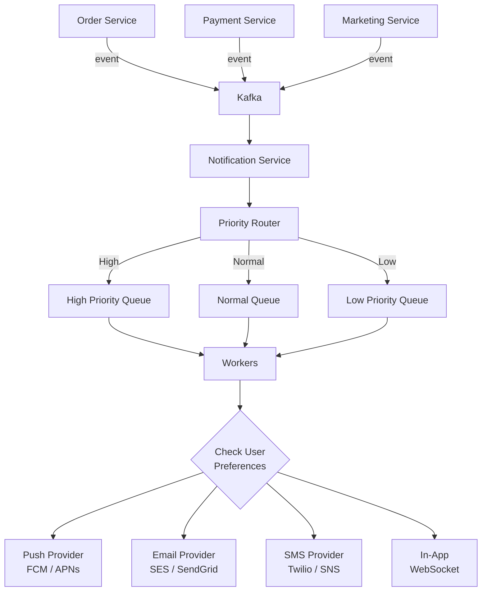

# Notification System — Complete System Design

## 1. Problem Statement

Design a multi-channel notification system that:
- Sends **push, email, SMS, and in-app** notifications
- Handles **millions of notifications per day**
- Supports priority levels (urgent vs marketing)
- Allows users to manage their notification preferences

---

## 2. High-Level Design



---

## 3. Key Design Decisions

### Priority Queues

| Priority | Example | SLA |
|----------|---------|-----|
| **Critical** | OTP, security alerts | < 30 seconds |
| **High** | Order confirmation, payment receipt | < 2 minutes |
| **Normal** | Shipping updates | < 15 minutes |
| **Low** | Marketing, newsletters | Best effort |

### Rate Limiting per Channel

```java
// Don't spam users
RateLimiter emailLimiter = RateLimiter.create(userId, Channel.EMAIL, 10, Duration.ofHours(1));
RateLimiter smsLimiter = RateLimiter.create(userId, Channel.SMS, 3, Duration.ofDays(1));
```

### Template Engine

```java
// Templates stored in DB, rendered at send time
NotificationTemplate template = templateService.get("ORDER_CONFIRMED");
// Template: "Hi {{name}}, your order #{{orderId}} is confirmed!"
String rendered = template.render(Map.of("name", "Alice", "orderId", "ORD-123"));
```

---

## 4. Delivery Guarantees

| Strategy | How |
|----------|-----|
| **At-least-once** | Retry on failure, deduplicate on receiver |
| **Idempotency** | Each notification has unique ID, providers ignore duplicates |
| **DLQ (Dead Letter Queue)** | Failed notifications go to DLQ for manual review |
| **Delivery tracking** | Track sent → delivered → read status |

---

## 5. Summary

| Aspect | Decision |
|--------|----------|
| Ingestion | Kafka (event-driven) |
| Prioritization | Separate queues per priority |
| Preferences | User preference service (opt-in/out per channel) |
| Templates | Centralized template engine |
| Delivery | At-least-once with idempotency |
| Providers | Pluggable (FCM, SES, Twilio) |

---

<div class="callout-tip">

**Applying this**: When designing any notification system, always build user preferences first. Rate limit per channel. Use priority queues to ensure OTPs arrive in seconds while marketing emails can wait.

</div>

<div class="callout-interview">

🎯 **Interview Ready**: "A notification system needs three things: (1) Priority queues — OTPs can't wait behind marketing emails, (2) User preferences — respect opt-in/out per channel, (3) Rate limiting — don't spam users. Use Kafka for ingestion, separate queues per priority, and pluggable providers (FCM, SES, Twilio)."

</div>
