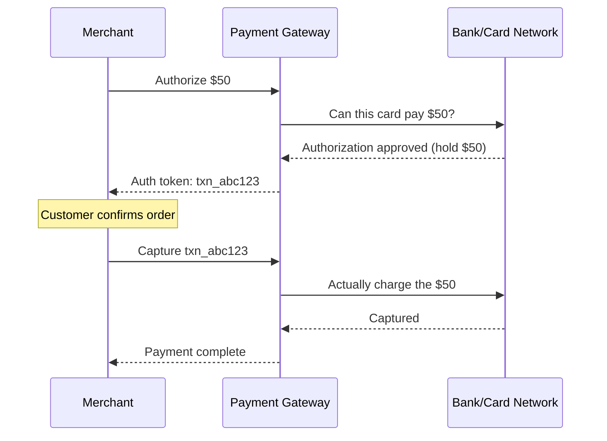
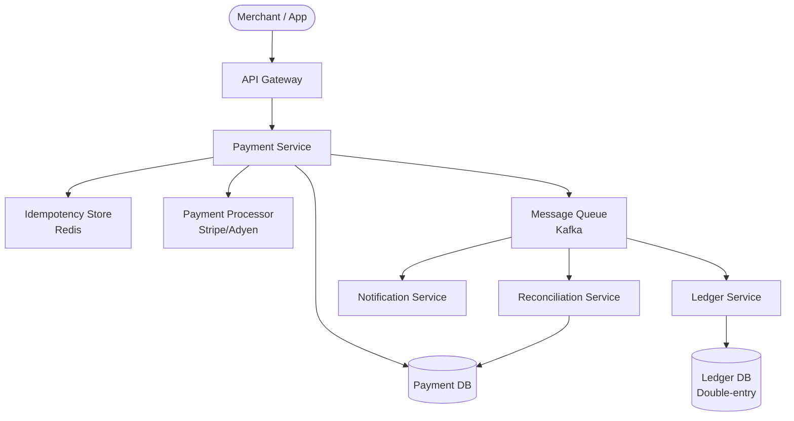
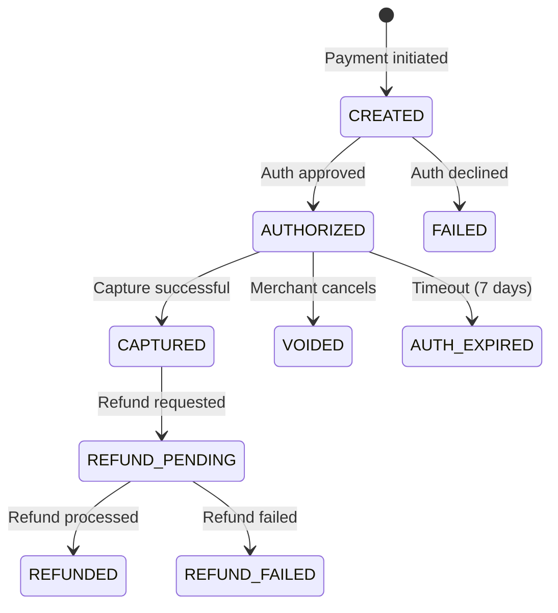
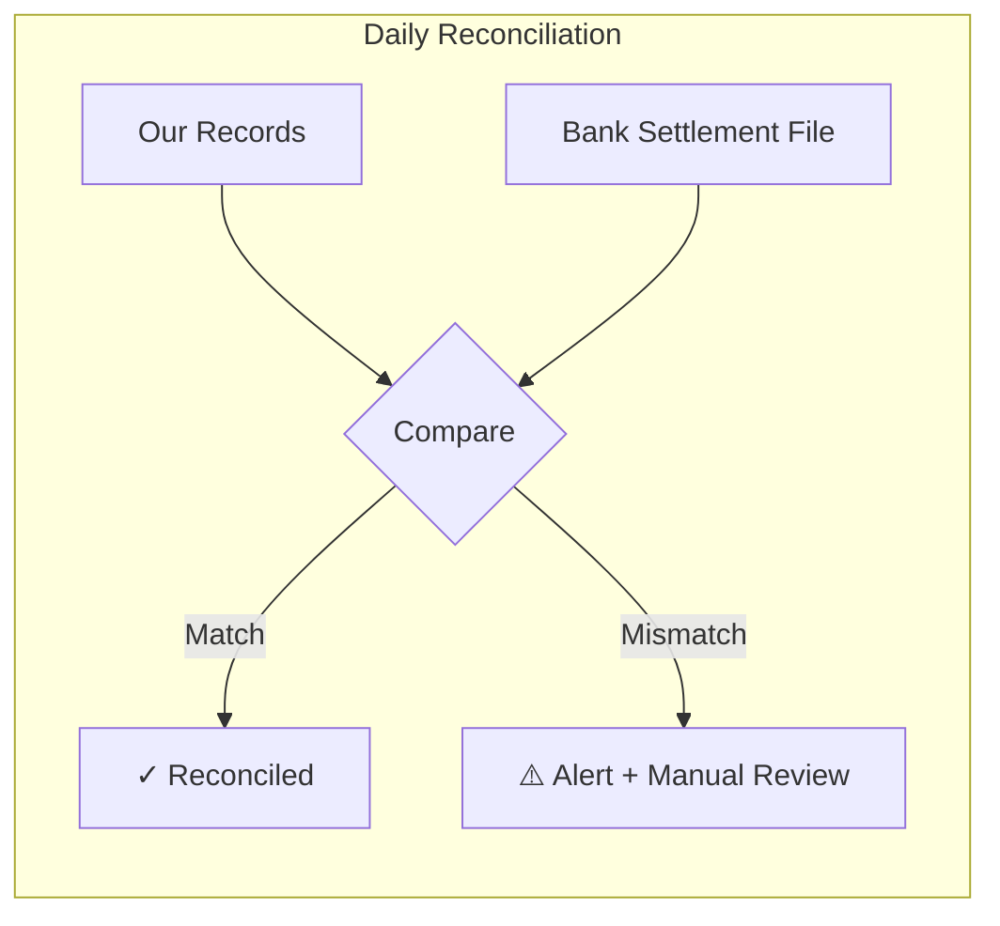

# Payment Gateway — Complete System Design

## 1. Problem Statement

Design a payment processing system that:
- Accepts payments via credit card, bank transfer, and digital wallets
- Guarantees **exactly-once processing** (no double charges!)
- Handles failures gracefully with retries and reconciliation
- Processes millions of transactions per day

---

## 2. Why Payment Systems Are Hard

> Imagine you buy coffee for $5. Your card is charged, but the coffee shop's system crashes before recording it. You're charged but got nothing. Or worse — the system retries and charges you twice.

Payment systems must handle: **network failures, timeouts, duplicate requests, partial failures, and regulatory compliance** — all while moving real money.

---

## 3. Key Concepts

### Idempotency — The Most Important Concept

```
Client sends: "Charge $50, idempotency_key=abc123"
Server processes it → Success

Client retries (network timeout): "Charge $50, idempotency_key=abc123"
Server sees same key → Returns cached result (no double charge!)
```

```java
public PaymentResponse processPayment(PaymentRequest request) {
    // Check if we've seen this idempotency key before
    Optional<PaymentResponse> cached = idempotencyStore.get(request.getIdempotencyKey());
    if (cached.isPresent()) {
        return cached.get();  // return same response, don't process again
    }

    PaymentResponse response = doProcessPayment(request);
    idempotencyStore.save(request.getIdempotencyKey(), response);
    return response;
}
```

### Two-Phase Payment



- **Authorize**: "Can this card pay?" (money is held, not charged)
- **Capture**: "Actually charge it" (money moves)
- **Why two phases?** Hotels authorize at check-in, capture at checkout (final amount may differ)

---

## 4. High-Level Design



### Components

| Component | Purpose |
|-----------|---------|
| Payment Service | Core processing, orchestrates the flow |
| Idempotency Store | Prevents duplicate processing |
| Payment DB | Stores transaction state |
| PSP (Payment Service Provider) | Actual card/bank integration (Stripe, Adyen) |
| Ledger Service | Double-entry bookkeeping |
| Reconciliation Service | Matches our records with bank records |
| Notification Service | Emails, webhooks to merchants |

---

## 5. Payment State Machine



> Every payment has a clear state. No ambiguity. This is critical for debugging and reconciliation.

---

## 6. Double-Entry Ledger

Every financial transaction has **two entries** that must balance:

```
Payment of $50 from Customer to Merchant:

| Account          | Debit  | Credit |
|------------------|--------|--------|
| Customer Wallet  |        | $50    |
| Merchant Account | $50    |        |

Total Debits = Total Credits = $50 ✓
```

```java
public void recordPayment(Payment payment) {
    ledgerService.record(
        new LedgerEntry(payment.getCustomerAccount(), EntryType.CREDIT, payment.getAmount()),
        new LedgerEntry(payment.getMerchantAccount(), EntryType.DEBIT, payment.getAmount())
    );
    // These two entries are saved in a single transaction — atomic
}
```

---

## 7. Handling Failures

### Retry with Exponential Backoff

```java
public PaymentResponse processWithRetry(PaymentRequest request) {
    int maxRetries = 3;
    long delay = 1000;  // 1 second

    for (int attempt = 0; attempt < maxRetries; attempt++) {
        try {
            return psp.charge(request);
        } catch (TransientException e) {
            Thread.sleep(delay);
            delay *= 2;  // 1s → 2s → 4s
        }
    }
    throw new PaymentFailedException("Max retries exceeded");
}
```

### Reconciliation — The Safety Net



Every day, compare your records with the bank's settlement file. Mismatches = something went wrong.

---

## 8. Security

| Concern | Solution |
|---------|----------|
| Card data exposure | **PCI DSS compliance**, tokenization |
| Man-in-the-middle | TLS everywhere, certificate pinning |
| Fraud | Velocity checks, ML-based fraud scoring |
| Data at rest | Encrypt sensitive fields (AES-256) |
| API security | API keys, OAuth 2.0, rate limiting |

### Tokenization

```
Customer enters: 4111-1111-1111-1111
We store: tok_abc123xyz (token)
Actual card number stored ONLY at PCI-compliant PSP
```

---

## 9. Summary

| Aspect | Decision |
|--------|----------|
| Idempotency | Redis with TTL for idempotency keys |
| State management | Explicit state machine |
| Accounting | Double-entry ledger |
| Failure handling | Retry + reconciliation |
| Security | Tokenization + PCI DSS |
| Async processing | Kafka for notifications, ledger, reconciliation |

---

<div class="callout-tip">

**Applying this**: Payment systems are about **trust and correctness**, not speed. It's better to be slow and correct than fast and wrong. When designing any financial flow, always build in idempotency, explicit state machines, and reconciliation.

</div>

<div class="callout-interview">

🎯 **Interview Ready**: "The three pillars of payment system design are: (1) Idempotency — prevent double charges via idempotency keys, (2) State machines — every payment has explicit states with valid transitions, (3) Reconciliation — daily matching of your records against bank settlement files."

</div>
