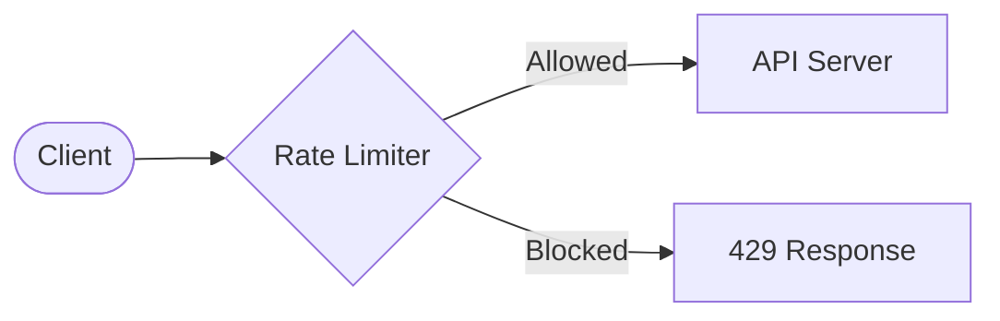
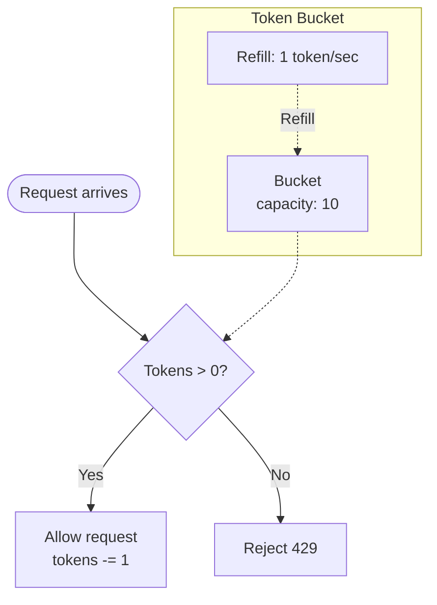
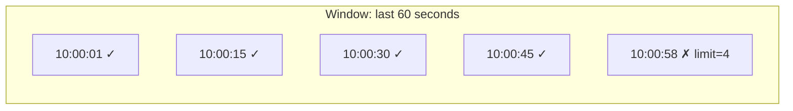
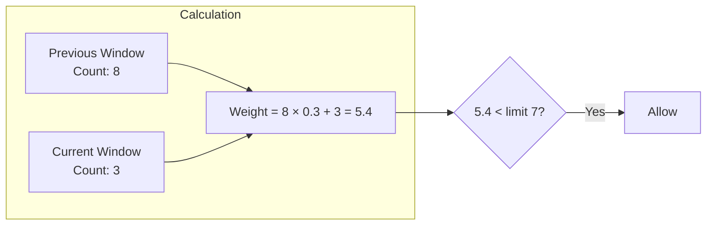
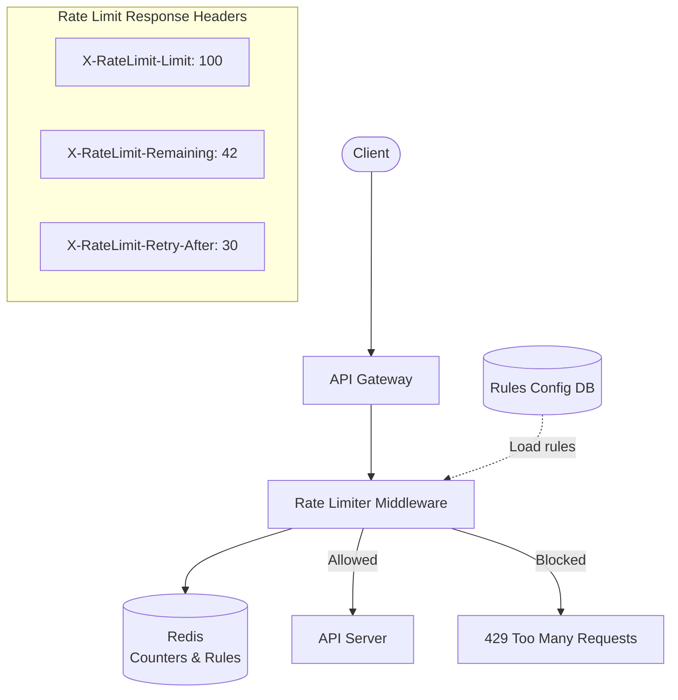
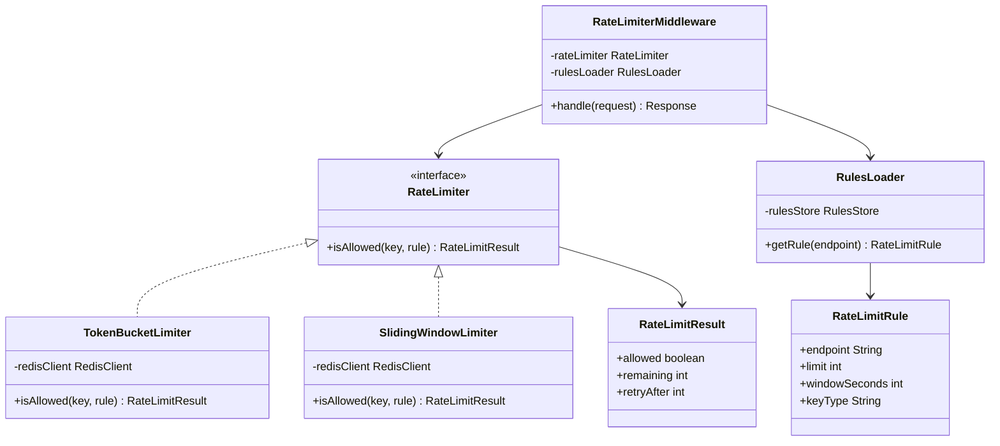
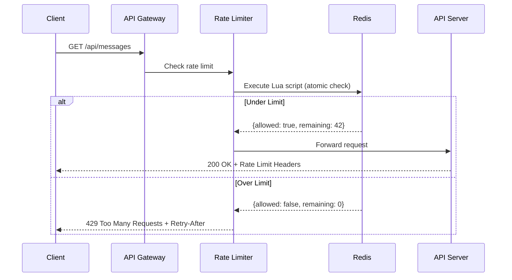
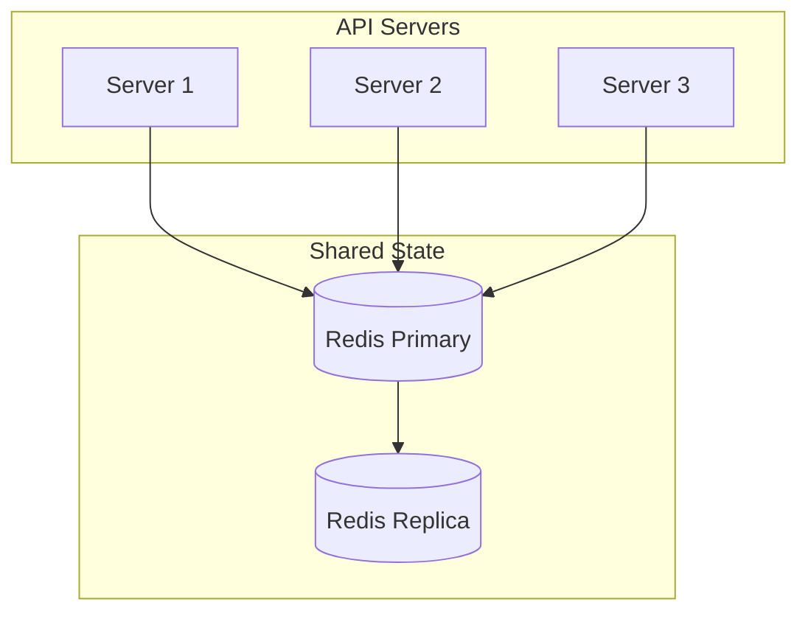

# Rate Limiter — Complete System Design

## 1. Problem Statement

Design a **rate limiter** that controls the rate of requests a client can send to an API. It:
- Prevents abuse and DDoS attacks
- Ensures fair usage across all clients
- Protects backend services from being overwhelmed

---

## 2. Functional Requirements

| # | Requirement |
|---|-------------|
| 1 | Limit requests per client based on configurable rules |
| 2 | Return `429 Too Many Requests` when limit is exceeded |
| 3 | Support different rate limit rules per API endpoint |
| 4 | Include rate limit headers in response (`X-RateLimit-Remaining`, etc.) |

## 3. Non-Functional Requirements

- **Low latency** — rate check must add < 1ms overhead
- **Distributed** — works across multiple API servers
- **Accurate** — no race conditions in counting
- **Fault tolerant** — if rate limiter fails, traffic should still flow

---

## 4. Where to Place the Rate Limiter?



| Option | Pros | Cons |
|--------|------|------|
| **Client-side** | Simple | Easily bypassed |
| **Server-side** | Full control | Adds load to API servers |
| **Middleware / API Gateway** | Centralized, reusable | Extra hop |

> **Best practice**: Implement at the **API Gateway** or as **middleware** before the API server.

---

## 5. Rate Limiting Algorithms

### 5.1 Token Bucket

The most commonly used algorithm. Simple and memory efficient.



**How it works:**
1. Bucket holds tokens up to a max capacity
2. Each request consumes 1 token
3. Tokens are refilled at a fixed rate
4. If bucket is empty → reject request

**Parameters:**
- `bucketSize` — max burst capacity
- `refillRate` — tokens added per second

---

### 5.2 Sliding Window Log

Tracks timestamps of each request in a sorted set.



**How it works:**
1. Store timestamp of each request
2. Remove timestamps older than the window
3. Count remaining — if count >= limit → reject

**Pros:** Very accurate
**Cons:** High memory usage (stores every timestamp)

---

### 5.3 Sliding Window Counter

Hybrid of fixed window + sliding window. Best balance of accuracy and memory.



**Formula:**
```
requests = prev_window_count × overlap_percentage + current_window_count
```

---

### Algorithm Comparison

| Algorithm | Memory | Accuracy | Burst Handling |
|-----------|--------|----------|----------------|
| Token Bucket | Low | Good | Allows bursts up to bucket size |
| Sliding Window Log | High | Exact | No burst |
| Sliding Window Counter | Low | Approximate | Smoothed |
| Fixed Window Counter | Low | Poor at edges | Allows 2x burst at boundary |
| Leaky Bucket | Low | Good | Smooths output rate |

---

## 6. High-Level Design (HLD)



### Components

1. **API Gateway** — entry point, routes to rate limiter
2. **Rate Limiter Middleware** — checks rate before forwarding
3. **Redis** — stores counters per client (fast, atomic operations)
4. **Rules Config** — defines limits per endpoint/user tier

---

## 7. Detailed Design

### Rate Limit Rules

```json
{
  "rules": [
    {
      "endpoint": "/api/v1/messages",
      "limit": 5,
      "window": 60,
      "unit": "seconds",
      "keyType": "user_id"
    },
    {
      "endpoint": "/api/v1/login",
      "limit": 3,
      "window": 300,
      "unit": "seconds",
      "keyType": "ip"
    }
  ]
}
```

### Redis Key Design

```
rate_limit:{client_id}:{endpoint}:{window_start}
```

Example: `rate_limit:user123:/api/messages:1700000000`

---

## 8. Low-Level Design (LLD)

### Class Diagram



### Token Bucket — Redis Lua Script

Using a Lua script ensures **atomicity** (no race conditions):

```lua
-- KEYS[1] = bucket key
-- ARGV[1] = bucket capacity
-- ARGV[2] = refill rate (tokens/sec)
-- ARGV[3] = current timestamp

local key = KEYS[1]
local capacity = tonumber(ARGV[1])
local refillRate = tonumber(ARGV[2])
local now = tonumber(ARGV[3])

local bucket = redis.call('HMGET', key, 'tokens', 'lastRefill')
local tokens = tonumber(bucket[1]) or capacity
local lastRefill = tonumber(bucket[2]) or now

-- Calculate tokens to add
local elapsed = now - lastRefill
local newTokens = math.min(capacity, tokens + elapsed * refillRate)

if newTokens >= 1 then
    redis.call('HMSET', key, 'tokens', newTokens - 1, 'lastRefill', now)
    redis.call('EXPIRE', key, capacity / refillRate * 2)
    return {1, math.floor(newTokens - 1)}  -- allowed, remaining
else
    return {0, 0}  -- denied
end
```

### Request Flow (Sequence Diagram)



---

## 9. Distributed Rate Limiting

When you have multiple API servers, each server must share the same counter.



### Challenges & Solutions

| Challenge | Solution |
|-----------|----------|
| Race conditions | Redis Lua scripts (atomic) |
| Redis failure | Fail-open (allow traffic) or local fallback |
| Multi-region | Sync counters via Redis Cluster or local + global limits |
| Clock skew | Use Redis server time, not client time |

---

## 10. Rate Limiting by Different Keys

| Key Type | Use Case |
|----------|----------|
| **IP Address** | Anonymous users, login endpoints |
| **User ID** | Authenticated API calls |
| **API Key** | Third-party integrations |
| **Endpoint** | Protect specific expensive operations |
| **Composite** | `user_id + endpoint` for fine-grained control |

---

## 11. Response Headers

Always include these headers so clients can self-regulate:

```
HTTP/1.1 429 Too Many Requests
X-RateLimit-Limit: 100
X-RateLimit-Remaining: 0
X-RateLimit-Reset: 1700000060
Retry-After: 30
```

---

## 12. Summary

| Aspect | Decision |
|--------|----------|
| Algorithm | Token Bucket (most common) |
| Storage | Redis (fast, atomic with Lua) |
| Placement | API Gateway / Middleware |
| Failure mode | Fail-open (allow traffic) |
| Key | User ID + Endpoint |
| Distributed | Redis Cluster with Lua scripts |

---

<div class="callout-tip">

**Applying this**: When adding rate limiting to your API, start with Token Bucket (it's what AWS API Gateway and Stripe use). Use Redis Lua scripts for atomic distributed counting. Always fail-open — if the rate limiter is down, let traffic through rather than blocking everything.

</div>

<div class="callout-interview">

🎯 **Interview Ready**: "I'd use Token Bucket for rate limiting because it handles bursts naturally. For distributed systems, Redis with Lua scripts ensures atomic counting. Key trade-offs: Token Bucket allows bursts up to bucket size, Sliding Window is more accurate but uses more memory. Always discuss the distributed case and failure mode (fail-open)."

</div>
