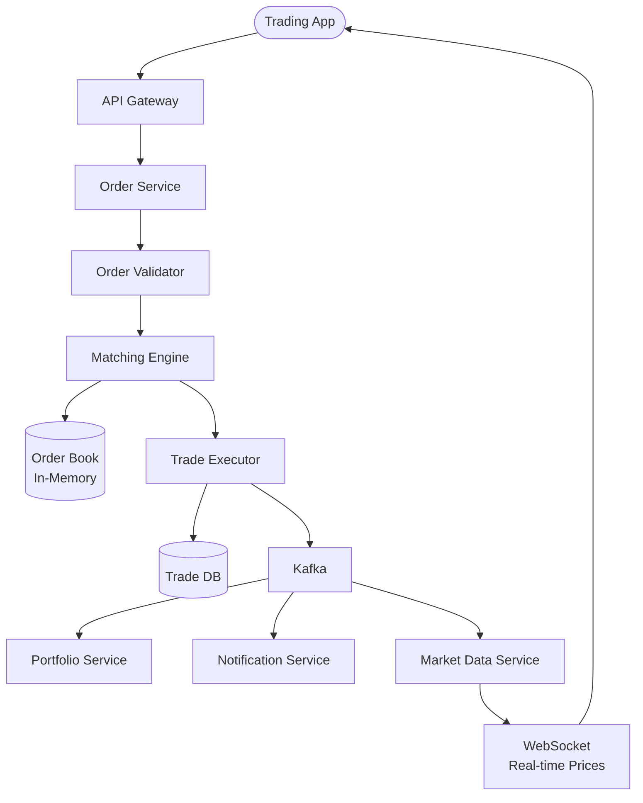

# Stock Trading Platform — Complete System Design

## 1. Problem Statement

Design a real-time stock trading system that:
- Allows users to place buy/sell orders
- Matches orders in real-time with an **order matching engine**
- Handles millions of orders per day with **sub-millisecond latency**
- Maintains accurate portfolio and balance tracking

---

## 2. Key Concepts

### Order Types

| Type | Description |
|------|-------------|
| **Market Order** | Buy/sell immediately at current price |
| **Limit Order** | Buy/sell only at specified price or better |
| **Stop Order** | Triggers when price reaches a threshold |

### Order Book

The order book is the heart of any exchange — it maintains all open buy (bid) and sell (ask) orders:

```
SELL (Ask) Side          Price       BUY (Bid) Side
                         $105.00     200 shares (Alice)
                         $104.50     150 shares (Bob)
50 shares (Charlie)      $104.00
100 shares (Dave)        $103.50
```

When a buy order at $104.00 comes in, it matches with Charlie's sell at $104.00.

---

## 3. High-Level Design



### Components

| Component | Purpose |
|-----------|---------|
| Order Service | Receives and validates orders |
| Matching Engine | Core — matches buy/sell orders (in-memory, single-threaded) |
| Order Book | In-memory data structure holding all open orders |
| Trade Executor | Records matched trades, updates balances |
| Market Data Service | Broadcasts real-time price updates via WebSocket |
| Portfolio Service | Tracks user holdings and P&L |

---

## 4. Matching Engine — The Core

The matching engine is **single-threaded** by design — this eliminates race conditions and ensures deterministic ordering.

### Price-Time Priority

Orders are matched by:
1. **Best price first** (highest bid, lowest ask)
2. **Earliest time first** (FIFO within same price)

### Data Structure: Two Priority Queues

```java
// Buy orders: highest price first, then earliest time
PriorityQueue<Order> bids = new PriorityQueue<>(
    Comparator.comparing(Order::getPrice).reversed()
             .thenComparing(Order::getTimestamp)
);

// Sell orders: lowest price first, then earliest time
PriorityQueue<Order> asks = new PriorityQueue<>(
    Comparator.comparing(Order::getPrice)
             .thenComparing(Order::getTimestamp)
);
```

### Matching Algorithm

```java
public List<Trade> match(Order incomingOrder) {
    List<Trade> trades = new ArrayList<>();
    PriorityQueue<Order> oppositeBook = incomingOrder.isBuy() ? asks : bids;

    while (!oppositeBook.isEmpty() && incomingOrder.getRemainingQty() > 0) {
        Order bestOpposite = oppositeBook.peek();

        // Check if prices cross
        if (incomingOrder.isBuy() && incomingOrder.getPrice() < bestOpposite.getPrice()) break;
        if (!incomingOrder.isBuy() && incomingOrder.getPrice() > bestOpposite.getPrice()) break;

        // Execute trade at the resting order's price
        int tradeQty = Math.min(incomingOrder.getRemainingQty(), bestOpposite.getRemainingQty());
        double tradePrice = bestOpposite.getPrice();

        trades.add(new Trade(incomingOrder, bestOpposite, tradeQty, tradePrice));

        incomingOrder.fill(tradeQty);
        bestOpposite.fill(tradeQty);

        if (bestOpposite.getRemainingQty() == 0) oppositeBook.poll();
    }

    // If incoming order still has remaining qty, add to book
    if (incomingOrder.getRemainingQty() > 0) {
        (incomingOrder.isBuy() ? bids : asks).add(incomingOrder);
    }

    return trades;
}
```

---

## 5. Event Sourcing for Trades

Every order and trade is stored as an **event** — complete audit trail:

```
Event 1: OrderPlaced { orderId: 1, user: Alice, side: BUY, price: 100, qty: 50 }
Event 2: OrderPlaced { orderId: 2, user: Bob, side: SELL, price: 100, qty: 30 }
Event 3: TradeExecuted { buyOrder: 1, sellOrder: 2, price: 100, qty: 30 }
Event 4: OrderPartiallyFilled { orderId: 1, remainingQty: 20 }
```

---

## 6. Risk Management

| Check | Purpose |
|-------|---------|
| Balance check | Does user have enough funds/shares? |
| Position limits | Max shares per user per stock |
| Price bands | Reject orders too far from market price |
| Circuit breaker | Halt trading if price moves too fast |

---

## 7. Summary

| Aspect | Decision |
|--------|----------|
| Matching engine | Single-threaded, in-memory |
| Order book | Two priority queues (bids + asks) |
| Persistence | Event sourcing (Kafka) |
| Real-time data | WebSocket broadcast |
| Risk | Pre-trade validation |
| Scaling | Partition by stock symbol |

---

<div class="callout-tip">

**Applying this**: The matching engine being single-threaded is counter-intuitive but critical. It's the same approach used by real exchanges (LMAX, Nasdaq). Single thread = no locks = deterministic = fast. The bottleneck is I/O, not CPU. When building any high-throughput ordered processing system, consider the single-writer pattern.

</div>

<div class="callout-interview">

🎯 **Interview Ready**: "The matching engine is single-threaded by design — this eliminates race conditions and ensures deterministic order matching. I'd use two priority queues (bids sorted by highest price, asks by lowest). Partition by stock symbol for horizontal scaling. Use event sourcing for the complete audit trail."

</div>
