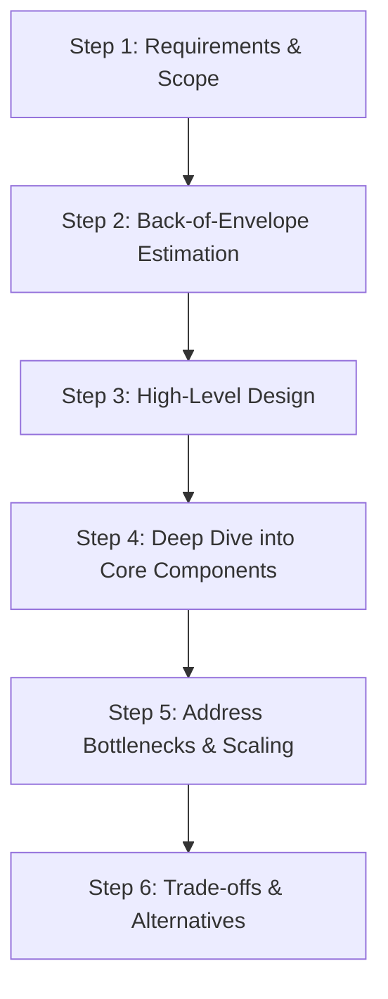
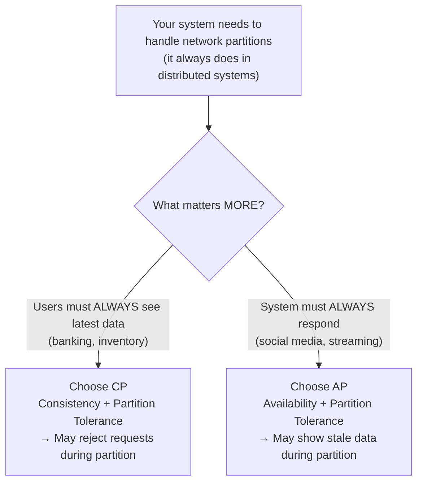
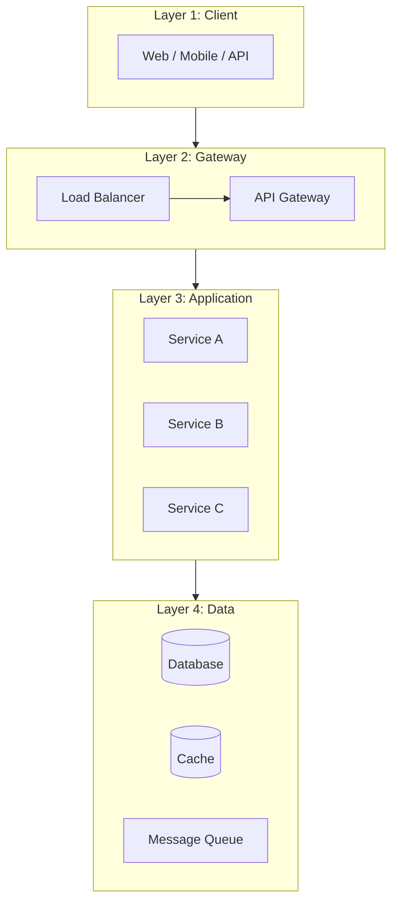
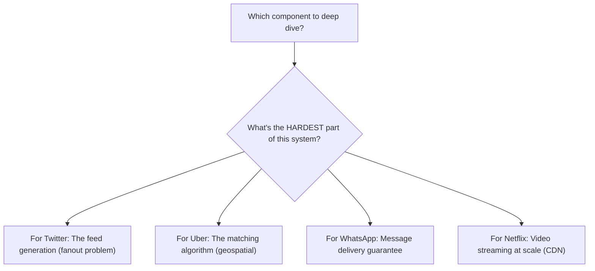
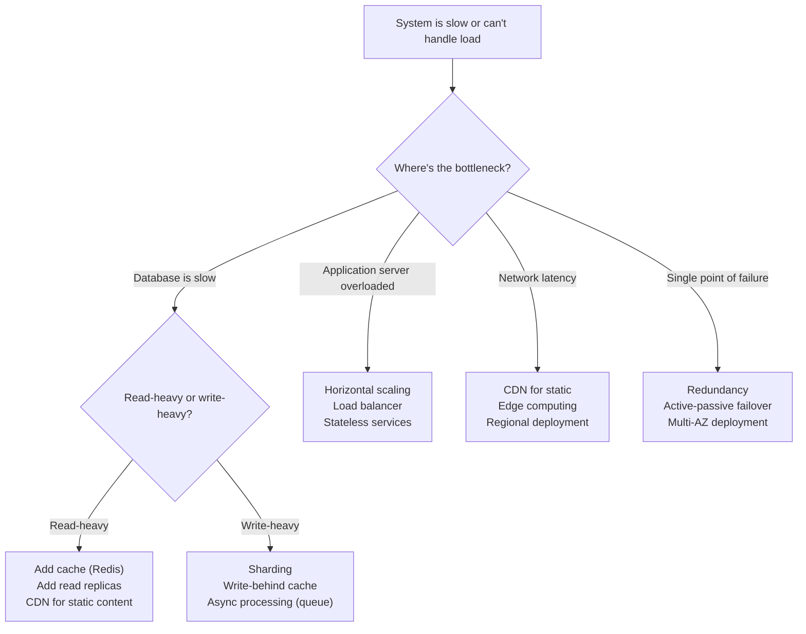

# How to Think in System Design — The Architect's Mental Model

## Why This Tutorial Exists

System design interviews aren't about memorizing "Uber uses QuadTree" or "Netflix uses CDN." They test whether you can **think through a problem you've never seen** and make reasonable decisions under uncertainty. This tutorial teaches you the thinking process — so you can design ANY system, not just the ones you've practiced.

---

## The 6-Step System Design Framework



---

## Step 1: Requirements — The Most Important 5 Minutes

**The mistake everyone makes**: Start drawing boxes immediately.

**What senior engineers do**: Spend 5 minutes asking questions that SHAPE the entire design.

### The Question Framework

| Category | Questions to ask | Why it matters |
|----------|-----------------|----------------|
| **Users** | How many users? DAU? Peak concurrent? | Determines scale — 1K users vs 1B users = completely different designs |
| **Features** | What's the MVP? What's out of scope? | Prevents over-engineering — you have 45 minutes, not 45 days |
| **Data** | How much data? Read-heavy or write-heavy? | Determines database choice and caching strategy |
| **Latency** | What's acceptable response time? Real-time needed? | Determines sync vs async, caching aggressiveness |
| **Consistency** | Can we show stale data? For how long? | Determines consistency model — strong vs eventual |
| **Availability** | What's the uptime requirement? 99.9% vs 99.99%? | Determines redundancy and failover strategy |

<div class="callout-scenario">

**Scenario**: You're asked "Design Twitter." Instead of jumping to architecture, ask: "Are we designing the tweet posting system, the timeline/feed system, or the search system? What's the expected scale — millions or billions of users? Is the feed real-time or can it be slightly delayed?"

**Why this matters**: Designing Twitter's feed for 1M users = simple database query. For 500M users = you need fanout, caching, sharding. The SAME problem has COMPLETELY different solutions at different scales.

</div>

### The CAP Theorem Decision — Make It Early



<div class="callout-info">

**Key insight**: You're not choosing "consistency OR availability" forever. You're choosing the DEFAULT behavior during failures. Most systems are AP for reads (show cached/stale data) and CP for writes (reject writes if consistency can't be guaranteed). Netflix is AP — showing a slightly stale catalog is fine. A bank is CP — showing wrong balance is not fine.

</div>

---

## Step 2: Back-of-Envelope Estimation — Think in Powers of 10

You don't need exact numbers. You need to know if you're dealing with thousands, millions, or billions.

### The Estimation Cheat Sheet

| What | Approximate value |
|------|------------------|
| Seconds in a day | ~100K (86,400) |
| Requests/sec from 1M DAU | ~12 RPS (1M / 86400) |
| Requests/sec from 100M DAU | ~1,200 RPS |
| 1 KB × 1M = | 1 GB |
| 1 KB × 1B = | 1 TB |
| Single server handles | ~10K-50K concurrent connections |
| Single DB handles | ~5K-10K queries/sec |
| Redis handles | ~100K ops/sec |
| SSD read latency | ~0.1ms |
| Network round-trip (same region) | ~1ms |
| Network round-trip (cross-continent) | ~100ms |

### How to Estimate — The Formula

```
Daily data = DAU × actions_per_user × data_per_action
Storage (5 years) = daily_data × 365 × 5
Peak QPS = average_QPS × 3 (rule of thumb)
```

<div class="callout-tip">

**Applying this** — In an interview, say: "Let me do a quick estimation. 100M DAU, each user sends 10 messages/day = 1B messages/day. At 1KB per message = 1TB/day. Over 5 years = ~2PB. Peak QPS = 1B/86400 × 3 ≈ 35K messages/sec." This takes 30 seconds and tells you: you need sharding, you need a write-optimized database, and a single server won't cut it.

</div>

---

## Step 3: High-Level Design — Think in Layers, Not Boxes

**The mistake**: Draw random boxes and connect them with arrows.

**The right approach**: Think in layers. Every system has the same layers:



### The Decision at Each Layer

| Layer | Key decision | How to decide |
|-------|-------------|---------------|
| **Client** | Thin client or thick client? | Mobile-first = thin (server does work). Desktop = can be thicker |
| **Gateway** | Need rate limiting? Auth? Routing? | If multiple services → yes, use API gateway |
| **Application** | Monolith or microservices? | < 10 engineers = monolith. > 50 engineers = microservices. In between = modular monolith |
| **Data** | SQL or NoSQL? Cache? Queue? | Read-heavy → cache. Write-heavy → queue + async. Complex queries → SQL. Simple key-value → NoSQL |

<div class="callout-warn">

**Warning**: Don't jump to microservices by default. In an interview, if the scale doesn't demand it, a well-designed monolith is a BETTER answer. It shows you understand that microservices add complexity (network calls, distributed transactions, deployment overhead) and you only pay that cost when the benefits outweigh it.

</div>

---

## Step 4: Deep Dive — Pick the Most Interesting Component

You can't design everything in 45 minutes. Pick 1-2 components and go deep.

### How to Pick What to Deep Dive



**Rule**: Deep dive into the component that makes this system UNIQUE. Every system has a database, a cache, and an API. What makes Uber different from Netflix? The geospatial matching vs the video streaming. That's where you go deep.

<div class="callout-interview">

🎯 **Interview Ready** — "I've outlined the high-level architecture. The most interesting and challenging component here is [X]. Let me dive deeper into that. Would you like me to focus there, or is there another area you'd prefer?" This shows you can identify the core challenge AND you're collaborative with the interviewer.

</div>

---

## Step 5: Scaling — The Decision Tree



### The Scaling Toolbox — When to Use What

| Problem | Tool | Why THIS tool |
|---------|------|---------------|
| Same data read 1000x | **Cache (Redis)** | O(1) lookup, 100K ops/sec, avoids DB hit |
| Database can't handle writes | **Sharding** | Split data across N databases, each handles 1/N |
| Spiky traffic | **Message Queue (Kafka/SQS)** | Buffer writes, process at your own pace |
| Global users, high latency | **CDN + Regional deployment** | Serve from nearest location |
| Single server = single point of failure | **Replication + Load Balancer** | If one dies, others take over |
| Complex queries on large data | **Read replicas + Materialized views** | Separate read and write paths |

<div class="callout-scenario">

**Scenario**: Your e-commerce site handles 1000 orders/sec during flash sales but only 10 orders/sec normally. Scaling the database to handle 1000/sec permanently is wasteful.

**Decision**: Put a message queue (Kafka/SQS) between the API and the database. The API writes to the queue instantly (handles 1000/sec). A consumer processes orders from the queue at a steady 100/sec. The queue buffers the spike. Users see "Order placed!" immediately, actual processing happens asynchronously. This is the **write-behind** pattern.

</div>

---

## Step 6: Trade-offs — The Mark of a Senior Engineer

Junior engineers give "the right answer." Senior engineers explain "why NOT the other options."

### The Trade-off Framework

For EVERY decision, state:

```
"I chose X over Y because [reason]. 
The trade-off is [what we lose]. 
This is acceptable because [why it's okay for our use case]."
```

### Common Trade-offs

| Decision | Option A | Option B | How to decide |
|----------|----------|----------|---------------|
| SQL vs NoSQL | Strong consistency, complex queries | High throughput, flexible schema | Need JOINs? → SQL. Need scale + simple queries? → NoSQL |
| Sync vs Async | Simple, immediate response | Decoupled, handles spikes | User needs instant result? → Sync. Can wait? → Async |
| Cache vs No cache | Fast reads, stale data risk | Always fresh, slower | Read:Write ratio > 10:1? → Cache. Mostly writes? → Skip cache |
| Monolith vs Microservices | Simple, fast development | Independent scaling, team autonomy | Small team? → Monolith. Large org? → Microservices |
| Push vs Pull | Real-time, more server work | On-demand, less server work | Need instant updates? → Push. Periodic refresh OK? → Pull |
| Consistency vs Availability | Correct data, may reject requests | Always responds, may be stale | Financial data? → Consistency. Social feed? → Availability |

<div class="callout-tip">

**Applying this** — In an interview, after every design decision, proactively say the trade-off. "I'm using Kafka here instead of direct API calls. The trade-off is added complexity and slight delay, but we gain decoupling and spike handling. For this use case, a 2-second delay in processing is acceptable." This is what separates a senior answer from a junior one.

</div>

---

## The Anti-Patterns — What NOT to Do

| Anti-Pattern | Why it's wrong | What to do instead |
|-------------|---------------|-------------------|
| **Jump to solution** | You might solve the wrong problem | Spend 5 min on requirements first |
| **Over-engineer** | Adding Kafka, Redis, 10 microservices for a 1000-user app | Match complexity to scale |
| **Ignore trade-offs** | "Use NoSQL" without explaining why not SQL | Always state what you're giving up |
| **Copy-paste architecture** | "Uber uses X so we should too" | Understand WHY Uber chose X, then decide if YOUR problem is similar |
| **Single database for everything** | One DB can't optimize for all access patterns | Use polyglot persistence — right DB for right data |
| **Forget failure modes** | "What if Redis goes down?" | Design for failure — every component WILL fail eventually |

---

## 🎯 Interview Corner

<div class="callout-interview">

**Q: "How do you approach a system design problem you've never seen before?"**

I follow a structured framework. First 5 minutes: clarify requirements — who are the users, what's the scale, what are the key features, what's the consistency/availability requirement. Next 5 minutes: back-of-envelope estimation — how much data, how many requests/sec, how much storage. Then I draw the high-level architecture in layers — client, gateway, application services, data stores. I identify the hardest/most unique component and deep dive into it. Throughout, I explicitly state trade-offs for every decision. Finally, I address scaling bottlenecks and failure modes. This framework works for ANY system because every system has users, data, and components that need to communicate.

**Follow-up trap**: "What if you don't know the right technology?" → I focus on the REQUIREMENTS the technology must meet, not the specific product. "We need a message queue that guarantees ordering and handles 100K messages/sec" is more valuable than "use Kafka." The interviewer cares about your reasoning, not your product knowledge.

</div>

<div class="callout-interview">

**Q: "How do you decide between SQL and NoSQL?"**

I ask four questions: (1) Do I need complex queries with JOINs? → SQL. (2) Is the schema well-defined and unlikely to change? → SQL. (3) Do I need horizontal scaling for massive write throughput? → NoSQL. (4) Is the access pattern simple key-value or document lookups? → NoSQL. Most systems use BOTH — SQL for transactional data (orders, users) and NoSQL for high-volume data (logs, sessions, analytics). The mistake is treating it as either/or. I'd use PostgreSQL for the order service and DynamoDB for the session store in the same system.

**Follow-up trap**: "What about NewSQL like CockroachDB?" → NewSQL gives you SQL semantics with horizontal scaling, but at the cost of higher latency per query and operational complexity. I'd consider it when I need both complex queries AND massive scale — like a global financial system. For most applications, PostgreSQL with read replicas handles millions of users fine.

</div>

<div class="callout-interview">

**Q: "Your system needs to handle 100x traffic during a flash sale. How?"**

Three layers of defense: (1) **Frontend**: CDN caches static assets, rate limit per user, queue-based "waiting room" if needed. (2) **Application**: Auto-scaling groups that scale from 10 to 100 instances based on CPU/request count. Stateless services so any instance handles any request. (3) **Database**: Read-through cache (Redis) absorbs 90% of reads. Write-behind queue (Kafka/SQS) buffers writes — users see "Order placed!" instantly, actual DB write happens asynchronously. The key insight: you don't scale the database to handle 100x — you put buffers (cache + queue) in front of it. The database processes at its comfortable rate while the buffers absorb the spike.

</div>

---

## Quick Reference — The System Design Cheat Sheet

| Step | What to do | Time in interview |
|------|-----------|-------------------|
| 1. Requirements | Ask scope, scale, features, constraints | 5 min |
| 2. Estimation | DAU → QPS → Storage → Bandwidth | 3 min |
| 3. High-Level Design | Draw layers: Client → Gateway → Services → Data | 10 min |
| 4. Deep Dive | Pick the hardest component, go deep | 15 min |
| 5. Scaling | Identify bottlenecks, apply scaling tools | 7 min |
| 6. Trade-offs | State alternatives and why you chose this | Throughout |

---

> **System design isn't about knowing the answer. It's about having a framework to FIND the answer. The best architects aren't the ones who've memorized the most systems — they're the ones who can reason through any system from first principles.**
