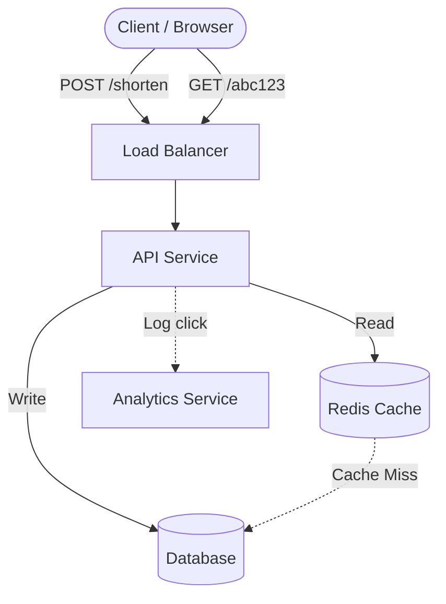
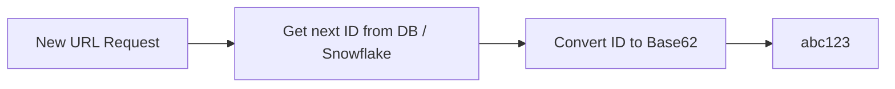
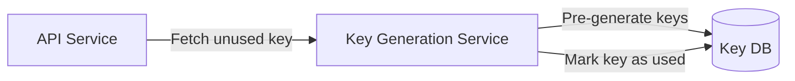
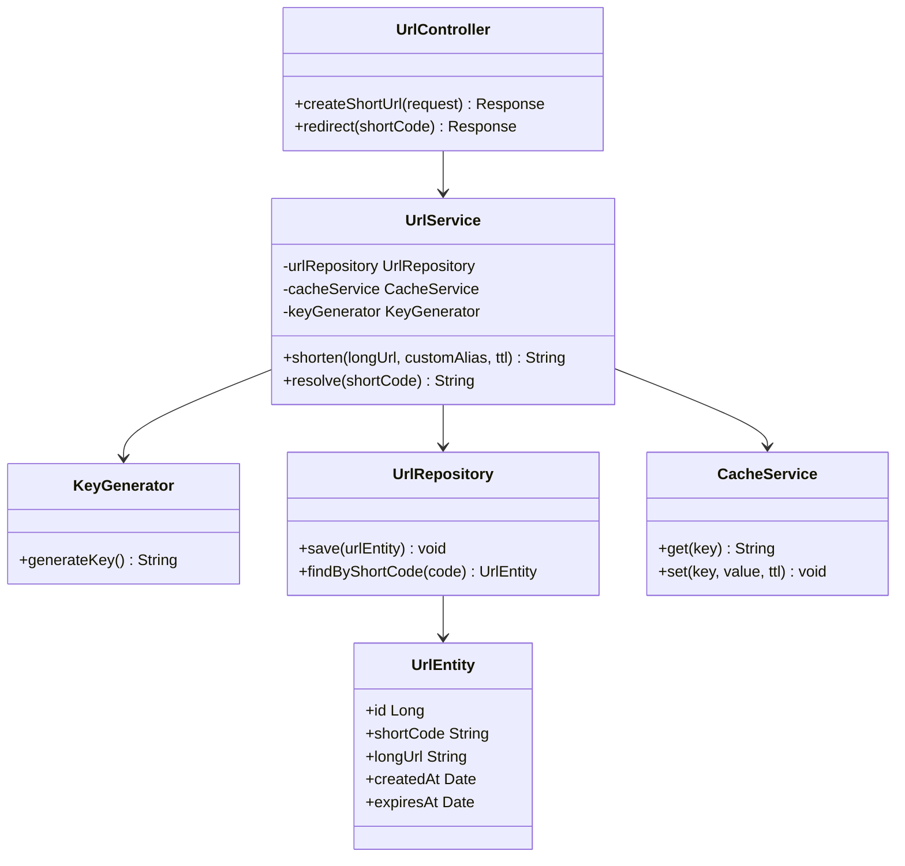
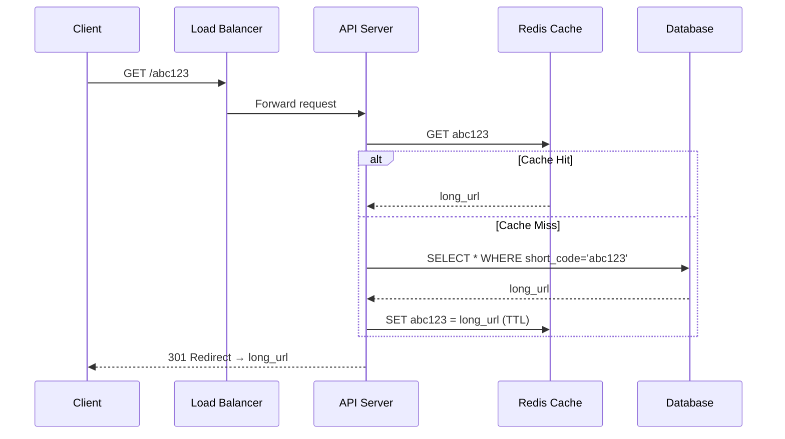
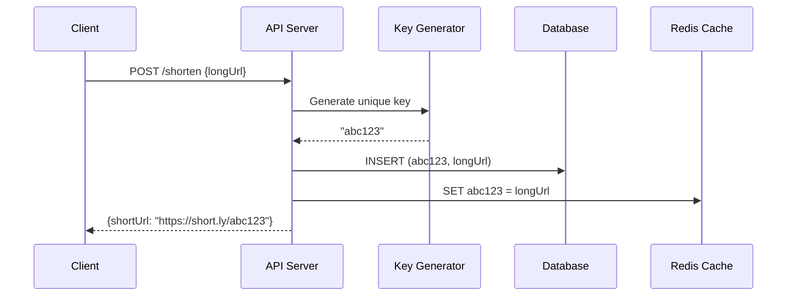
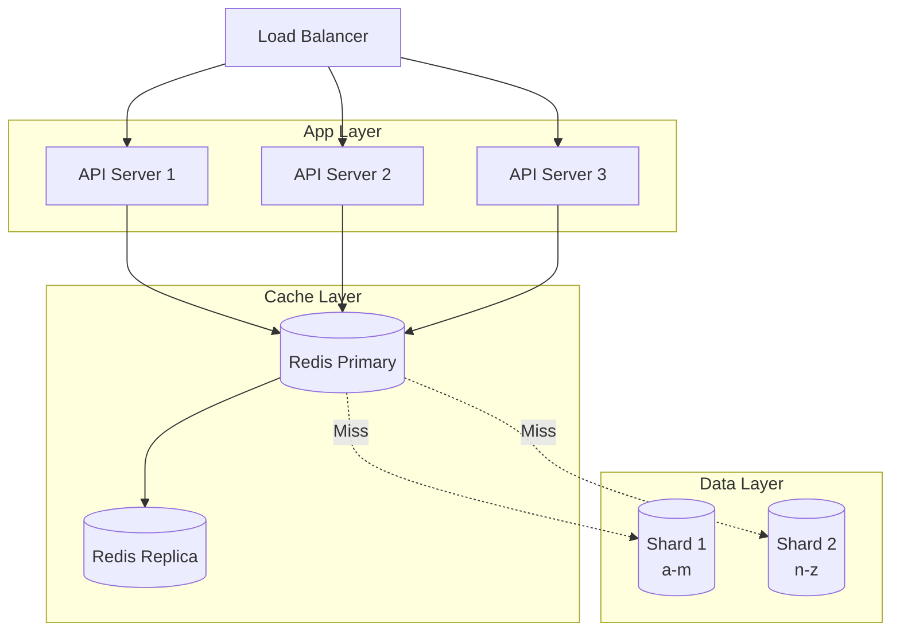

# URL Shortener — Complete System Design

## 1. Problem Statement

Design a URL shortening service (like TinyURL or Bitly) that:
- Takes a long URL and returns a short, unique URL
- Redirects the short URL to the original long URL
- Handles **billions** of URLs with low latency
- Tracks click analytics (optional)

---

## 2. Functional Requirements

| # | Requirement |
|---|-------------|
| 1 | Given a long URL, generate a unique short URL |
| 2 | Given a short URL, redirect to the original URL |
| 3 | Short URLs expire after a configurable TTL |
| 4 | Users can optionally pick a custom alias |

## 3. Non-Functional Requirements

- **High availability** — the redirect service must always be up
- **Low latency** — redirect should happen in < 50ms
- **Short URLs should not be predictable** (security)
- **Scalable** to 100M+ URLs created per month

---

## 4. Capacity Estimation

> Assume 100M new URLs/month, 10:1 read-to-write ratio.

| Metric | Value |
|--------|-------|
| Writes | ~40 URLs/sec |
| Reads (redirects) | ~400 URLs/sec |
| Storage (5 years) | 100M × 12 × 5 = 6B records |
| Storage size | 6B × 500 bytes ≈ **3 TB** |

---

## 5. High-Level Design (HLD)

The system has two main flows: **URL creation** and **URL redirection**.



### Components

1. **Load Balancer** — distributes traffic across API servers
2. **API Service** — stateless service handling create & redirect
3. **Database** — stores the URL mappings
4. **Cache (Redis)** — caches hot/popular URLs for fast redirect
5. **Analytics Service** — async click tracking via message queue

---

## 6. API Design

### Create Short URL

```
POST /api/v1/shorten
Body: { "longUrl": "https://example.com/very/long/path", "customAlias": "mylink", "ttl": 3600 }
Response: { "shortUrl": "https://short.ly/abc123" }
```

### Redirect

```
GET /:shortCode
Response: 301 Redirect → original long URL
```

> **301 vs 302**: Use **301** (permanent) if SEO matters and you want browsers to cache. Use **302** (temporary) if you need to track every click.

---

## 7. Short URL Generation — Approaches

### Approach 1: Base62 Encoding of Auto-Increment ID



- Characters: `a-z, A-Z, 0-9` = 62 chars
- 7 characters → 62^7 = **3.5 trillion** unique URLs
- **Pros**: Simple, no collisions
- **Cons**: Predictable (sequential)

### Approach 2: MD5/SHA256 Hash + First 7 chars

- Hash the long URL, take first 7 characters
- **Pros**: Same URL always gives same short code
- **Cons**: Collision possible — need collision resolution

### Approach 3: Pre-generated Key Service (KGS)



- A separate service pre-generates unique keys
- API fetches an unused key when creating a short URL
- **Pros**: No collision, fast
- **Cons**: Extra service to manage

---

## 8. Database Design (LLD)

### Schema

```sql
CREATE TABLE urls (
    id          BIGINT PRIMARY KEY AUTO_INCREMENT,
    short_code  VARCHAR(10) UNIQUE NOT NULL,
    long_url    TEXT NOT NULL,
    created_at  TIMESTAMP DEFAULT CURRENT_TIMESTAMP,
    expires_at  TIMESTAMP,
    user_id     BIGINT,
    click_count BIGINT DEFAULT 0
);

CREATE INDEX idx_short_code ON urls(short_code);
CREATE INDEX idx_expires_at ON urls(expires_at);
```

### Database Choice

| Option | When to use |
|--------|-------------|
| **SQL (MySQL/PostgreSQL)** | Strong consistency, ACID transactions |
| **NoSQL (DynamoDB/Cassandra)** | Massive scale, high write throughput |

For a URL shortener, **NoSQL** is often preferred because:
- Simple key-value lookups (short_code → long_url)
- Horizontal scaling is easier
- No complex joins needed

---

## 9. Low-Level Design (LLD)

### Class Diagram



### Redirect Flow (Sequence Diagram)



### Create URL Flow



---

## 10. Caching Strategy

- **Cache**: Redis with LRU eviction
- **Cache aside pattern**: Check cache first → if miss, read DB → populate cache
- **TTL**: Match URL expiration or use 24h default
- **Hot URLs**: The top 20% of URLs get 80% of traffic (Pareto principle)

---

## 11. Scaling



### Strategies

| Strategy | Details |
|----------|---------|
| **DB Sharding** | Shard by first char of short_code or hash-based |
| **Read Replicas** | For read-heavy redirect traffic |
| **CDN** | Cache 301 redirects at edge |
| **Rate Limiting** | Prevent abuse on create endpoint |

---

## 12. Summary

| Aspect | Decision |
|--------|----------|
| Short code generation | Base62 or KGS |
| Database | NoSQL (DynamoDB) or SQL with sharding |
| Cache | Redis with LRU, 24h TTL |
| Redirect status | 301 for caching, 302 for analytics |
| Scaling | Horizontal API servers + DB sharding |

---

<div class="callout-tip">

**Applying this**: When approaching any system design problem, follow this flow: Requirements → Capacity Estimation → HLD → LLD. Start broad, then zoom in. This works for real architecture decisions too — always understand the scale before picking technologies.

</div>

<div class="callout-interview">

🎯 **Interview Ready**: "I'd start with functional and non-functional requirements, then do a quick capacity estimation to understand scale. For URL shortener: Base62 encoding or KGS for short codes, NoSQL for simple key-value lookups, Redis cache with LRU for hot URLs, 301 for SEO or 302 for analytics tracking."

</div>
